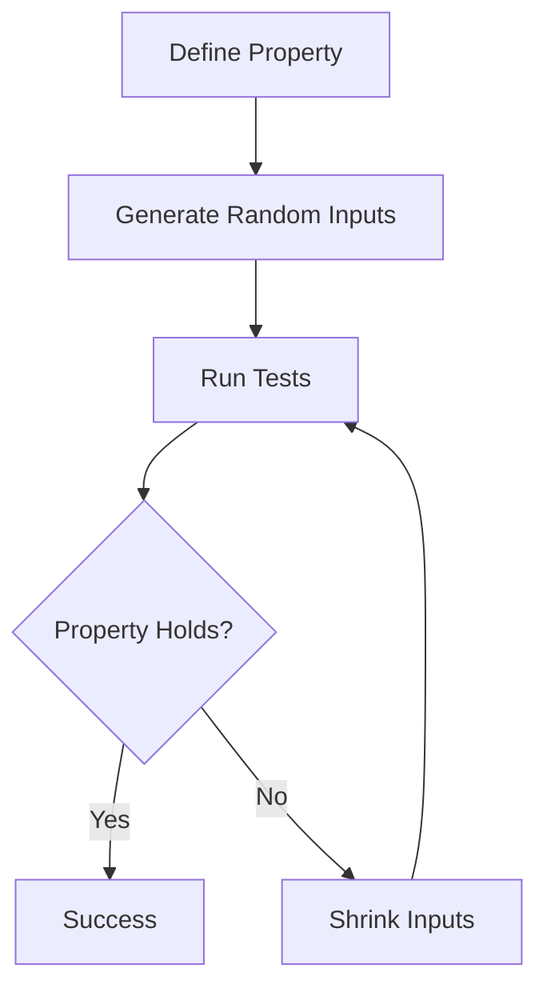

## 15.3.2 Using `test.check`

As experienced Java developers, you're likely familiar with unit testing frameworks such as JUnit, which focus on example-based testing. In contrast, **property-based testing** is a powerful paradigm that allows you to define general properties that your code should satisfy, and then automatically generate a wide range of test cases to verify those properties. Clojure's `test.check` library is a robust tool for implementing property-based testing, enabling you to test your code more thoroughly and uncover edge cases that example-based tests might miss.

### Understanding Property-Based Testing

Property-based testing shifts the focus from specific test cases to general properties of the code. Instead of writing individual tests for each scenario, you define properties that should hold true for a wide range of inputs. The testing framework then generates numerous random inputs to validate these properties.

**Key Concepts:**

- **Properties**: Assertions about the behavior of your code that should hold true for all inputs.
- **Generators**: Functions that produce random test data to be used in testing properties.

### Getting Started with `test.check`

To begin using `test.check`, you'll need to add it to your Clojure project. If you're using Leiningen, add the following dependency to your `project.clj` file:

```clojure
:dependencies [[org.clojure/test.check "1.1.0"]]
```

### Defining Generators

Generators are at the heart of property-based testing. They produce random data that is used to test the properties of your code. `test.check` provides a variety of built-in generators, and you can also create custom generators to suit your needs.

#### Built-in Generators

`test.check` includes a range of built-in generators for common data types:

- **Integers**: `gen/int`
- **Booleans**: `gen/boolean`
- **Strings**: `gen/string`
- **Collections**: `gen/vector`, `gen/list`, `gen/map`

Here's a simple example of using a generator to produce random integers:

```clojure
(require '[clojure.test.check.generators :as gen])

(def int-gen (gen/int))
```

#### Custom Generators

You can create custom generators using the `gen/fmap` and `gen/bind` functions to transform existing generators. For example, to create a generator that produces even integers, you can use:

```clojure
(def even-int-gen
  (gen/fmap #(* 2 %) (gen/int)))
```

### Defining Properties

Properties are the core of property-based testing. They describe the expected behavior of your code for a wide range of inputs. In `test.check`, properties are defined using the `prop/for-all` macro.

#### Example: Testing a Simple Function

Let's consider a simple function that reverses a list. We want to test the property that reversing a list twice should yield the original list:

```clojure
(defn reverse-twice [lst]
  (reverse (reverse lst)))

(require '[clojure.test.check.properties :as prop])

(def reverse-twice-property
  (prop/for-all [lst (gen/vector gen/int)]
    (= lst (reverse-twice lst))))
```

### Running Property-Based Tests

To run property-based tests, use the `clojure.test.check/quick-check` function, which takes a property and the number of tests to run:

```clojure
(require '[clojure.test.check :as tc])

(tc/quick-check 100 reverse-twice-property)
```

This will run the property 100 times with different random inputs. If a failure is found, `test.check` will attempt to shrink the input to find the smallest failing case.

### Comparing with Java

In Java, property-based testing can be achieved using libraries like [JUnit-Quickcheck](https://pholser.github.io/junit-quickcheck/). However, Clojure's `test.check` offers a more seamless integration with functional programming paradigms, allowing for more expressive and concise test definitions.

#### Java Example

Here's a similar test in Java using JUnit-Quickcheck:

```java
import com.pholser.junit.quickcheck.Property;
import com.pholser.junit.quickcheck.runner.JUnitQuickcheck;
import org.junit.runner.RunWith;
import static org.junit.Assert.*;

@RunWith(JUnitQuickcheck.class)
public class ReverseTest {
    @Property
    public void reverseTwice(int[] array) {
        assertArrayEquals(array, reverse(reverse(array)));
    }

    private int[] reverse(int[] array) {
        int[] reversed = new int[array.length];
        for (int i = 0; i < array.length; i++) {
            reversed[i] = array[array.length - 1 - i];
        }
        return reversed;
    }
}
```

### Advanced Features of `test.check`

#### Shrinking

Shrinking is the process of reducing a failing test case to its simplest form. `test.check` automatically attempts to shrink inputs when a property fails, helping you identify the root cause of the failure.

#### Composing Generators

You can compose generators to create complex data structures. For example, to generate a map with string keys and integer values:

```clojure
(def map-gen
  (gen/map gen/string gen/int))
```

#### Conditional Properties

You can use the `prop/for-all` macro to define conditional properties, which only apply to certain inputs:

```clojure
(def conditional-property
  (prop/for-all [x gen/int]
    (when (pos? x)
      (> (* x x) x))))
```

### Try It Yourself

Experiment with the following exercises to deepen your understanding of `test.check`:

1. **Modify the `reverse-twice` property** to test a different function, such as sorting a list.
2. **Create a custom generator** for generating valid email addresses and test a property of an email validation function.
3. **Explore shrinking** by intentionally introducing a bug in the `reverse-twice` function and observing how `test.check` shrinks the failing input.

### Diagrams and Visualizations

Below is a diagram illustrating the flow of data through a property-based test using `test.check`:



*Diagram: The flow of data through a property-based test using `test.check`.*

### Further Reading

For more information on property-based testing and `test.check`, consider exploring the following resources:

- [Official Clojure `test.check` Documentation](https://clojure.github.io/test.check/)
- [ClojureDocs `test.check` Examples](https://clojuredocs.org/clojure.test.check)
- [Property-Based Testing in Java with JUnit-Quickcheck](https://pholser.github.io/junit-quickcheck/)

### Exercises

1. **Define a property** for a function that calculates the factorial of a number, ensuring it satisfies the mathematical properties of factorials.
2. **Create a generator** for binary trees and define properties that test tree traversal algorithms.
3. **Implement a property-based test** for a function that checks if a string is a palindrome.

### Key Takeaways

- **Property-based testing** allows you to define general properties of your code and test them against a wide range of inputs.
- **Generators** are used to produce random test data, and `test.check` provides a variety of built-in and custom generators.
- **Shrinking** helps identify the simplest failing test case, making debugging easier.
- **Clojure's `test.check`** offers a powerful and expressive way to implement property-based testing, leveraging the strengths of functional programming.

Now that we've explored the fundamentals of property-based testing with `test.check`, you're equipped to enhance your testing strategy and improve the robustness of your Clojure applications.

## Quiz: Mastering Property-Based Testing with `test.check`



### What is the primary focus of property-based testing?

- [x] Defining general properties of the code
- [ ] Writing specific test cases
- [ ] Testing only edge cases
- [ ] Ensuring code coverage

> **Explanation:** Property-based testing focuses on defining general properties that should hold true for a wide range of inputs, rather than writing specific test cases.

### What is the role of generators in `test.check`?

- [x] To produce random test data
- [ ] To define properties
- [ ] To execute tests
- [ ] To shrink failing test cases

> **Explanation:** Generators in `test.check` are used to produce random test data that is used to test the properties of your code.

### How does `test.check` help identify the root cause of a failure?

- [x] By shrinking the failing input
- [ ] By running more tests
- [ ] By logging detailed error messages
- [ ] By providing a stack trace

> **Explanation:** `test.check` automatically attempts to shrink inputs when a property fails, helping you identify the root cause of the failure by reducing the test case to its simplest form.

### Which function is used to run property-based tests in `test.check`?

- [x] `quick-check`
- [ ] `run-tests`
- [ ] `execute-tests`
- [ ] `check-properties`

> **Explanation:** The `quick-check` function is used to run property-based tests in `test.check`, taking a property and the number of tests to run.

### What is a key advantage of property-based testing over example-based testing?

- [x] It can uncover edge cases that example-based tests might miss
- [ ] It requires less code to write
- [ ] It is faster to execute
- [ ] It provides more detailed error messages

> **Explanation:** Property-based testing can uncover edge cases that example-based tests might miss by testing a wide range of inputs against general properties.

### How can you create a custom generator in `test.check`?

- [x] Using `gen/fmap` and `gen/bind`
- [ ] Using `gen/create`
- [ ] Using `gen/custom`
- [ ] Using `gen/define`

> **Explanation:** Custom generators can be created using `gen/fmap` and `gen/bind` to transform existing generators.

### What is the purpose of the `prop/for-all` macro in `test.check`?

- [x] To define properties
- [ ] To generate random data
- [ ] To run tests
- [ ] To shrink inputs

> **Explanation:** The `prop/for-all` macro is used to define properties in `test.check`, specifying the expected behavior of the code for a range of inputs.

### What does the `gen/map` generator produce?

- [x] A map with generated keys and values
- [ ] A list of generated values
- [ ] A vector of generated values
- [ ] A set of generated values

> **Explanation:** The `gen/map` generator produces a map with generated keys and values, allowing for complex data structure generation.

### Can `test.check` be used to test Java code?

- [x] True
- [ ] False

> **Explanation:** While `test.check` is designed for Clojure, it can be used to test Java code by leveraging Clojure's interoperability with Java.

### What is a common use case for property-based testing?

- [x] Testing mathematical functions
- [ ] Testing user interfaces
- [ ] Testing database connections
- [ ] Testing network protocols

> **Explanation:** Property-based testing is commonly used for testing mathematical functions, as it allows for the definition of general properties that should hold true for a wide range of inputs.


