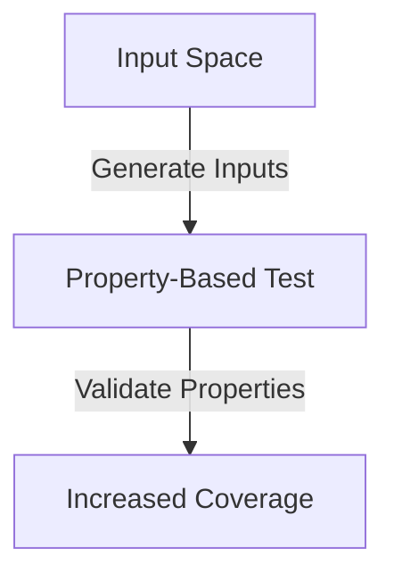

## 15.3.3 Benefits and Challenges

In the realm of software testing, **property-based testing** has emerged as a powerful technique, especially for functional programming languages like Clojure. Leveraging the `test.check` library, property-based testing allows developers to define properties or invariants that should hold true for a wide range of inputs, rather than specifying individual test cases. This approach can uncover edge cases and increase test coverage significantly. However, it also presents challenges, particularly in defining meaningful properties and managing the complexity of generated data.

### Benefits of Property-Based Testing

#### 1. Uncovering Edge Cases

One of the most significant advantages of property-based testing is its ability to uncover edge cases that traditional example-based testing might miss. By generating a wide range of inputs, property-based tests can reveal unexpected behavior in your code.

**Example:**

Consider a simple function that reverses a string:

```clojure
(defn reverse-string [s]
  (apply str (reverse s)))

;; Property-based test
(require '[clojure.test.check :as tc])
(require '[clojure.test.check.properties :as prop])
(require '[clojure.test.check.generators :as gen])

(def reverse-property
  (prop/for-all [s (gen/string)]
    (= s (reverse-string (reverse-string s)))))

(tc/quick-check 1000 reverse-property)
```

In this example, the property states that reversing a string twice should yield the original string. The `test.check` library generates numerous strings, including edge cases like empty strings or strings with special characters, to validate this property.

#### 2. Increased Test Coverage

Property-based testing can significantly increase test coverage by exploring a vast input space. This approach is particularly beneficial for functions with complex logic or those that interact with external systems.

**Diagram:**



*Diagram Caption:* This diagram illustrates how property-based testing generates a wide range of inputs to validate properties, leading to increased test coverage.

#### 3. Simplified Test Maintenance

With property-based testing, you define properties once, and the testing framework handles the generation of test cases. This approach reduces the need for maintaining a large suite of example-based tests.

#### 4. Encourages Thinking in Properties

Writing property-based tests encourages developers to think about the properties and invariants of their code, leading to a deeper understanding of the problem domain and more robust software design.

### Challenges of Property-Based Testing

Despite its benefits, property-based testing comes with its own set of challenges.

#### 1. Defining Meaningful Properties

One of the most significant challenges is defining meaningful properties that accurately capture the behavior of the system under test. This task requires a deep understanding of the domain and the function's intended behavior.

**Example:**

For a sorting function, a meaningful property might be that the output list is sorted and contains the same elements as the input list.

```clojure
(defn sorted? [coll]
  (apply <= coll))

(def sort-property
  (prop/for-all [v (gen/vector gen/int)]
    (and (sorted? (sort v))
         (= (frequencies v) (frequencies (sort v))))))
```

In this example, the property checks that the sorted vector is indeed sorted and that it contains the same elements as the original vector.

#### 2. Managing Complexity of Generated Data

Another challenge is managing the complexity of the data generated by the testing framework. While `test.check` provides powerful generators, creating complex data structures can be difficult and may require custom generators.

**Example:**

Generating a complex data structure like a binary tree might require a custom generator:

```clojure
(defn tree-gen [leaf-gen]
  (gen/recursive-gen
    (fn [inner-gen]
      (gen/one-of [leaf-gen
                   (gen/tuple inner-gen inner-gen)]))
    leaf-gen))

(def tree-property
  (prop/for-all [tree (tree-gen gen/int)]
    ;; Define properties for the tree
    true))
```

#### 3. Debugging Failing Tests

When a property-based test fails, it can be challenging to debug the issue, especially if the generated input is complex. `test.check` helps by shrinking the failing input to a minimal example, but understanding the root cause still requires careful analysis.

#### 4. Performance Considerations

Running property-based tests can be computationally intensive, especially if the properties are complex or the input space is large. It's essential to balance the thoroughness of the tests with the available computational resources.

### Try It Yourself

To get hands-on experience with property-based testing, try modifying the examples above:

- **Reverse String Test:** Modify the `reverse-string` function to introduce a bug (e.g., remove the `apply str` part) and observe how the property-based test catches it.
- **Sorting Test:** Add a new property to check that the length of the sorted vector is the same as the original vector.
- **Custom Generator:** Create a custom generator for a simple data structure, such as a linked list, and define properties for it.

### Further Reading

For more information on property-based testing and `test.check`, consider the following resources:

- [Official Clojure Documentation](https://clojure.org/)
- [ClojureDocs](https://clojuredocs.org/)
- [test.check GitHub Repository](https://github.com/clojure/test.check)

### Exercises

1. **Define Properties for a Calculator Function:** Write property-based tests for a simple calculator function that supports addition, subtraction, multiplication, and division. Consider properties like commutativity for addition and multiplication.

2. **Create a Custom Generator for User Data:** Develop a custom generator for a user data structure with fields like name, age, and email. Define properties to ensure valid data (e.g., age should be non-negative).

3. **Explore Edge Cases in a Web Application:** Identify a function in a web application that could benefit from property-based testing. Define properties and use `test.check` to uncover edge cases.

### Key Takeaways

- **Property-based testing** is a powerful technique for uncovering edge cases and increasing test coverage.
- Defining meaningful properties requires a deep understanding of the domain and the function's intended behavior.
- Managing the complexity of generated data and debugging failing tests are common challenges.
- Property-based testing encourages thinking in properties and invariants, leading to more robust software design.

Now that we've explored the benefits and challenges of property-based testing in Clojure, let's apply these concepts to enhance the reliability and robustness of your applications.

## Quiz: Mastering Property-Based Testing with Clojure's test.check



### What is a primary benefit of property-based testing?

- [x] Uncovering edge cases
- [ ] Reducing code complexity
- [ ] Eliminating the need for unit tests
- [ ] Simplifying deployment processes

> **Explanation:** Property-based testing generates a wide range of inputs, which helps uncover edge cases that might not be covered by traditional example-based tests.

### Which library is commonly used for property-based testing in Clojure?

- [x] test.check
- [ ] clojure.test
- [ ] clojure.spec
- [ ] midje

> **Explanation:** `test.check` is the library used in Clojure for property-based testing, allowing developers to define properties and generate test cases.

### What is a challenge associated with property-based testing?

- [x] Defining meaningful properties
- [ ] Writing concise code
- [ ] Managing small data sets
- [ ] Reducing test coverage

> **Explanation:** One of the main challenges of property-based testing is defining meaningful properties that accurately capture the behavior of the system under test.

### How does `test.check` help when a property-based test fails?

- [x] By shrinking the failing input to a minimal example
- [ ] By automatically fixing the code
- [ ] By generating a detailed error report
- [ ] By skipping the failing test

> **Explanation:** `test.check` helps by shrinking the failing input to a minimal example, making it easier to understand and debug the issue.

### Which of the following is a benefit of property-based testing?

- [x] Increased test coverage
- [ ] Reduced execution time
- [ ] Simplified user interfaces
- [ ] Enhanced graphics rendering

> **Explanation:** Property-based testing increases test coverage by exploring a vast input space, which is particularly beneficial for functions with complex logic.

### What is a common use case for property-based testing?

- [x] Validating sorting algorithms
- [ ] Designing user interfaces
- [ ] Managing database connections
- [ ] Configuring network settings

> **Explanation:** Property-based testing is commonly used to validate sorting algorithms by checking properties like the output list being sorted and containing the same elements as the input list.

### What is a potential downside of property-based testing?

- [x] Performance considerations
- [ ] Increased code readability
- [ ] Simplified debugging
- [ ] Enhanced user experience

> **Explanation:** Running property-based tests can be computationally intensive, especially if the properties are complex or the input space is large.

### How can property-based testing encourage better software design?

- [x] By encouraging thinking in properties and invariants
- [ ] By reducing the need for documentation
- [ ] By simplifying code syntax
- [ ] By eliminating the need for testing

> **Explanation:** Property-based testing encourages developers to think about the properties and invariants of their code, leading to a deeper understanding of the problem domain and more robust software design.

### What is a common challenge when using `test.check`?

- [x] Managing the complexity of generated data
- [ ] Writing concise documentation
- [ ] Designing user interfaces
- [ ] Configuring network settings

> **Explanation:** Managing the complexity of the data generated by the testing framework is a common challenge, especially when creating complex data structures.

### True or False: Property-based testing can completely replace example-based testing.

- [ ] True
- [x] False

> **Explanation:** While property-based testing is powerful, it does not completely replace example-based testing. Both approaches have their strengths and can complement each other in a comprehensive testing strategy.


