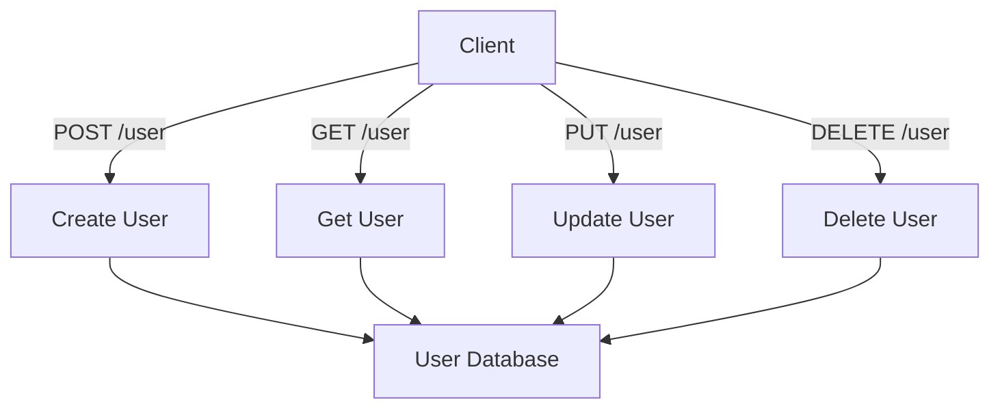

## 15.4.1 Testing Interactions Between Components

In the realm of software development, ensuring that individual components of an application work together seamlessly is crucial. This is where **integration testing** comes into play. For experienced Java developers transitioning to Clojure, understanding how to effectively test interactions between components in a functional programming paradigm can significantly enhance the robustness and reliability of your applications.

### The Importance of Integration Testing

Integration testing is a level of software testing where individual units or components are combined and tested as a group. The primary goal is to identify issues in the interaction between integrated units. While unit tests focus on individual components, integration tests ensure that these components work together as expected.

#### Key Benefits of Integration Testing

- **Detecting Interface Defects**: Integration tests help uncover issues that arise when components interact, such as mismatched data formats or incorrect API calls.
- **Ensuring Data Flow**: They verify that data flows correctly between components, maintaining the integrity and consistency of the application's state.
- **Validating Business Logic**: Integration tests can validate complex business logic that spans multiple components, ensuring that the overall functionality is preserved.
- **Improving System Reliability**: By catching integration issues early, these tests contribute to a more reliable and stable system.

### Integration Testing in Clojure vs. Java

In Java, integration testing often involves frameworks like JUnit, TestNG, or Spring Test. These frameworks provide tools for setting up application contexts, managing dependencies, and simulating user interactions. Clojure, with its functional nature and emphasis on immutability, offers a different approach to integration testing.

#### Clojure's Unique Approach

- **Functional Composition**: Clojure encourages composing functions, which can simplify testing interactions by focusing on data transformations rather than state changes.
- **Immutable Data Structures**: The use of immutable data structures in Clojure reduces side effects, making it easier to predict and test component interactions.
- **REPL-Driven Development**: Clojure's REPL (Read-Eval-Print Loop) allows for interactive testing and exploration of component interactions, providing immediate feedback.

### Setting Up Integration Tests in Clojure

To illustrate integration testing in Clojure, let's consider a simple web application consisting of a REST API and a database layer. We'll use the `clojure.test` library for testing and `ring` for handling HTTP requests.

#### Example: Testing a REST API

Suppose we have a REST API that manages a list of users. The API has endpoints for creating, retrieving, updating, and deleting users. We'll write integration tests to ensure these endpoints work together correctly.

**Clojure Code Example:**

```clojure
(ns user-api.core
  (:require [ring.adapter.jetty :refer [run-jetty]]
            [ring.util.response :refer [response]]
            [clojure.test :refer :all]))

(def users (atom {}))

(defn create-user [id name]
  (swap! users assoc id {:id id :name name})
  (response {:status "User created"}))

(defn get-user [id]
  (if-let [user (@users id)]
    (response user)
    (response {:status "User not found"})))

(defn update-user [id name]
  (if-let [user (@users id)]
    (do
      (swap! users assoc id {:id id :name name})
      (response {:status "User updated"}))
    (response {:status "User not found"})))

(defn delete-user [id]
  (if-let [user (@users id)]
    (do
      (swap! users dissoc id)
      (response {:status "User deleted"}))
    (response {:status "User not found"})))

(defn app [request]
  (let [{:keys [uri method]} request]
    (case [method uri]
      [:post "/user"] (create-user (get-in request [:params :id])
                                   (get-in request [:params :name]))
      [:get "/user"] (get-user (get-in request [:params :id]))
      [:put "/user"] (update-user (get-in request [:params :id])
                                  (get-in request [:params :name]))
      [:delete "/user"] (delete-user (get-in request [:params :id]))
      (response {:status "Invalid request"}))))

(run-jetty app {:port 3000})
```

**Integration Test Example:**

```clojure
(ns user-api.test.core
  (:require [clojure.test :refer :all]
            [ring.mock.request :as mock]
            [user-api.core :refer :all]))

(deftest test-user-api
  (testing "User creation"
    (let [response (app (mock/request :post "/user" {:id "1" :name "Alice"}))]
      (is (= 200 (:status response)))
      (is (= "User created" (:body response)))))

  (testing "User retrieval"
    (let [response (app (mock/request :get "/user" {:id "1"}))]
      (is (= 200 (:status response)))
      (is (= {:id "1" :name "Alice"} (:body response)))))

  (testing "User update"
    (let [response (app (mock/request :put "/user" {:id "1" :name "Bob"}))]
      (is (= 200 (:status response)))
      (is (= "User updated" (:body response)))))

  (testing "User deletion"
    (let [response (app (mock/request :delete "/user" {:id "1"}))]
      (is (= 200 (:status response)))
      (is (= "User deleted" (:body response))))))
```

### Comparing with Java

In Java, a similar integration test might involve setting up a Spring Boot application and using MockMvc to simulate HTTP requests. Here's a brief comparison:

**Java Code Example:**

```java
@RunWith(SpringRunner.class)
@SpringBootTest
@AutoConfigureMockMvc
public class UserApiTests {

    @Autowired
    private MockMvc mockMvc;

    @Test
    public void testUserCreation() throws Exception {
        mockMvc.perform(post("/user")
                .param("id", "1")
                .param("name", "Alice"))
                .andExpect(status().isOk())
                .andExpect(content().string("User created"));
    }

    // Additional tests for retrieval, update, and deletion...
}
```

#### Key Differences

- **Setup Complexity**: Java often requires more setup, such as configuring application contexts and dependency injection.
- **Immutability**: Clojure's immutable data structures simplify state management, reducing the risk of side effects during tests.
- **Functional Composition**: Clojure's emphasis on functions and data transformations can lead to more concise and expressive tests.

### Best Practices for Integration Testing in Clojure

1. **Isolate External Dependencies**: Use mocks or stubs to isolate external systems, such as databases or third-party APIs, to ensure tests are reliable and fast.
2. **Focus on Data Flow**: Test the flow of data through your application, ensuring that transformations and interactions between components are correct.
3. **Leverage the REPL**: Use the REPL for interactive testing and exploration of component interactions, allowing for rapid feedback and iteration.
4. **Combine with Unit Tests**: While integration tests are crucial, they should complement unit tests, which verify the correctness of individual components.

### Try It Yourself

Experiment with the provided Clojure code by adding new endpoints or modifying existing ones. Consider testing additional scenarios, such as handling invalid input or simulating network failures.

### Diagrams and Visualizations

To better understand the flow of data and interactions between components, let's visualize the architecture of our example application.



**Diagram Caption**: This flowchart illustrates the interactions between the client and the user management API, highlighting the flow of data to and from the user database.

### Exercises

1. **Extend the API**: Add a new endpoint for listing all users and write integration tests for it.
2. **Error Handling**: Implement error handling for invalid user IDs and test these scenarios.
3. **Performance Testing**: Measure the performance of your integration tests and optimize them for speed.

### Key Takeaways

- Integration testing is essential for verifying that components work together correctly, ensuring data flows and business logic are preserved.
- Clojure's functional nature and immutable data structures offer unique advantages for integration testing, simplifying state management and reducing side effects.
- By leveraging Clojure's REPL and functional composition, you can write expressive and concise integration tests that complement your unit tests.

For further reading, explore the [Official Clojure Documentation](https://clojure.org/reference/documentation) and [ClojureDocs](https://clojuredocs.org/) for more examples and best practices.

---

## Quiz: Mastering Integration Testing in Clojure



### What is the primary goal of integration testing?

- [x] To ensure that different components work together correctly
- [ ] To test individual functions in isolation
- [ ] To measure the performance of the application
- [ ] To verify the user interface design

> **Explanation:** Integration testing focuses on verifying that different components of an application interact correctly, ensuring seamless data flow and functionality.

### How does Clojure's immutability benefit integration testing?

- [x] It reduces side effects and simplifies state management
- [ ] It makes tests run faster
- [ ] It allows for dynamic typing
- [ ] It eliminates the need for mocks

> **Explanation:** Immutability in Clojure reduces side effects, making it easier to predict and test interactions between components.

### Which Clojure library is commonly used for testing?

- [x] clojure.test
- [ ] JUnit
- [ ] Mockito
- [ ] TestNG

> **Explanation:** `clojure.test` is the standard library for testing in Clojure, providing tools for unit and integration testing.

### What is a key difference between integration testing in Clojure and Java?

- [x] Clojure emphasizes functional composition and immutability
- [ ] Java tests are always faster
- [ ] Clojure requires more setup
- [ ] Java does not support integration testing

> **Explanation:** Clojure's functional composition and immutability simplify integration testing by reducing side effects and focusing on data transformations.

### What tool can be used in Clojure for interactive testing and exploration?

- [x] REPL
- [ ] JUnit
- [ ] Spring Boot
- [ ] Maven

> **Explanation:** The REPL (Read-Eval-Print Loop) in Clojure allows for interactive testing and exploration of code, providing immediate feedback.

### Which of the following is a best practice for integration testing in Clojure?

- [x] Isolate external dependencies using mocks or stubs
- [ ] Test only the user interface
- [ ] Avoid using the REPL
- [ ] Focus solely on performance

> **Explanation:** Isolating external dependencies ensures that integration tests are reliable and not affected by external systems.

### What does the flowchart in the article illustrate?

- [x] The interactions between the client and the user management API
- [ ] The internal structure of a database
- [ ] The performance metrics of the application
- [ ] The user interface design

> **Explanation:** The flowchart shows how the client interacts with the user management API, highlighting data flow to and from the database.

### What is a common challenge in integration testing?

- [x] Ensuring data flows correctly between components
- [ ] Writing unit tests
- [ ] Designing user interfaces
- [ ] Implementing algorithms

> **Explanation:** A key challenge in integration testing is verifying that data flows correctly between components, maintaining consistency and integrity.

### How can you extend the provided Clojure API example?

- [x] Add a new endpoint for listing all users
- [ ] Rewrite it in Java
- [ ] Remove all endpoints
- [ ] Focus on UI design

> **Explanation:** Extending the API by adding new endpoints, such as listing all users, provides additional functionality and testing scenarios.

### True or False: Integration tests should replace unit tests.

- [ ] True
- [x] False

> **Explanation:** Integration tests should complement unit tests, not replace them. Both types of tests serve different purposes and are essential for comprehensive testing.


