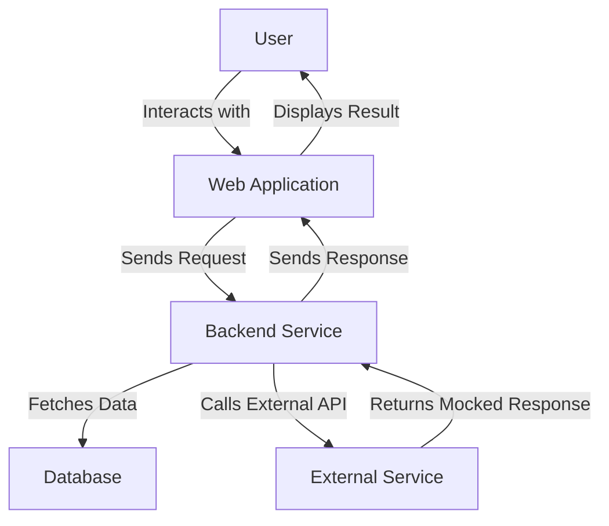

## 15.4.3 System Testing Strategies

System testing is a critical phase in the software development lifecycle, ensuring that the entire application functions as expected in an integrated environment. For Java developers transitioning to Clojure, understanding system testing strategies is essential to maintain software quality and reliability. In this section, we will delve into various system testing approaches, including end-to-end testing, and explore how to simulate external dependencies or services effectively.

### Understanding System Testing

System testing involves testing the complete and integrated software application to evaluate its compliance with the specified requirements. It is a high-level testing phase that focuses on the system's behavior as a whole, rather than individual components. This type of testing is crucial for identifying issues that may not be apparent during unit or integration testing.

#### Key Objectives of System Testing

- **Verification of Functional Requirements**: Ensure that the system meets all functional specifications.
- **Validation of Non-Functional Requirements**: Assess performance, usability, reliability, and other non-functional aspects.
- **End-to-End Workflow Testing**: Validate complete user scenarios and workflows.
- **Regression Testing**: Confirm that new changes do not adversely affect existing functionality.

### End-to-End Testing in Clojure

End-to-end (E2E) testing is a subset of system testing that simulates real user scenarios to validate the application's flow from start to finish. In Clojure, E2E testing can be achieved using various tools and libraries that facilitate testing web applications, APIs, and more.

#### Tools for End-to-End Testing in Clojure

1. **Cypress**: Although primarily a JavaScript-based tool, Cypress can be used to test ClojureScript applications by interacting with the browser.
2. **TestCafe**: Another JavaScript-based tool that supports testing ClojureScript applications.
3. **Clojure's `clj-webdriver`**: A Clojure wrapper for Selenium WebDriver, useful for browser-based testing.

#### Example: End-to-End Testing with `clj-webdriver`

Let's explore how to set up a simple E2E test using `clj-webdriver` to test a web application.

```clojure
(ns my-app.e2e-test
  (:require [clj-webdriver.taxi :as taxi]))

(defn setup []
  ;; Start the browser and navigate to the application
  (taxi/set-driver! {:browser :firefox})
  (taxi/to "http://localhost:3000"))

(defn teardown []
  ;; Close the browser
  (taxi/quit))

(defn test-login []
  (setup)
  (try
    ;; Simulate user actions
    (taxi/input-text "#username" "testuser")
    (taxi/input-text "#password" "password123")
    (taxi/click "#login-button")
    ;; Assert the expected outcome
    (assert (= "Welcome, testuser!" (taxi/text "#welcome-message")))
    (finally
      (teardown))))
```

**Explanation**: This code sets up a simple E2E test for a login feature. It uses `clj-webdriver` to automate browser interactions, such as entering text and clicking buttons, and verifies the expected outcome.

### Simulating External Dependencies

In system testing, it's often necessary to simulate external dependencies or services to test the system's behavior under various conditions. This can be achieved through mocking or stubbing techniques.

#### Mocking and Stubbing in Clojure

- **Mocking**: Creating a fake version of a service or component to simulate its behavior.
- **Stubbing**: Providing predefined responses to specific requests or interactions.

#### Libraries for Mocking and Stubbing

1. **`clj-mock`**: A Clojure library for creating mocks and stubs.
2. **`mockito-clj`**: A Clojure wrapper for the popular Java mocking framework, Mockito.

#### Example: Mocking an External API

Let's see how to mock an external API using `clj-mock`.

```clojure
(ns my-app.api-test
  (:require [clj-mock.core :as mock]))

(defn fetch-user-data [user-id]
  ;; Simulate an API call to fetch user data
  {:name "John Doe" :id user-id})

(defn test-fetch-user-data []
  (mock/with-mock [fetch-user-data (mock/returns {:name "Mock User" :id 1})]
    (let [result (fetch-user-data 1)]
      (assert (= "Mock User" (:name result)))
      (assert (= 1 (:id result))))))
```

**Explanation**: This example demonstrates how to use `clj-mock` to simulate an API call. The `fetch-user-data` function is mocked to return a predefined response, allowing us to test the behavior of the system without relying on the actual API.

### Strategies for Effective System Testing

To ensure comprehensive system testing, consider the following strategies:

1. **Define Clear Test Scenarios**: Identify key user workflows and scenarios that need to be tested.
2. **Automate Tests**: Use automation tools to execute tests consistently and efficiently.
3. **Incorporate Continuous Integration**: Integrate system tests into the CI/CD pipeline to catch issues early.
4. **Monitor Test Coverage**: Ensure that tests cover a wide range of scenarios, including edge cases.
5. **Use Realistic Test Data**: Use data that closely resembles production data to uncover potential issues.

### Comparing System Testing in Java and Clojure

Java developers transitioning to Clojure may find similarities and differences in system testing approaches. While the fundamental concepts remain the same, Clojure's functional paradigm and immutability can influence testing strategies.

#### Java vs. Clojure: System Testing

- **Java**: Often relies on object-oriented testing frameworks like JUnit and Mockito.
- **Clojure**: Leverages functional testing libraries and emphasizes immutability and pure functions.

#### Code Example: Java vs. Clojure Testing

**Java Example**: Testing a login feature using JUnit and Mockito.

```java
import static org.mockito.Mockito.*;
import org.junit.Test;
import static org.junit.Assert.*;

public class LoginTest {
    @Test
    public void testLogin() {
        UserService userService = mock(UserService.class);
        when(userService.login("testuser", "password123")).thenReturn("Welcome, testuser!");

        String result = userService.login("testuser", "password123");
        assertEquals("Welcome, testuser!", result);
    }
}
```

**Clojure Example**: Testing the same feature using `clj-mock`.

```clojure
(ns my-app.login-test
  (:require [clj-mock.core :as mock]))

(defn login [username password]
  ;; Simulate a login function
  (str "Welcome, " username "!"))

(defn test-login []
  (mock/with-mock [login (mock/returns "Welcome, testuser!")]
    (let [result (login "testuser" "password123")]
      (assert (= "Welcome, testuser!" result)))))
```

**Explanation**: Both examples demonstrate how to test a login feature, highlighting the differences in syntax and approach between Java and Clojure.

### Try It Yourself

To deepen your understanding of system testing in Clojure, try modifying the examples provided:

- **Experiment with Different Scenarios**: Add more test cases to cover different user workflows.
- **Simulate Network Failures**: Modify the mock to simulate network errors and test the system's resilience.
- **Integrate with a CI/CD Pipeline**: Set up a simple CI/CD pipeline to automate the execution of your tests.

### Diagrams and Visual Aids

To visualize the flow of data and interactions in system testing, consider the following diagram:



**Diagram Description**: This flowchart illustrates the interactions between a user, a web application, backend services, a database, and external APIs during system testing. It highlights how mocked responses can be used to simulate external services.

### Further Reading and Resources

For more information on system testing and related topics, consider exploring the following resources:

- [Official Clojure Documentation](https://clojure.org/reference/documentation)
- [ClojureDocs](https://clojuredocs.org/)
- [Selenium WebDriver](https://www.selenium.dev/documentation/en/)
- [Mockito Documentation](https://site.mockito.org/)

### Exercises and Practice Problems

1. **Exercise 1**: Create an end-to-end test for a simple CRUD application using `clj-webdriver`.
2. **Exercise 2**: Mock an external payment gateway API and test the payment processing workflow.
3. **Exercise 3**: Integrate system tests into a CI/CD pipeline using GitHub Actions or Jenkins.

### Summary and Key Takeaways

In this section, we've explored system testing strategies in Clojure, focusing on end-to-end testing and simulating external dependencies. By leveraging Clojure's functional paradigm and testing libraries, you can ensure that your applications are robust, reliable, and ready for production. Remember to define clear test scenarios, automate your tests, and continuously monitor test coverage to maintain high software quality.

---

## System Testing Strategies Quiz for Clojure Developers



### What is the primary goal of system testing?

- [x] To evaluate the complete and integrated software application.
- [ ] To test individual components in isolation.
- [ ] To focus solely on performance testing.
- [ ] To ensure code adheres to style guidelines.

> **Explanation:** System testing aims to evaluate the entire software application as a whole, ensuring it meets all specified requirements.

### Which tool is commonly used for end-to-end testing in ClojureScript applications?

- [ ] JUnit
- [x] Cypress
- [ ] Mockito
- [ ] JMeter

> **Explanation:** Cypress is a popular tool for end-to-end testing, especially for ClojureScript applications, due to its ability to interact with the browser.

### What is the purpose of mocking in system testing?

- [x] To simulate the behavior of external services or components.
- [ ] To measure the performance of the application.
- [ ] To ensure code coverage is maximized.
- [ ] To automate the deployment process.

> **Explanation:** Mocking is used to simulate the behavior of external services or components, allowing for isolated testing of the system.

### How does Clojure's functional paradigm influence testing strategies?

- [x] It emphasizes immutability and pure functions, affecting how tests are written.
- [ ] It requires the use of object-oriented testing frameworks.
- [ ] It discourages the use of automated testing tools.
- [ ] It mandates the use of Java-based testing libraries.

> **Explanation:** Clojure's functional paradigm, with its emphasis on immutability and pure functions, influences the way tests are structured and written.

### What is a key benefit of integrating system tests into a CI/CD pipeline?

- [x] Early detection of issues and consistent test execution.
- [ ] Increased manual testing efforts.
- [ ] Reduced need for unit tests.
- [ ] Elimination of integration testing.

> **Explanation:** Integrating system tests into a CI/CD pipeline allows for early detection of issues and ensures consistent execution of tests.

### Which Clojure library is used for mocking external APIs?

- [ ] JUnit
- [ ] Selenium
- [x] clj-mock
- [ ] TestCafe

> **Explanation:** `clj-mock` is a Clojure library used for creating mocks and stubs, useful for simulating external APIs.

### What is the role of end-to-end testing in system testing?

- [x] To validate complete user scenarios and workflows.
- [ ] To focus on testing individual functions.
- [ ] To measure the application's performance under load.
- [ ] To ensure code adheres to style guidelines.

> **Explanation:** End-to-end testing is a subset of system testing that validates complete user scenarios and workflows.

### How can external dependencies be simulated in system testing?

- [x] By using mocking and stubbing techniques.
- [ ] By increasing the number of unit tests.
- [ ] By reducing the number of integration tests.
- [ ] By focusing solely on performance testing.

> **Explanation:** External dependencies can be simulated using mocking and stubbing techniques, allowing for isolated testing of the system.

### What is a common challenge in system testing?

- [x] Ensuring comprehensive test coverage across various scenarios.
- [ ] Writing code that adheres to style guidelines.
- [ ] Reducing the number of unit tests.
- [ ] Eliminating the need for integration testing.

> **Explanation:** A common challenge in system testing is ensuring comprehensive test coverage across various scenarios, including edge cases.

### True or False: System testing is only concerned with functional requirements.

- [ ] True
- [x] False

> **Explanation:** System testing evaluates both functional and non-functional requirements, including performance, usability, and reliability.


