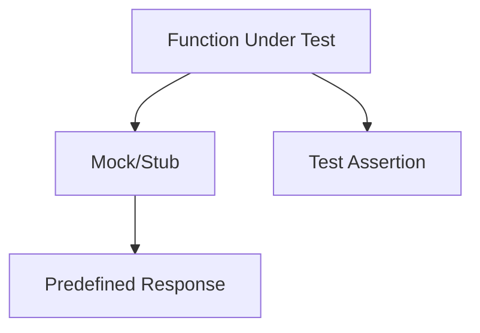

## 15.5.1 Understanding the Purpose of Mocks and Stubs in Clojure Testing

In the world of software development, testing is a crucial component that ensures the reliability and correctness of code. As experienced Java developers transitioning to Clojure, understanding the purpose and application of mocks and stubs in testing can significantly enhance your ability to write robust and maintainable tests. This section will delve into the concepts of mocking and stubbing, their importance in testing, and how they can be effectively utilized in Clojure.

### Introduction to Mocks and Stubs

Mocks and stubs are two types of test doubles used to simulate the behavior of real objects in a controlled way. They are particularly useful when testing code that interacts with external systems or has side effects, such as database access, network communication, or file I/O.

- **Mocks**: These are objects that simulate the behavior of real objects. They are used to verify interactions between objects by asserting that certain methods were called with specific arguments.
- **Stubs**: These are objects that provide predefined responses to method calls. They are used to isolate the unit of work by replacing parts of the system that are not under test.

### Why Use Mocks and Stubs?

Mocks and stubs are essential for several reasons:

1. **Isolation**: They allow you to isolate the unit of work from its dependencies, ensuring that tests are focused and reliable.
2. **Control**: They provide control over the behavior of dependencies, allowing you to simulate various scenarios and edge cases.
3. **Performance**: They can improve test performance by avoiding slow operations, such as network calls or database queries.
4. **Reliability**: They eliminate the reliance on external systems, reducing flakiness in tests due to factors outside your control.

### Mocks and Stubs in Clojure

Clojure, being a functional language, encourages immutability and pure functions, which naturally leads to more testable code. However, when dealing with side effects or external systems, mocks and stubs become invaluable tools.

#### Mocking in Clojure

Mocking in Clojure can be achieved using libraries such as `clojure.test.mock` or `midje`. These libraries provide facilities to create mock objects and verify interactions.

**Example: Mocking a Database Call**

Let's consider a scenario where we have a function that retrieves user data from a database:

```clojure
(defn get-user [db user-id]
  ;; Simulate a database call
  (db/query {:select [:*] :from :users :where [:= :id user-id]}))
```

To test this function without an actual database, we can use a mock:

```clojure
(ns myapp.test
  (:require [clojure.test :refer :all]
            [clojure.test.mock :as mock]))

(deftest test-get-user
  (let [mock-db (mock/mock {:query (fn [_] {:id 1 :name "Alice"})})]
    (is (= {:id 1 :name "Alice"} (get-user mock-db 1)))))
```

In this example, `mock-db` is a mock object that simulates the behavior of a database. The `query` method is stubbed to return a predefined user object.

#### Stubbing in Clojure

Stubbing in Clojure can be done using similar libraries. Stubs are used to provide controlled responses to function calls.

**Example: Stubbing an HTTP Request**

Consider a function that makes an HTTP request to fetch data:

```clojure
(defn fetch-data [url]
  ;; Simulate an HTTP request
  (http/get url))
```

To test this function without making an actual HTTP request, we can use a stub:

```clojure
(ns myapp.test
  (:require [clojure.test :refer :all]
            [clojure.test.mock :as mock]))

(deftest test-fetch-data
  (let [mock-http (mock/mock {:get (fn [_] {:status 200 :body "OK"})})]
    (is (= {:status 200 :body "OK"} (fetch-data mock-http "http://example.com")))))
```

Here, `mock-http` is a stub that provides a predefined response for the `get` method.

### Comparing Mocks and Stubs in Java and Clojure

In Java, mocking and stubbing are commonly done using libraries like Mockito. The concepts are similar, but the syntax and approach differ due to the nature of the languages.

**Java Example: Mocking with Mockito**

```java
import static org.mockito.Mockito.*;
import org.junit.Test;
import static org.junit.Assert.*;

public class UserServiceTest {
    @Test
    public void testGetUser() {
        Database mockDb = mock(Database.class);
        when(mockDb.query(anyString())).thenReturn(new User(1, "Alice"));

        UserService userService = new UserService(mockDb);
        User user = userService.getUser(1);

        assertEquals("Alice", user.getName());
    }
}
```

In this Java example, `mock` creates a mock object, and `when` specifies the behavior of the mock. The Clojure approach is more functional and leverages the language's strengths, such as higher-order functions and immutability.

### Best Practices for Using Mocks and Stubs

1. **Use Mocks and Stubs Sparingly**: Overuse can lead to brittle tests that are tightly coupled to implementation details.
2. **Focus on Behavior**: Test the behavior of the unit under test, not the implementation details of the mocks or stubs.
3. **Keep Tests Simple**: Avoid complex setup and teardown logic. Mocks and stubs should simplify tests, not complicate them.
4. **Verify Interactions**: Use mocks to verify that the correct interactions occur between objects, especially when dealing with side effects.

### Try It Yourself

Experiment with the provided examples by modifying the mock and stub behaviors. Try changing the return values or adding additional method calls to see how it affects the tests.

### Diagrams and Visualizations

To better understand the flow of data and interactions when using mocks and stubs, consider the following diagram:



**Diagram Description**: This flowchart illustrates the interaction between the function under test and the mock/stub, which provides a predefined response. The test assertion verifies the expected outcome.

### Further Reading

For more information on mocking and stubbing in Clojure, consider exploring the following resources:

- [Official Clojure Documentation](https://clojure.org/)
- [ClojureDocs](https://clojuredocs.org/)
- [Midje Testing Library](https://github.com/marick/Midje)

### Exercises

1. **Exercise 1**: Create a mock for a function that interacts with a file system. Test the function without actually reading or writing files.
2. **Exercise 2**: Stub an external API call in a Clojure function. Verify that the function handles different response scenarios correctly.

### Key Takeaways

- Mocks and stubs are powerful tools for isolating and controlling dependencies in tests.
- They are particularly useful for testing code with side effects or external interactions.
- Clojure's functional nature and libraries make it easy to implement mocks and stubs.
- Use mocks and stubs judiciously to maintain test reliability and simplicity.

Now that we've explored the purpose and application of mocks and stubs in Clojure, let's apply these concepts to enhance the testability of your applications.

## Quiz: Mastering Mocks and Stubs in Clojure Testing



### What is the primary purpose of using mocks in testing?

- [x] To simulate the behavior of real objects and verify interactions
- [ ] To provide predefined responses to method calls
- [ ] To improve code readability
- [ ] To enhance performance of production code

> **Explanation:** Mocks are used to simulate the behavior of real objects and verify that certain interactions occur during testing.

### How do stubs differ from mocks?

- [x] Stubs provide predefined responses, while mocks verify interactions
- [ ] Stubs verify interactions, while mocks provide predefined responses
- [ ] Stubs are used for performance testing, while mocks are for unit testing
- [ ] Stubs are only used in Clojure, while mocks are used in Java

> **Explanation:** Stubs provide predefined responses to method calls, whereas mocks are used to verify interactions between objects.

### Which Clojure library is commonly used for mocking?

- [x] clojure.test.mock
- [ ] clojure.core.async
- [ ] clojure.java.jdbc
- [ ] clojure.spec

> **Explanation:** `clojure.test.mock` is a library used in Clojure for creating mock objects and verifying interactions.

### What is a key benefit of using mocks and stubs in testing?

- [x] They allow for isolation of the unit of work from its dependencies
- [ ] They automatically generate test cases
- [ ] They eliminate the need for test assertions
- [ ] They improve the performance of production code

> **Explanation:** Mocks and stubs allow for the isolation of the unit of work from its dependencies, ensuring focused and reliable tests.

### In Java, which library is commonly used for mocking?

- [x] Mockito
- [ ] JUnit
- [ ] Spring
- [ ] Hibernate

> **Explanation:** Mockito is a popular library in Java used for creating mock objects and verifying interactions.

### What should be the focus when using mocks and stubs in tests?

- [x] Testing the behavior of the unit under test
- [ ] Testing the implementation details of the mocks
- [ ] Testing the performance of the mocks
- [ ] Testing the syntax of the mocks

> **Explanation:** The focus should be on testing the behavior of the unit under test, not the implementation details of the mocks or stubs.

### What is a potential downside of overusing mocks and stubs?

- [x] Tests can become brittle and tightly coupled to implementation details
- [ ] Tests will run faster
- [ ] Tests will become more reliable
- [ ] Tests will require less maintenance

> **Explanation:** Overusing mocks and stubs can lead to brittle tests that are tightly coupled to implementation details, making them harder to maintain.

### What is a common use case for stubs?

- [x] Providing controlled responses to function calls
- [ ] Verifying that methods are called with specific arguments
- [ ] Automatically generating test data
- [ ] Improving code readability

> **Explanation:** Stubs are used to provide controlled responses to function calls, allowing for isolation and control in tests.

### How can you experiment with mocks and stubs in Clojure?

- [x] By modifying the mock and stub behaviors in test examples
- [ ] By using them in production code
- [ ] By avoiding their use in tests
- [ ] By using them only in integration tests

> **Explanation:** Experimenting with mocks and stubs involves modifying their behaviors in test examples to see how they affect the tests.

### True or False: Mocks and stubs are only useful in functional programming languages.

- [ ] True
- [x] False

> **Explanation:** Mocks and stubs are useful in both functional and object-oriented programming languages for testing purposes.


