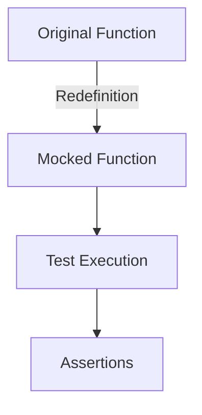

## 15.5.2 Mocking Libraries

As experienced Java developers transitioning to Clojure, you are likely familiar with the concept of mocking in unit tests. Mocking allows you to isolate the unit of work by replacing dependencies with controlled substitutes. In Clojure, mocking can be achieved through libraries like `clojure.test.mock` or by using built-in techniques such as `with-redefs`. This section will guide you through these tools and techniques, helping you to write effective and reliable tests in Clojure.

### Understanding Mocking in Clojure

Mocking in Clojure serves the same purpose as in Java: to simulate the behavior of complex, unpredictable, or external systems during testing. However, Clojure's functional nature and emphasis on immutability introduce unique approaches to mocking.

#### Key Differences from Java

- **Immutability**: Clojure's immutable data structures mean that state changes are not as prevalent as in Java, reducing the need for mocks that track state changes.
- **First-Class Functions**: Functions in Clojure can be passed around and redefined easily, allowing for more straightforward mocking techniques.
- **Dynamic Binding**: Clojure's dynamic nature allows for temporary redefinition of functions, which can be leveraged for mocking.

### Mocking Libraries in Clojure

Several libraries and techniques can be used for mocking in Clojure. Let's explore some of the most popular options.

#### clojure.test.mock

`clojure.test.mock` is a library that provides a straightforward way to create mocks and stubs in Clojure. It is designed to integrate seamlessly with `clojure.test`, the standard testing framework in Clojure.

##### Installation

To use `clojure.test.mock`, add it to your `project.clj` or `deps.edn` file:

```clojure
;; project.clj
:dependencies [[org.clojure/clojure "1.10.3"]
               [clojure.test.mock "0.1.0"]]

;; deps.edn
{:deps {org.clojure/clojure {:mvn/version "1.10.3"}
        clojure.test.mock {:mvn/version "0.1.0"}}}
```

##### Basic Usage

Here's a simple example of how to use `clojure.test.mock` to mock a function:

```clojure
(ns myapp.core-test
  (:require [clojure.test :refer :all]
            [clojure.test.mock :refer :all]
            [myapp.core :as core]))

(deftest test-my-function
  (with-mocks [core/dependency-fn (mock (returns 42))]
    (is (= 42 (core/my-function)))))
```

In this example, `core/dependency-fn` is mocked to always return `42`. The `with-mocks` macro temporarily replaces the function during the test.

##### Advanced Features

`clojure.test.mock` also supports more advanced features such as:

- **Argument Matching**: Specify expected arguments for mocked functions.
- **Call Verification**: Verify that mocked functions are called with expected arguments.

```clojure
(deftest test-advanced-mocking
  (with-mocks [core/dependency-fn (mock (returns 42) (args [1 2]))]
    (core/my-function 1 2)
    (verify-mock core/dependency-fn)))
```

### Using `with-redefs` for Mocking

Clojure provides a built-in mechanism for temporarily redefining functions using `with-redefs`. This is particularly useful for mocking functions in a test context.

#### Basic Usage

`with-redefs` allows you to redefine a function within a specific scope:

```clojure
(ns myapp.core-test
  (:require [clojure.test :refer :all]
            [myapp.core :as core]))

(deftest test-my-function
  (with-redefs [core/dependency-fn (fn [& _] 42)]
    (is (= 42 (core/my-function)))))
```

In this example, `core/dependency-fn` is redefined to return `42` during the execution of the test.

#### Advantages and Limitations

- **Advantages**: Simple to use and does not require additional dependencies.
- **Limitations**: Does not provide built-in support for argument matching or call verification.

### Comparing Mocking in Java and Clojure

Let's compare how mocking is typically done in Java using a library like Mockito and how it differs in Clojure.

#### Java Example with Mockito

```java
import static org.mockito.Mockito.*;
import org.junit.Test;

public class MyServiceTest {
    @Test
    public void testMyMethod() {
        Dependency dependency = mock(Dependency.class);
        when(dependency.someMethod()).thenReturn(42);

        MyService service = new MyService(dependency);
        assertEquals(42, service.myMethod());
    }
}
```

#### Clojure Equivalent

```clojure
(ns myapp.core-test
  (:require [clojure.test :refer :all]
            [myapp.core :as core]))

(deftest test-my-function
  (with-redefs [core/dependency-fn (fn [& _] 42)]
    (is (= 42 (core/my-function)))))
```

**Comparison**:

- **Setup**: Java requires a mocking library like Mockito, while Clojure can use built-in features like `with-redefs`.
- **Syntax**: Clojure's syntax is more concise, leveraging its functional nature.
- **Flexibility**: Clojure's dynamic nature allows for more flexible mocking without additional libraries.

### Try It Yourself

Experiment with the following code snippets to deepen your understanding of mocking in Clojure:

1. Modify the `with-redefs` example to mock a function that takes multiple arguments and returns a computed value.
2. Use `clojure.test.mock` to verify that a mocked function is called with specific arguments.

### Diagrams and Visuals

Below is a diagram illustrating the flow of data through a mocked function using `with-redefs`:



*Diagram 1: Flow of data through a mocked function using `with-redefs`.*

### Exercises

1. **Exercise 1**: Write a test using `clojure.test.mock` to mock a function that interacts with an external API. Verify that the function is called with the correct parameters.
2. **Exercise 2**: Refactor a Java test that uses Mockito into a Clojure test using `with-redefs`.

### Key Takeaways

- **Mocking in Clojure**: Leverage `clojure.test.mock` and `with-redefs` to mock dependencies in your tests.
- **Functional Approach**: Clojure's functional nature simplifies mocking by allowing functions to be easily redefined.
- **Comparison with Java**: Clojure offers a more concise and flexible approach to mocking compared to Java.

By mastering these mocking techniques, you can write more effective and reliable tests in Clojure, ensuring your applications are robust and maintainable.

### Further Reading

- [Official Clojure Documentation](https://clojure.org/reference/documentation)
- [ClojureDocs](https://clojuredocs.org/)
- [clojure.test.mock GitHub Repository](https://github.com/clojure/test.mock)

## Quiz: Mastering Mocking Libraries in Clojure



### What is the primary purpose of mocking in unit tests?

- [x] To simulate the behavior of dependencies
- [ ] To increase the complexity of tests
- [ ] To replace the testing framework
- [ ] To ensure tests run slower

> **Explanation:** Mocking is used to simulate the behavior of dependencies, allowing for isolated testing of the unit of work.


### Which Clojure feature allows temporary redefinition of functions?

- [x] with-redefs
- [ ] defn
- [ ] let
- [ ] loop

> **Explanation:** `with-redefs` is used in Clojure to temporarily redefine functions within a specific scope.


### What is a key advantage of using `with-redefs` in Clojure?

- [x] It does not require additional dependencies
- [ ] It provides built-in argument matching
- [ ] It is only available in Java
- [ ] It requires a complex setup

> **Explanation:** `with-redefs` is a built-in feature in Clojure that does not require additional dependencies.


### How does `clojure.test.mock` integrate with Clojure's testing framework?

- [x] It integrates with clojure.test
- [ ] It replaces clojure.test
- [ ] It only works with JUnit
- [ ] It is incompatible with Clojure

> **Explanation:** `clojure.test.mock` is designed to integrate seamlessly with `clojure.test`.


### What is a limitation of using `with-redefs` for mocking?

- [x] It does not provide built-in support for argument matching
- [ ] It requires a third-party library
- [ ] It is only available in Java
- [ ] It cannot redefine functions

> **Explanation:** `with-redefs` does not provide built-in support for argument matching or call verification.


### Which Java library is commonly used for mocking?

- [x] Mockito
- [ ] JUnit
- [ ] Spring
- [ ] Hibernate

> **Explanation:** Mockito is a popular library in Java for creating mocks in unit tests.


### What is a benefit of Clojure's functional nature in mocking?

- [x] Functions can be easily redefined
- [ ] It makes mocking impossible
- [ ] It requires more complex syntax
- [ ] It eliminates the need for tests

> **Explanation:** Clojure's functional nature allows functions to be easily redefined, simplifying mocking.


### Which of the following is a feature of `clojure.test.mock`?

- [x] Call verification
- [ ] Automatic test generation
- [ ] Built-in database mocking
- [ ] UI testing support

> **Explanation:** `clojure.test.mock` supports call verification to ensure mocked functions are called with expected arguments.


### How does Clojure's approach to mocking differ from Java's?

- [x] Clojure offers a more concise and flexible approach
- [ ] Clojure requires more boilerplate code
- [ ] Java provides more built-in mocking features
- [ ] Clojure does not support mocking

> **Explanation:** Clojure's approach to mocking is more concise and flexible due to its functional nature.


### True or False: `with-redefs` can be used to redefine functions globally.

- [ ] True
- [x] False

> **Explanation:** `with-redefs` redefines functions only within the scope of its execution, not globally.


