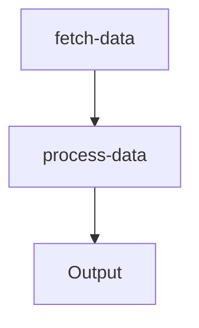

## 15.5.3 Writing Tests with Mocks

In this section, we will delve into the art of writing tests with mocks in Clojure, a crucial skill for ensuring your code is both reliable and maintainable. As experienced Java developers, you are likely familiar with the concept of mocking to isolate units of code during testing. We will build on that foundation, exploring how Clojure's functional paradigm and unique features can enhance your testing strategy.

### Understanding Mocks and Stubs

**Mocks** and **stubs** are test doubles used to simulate the behavior of real objects. They allow us to isolate the code under test by providing controlled responses to method calls or function invocations. This isolation is crucial for testing components independently and ensuring that tests are not affected by external dependencies.

- **Mocks**: These are objects that record their interactions, allowing you to verify that certain methods were called with expected parameters.
- **Stubs**: These provide predefined responses to method calls, without recording interactions.

In Java, libraries like Mockito are commonly used for mocking. Clojure, being a functional language, approaches mocking differently, often using functions and closures to achieve similar results.

### Why Use Mocks in Clojure?

Mocks are particularly useful in scenarios where:

- The code under test interacts with external systems (e.g., databases, web services).
- You want to simulate error conditions or edge cases that are difficult to reproduce.
- Testing involves components that are not yet implemented.

Clojure's immutable data structures and first-class functions provide a powerful foundation for creating test doubles. By leveraging these features, we can write concise and expressive tests.

### Setting Up Your Clojure Testing Environment

Before diving into examples, ensure your Clojure environment is set up for testing. You will need:

- **Leiningen**: A build automation tool for Clojure.
- **Clojure.test**: The built-in testing library.
- **Mocking Libraries**: Libraries like `clojure.test.mock` or `midje` can be used for more advanced mocking capabilities.

To include these in your project, update your `project.clj` file:

```clojure
(defproject my-clojure-project "0.1.0-SNAPSHOT"
  :dependencies [[org.clojure/clojure "1.10.3"]
                 [midje "1.9.10"]]
  :plugins [[lein-midje "3.2.1"]])
```

### Writing Tests with Mocks in Clojure

Let's explore how to write tests using mocks in Clojure with practical examples.

#### Example 1: Mocking a Simple Function

Suppose we have a function `fetch-data` that retrieves data from an external API. We want to test another function `process-data` that depends on `fetch-data`.

```clojure
(ns my-clojure-project.core
  (:require [clojure.test :refer :all]))

(defn fetch-data []
  ;; Imagine this function makes an HTTP request
  {:status 200 :body "data"})

(defn process-data []
  (let [data (fetch-data)]
    ;; Process the data
    (str "Processed: " (:body data))))
```

To test `process-data`, we can mock `fetch-data` to return a controlled response:

```clojure
(deftest test-process-data
  (with-redefs [fetch-data (fn [] {:status 200 :body "mock data"})]
    (is (= "Processed: mock data" (process-data)))))
```

**Explanation**: We use `with-redefs` to temporarily redefine `fetch-data` within the scope of the test. This allows us to control its output and test `process-data` in isolation.

#### Example 2: Using Midje for More Advanced Mocking

Midje is a popular testing library in Clojure that offers more expressive syntax for writing tests and mocks.

```clojure
(ns my-clojure-project.core-test
  (:require [midje.sweet :refer :all]
            [my-clojure-project.core :refer :all]))

(fact "process-data should return processed mock data"
  (fetch-data) => {:status 200 :body "mock data"}
  (process-data) => "Processed: mock data")
```

**Explanation**: Midje's `fact` macro allows us to specify expectations in a readable format. We define that `fetch-data` should return a specific map, and `process-data` should produce the expected result.

### Comparing Clojure Mocks with Java

In Java, mocking frameworks like Mockito use proxy objects to intercept method calls. Clojure's approach, using functions and closures, is more lightweight and aligns with its functional nature.

**Java Example with Mockito**:

```java
import static org.mockito.Mockito.*;
import org.junit.Test;
import static org.junit.Assert.*;

public class MyJavaTest {
    @Test
    public void testProcessData() {
        MyService service = mock(MyService.class);
        when(service.fetchData()).thenReturn("mock data");

        MyProcessor processor = new MyProcessor(service);
        assertEquals("Processed: mock data", processor.processData());
    }
}
```

**Clojure Equivalent**:

```clojure
(deftest test-process-data
  (with-redefs [fetch-data (fn [] {:status 200 :body "mock data"})]
    (is (= "Processed: mock data" (process-data)))))
```

**Key Differences**:
- **Simplicity**: Clojure's `with-redefs` is simpler and requires less boilerplate than Java's Mockito.
- **Flexibility**: Clojure's functions can be easily redefined, offering more flexibility in test setup.

### Try It Yourself

Experiment with the following modifications to deepen your understanding:

- Change the response of `fetch-data` to simulate different scenarios (e.g., error responses).
- Use Midje to test a function that interacts with multiple dependencies.
- Explore how `with-redefs` can be used to mock other types of dependencies, such as database connections.

### Visualizing the Flow of Data

To better understand how data flows through our mocked functions, let's use a diagram:



**Diagram Explanation**: This flowchart illustrates how `fetch-data` feeds into `process-data`, which then produces an output. By mocking `fetch-data`, we control the input to `process-data`, ensuring predictable and testable outcomes.

### Best Practices for Writing Tests with Mocks

- **Keep Tests Focused**: Each test should focus on a single behavior or outcome.
- **Use Mocks Sparingly**: Overuse of mocks can lead to brittle tests. Use them only when necessary to isolate the code under test.
- **Document Mock Behavior**: Clearly document the expected behavior of mocks to ensure tests remain understandable and maintainable.

### Exercises

1. **Exercise 1**: Write a test for a function that calculates the total price of items in a shopping cart, mocking the function that retrieves item prices.
2. **Exercise 2**: Use Midje to test a function that sends emails, mocking the email service to verify that emails are sent with the correct content.

### Summary and Key Takeaways

- Mocks and stubs are essential tools for isolating code during testing.
- Clojure's functional nature offers a unique approach to mocking, using functions and closures.
- Libraries like Midje provide expressive syntax for writing tests and defining expectations.
- By leveraging your Java experience, you can effectively apply these concepts in Clojure, enhancing your testing strategy.

### Further Reading

- [Clojure Official Documentation](https://clojure.org/reference/documentation)
- [Midje Documentation](https://github.com/marick/Midje/wiki)
- [ClojureDocs](https://clojuredocs.org/)

Now that we've explored how to write tests with mocks in Clojure, let's apply these concepts to ensure your applications are robust and reliable.

## Quiz: Mastering Clojure Testing with Mocks



### What is the primary purpose of using mocks in testing?

- [x] To isolate the code under test by simulating dependencies.
- [ ] To increase the execution speed of tests.
- [ ] To replace all real objects in the system.
- [ ] To ensure tests are always successful.

> **Explanation:** Mocks are used to isolate the code under test by simulating dependencies, allowing for controlled testing environments.

### How does Clojure's `with-redefs` function help in testing?

- [x] It temporarily redefines functions for the scope of the test.
- [ ] It permanently changes the function definitions.
- [ ] It creates a new namespace for testing.
- [ ] It automatically generates test data.

> **Explanation:** `with-redefs` temporarily redefines functions within the scope of a test, allowing for controlled testing scenarios.

### Which Clojure library provides expressive syntax for writing tests with mocks?

- [x] Midje
- [ ] Mockito
- [ ] JUnit
- [ ] Spock

> **Explanation:** Midje is a Clojure library that provides expressive syntax for writing tests and defining expectations with mocks.

### In Clojure, what is a common way to mock a function's behavior?

- [x] Using closures and `with-redefs`.
- [ ] Using Java's Reflection API.
- [ ] Creating proxy objects.
- [ ] Overloading functions.

> **Explanation:** Clojure commonly uses closures and `with-redefs` to mock function behavior during testing.

### What is a key advantage of using mocks in testing?

- [x] They allow testing of components in isolation.
- [ ] They eliminate the need for real data.
- [ ] They make tests run faster.
- [ ] They automatically fix bugs.

> **Explanation:** Mocks allow testing of components in isolation, ensuring that tests are not affected by external dependencies.

### How does Clojure's approach to mocking differ from Java's?

- [x] Clojure uses functions and closures, while Java uses proxy objects.
- [ ] Clojure uses proxy objects, while Java uses functions.
- [ ] Clojure does not support mocking.
- [ ] Java does not support mocking.

> **Explanation:** Clojure uses functions and closures for mocking, while Java typically uses proxy objects with frameworks like Mockito.

### What is the role of a stub in testing?

- [x] To provide predefined responses to method calls.
- [ ] To record interactions for verification.
- [ ] To replace all real objects in the system.
- [ ] To automatically generate test cases.

> **Explanation:** Stubs provide predefined responses to method calls, allowing for controlled testing environments.

### Which of the following is a best practice when using mocks?

- [x] Use mocks sparingly to avoid brittle tests.
- [ ] Mock every function in the system.
- [ ] Avoid documenting mock behavior.
- [ ] Use mocks to replace all real data.

> **Explanation:** Using mocks sparingly helps avoid brittle tests, and documenting mock behavior ensures tests remain understandable.

### What is a potential downside of overusing mocks?

- [x] Tests can become brittle and hard to maintain.
- [ ] Tests will always pass.
- [ ] Tests will run faster.
- [ ] Tests will require less code.

> **Explanation:** Overusing mocks can lead to brittle tests that are hard to maintain, as they may not accurately reflect real-world scenarios.

### True or False: Mocks can be used to simulate error conditions in testing.

- [x] True
- [ ] False

> **Explanation:** True. Mocks can be used to simulate error conditions, allowing for testing of edge cases and error handling.


