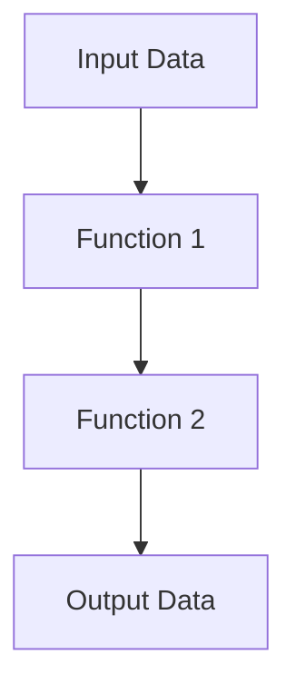

## 15.6.1 Debugging in the REPL

Debugging is an essential skill for any developer, and the Clojure Read-Eval-Print Loop (REPL) offers a powerful environment for interactive debugging. In this section, we'll explore how to use the REPL to inspect values, test functions interactively, and examine stack traces. We'll draw parallels to Java debugging techniques to help you transition smoothly into Clojure's functional paradigm.

### Understanding the REPL

The REPL is a cornerstone of Clojure development, providing an interactive environment where you can evaluate expressions, test functions, and debug code in real-time. Unlike traditional debugging methods in Java, which often involve setting breakpoints and stepping through code, the REPL allows for a more dynamic and immediate approach to problem-solving.

#### Key Features of the REPL

- **Immediate Feedback**: Evaluate expressions and see results instantly.
- **Interactive Testing**: Test functions and logic without needing to compile an entire application.
- **State Inspection**: Examine the current state of variables and data structures.
- **Error Exploration**: Investigate stack traces and error messages directly.

### Inspecting Values in the REPL

One of the primary uses of the REPL is to inspect values and understand the state of your program. This is akin to using a debugger in Java to watch variables.

#### Example: Inspecting a List

Let's say we have a list of numbers, and we want to inspect its contents:

```clojure
(def numbers [1 2 3 4 5])
```

To inspect the list, simply evaluate the symbol:

```clojure
numbers
;; => [1 2 3 4 5]
```

This immediate feedback allows you to verify the contents of `numbers` without additional setup.

#### Comparing with Java

In Java, inspecting a list typically involves using a debugger to set breakpoints or printing values to the console. The REPL streamlines this process by allowing direct interaction with data structures.

### Testing Functions Interactively

The REPL excels at interactive function testing, enabling you to experiment with different inputs and observe outputs without recompiling your code.

#### Example: Testing a Function

Consider a simple function that doubles a number:

```clojure
(defn double [n]
  (* 2 n))
```

You can test this function directly in the REPL:

```clojure
(double 5)
;; => 10
```

Try different inputs to see how the function behaves:

```clojure
(double -3)
;; => -6
```

#### Java Comparison

In Java, testing a function typically requires writing a test case or a main method to execute the function. The REPL's interactive nature simplifies this process, allowing for rapid experimentation.

### Examining Stack Traces

When errors occur, the REPL provides stack traces that help diagnose issues. Understanding these traces is crucial for effective debugging.

#### Example: Handling an Error

Suppose we have a function that divides two numbers:

```clojure
(defn divide [a b]
  (/ a b))
```

If we attempt to divide by zero, an error occurs:

```clojure
(divide 10 0)
;; => ArithmeticException Divide by zero
```

The REPL displays a stack trace, which you can use to trace the source of the error.

#### Analyzing the Stack Trace

The stack trace provides information about where the error occurred, similar to Java's stack traces. Use this information to pinpoint the issue and make necessary corrections.

### Advanced REPL Debugging Techniques

Beyond basic inspection and testing, the REPL offers advanced debugging techniques that enhance your development workflow.

#### Using `tap>` for Data Inspection

The `tap>` function allows you to send data to a tap, which can be useful for inspecting intermediate values in a computation.

```clojure
(tap> (range 10))
;; => nil
```

You can then use a tap handler to view the data:

```clojure
(add-tap (fn [x] (println "Tapped value:" x)))
```

#### Leveraging `trace` for Function Calls

The `trace` macro from the `clojure.tools.trace` library provides insights into function calls and returns.

```clojure
(require '[clojure.tools.trace :refer [trace]])

(trace (double 5))
;; => TRACE t12345: (double 5)
;; => TRACE t12345: => 10
```

This is similar to using logging in Java to trace execution flow.

### Try It Yourself: Experiment with the REPL

To deepen your understanding, try modifying the examples above:

- Change the `double` function to triple the input and test it.
- Introduce an error in the `divide` function and examine the stack trace.
- Use `tap>` to inspect a complex data structure.

### Visualizing Data Flow in the REPL

To better understand how data flows through your functions, consider the following diagram:



This diagram represents the flow of data through a series of functions, illustrating how the REPL can be used to inspect each step.

### External Resources for Further Reading

- [Official Clojure Documentation](https://clojure.org/reference/repl)
- [ClojureDocs](https://clojuredocs.org/)
- [Clojure REPL Guide on GitHub](https://github.com/clojure/tools.nrepl)

### Exercises and Practice Problems

1. **Modify the `double` Function**: Change it to return the square of the input and test it in the REPL.
2. **Handle Errors Gracefully**: Update the `divide` function to handle division by zero without throwing an exception.
3. **Explore `tap>`**: Use `tap>` to inspect a nested map and print its contents.

### Key Takeaways

- The REPL provides an interactive environment for debugging, allowing for immediate feedback and testing.
- Use the REPL to inspect values, test functions, and examine stack traces.
- Advanced techniques like `tap>` and `trace` enhance your debugging capabilities.
- The REPL's interactive nature simplifies the debugging process compared to traditional Java methods.

Now that we've explored how to use the REPL for debugging, let's apply these techniques to streamline your development workflow and enhance your problem-solving skills.

## Clojure REPL Debugging Quiz: Test Your Knowledge



### What is the primary advantage of using the REPL for debugging in Clojure?

- [x] Immediate feedback and interactive testing
- [ ] Automatic code optimization
- [ ] Built-in error correction
- [ ] Seamless integration with Java

> **Explanation:** The REPL provides immediate feedback and allows for interactive testing, which is a significant advantage for debugging.

### How can you inspect the contents of a list in the REPL?

- [x] Evaluate the list symbol directly
- [ ] Use a debugger tool
- [ ] Print the list using `println`
- [ ] Compile the code and run tests

> **Explanation:** Evaluating the list symbol directly in the REPL shows its contents immediately.

### What function can be used to send data to a tap for inspection?

- [x] `tap>`
- [ ] `trace`
- [ ] `println`
- [ ] `inspect`

> **Explanation:** The `tap>` function sends data to a tap, allowing for inspection.

### Which library provides the `trace` macro for tracing function calls?

- [x] `clojure.tools.trace`
- [ ] `clojure.core`
- [ ] `clojure.test`
- [ ] `clojure.data`

> **Explanation:** The `clojure.tools.trace` library provides the `trace` macro for tracing function calls.

### What is a common use case for the `tap>` function?

- [x] Inspecting intermediate values in a computation
- [ ] Optimizing function performance
- [ ] Automatically correcting errors
- [ ] Generating documentation

> **Explanation:** `tap>` is commonly used to inspect intermediate values in a computation.

### How does the REPL simplify testing functions compared to Java?

- [x] Allows for rapid experimentation without recompiling
- [ ] Automatically generates test cases
- [ ] Provides built-in performance analysis
- [ ] Integrates with all Java IDEs

> **Explanation:** The REPL allows for rapid experimentation and testing without the need to recompile code, unlike Java.

### What is the purpose of the `trace` macro?

- [x] To trace function calls and returns
- [ ] To optimize code execution
- [ ] To automatically handle exceptions
- [ ] To generate performance reports

> **Explanation:** The `trace` macro is used to trace function calls and returns, providing insights into execution flow.

### How can you handle division by zero in the `divide` function?

- [x] Use a conditional to check for zero before dividing
- [ ] Use a try-catch block
- [ ] Use a logging library
- [ ] Use the `trace` macro

> **Explanation:** Using a conditional to check for zero before dividing can prevent division by zero errors.

### What does the stack trace in the REPL provide?

- [x] Information about where an error occurred
- [ ] Automatic error correction
- [ ] Performance metrics
- [ ] Code optimization suggestions

> **Explanation:** The stack trace provides information about where an error occurred, helping to diagnose issues.

### True or False: The REPL can be used to compile Clojure code.

- [ ] True
- [x] False

> **Explanation:** The REPL is used for evaluating expressions and testing code interactively, not for compiling Clojure code.




