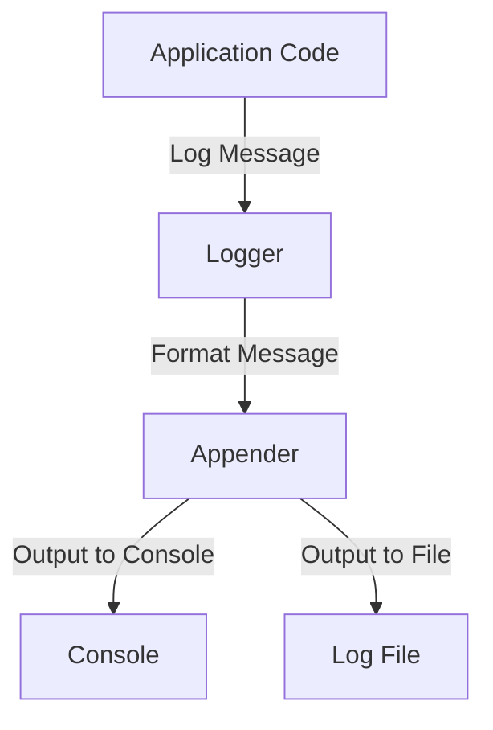

## 15.6.2 Logging for Debugging

In the world of software development, logging is an indispensable tool for debugging and monitoring applications. As experienced Java developers transitioning to Clojure, you may already be familiar with Java's logging frameworks such as Log4j, SLF4J, and java.util.logging. In this section, we will explore how logging in Clojure can be leveraged for effective debugging, drawing parallels with Java where applicable.

### Understanding Logging in Clojure

Logging in Clojure is similar to Java in that it involves recording messages that describe the execution of a program. These messages can be used to trace the flow of execution, identify errors, and understand application behavior. However, Clojure's functional nature and its emphasis on immutability and simplicity offer unique advantages and challenges in logging.

#### Key Concepts in Clojure Logging

- **Immutability**: Clojure's immutable data structures ensure that logged data remains unchanged, providing a reliable record of application state.
- **Simplicity**: Clojure's concise syntax allows for straightforward logging code, reducing boilerplate and enhancing readability.
- **Interoperability**: Clojure can leverage Java's robust logging libraries, providing flexibility and familiarity for Java developers.

### Setting Up Logging in Clojure

To begin logging in Clojure, you can use popular Java logging libraries such as Log4j or SLF4J. These libraries offer comprehensive features and are well-suited for Clojure applications.

#### Using Log4j with Clojure

Log4j is a widely-used logging library in the Java ecosystem. To use Log4j in Clojure, you need to include the necessary dependencies in your project.

```clojure
;; project.clj for Leiningen
(defproject my-clojure-app "0.1.0-SNAPSHOT"
  :dependencies [[org.clojure/clojure "1.10.3"]
                 [org.apache.logging.log4j/log4j-core "2.14.1"]
                 [org.apache.logging.log4j/log4j-api "2.14.1"]])
```

Once the dependencies are set, you can configure Log4j using a configuration file (e.g., `log4j2.xml`) and start logging in your Clojure code.

```clojure
(ns my-clojure-app.core
  (:import [org.apache.logging.log4j LogManager]))

(def logger (LogManager/getLogger "my-clojure-app"))

(defn log-example []
  (.info logger "This is an info message")
  (.warn logger "This is a warning message")
  (.error logger "This is an error message"))
```

#### Configuring Logging Levels

Logging levels allow you to control the granularity of log output. Common levels include DEBUG, INFO, WARN, and ERROR. By configuring these levels, you can filter log messages based on their importance.

```xml
<!-- log4j2.xml -->
<Configuration status="WARN">
  <Appenders>
    <Console name="Console" target="SYSTEM_OUT">
      <PatternLayout pattern="%d{HH:mm:ss.SSS} [%t] %-5level %logger{36} - %msg%n"/>
    </Console>
  </Appenders>
  <Loggers>
    <Root level="info">
      <AppenderRef ref="Console"/>
    </Root>
  </Loggers>
</Configuration>
```

### Formatting Log Messages

Effective log messages are clear, concise, and informative. They should provide enough context to understand the application's state and behavior at the time of logging.

#### Best Practices for Log Message Formatting

- **Include Context**: Log messages should include relevant context, such as variable values and execution flow.
- **Be Concise**: Avoid overly verbose messages that can clutter logs.
- **Use Structured Logging**: Consider using structured logging to capture log data in a machine-readable format, such as JSON.

```clojure
(defn log-with-context [user-id action]
  (.info logger (str "User " user-id " performed action: " action)))
```

### Comparing Clojure and Java Logging

While Clojure can utilize Java's logging frameworks, there are differences in how logging is approached in functional programming.

#### Java Logging Example

```java
import org.apache.logging.log4j.LogManager;
import org.apache.logging.log4j.Logger;

public class JavaLoggingExample {
    private static final Logger logger = LogManager.getLogger(JavaLoggingExample.class);

    public static void main(String[] args) {
        logger.info("This is an info message");
        logger.warn("This is a warning message");
        logger.error("This is an error message");
    }
}
```

#### Clojure Logging Example

```clojure
(ns my-clojure-app.core
  (:import [org.apache.logging.log4j LogManager]))

(def logger (LogManager/getLogger "my-clojure-app"))

(defn log-example []
  (.info logger "This is an info message")
  (.warn logger "This is a warning message")
  (.error logger "This is an error message"))
```

**Comparison**: In Clojure, logging is more concise due to its functional nature. The use of immutable data structures ensures that log messages accurately reflect the application's state at the time of logging.

### Advanced Logging Techniques

#### Asynchronous Logging

Asynchronous logging can improve application performance by offloading log processing to a separate thread. This is particularly useful in high-throughput applications.

```xml
<!-- log4j2.xml -->
<Configuration status="WARN">
  <Appenders>
    <Async name="AsyncConsole">
      <AppenderRef ref="Console"/>
    </Async>
  </Appenders>
  <Loggers>
    <Root level="info">
      <AppenderRef ref="AsyncConsole"/>
    </Root>
  </Loggers>
</Configuration>
```

#### Structured Logging with JSON

Structured logging captures log data in a structured format, such as JSON, making it easier to parse and analyze.

```clojure
(defn log-json [user-id action]
  (let [log-data {:user-id user-id :action action}]
    (.info logger (json/write-str log-data))))
```

### Try It Yourself

Experiment with the following modifications to the provided code examples:

- Change the logging level in `log4j2.xml` to `DEBUG` and observe the difference in log output.
- Implement structured logging using JSON and log additional context, such as timestamps and request IDs.
- Configure asynchronous logging and measure the impact on application performance.

### Visualizing Logging Flow

Below is a diagram illustrating the flow of data through a logging system using Log4j in a Clojure application.



*Diagram: This flowchart represents how log messages are processed in a Clojure application using Log4j.*

### Further Reading

For more information on logging in Clojure, consider exploring the following resources:

- [Official Clojure Documentation](https://clojure.org/)
- [Log4j Documentation](https://logging.apache.org/log4j/2.x/)
- [ClojureDocs](https://clojuredocs.org/)

### Exercises

1. **Implement a Custom Logger**: Create a custom logger in Clojure that logs messages to both the console and a file.
2. **Structured Logging**: Implement structured logging using JSON and include additional context such as user roles and IP addresses.
3. **Performance Testing**: Measure the performance impact of synchronous vs. asynchronous logging in a high-throughput application.

### Key Takeaways

- Logging is a critical tool for debugging and monitoring applications.
- Clojure's functional nature and interoperability with Java logging libraries provide unique advantages for logging.
- Effective logging involves configuring appropriate logging levels, formatting messages clearly, and considering advanced techniques like asynchronous and structured logging.

By mastering logging in Clojure, you can enhance your debugging capabilities and gain deeper insights into your application's behavior. Now that we've explored logging for debugging, let's apply these concepts to improve the reliability and maintainability of your Clojure applications.

## Quiz: Mastering Logging for Debugging in Clojure



### Which logging library is commonly used in both Java and Clojure for logging?

- [x] Log4j
- [ ] System.out
- [ ] Clojure.log
- [ ] Java.util.logging

> **Explanation:** Log4j is a widely-used logging library in the Java ecosystem and can be used in Clojure applications as well.

### What is the primary advantage of using immutable data structures in logging?

- [x] They ensure logged data remains unchanged.
- [ ] They allow for faster logging.
- [ ] They reduce the size of log files.
- [ ] They enable asynchronous logging.

> **Explanation:** Immutable data structures ensure that logged data remains unchanged, providing a reliable record of application state.

### How can you configure logging levels in Log4j?

- [x] By editing the log4j2.xml configuration file.
- [ ] By writing custom logging code.
- [ ] By using the Clojure REPL.
- [ ] By setting environment variables.

> **Explanation:** Logging levels in Log4j are configured using the log4j2.xml configuration file.

### What is a benefit of structured logging?

- [x] It captures log data in a machine-readable format.
- [ ] It reduces the need for log files.
- [ ] It simplifies log message formatting.
- [ ] It eliminates the need for logging levels.

> **Explanation:** Structured logging captures log data in a machine-readable format, such as JSON, making it easier to parse and analyze.

### Which of the following is an example of a logging level?

- [x] DEBUG
- [ ] VERBOSE
- [ ] SYSTEM
- [ ] TRACE

> **Explanation:** DEBUG is a common logging level used to control the granularity of log output.

### What is the purpose of asynchronous logging?

- [x] To improve application performance by offloading log processing.
- [ ] To increase the verbosity of log messages.
- [ ] To reduce the size of log files.
- [ ] To simplify log configuration.

> **Explanation:** Asynchronous logging improves application performance by offloading log processing to a separate thread.

### How can you log messages in a structured format in Clojure?

- [x] By using JSON to format log messages.
- [ ] By using XML to format log messages.
- [ ] By using plain text to format log messages.
- [ ] By using CSV to format log messages.

> **Explanation:** Structured logging in Clojure can be achieved by using JSON to format log messages.

### What is a key difference between logging in Clojure and Java?

- [x] Clojure logging is more concise due to its functional nature.
- [ ] Java logging is more concise due to its object-oriented nature.
- [ ] Clojure logging requires more boilerplate code.
- [ ] Java logging does not support structured logging.

> **Explanation:** Clojure logging is more concise due to its functional nature, reducing boilerplate and enhancing readability.

### Which tool can be used to visualize the flow of log messages in a Clojure application?

- [x] Mermaid.js
- [ ] Log4j
- [ ] ClojureDocs
- [ ] System.out

> **Explanation:** Mermaid.js can be used to create diagrams that visualize the flow of log messages in a Clojure application.

### True or False: Logging is only useful for debugging purposes.

- [ ] True
- [x] False

> **Explanation:** Logging is useful for both debugging and monitoring applications, providing insights into application behavior and performance.


