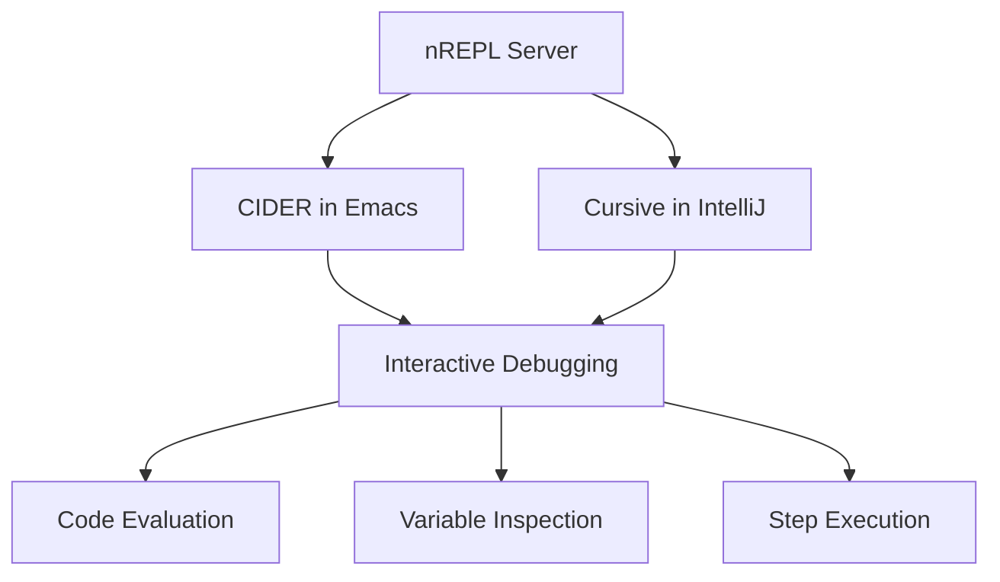

## 15.6.3 Debugging Tools

Debugging is an essential part of software development, and as experienced Java developers transitioning to Clojure, understanding the debugging tools available in the Clojure ecosystem will significantly enhance your productivity. In this section, we will explore various debugging tools such as `nREPL`, CIDER in Emacs, and Cursive in IntelliJ IDEA, which are pivotal for effective Clojure development.

### Introduction to Clojure Debugging

Clojure, being a dynamic language, offers unique challenges and opportunities in debugging compared to Java. While Java developers often rely on integrated debuggers within IDEs, Clojure developers can leverage the power of the REPL (Read-Eval-Print Loop) for interactive debugging. This approach allows for a more exploratory and iterative debugging process, which can be both powerful and efficient.

### nREPL: The Backbone of Clojure Debugging

**nREPL** (Networked REPL) is a Clojure library that provides a networked REPL server, enabling interactive development and debugging. It acts as the backbone for many Clojure development tools, facilitating communication between your code and the development environment.

#### Key Features of nREPL

- **Interactive Development**: nREPL allows you to evaluate code in real-time, making it easier to test and debug.
- **Tool Integration**: It integrates seamlessly with various editors and IDEs, providing a consistent debugging experience.
- **Remote Debugging**: nREPL can be used to connect to remote Clojure processes, enabling debugging of applications running on different machines.

#### Setting Up nREPL

To set up nREPL, you need to include it as a dependency in your `project.clj` or `deps.edn` file. Here's an example for Leiningen:

```clojure
:dependencies [[org.clojure/clojure "1.10.3"]
               [nrepl "0.8.3"]]
```

For tools.deps, add it to your `deps.edn`:

```clojure
{:deps {org.clojure/clojure {:mvn/version "1.10.3"}
        nrepl {:mvn/version "0.8.3"}}}
```

Once set up, you can start an nREPL server using the following command:

```bash
lein repl
```

Or for tools.deps:

```bash
clj -M:nrepl
```

### CIDER: Emacs Integration for Clojure

**CIDER** (Clojure Interactive Development Environment that Rocks) is an Emacs package that provides a powerful interactive development environment for Clojure. It builds on top of nREPL, offering a rich set of features for debugging and development.

#### Key Features of CIDER

- **Interactive Evaluation**: Evaluate code directly within Emacs, seeing results instantly.
- **Debugging Support**: Set breakpoints, inspect variables, and step through code.
- **Code Navigation**: Jump to definitions, find references, and navigate code efficiently.
- **REPL Integration**: Seamlessly integrates with the REPL for interactive development.

#### Setting Up CIDER

To use CIDER, you need to have Emacs installed along with the CIDER package. Add the following to your Emacs configuration:

```elisp
(require 'package)
(add-to-list 'package-archives '("melpa" . "https://melpa.org/packages/"))
(package-initialize)

(unless (package-installed-p 'cider)
  (package-refresh-contents)
  (package-install 'cider))
```

Once installed, you can start a CIDER session by opening a Clojure file and running `M-x cider-jack-in`.

#### Debugging with CIDER

CIDER provides a powerful debugging interface within Emacs. Here's how you can use it:

1. **Set Breakpoints**: Place the cursor on a line and use `C-u C-M-x` to set a breakpoint.
2. **Step Through Code**: Use `n` to step over, `i` to step into, and `o` to step out of functions.
3. **Inspect Variables**: Use `e` to evaluate expressions and inspect variable values.

### Cursive: IntelliJ IDEA Integration for Clojure

**Cursive** is a Clojure plugin for IntelliJ IDEA, providing a comprehensive development environment for Clojure. It offers robust debugging capabilities, making it a popular choice among developers who prefer IntelliJ IDEA.

#### Key Features of Cursive

- **Rich Editor Support**: Syntax highlighting, code completion, and refactoring tools.
- **Integrated Debugger**: Set breakpoints, inspect variables, and control execution flow.
- **REPL Integration**: Connect to local and remote REPLs for interactive development.
- **Java Interop**: Seamlessly work with Java code and libraries.

#### Setting Up Cursive

To use Cursive, you need to install the plugin in IntelliJ IDEA. Follow these steps:

1. Open IntelliJ IDEA and navigate to `File > Settings > Plugins`.
2. Search for "Cursive" and install the plugin.
3. Restart IntelliJ IDEA to activate the plugin.

#### Debugging with Cursive

Cursive provides a familiar debugging experience for Java developers. Here's how you can use it:

1. **Set Breakpoints**: Click in the gutter next to the line numbers to set breakpoints.
2. **Start Debugging**: Use the debug configuration to start a debugging session.
3. **Inspect Variables**: Hover over variables to see their values or use the Variables pane.
4. **Step Through Code**: Use the toolbar to step over, into, or out of functions.

### Comparing Clojure Debugging Tools with Java

Java developers are accustomed to using integrated debuggers within IDEs like IntelliJ IDEA or Eclipse. Clojure's debugging tools, while different, offer similar capabilities with added flexibility through the REPL.

#### Similarities

- **Breakpoints**: Both Clojure and Java debuggers allow setting breakpoints to pause execution.
- **Variable Inspection**: Inspecting variable values is possible in both environments.
- **Step Execution**: Step through code to understand execution flow.

#### Differences

- **REPL Integration**: Clojure's REPL allows for interactive debugging, which is less common in Java.
- **Dynamic Typing**: Clojure's dynamic nature can make debugging more exploratory compared to Java's static typing.
- **Tool Diversity**: Clojure offers a variety of tools (nREPL, CIDER, Cursive) that integrate with different editors and IDEs.

### Try It Yourself

To get hands-on experience with Clojure debugging tools, try the following exercises:

1. **Set Up nREPL**: Configure nREPL in your project and start a REPL session. Experiment with evaluating expressions and inspecting results.
2. **Use CIDER**: Install CIDER in Emacs and debug a simple Clojure program. Set breakpoints and step through the code.
3. **Explore Cursive**: Use Cursive in IntelliJ IDEA to debug a Clojure application. Compare the experience with Java debugging.

### Diagrams and Visual Aids

To better understand the flow of debugging in Clojure, consider the following diagram illustrating the interaction between nREPL, CIDER, and Cursive:



*Diagram: Interaction between nREPL, CIDER, and Cursive for debugging in Clojure.*

### Further Reading

For more information on Clojure debugging tools, consider the following resources:

- [Official Clojure Documentation](https://clojure.org/)
- [CIDER GitHub Repository](https://github.com/clojure-emacs/cider)
- [Cursive Official Website](https://cursive-ide.com/)

### Exercises and Practice Problems

1. **Exercise 1**: Set up a Clojure project with nREPL and write a simple function. Use the REPL to evaluate and debug the function.
2. **Exercise 2**: Install CIDER in Emacs and debug a recursive function. Set breakpoints and inspect variable values.
3. **Exercise 3**: Use Cursive in IntelliJ IDEA to debug a Clojure application that interacts with Java code. Compare the debugging experience with a similar Java application.

### Summary and Key Takeaways

- **nREPL** is the backbone of Clojure debugging, enabling interactive development and integration with various tools.
- **CIDER** provides a powerful debugging environment within Emacs, leveraging nREPL for interactive development.
- **Cursive** offers a comprehensive Clojure development experience in IntelliJ IDEA, with robust debugging capabilities.
- Clojure's debugging tools, while different from Java's, offer similar capabilities with added flexibility through the REPL.
- Experimenting with these tools will enhance your understanding and proficiency in Clojure development.

By mastering these debugging tools, you'll be well-equipped to tackle any challenges you encounter in your Clojure development journey. Now, let's apply these concepts to improve your debugging workflow and enhance your productivity.

---

## Clojure Debugging Tools Quiz: Test Your Knowledge



### What is nREPL in the context of Clojure?

- [x] A networked REPL server for interactive development
- [ ] A Java library for concurrency
- [ ] A Clojure testing framework
- [ ] An IDE for Clojure development

> **Explanation:** nREPL is a networked REPL server that facilitates interactive development and debugging in Clojure.

### Which editor is CIDER primarily associated with?

- [x] Emacs
- [ ] IntelliJ IDEA
- [ ] Visual Studio Code
- [ ] Eclipse

> **Explanation:** CIDER is an Emacs package that provides a powerful interactive development environment for Clojure.

### What is a key feature of Cursive in IntelliJ IDEA?

- [x] Integrated debugger for Clojure
- [ ] Built-in Java compiler
- [ ] Support for Python development
- [ ] Cloud-based IDE features

> **Explanation:** Cursive provides a comprehensive development environment for Clojure in IntelliJ IDEA, including an integrated debugger.

### How can you start a CIDER session in Emacs?

- [x] M-x cider-jack-in
- [ ] M-x start-cider
- [ ] M-x run-cider
- [ ] M-x open-cider

> **Explanation:** To start a CIDER session, you use the command `M-x cider-jack-in` in Emacs.

### What is a common use of breakpoints in debugging?

- [x] To pause execution at a specific line of code
- [ ] To compile code faster
- [ ] To automatically fix errors
- [ ] To run tests

> **Explanation:** Breakpoints are used to pause execution at specific lines of code, allowing developers to inspect the program state.

### Which tool allows remote debugging of Clojure applications?

- [x] nREPL
- [ ] JUnit
- [ ] Maven
- [ ] Gradle

> **Explanation:** nREPL can be used to connect to remote Clojure processes, enabling debugging of applications running on different machines.

### What is a benefit of using the REPL for debugging in Clojure?

- [x] Interactive code evaluation
- [ ] Faster compilation times
- [ ] Automatic code formatting
- [ ] Built-in testing framework

> **Explanation:** The REPL allows for interactive code evaluation, making it easier to test and debug Clojure code.

### What is the primary advantage of Clojure's dynamic typing in debugging?

- [x] More exploratory debugging
- [ ] Faster execution speed
- [ ] Easier static analysis
- [ ] Better memory management

> **Explanation:** Clojure's dynamic typing allows for more exploratory debugging, as developers can evaluate and modify code on the fly.

### Which command is used to set a breakpoint in CIDER?

- [x] C-u C-M-x
- [ ] C-x C-b
- [ ] C-c C-d
- [ ] C-x C-x

> **Explanation:** In CIDER, the command `C-u C-M-x` is used to set a breakpoint.

### True or False: Cursive can only be used for Clojure development in IntelliJ IDEA.

- [ ] True
- [x] False

> **Explanation:** While Cursive is primarily used for Clojure development, IntelliJ IDEA supports multiple languages and can be used for various types of development.


