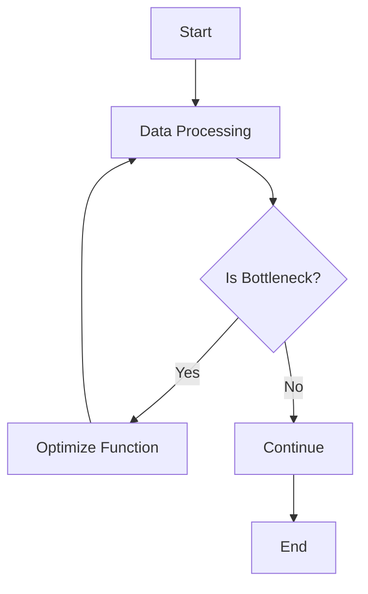

## 15.7.1 Profiling Clojure Applications

As experienced Java developers transitioning to Clojure, understanding how to profile applications is crucial for optimizing performance and ensuring efficient resource utilization. Profiling helps identify bottlenecks, memory leaks, and other performance issues that can affect the responsiveness and scalability of your applications. In this section, we'll explore how to profile Clojure applications using various tools and techniques, leveraging your existing knowledge of Java and the JVM.

### Understanding Profiling

Profiling is the process of analyzing a program to determine where it spends its time and how it uses resources. This analysis helps identify performance bottlenecks, such as slow functions or excessive memory usage, allowing developers to optimize their code. Profiling is especially important in Clojure due to its functional nature and reliance on the JVM.

#### Key Concepts in Profiling

- **CPU Profiling**: Measures the time spent executing code, helping identify slow functions or methods.
- **Memory Profiling**: Analyzes memory usage to detect leaks or excessive allocation.
- **Thread Profiling**: Examines thread activity to identify concurrency issues.
- **Garbage Collection (GC) Profiling**: Monitors GC activity to optimize memory management.

### Profiling Tools for Clojure

Clojure runs on the JVM, so we can use many of the same profiling tools available for Java applications. Here are some popular tools:

- **VisualVM**: A powerful tool for monitoring and profiling Java applications, including Clojure.
- **YourKit**: A commercial profiler with advanced features for CPU and memory analysis.
- **JProfiler**: Another commercial option with comprehensive profiling capabilities.
- **Java Flight Recorder (JFR)**: A low-overhead profiling tool built into the JVM.

#### VisualVM

VisualVM is a free, open-source tool that provides a visual interface for monitoring and profiling Java applications. It offers features such as CPU and memory profiling, thread analysis, and garbage collection monitoring.

**Setting Up VisualVM**

1. **Download and Install**: Download VisualVM from the [official website](https://visualvm.github.io/).
2. **Configure Clojure Application**: Ensure your Clojure application is running on the JVM with the necessary JMX (Java Management Extensions) options enabled.
3. **Connect to Application**: Launch VisualVM and connect to your running Clojure application.

**Using VisualVM**

- **CPU Profiling**: Identify methods consuming the most CPU time.
- **Memory Profiling**: Analyze heap dumps to find memory leaks.
- **Thread Analysis**: Monitor thread activity and detect deadlocks.

```clojure
;; Sample Clojure code to demonstrate profiling
(defn slow-function [n]
  (Thread/sleep 1000) ; Simulate a slow operation
  (* n n))

(defn calculate [numbers]
  (map slow-function numbers))

;; Usage
(calculate (range 1 10))
```

*Comment:* This code snippet simulates a slow function to illustrate CPU profiling.

### Profiling Clojure Code

When profiling Clojure applications, it's important to understand how Clojure's functional nature and immutable data structures impact performance. Let's explore some key considerations:

#### Immutable Data Structures

Clojure's persistent data structures are designed for efficiency, but they can still impact performance if not used correctly. Profiling can help identify inefficient data manipulations.

**Example:**

```clojure
(defn inefficient-sum [coll]
  (reduce + (map inc coll)))

;; Profiling can reveal that `map inc` creates an intermediate collection.
```

*Comment:* This example demonstrates how intermediate collections can affect performance.

#### Higher-Order Functions

Clojure's use of higher-order functions can lead to performance overhead if not optimized. Profiling helps identify functions that are called frequently or take too long to execute.

**Example:**

```clojure
(defn process-data [data]
  (->> data
       (filter even?)
       (map #(* % 2))
       (reduce +)))

;; Profiling can show which function in the pipeline is the bottleneck.
```

*Comment:* This pipeline processes data, and profiling can help optimize each step.

### Comparing with Java Profiling

Java developers are familiar with profiling tools and techniques, and many of these apply to Clojure as well. However, there are some differences to consider:

- **Function Calls**: Clojure's functional style often results in more function calls than Java, which can impact performance.
- **Data Structures**: Clojure's persistent data structures differ from Java's mutable collections, affecting memory usage and performance.
- **Concurrency**: Clojure's concurrency primitives (atoms, refs, agents) offer different profiling challenges compared to Java's threads and locks.

### Practical Profiling Techniques

Let's explore some practical techniques for profiling Clojure applications:

#### Identifying Hotspots

Hotspots are sections of code that consume a significant portion of CPU time. Use CPU profiling to identify these areas and optimize them.

**Example:**

```clojure
(defn hotspot-example [n]
  (reduce + (map #(* % %) (range n))))

;; Profiling can reveal that the `map` operation is a hotspot.
```

*Comment:* This example demonstrates a potential hotspot in a computation-heavy function.

#### Memory Leak Detection

Memory leaks occur when objects are not properly garbage collected. Use memory profiling to identify leaks and optimize memory usage.

**Example:**

```clojure
(defn memory-leak-example []
  (let [data (atom [])]
    (dotimes [i 1000]
      (swap! data conj (range 1000)))))

;; Profiling can show excessive memory usage due to the growing atom.
```

*Comment:* This example illustrates a memory leak caused by an ever-growing atom.

#### Thread Analysis

Thread profiling helps identify concurrency issues, such as deadlocks or excessive context switching.

**Example:**

```clojure
(defn thread-example []
  (future (Thread/sleep 1000))
  (future (Thread/sleep 2000)))

;; Profiling can reveal thread contention or deadlocks.
```

*Comment:* This example demonstrates basic thread usage for profiling.

### Try It Yourself

To deepen your understanding, try modifying the code examples above:

- **Experiment with Different Data Structures**: Replace vectors with maps or sets and observe the impact on performance.
- **Optimize Higher-Order Functions**: Refactor the `process-data` function to use transducers and compare performance.
- **Introduce Concurrency**: Use Clojure's concurrency primitives to parallelize computations and profile the results.

### Diagrams and Visualizations

To better understand the flow of data and performance bottlenecks, let's use diagrams:



*Caption:* This flowchart illustrates the process of identifying and optimizing performance bottlenecks in Clojure applications.

### Further Reading

For more information on profiling and performance optimization, consider the following resources:

- [Official Clojure Documentation](https://clojure.org/reference/documentation)
- [ClojureDocs](https://clojuredocs.org/)
- [VisualVM Documentation](https://visualvm.github.io/documentation.html)

### Exercises

1. **Profile a Clojure Application**: Use VisualVM to profile a simple Clojure application and identify CPU and memory hotspots.
2. **Optimize a Function**: Refactor a function with identified bottlenecks and measure the performance improvement.
3. **Analyze Concurrency**: Create a multithreaded Clojure application and use thread profiling to optimize thread usage.

### Key Takeaways

- Profiling is essential for identifying performance bottlenecks in Clojure applications.
- Use JVM profiling tools like VisualVM to analyze CPU, memory, and thread usage.
- Clojure's functional nature and immutable data structures require specific profiling considerations.
- Comparing Clojure and Java profiling helps leverage existing Java knowledge for effective optimization.

By mastering profiling techniques, you'll be well-equipped to optimize your Clojure applications, ensuring they run efficiently and effectively. Now that we've explored profiling, let's apply these concepts to enhance the performance of your Clojure projects.

## Quiz: Mastering Clojure Profiling Techniques



### What is the primary purpose of profiling a Clojure application?

- [x] To identify performance bottlenecks
- [ ] To write more concise code
- [ ] To improve code readability
- [ ] To ensure code correctness

> **Explanation:** Profiling is used to identify performance bottlenecks, such as slow functions or excessive memory usage, allowing developers to optimize their code.

### Which tool is commonly used for profiling Clojure applications on the JVM?

- [x] VisualVM
- [ ] Eclipse
- [ ] IntelliJ IDEA
- [ ] NetBeans

> **Explanation:** VisualVM is a popular tool for profiling Java applications, including Clojure, as it provides CPU and memory analysis features.

### What is a hotspot in the context of profiling?

- [x] A section of code that consumes significant CPU time
- [ ] A memory leak
- [ ] A concurrency issue
- [ ] A syntax error

> **Explanation:** A hotspot is a section of code that consumes a significant portion of CPU time, indicating a potential area for optimization.

### How can memory leaks be detected in Clojure applications?

- [x] By using memory profiling tools
- [ ] By writing more tests
- [ ] By refactoring code
- [ ] By using more threads

> **Explanation:** Memory profiling tools help detect memory leaks by analyzing heap dumps and identifying objects that are not properly garbage collected.

### What is the impact of Clojure's immutable data structures on performance?

- [x] They can affect performance if not used correctly
- [ ] They always improve performance
- [ ] They have no impact on performance
- [ ] They make code harder to read

> **Explanation:** While Clojure's immutable data structures are designed for efficiency, they can impact performance if not used correctly, such as creating unnecessary intermediate collections.

### Which of the following is a concurrency primitive in Clojure?

- [x] Atoms
- [ ] Threads
- [ ] Locks
- [ ] Semaphores

> **Explanation:** Atoms are a concurrency primitive in Clojure, providing a way to manage shared state in a thread-safe manner.

### What is the benefit of using higher-order functions in Clojure?

- [x] They allow for more abstract and reusable code
- [ ] They always improve performance
- [ ] They make code harder to understand
- [ ] They are only useful for small projects

> **Explanation:** Higher-order functions allow for more abstract and reusable code by enabling functions to be passed as arguments and returned as values.

### How can thread profiling help in optimizing Clojure applications?

- [x] By identifying concurrency issues
- [ ] By improving code readability
- [ ] By reducing memory usage
- [ ] By increasing code complexity

> **Explanation:** Thread profiling helps identify concurrency issues, such as deadlocks or excessive context switching, allowing developers to optimize thread usage.

### What is the role of garbage collection profiling in Clojure applications?

- [x] To monitor and optimize memory management
- [ ] To improve code readability
- [ ] To ensure code correctness
- [ ] To write more concise code

> **Explanation:** Garbage collection profiling monitors GC activity to optimize memory management, reducing pauses and improving application performance.

### Profiling is only necessary for large-scale Clojure applications.

- [ ] True
- [x] False

> **Explanation:** Profiling is important for applications of all sizes to ensure efficient resource utilization and identify potential performance bottlenecks.


