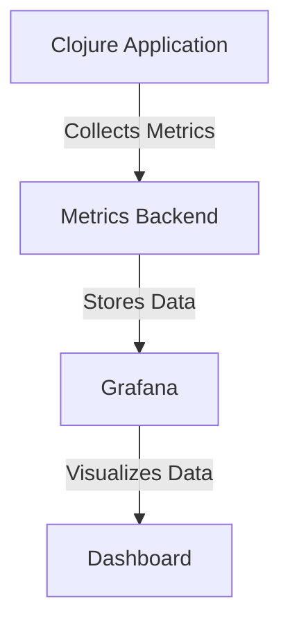

## 15.7.2 Instrumentation for Performance Monitoring

As experienced Java developers transitioning to Clojure, understanding how to effectively monitor and optimize the performance of your applications is crucial. Instrumentation allows us to collect metrics such as execution time, memory usage, and other performance-related data, enabling us to identify bottlenecks and optimize our code. In this section, we will explore how to add instrumentation to Clojure code, compare it with Java techniques, and provide practical examples to illustrate these concepts.

### Understanding Instrumentation

Instrumentation involves adding code to your application to collect data about its performance. This data can include metrics like execution time, memory usage, and resource utilization. By analyzing these metrics, you can gain insights into how your application behaves under different conditions and identify areas for improvement.

#### Why Instrumentation Matters

- **Performance Optimization**: Identify slow parts of your code and optimize them for better performance.
- **Resource Management**: Monitor memory usage and prevent leaks or excessive consumption.
- **Scalability**: Ensure your application can handle increased load by understanding its performance characteristics.
- **Debugging**: Gain insights into unexpected behavior or bottlenecks in your application.

### Instrumentation in Clojure vs. Java

In Java, instrumentation often involves using tools like Java Management Extensions (JMX), profilers, or logging frameworks. Clojure, being a functional language, offers unique approaches to instrumentation that leverage its immutable data structures and functional paradigms.

#### Java Instrumentation Techniques

- **JMX**: Provides a standard way to manage and monitor Java applications.
- **Profilers**: Tools like VisualVM or YourKit can profile Java applications to collect performance data.
- **Logging Frameworks**: Libraries like Log4j or SLF4J can be used to log performance metrics.

#### Clojure Instrumentation Techniques

- **Time Measurement**: Use functions like `time` to measure execution time.
- **Memory Monitoring**: Utilize Java interop to access memory metrics.
- **Custom Instrumentation**: Create custom functions to collect specific metrics.
- **Libraries**: Use libraries like `metrics-clojure` for comprehensive instrumentation.

### Measuring Execution Time in Clojure

One of the simplest forms of instrumentation is measuring the execution time of a function. Clojure provides built-in support for this through the `time` macro.

```clojure
(defn example-function []
  (Thread/sleep 1000) ; Simulate a time-consuming operation
  "Done")

(time (example-function))
```

**Explanation**: The `time` macro prints the execution time of the expression it wraps. In this example, it measures how long `example-function` takes to execute.

#### Comparing with Java

In Java, you might use `System.nanoTime()` or a similar method to measure execution time:

```java
long startTime = System.nanoTime();
exampleFunction();
long endTime = System.nanoTime();
System.out.println("Execution time: " + (endTime - startTime) + " nanoseconds");
```

**Key Differences**: Clojure's `time` macro simplifies the process by automatically printing the result, whereas Java requires manual calculation and logging.

### Monitoring Memory Usage

Memory usage is another critical aspect of performance monitoring. In Clojure, you can leverage Java's `Runtime` class to access memory metrics.

```clojure
(defn memory-usage []
  (let [runtime (Runtime/getRuntime)
        total-memory (.totalMemory runtime)
        free-memory (.freeMemory runtime)
        used-memory (- total-memory free-memory)]
    {:total-memory total-memory
     :free-memory free-memory
     :used-memory used-memory}))

(memory-usage)
```

**Explanation**: This function retrieves the total, free, and used memory of the JVM, providing insights into memory consumption.

#### Java Equivalent

In Java, you would use similar methods from the `Runtime` class:

```java
Runtime runtime = Runtime.getRuntime();
long totalMemory = runtime.totalMemory();
long freeMemory = runtime.freeMemory();
long usedMemory = totalMemory - freeMemory;
System.out.println("Used memory: " + usedMemory);
```

**Key Differences**: Both languages use the same underlying Java API, but Clojure's functional style allows for more concise and expressive code.

### Custom Instrumentation

For more advanced instrumentation, you can create custom functions to collect specific metrics. This approach allows you to tailor instrumentation to your application's unique needs.

#### Example: Custom Execution Time Logger

```clojure
(defn log-execution-time [f & args]
  (let [start-time (System/nanoTime)
        result (apply f args)
        end-time (System/nanoTime)]
    (println "Execution time:" (- end-time start-time) "nanoseconds")
    result))

(log-execution-time example-function)
```

**Explanation**: This function logs the execution time of any function `f` passed to it, along with its arguments. It uses `apply` to call the function with the provided arguments.

#### Java Equivalent

In Java, you might create a utility method to achieve similar functionality:

```java
public static <T> T logExecutionTime(Supplier<T> supplier) {
    long startTime = System.nanoTime();
    T result = supplier.get();
    long endTime = System.nanoTime();
    System.out.println("Execution time: " + (endTime - startTime) + " nanoseconds");
    return result;
}

logExecutionTime(() -> exampleFunction());
```

**Key Differences**: Clojure's use of higher-order functions and `apply` makes it easy to create reusable instrumentation utilities.

### Using Libraries for Instrumentation

Clojure has several libraries that simplify instrumentation and provide additional features. One popular library is `metrics-clojure`, which integrates with the Coda Hale Metrics library.

#### Setting Up `metrics-clojure`

To use `metrics-clojure`, add it to your `project.clj` dependencies:

```clojure
:dependencies [[metrics-clojure "2.10.0"]]
```

#### Example: Using `metrics-clojure`

```clojure
(require '[metrics.timers :as timers])

(def timer (timers/timer ["example" "function"]))

(timers/time! timer
  (example-function))
```

**Explanation**: This code creates a timer for `example-function` and measures its execution time. The `metrics-clojure` library provides a comprehensive API for collecting various metrics.

### Visualizing Performance Data

Once you've collected performance data, visualizing it can help you identify patterns and trends. Tools like Grafana or Kibana can be used to create dashboards for monitoring your application's performance.

#### Example: Visualizing Metrics with Grafana

1. **Set Up a Metrics Backend**: Use a backend like Prometheus to collect and store metrics.
2. **Configure Grafana**: Connect Grafana to your metrics backend.
3. **Create Dashboards**: Use Grafana's dashboard editor to create visualizations of your performance data.

**Diagram**: The following diagram illustrates the flow of data from your Clojure application to Grafana for visualization.



**Caption**: This diagram shows how performance metrics flow from a Clojure application to a metrics backend and are visualized in Grafana.

### Try It Yourself

To deepen your understanding, try modifying the code examples to measure different functions or collect additional metrics. Experiment with different libraries and tools to find the best fit for your application.

### Exercises

1. **Measure Execution Time**: Modify the `log-execution-time` function to log execution time in milliseconds instead of nanoseconds.
2. **Monitor Memory Usage**: Create a function that logs memory usage at regular intervals.
3. **Visualize Metrics**: Set up a simple Grafana dashboard to visualize execution time and memory usage metrics.

### Key Takeaways

- **Instrumentation** is essential for understanding and optimizing application performance.
- **Clojure** offers unique approaches to instrumentation, leveraging its functional paradigms.
- **Libraries** like `metrics-clojure` provide comprehensive tools for collecting and visualizing metrics.
- **Visualization** tools like Grafana can help you gain insights into your application's performance.

By incorporating instrumentation into your Clojure applications, you can ensure they perform optimally and scale effectively. Now that we've explored how to add instrumentation to your code, let's apply these concepts to monitor and optimize your applications.

## Quiz: Mastering Instrumentation for Performance Monitoring in Clojure



### What is the primary purpose of instrumentation in software development?

- [x] To collect performance metrics such as execution time and memory usage
- [ ] To compile code faster
- [ ] To enhance code readability
- [ ] To automate testing

> **Explanation:** Instrumentation is used to collect performance metrics, enabling developers to monitor and optimize their applications.

### Which Clojure macro is used to measure the execution time of a function?

- [x] `time`
- [ ] `measure`
- [ ] `duration`
- [ ] `timer`

> **Explanation:** The `time` macro in Clojure is used to measure and print the execution time of an expression.

### How does Clojure's `time` macro differ from Java's `System.nanoTime()`?

- [x] `time` automatically prints the execution time, while `System.nanoTime()` requires manual calculation
- [ ] `time` is more accurate than `System.nanoTime()`
- [ ] `time` measures memory usage, while `System.nanoTime()` measures execution time
- [ ] `time` is only available in Java

> **Explanation:** The `time` macro simplifies the process by automatically printing the result, whereas Java's `System.nanoTime()` requires manual calculation and logging.

### What Java class is used in Clojure to monitor memory usage?

- [x] `Runtime`
- [ ] `MemoryManager`
- [ ] `System`
- [ ] `MemoryMonitor`

> **Explanation:** The `Runtime` class in Java provides methods to monitor memory usage, which can be accessed in Clojure through Java interop.

### Which library is commonly used in Clojure for comprehensive instrumentation?

- [x] `metrics-clojure`
- [ ] `clojure-instrument`
- [ ] `performance-clojure`
- [ ] `clojure-metrics`

> **Explanation:** `metrics-clojure` is a popular library that integrates with the Coda Hale Metrics library for comprehensive instrumentation in Clojure.

### What is the benefit of using visualization tools like Grafana?

- [x] They help identify patterns and trends in performance data
- [ ] They automatically optimize code
- [ ] They compile Clojure code faster
- [ ] They replace the need for instrumentation

> **Explanation:** Visualization tools like Grafana help identify patterns and trends in performance data, providing insights into application behavior.

### How can you create a custom execution time logger in Clojure?

- [x] By using higher-order functions and the `apply` function
- [ ] By using the `measure` macro
- [ ] By writing a Java class
- [ ] By using the `duration` function

> **Explanation:** Clojure's higher-order functions and `apply` function allow you to create reusable instrumentation utilities like a custom execution time logger.

### What is a key advantage of Clojure's functional style for instrumentation?

- [x] It allows for more concise and expressive code
- [ ] It requires less memory
- [ ] It is faster than Java
- [ ] It eliminates the need for libraries

> **Explanation:** Clojure's functional style allows for more concise and expressive code, making it easier to implement instrumentation.

### Which of the following is NOT a benefit of instrumentation?

- [ ] Performance Optimization
- [ ] Resource Management
- [ ] Scalability
- [x] Code Compilation

> **Explanation:** Instrumentation is not related to code compilation; it focuses on monitoring and optimizing application performance.

### True or False: Clojure's `metrics-clojure` library can be used to collect various performance metrics.

- [x] True
- [ ] False

> **Explanation:** `metrics-clojure` provides a comprehensive API for collecting various performance metrics in Clojure applications.


