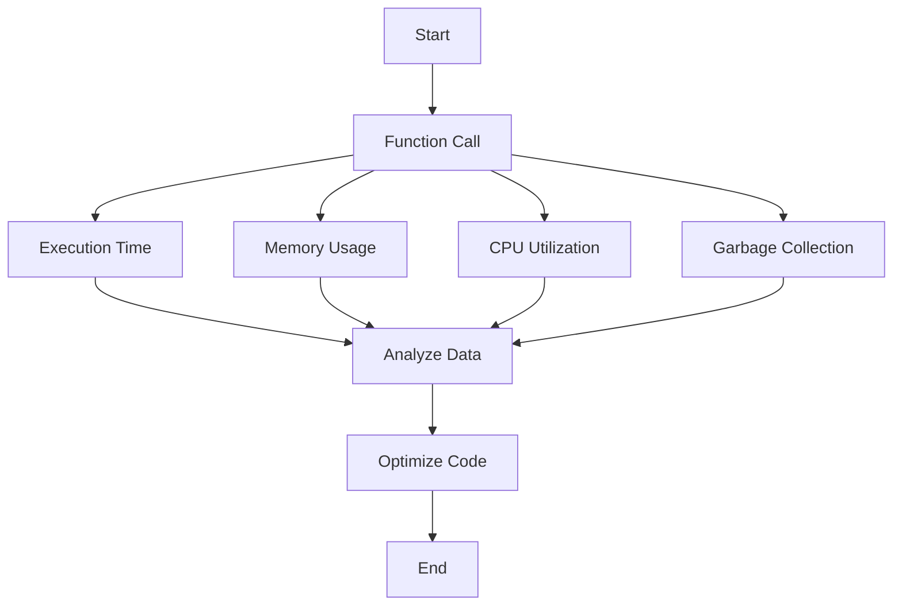

## 15.7.3 Analyzing Performance Data

Performance analysis is a crucial aspect of software development, especially when transitioning from Java to Clojure. As experienced Java developers, you are likely familiar with tools like JProfiler or VisualVM for profiling Java applications. In this section, we will explore how to analyze performance data in Clojure, leveraging your existing knowledge to optimize and enhance your Clojure applications.

### Understanding Performance Data

Performance data provides insights into how your application behaves under various conditions. It includes metrics such as execution time, memory usage, and CPU load. Analyzing this data helps identify bottlenecks and areas for improvement.

#### Key Metrics to Consider

- **Execution Time**: How long does a function or process take to complete?
- **Memory Usage**: How much memory is consumed during execution?
- **CPU Utilization**: How much CPU time is used by your application?
- **Garbage Collection**: How often and how long does garbage collection occur?

### Profiling Tools for Clojure

Clojure runs on the Java Virtual Machine (JVM), allowing you to use Java profiling tools to analyze Clojure applications. Here are some popular tools:

- **VisualVM**: A free, open-source tool that provides detailed information about Java applications.
- **JProfiler**: A commercial tool offering advanced profiling capabilities.
- **YourKit**: Another commercial profiler known for its ease of use and powerful features.

#### Using VisualVM with Clojure

VisualVM is a versatile tool that can be used to profile Clojure applications. Here's how you can set it up:

1. **Install VisualVM**: Download and install VisualVM from the [official website](https://visualvm.github.io/).
2. **Start Your Clojure Application**: Run your Clojure application with the JVM options required for profiling.
3. **Attach VisualVM**: Open VisualVM and attach it to your running Clojure process.
4. **Collect Data**: Use VisualVM to collect performance data, including CPU and memory usage.

### Analyzing Execution Time

Execution time is a critical metric for understanding the performance of your application. In Clojure, you can use the `time` macro to measure how long a function takes to execute.

```clojure
(defn example-function []
  (Thread/sleep 1000) ; Simulate a delay
  (println "Function executed"))

(time (example-function))
```

**Output:**

```
Function executed
"Elapsed time: 1001.234 msecs"
```

#### Comparing with Java

In Java, you might use `System.nanoTime()` to measure execution time:

```java
public class Example {
    public static void main(String[] args) {
        long startTime = System.nanoTime();
        try {
            Thread.sleep(1000); // Simulate a delay
        } catch (InterruptedException e) {
            e.printStackTrace();
        }
        long endTime = System.nanoTime();
        System.out.println("Elapsed time: " + (endTime - startTime) / 1_000_000 + " ms");
    }
}
```

### Memory Usage Analysis

Memory usage is another important aspect of performance analysis. In Clojure, you can use the `clojure.core` library to analyze memory usage.

#### Example: Analyzing Memory Usage

```clojure
(defn memory-intensive-function []
  (let [large-list (range 1e6)]
    (reduce + large-list)))

(time (memory-intensive-function))
```

To analyze memory usage, you can use VisualVM to monitor heap size and garbage collection activity.

#### Java Comparison

In Java, you might use a similar approach with arrays or collections:

```java
import java.util.stream.IntStream;

public class MemoryExample {
    public static void main(String[] args) {
        long[] largeArray = IntStream.range(0, 1_000_000).asLongStream().toArray();
        long sum = 0;
        for (long num : largeArray) {
            sum += num;
        }
        System.out.println("Sum: " + sum);
    }
}
```

### CPU Utilization

CPU utilization indicates how much processing power your application consumes. High CPU usage can indicate inefficient code or algorithms.

#### Measuring CPU Utilization in Clojure

Use VisualVM to monitor CPU usage and identify functions that consume excessive CPU time.

#### Java Comparison

In Java, you might use profilers like JProfiler to measure CPU utilization and optimize code accordingly.

### Garbage Collection Analysis

Garbage collection (GC) is a critical aspect of JVM performance. Frequent or long GC pauses can degrade application performance.

#### Analyzing GC in Clojure

Use VisualVM to monitor GC activity and identify potential issues. Consider tuning JVM options to optimize GC performance.

#### Java Comparison

In Java, you might use similar tools and techniques to analyze and optimize garbage collection.

### Try It Yourself: Experiment with Profiling

To deepen your understanding, try profiling a Clojure application using VisualVM. Experiment with different JVM options and observe how they affect performance.

### Diagrams and Visualizations

Let's visualize the flow of data through a Clojure application using a Mermaid.js diagram:



**Diagram Caption**: This flowchart illustrates the process of analyzing performance data in a Clojure application, from function call to optimization.

### Key Takeaways

- **Profiling Tools**: Use tools like VisualVM to profile Clojure applications.
- **Execution Time**: Measure execution time using the `time` macro.
- **Memory Usage**: Monitor memory usage and optimize data structures.
- **CPU Utilization**: Identify CPU-intensive functions and optimize algorithms.
- **Garbage Collection**: Analyze GC activity and tune JVM options for optimal performance.

### Further Reading

For more information on profiling and performance analysis, consider the following resources:

- [Official Clojure Documentation](https://clojure.org/reference/documentation)
- [VisualVM Documentation](https://visualvm.github.io/documentation.html)
- [YourKit Java Profiler](https://www.yourkit.com/java/profiler/)

### Exercises

1. **Profile a Clojure Application**: Use VisualVM to profile a Clojure application and identify performance bottlenecks.
2. **Optimize a Function**: Choose a function in your application and optimize it for execution time and memory usage.
3. **Analyze GC Activity**: Monitor garbage collection activity and experiment with JVM options to improve performance.

Now that we've explored how to analyze performance data in Clojure, let's apply these concepts to optimize your applications and enhance their efficiency.

## Clojure Performance Analysis Quiz



### Which tool can be used to profile Clojure applications?

- [x] VisualVM
- [ ] Eclipse
- [ ] NetBeans
- [ ] IntelliJ IDEA

> **Explanation:** VisualVM is a versatile tool that can be used to profile Clojure applications running on the JVM.

### What does the `time` macro in Clojure measure?

- [x] Execution time of a function
- [ ] Memory usage of a function
- [ ] CPU utilization of a function
- [ ] Garbage collection activity

> **Explanation:** The `time` macro in Clojure measures the execution time of a function.

### Which metric indicates how much memory is consumed during execution?

- [x] Memory Usage
- [ ] Execution Time
- [ ] CPU Utilization
- [ ] Garbage Collection

> **Explanation:** Memory Usage indicates how much memory is consumed during execution.

### What is a common tool for analyzing garbage collection activity?

- [x] VisualVM
- [ ] JUnit
- [ ] Maven
- [ ] Gradle

> **Explanation:** VisualVM can be used to analyze garbage collection activity in JVM applications.

### Which of the following is a key metric for performance analysis?

- [x] Execution Time
- [x] Memory Usage
- [ ] Code Complexity
- [ ] Code Readability

> **Explanation:** Execution Time and Memory Usage are key metrics for performance analysis.

### How can CPU utilization be monitored in Clojure applications?

- [x] Using VisualVM
- [ ] Using JUnit
- [ ] Using Maven
- [ ] Using Gradle

> **Explanation:** VisualVM can be used to monitor CPU utilization in Clojure applications.

### What is the purpose of analyzing garbage collection activity?

- [x] To identify potential performance issues
- [ ] To measure execution time
- [ ] To monitor CPU utilization
- [ ] To analyze code complexity

> **Explanation:** Analyzing garbage collection activity helps identify potential performance issues related to memory management.

### Which tool is known for its ease of use and powerful features for profiling?

- [x] YourKit
- [ ] Eclipse
- [ ] NetBeans
- [ ] IntelliJ IDEA

> **Explanation:** YourKit is known for its ease of use and powerful features for profiling Java applications.

### What is the benefit of using the `time` macro in Clojure?

- [x] It helps measure the execution time of functions.
- [ ] It helps monitor memory usage.
- [ ] It helps analyze garbage collection activity.
- [ ] It helps optimize code readability.

> **Explanation:** The `time` macro helps measure the execution time of functions in Clojure.

### True or False: VisualVM can be used to profile both Java and Clojure applications.

- [x] True
- [ ] False

> **Explanation:** VisualVM can be used to profile both Java and Clojure applications running on the JVM.


