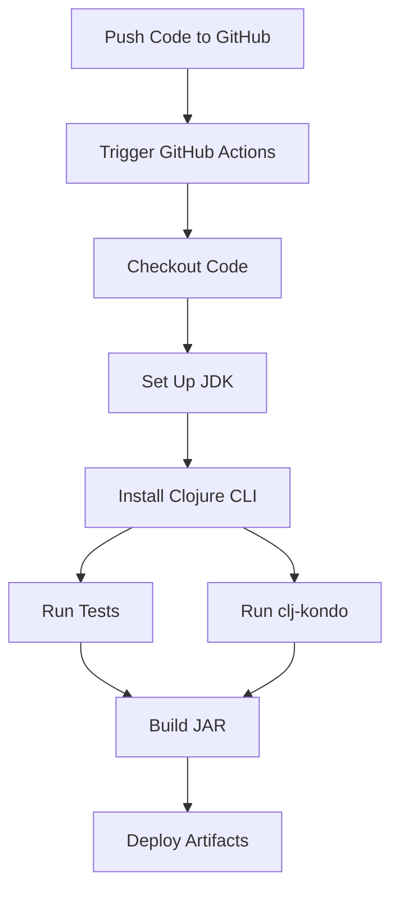

## 15.8.2 Automating Tests and Builds

In the world of software development, automation is a key factor in ensuring efficiency, reliability, and speed. Automating tests and builds is an essential part of the Continuous Integration and Continuous Deployment (CI/CD) process. This section will guide you through setting up CI pipelines to automate the running of tests, code quality checks, and building artifacts for Clojure projects.

### Introduction to CI/CD

Continuous Integration (CI) and Continuous Deployment (CD) are practices that enable teams to deliver code changes more frequently and reliably. CI involves automatically testing and integrating code changes into a shared repository, while CD extends this by automating the deployment of code to production environments.

**Key Benefits of CI/CD:**

- **Early Detection of Bugs:** Automated tests run with every code change, catching issues early in the development cycle.
- **Faster Release Cycles:** Automation reduces manual intervention, speeding up the release process.
- **Improved Code Quality:** Consistent testing and code quality checks ensure a high standard of code.
- **Enhanced Collaboration:** CI/CD encourages frequent commits and collaboration among team members.

### Setting Up a CI/CD Pipeline for Clojure

To automate tests and builds in a Clojure project, we need to set up a CI/CD pipeline. This involves selecting a CI/CD tool, configuring it to run tests, perform code quality checks, and build artifacts.

#### Choosing a CI/CD Tool

Several CI/CD tools are available, each with its own strengths. Popular choices include:

- **Jenkins:** An open-source automation server with a rich ecosystem of plugins.
- **GitHub Actions:** Integrated with GitHub, it provides a seamless experience for projects hosted on GitHub.
- **GitLab CI/CD:** Offers powerful CI/CD features integrated with GitLab repositories.
- **CircleCI:** Known for its ease of use and scalability.
- **Travis CI:** Popular for open-source projects with a straightforward configuration.

For this guide, we'll focus on GitHub Actions due to its integration with GitHub and ease of use for Clojure projects.

#### Configuring GitHub Actions for Clojure

GitHub Actions allows you to automate workflows directly from your GitHub repository. Let's set up a basic CI pipeline for a Clojure project.

1. **Create a GitHub Repository:**

   If you haven't already, create a GitHub repository for your Clojure project.

2. **Add a Workflow File:**

   In your repository, create a `.github/workflows` directory and add a YAML file, e.g., `ci.yml`.

3. **Define the Workflow:**

   Here's a sample workflow configuration for a Clojure project:

   ```yaml
   name: CI

   on:
     push:
       branches:
         - main
     pull_request:
       branches:
         - main

   jobs:
     build:
       runs-on: ubuntu-latest

       steps:
       - name: Checkout code
         uses: actions/checkout@v2

       - name: Set up JDK 11
         uses: actions/setup-java@v2
         with:
           java-version: '11'

       - name: Install Clojure CLI
         run: |
           curl -O https://download.clojure.org/install/linux-install-1.10.3.967.sh
           chmod +x linux-install-1.10.3.967.sh
           sudo ./linux-install-1.10.3.967.sh

       - name: Run tests
         run: clojure -M:test
   ```

   **Explanation:**

   - **Triggering Events:** The workflow triggers on pushes and pull requests to the `main` branch.
   - **Job Definition:** The `build` job runs on the latest Ubuntu environment.
   - **Steps:**
     - **Checkout Code:** Uses the `actions/checkout` action to clone the repository.
     - **Set Up JDK:** Uses `actions/setup-java` to install JDK 11, which is required for Clojure.
     - **Install Clojure CLI:** Downloads and installs the Clojure CLI tools.
     - **Run Tests:** Executes the test suite using the `clojure` command.

#### Automating Code Quality Checks

In addition to running tests, it's important to automate code quality checks. This can be done using linters and static analysis tools.

**Clojure Linting Tools:**

- **clj-kondo:** A linter for Clojure that checks for potential errors and code style issues.
- **Eastwood:** A Clojure lint tool that provides warnings for potential problems in your code.

**Integrating clj-kondo with GitHub Actions:**

Add a step to your workflow to run `clj-kondo`:

```yaml
- name: Run clj-kondo
  run: clj-kondo --lint src
```

This step will analyze the source code in the `src` directory and report any issues.

#### Building Artifacts

Building artifacts is a crucial step in preparing your application for deployment. In Clojure, this often involves creating a JAR file.

**Using Leiningen for Builds:**

Leiningen is a popular build tool for Clojure projects. Here's how you can configure it to build a JAR:

1. **Add a `project.clj` File:**

   Ensure your project has a `project.clj` file with the necessary configurations.

   ```clojure
   (defproject my-clojure-app "0.1.0-SNAPSHOT"
     :description "A sample Clojure application"
     :dependencies [[org.clojure/clojure "1.10.3"]]
     :main ^:skip-aot my-clojure-app.core
     :target-path "target/%s"
     :profiles {:uberjar {:aot :all}})
   ```

2. **Build the JAR:**

   Add a step to your GitHub Actions workflow to build the JAR:

   ```yaml
   - name: Build JAR
     run: lein uberjar
   ```

   This command will create an uberjar, a standalone JAR that includes all dependencies.

### Comparing with Java CI/CD Practices

Java developers may be familiar with tools like Maven or Gradle for builds and testing. Clojure's Leiningen serves a similar purpose but is tailored for Clojure's ecosystem.

**Key Differences:**

- **Configuration:** Clojure uses `project.clj` for configuration, while Java projects often use `pom.xml` (Maven) or `build.gradle` (Gradle).
- **Dependency Management:** Leiningen handles dependencies in a way similar to Maven, but with a syntax more aligned with Clojure's Lisp roots.
- **Build Artifacts:** Both ecosystems support building JAR files, but Clojure's uberjar simplifies deployment by bundling all dependencies.

### Try It Yourself

Experiment with the provided GitHub Actions workflow by making the following modifications:

- **Add a Code Coverage Tool:** Integrate a tool like `cloverage` to measure test coverage.
- **Deploy Artifacts:** Extend the workflow to deploy the built JAR to a cloud service or artifact repository.
- **Parallelize Jobs:** Configure the workflow to run tests and builds in parallel to reduce execution time.

### Diagram: CI/CD Workflow for Clojure Projects

Below is a diagram illustrating the CI/CD workflow for a Clojure project using GitHub Actions.



**Diagram Explanation:**

- **Push Code to GitHub:** Initiates the CI/CD process.
- **Trigger GitHub Actions:** Starts the workflow defined in the YAML file.
- **Checkout Code:** Retrieves the latest code from the repository.
- **Set Up JDK and Install Clojure CLI:** Prepares the environment for running Clojure code.
- **Run Tests and clj-kondo:** Ensures code quality and correctness.
- **Build JAR:** Packages the application for deployment.
- **Deploy Artifacts:** Moves the built artifacts to a deployment target.

### Exercises

1. **Integrate a New CI/CD Tool:**
   - Choose a different CI/CD tool (e.g., Jenkins, CircleCI) and configure it for your Clojure project.

2. **Enhance the Workflow:**
   - Add additional steps to the GitHub Actions workflow, such as security scans or performance tests.

3. **Create a Custom Linter Rule:**
   - Use `clj-kondo` to create a custom linting rule specific to your project's coding standards.

### Key Takeaways

- **Automation is Key:** Automating tests and builds is crucial for maintaining code quality and accelerating development cycles.
- **CI/CD Tools:** GitHub Actions provides a powerful and flexible platform for automating Clojure projects.
- **Integration with Clojure Tools:** Tools like Leiningen and clj-kondo integrate seamlessly into CI/CD pipelines, enhancing code quality and build processes.
- **Experiment and Extend:** Use the provided examples as a starting point and customize them to fit your project's needs.

By automating tests and builds, you can focus more on writing code and less on manual processes, leading to more efficient and reliable software development.

## Quiz: Mastering CI/CD Automation for Clojure Projects



### What is the primary benefit of automating tests in a CI/CD pipeline?

- [x] Early detection of bugs
- [ ] Reducing code complexity
- [ ] Increasing code size
- [ ] Decreasing team collaboration

> **Explanation:** Automating tests allows for early detection of bugs, which helps in maintaining code quality and reducing the time spent on debugging.

### Which CI/CD tool is integrated with GitHub for seamless automation?

- [x] GitHub Actions
- [ ] Jenkins
- [ ] Travis CI
- [ ] CircleCI

> **Explanation:** GitHub Actions is integrated with GitHub, providing a seamless experience for automating workflows directly from GitHub repositories.

### What is the purpose of the `lein uberjar` command in a Clojure project?

- [x] To build a standalone JAR file with all dependencies
- [ ] To run tests
- [ ] To lint the code
- [ ] To deploy the application

> **Explanation:** The `lein uberjar` command creates a standalone JAR file that includes all dependencies, making it ready for deployment.

### Which tool is used for linting Clojure code in the provided workflow?

- [x] clj-kondo
- [ ] Eastwood
- [ ] Leiningen
- [ ] Maven

> **Explanation:** The provided workflow uses `clj-kondo` to lint Clojure code, checking for potential errors and style issues.

### What is the role of the `actions/checkout` step in a GitHub Actions workflow?

- [x] To clone the repository code
- [ ] To run tests
- [ ] To build artifacts
- [ ] To deploy the application

> **Explanation:** The `actions/checkout` step clones the repository code, making it available for subsequent steps in the workflow.

### How can you measure code coverage in a Clojure project?

- [x] By integrating a tool like cloverage
- [ ] By using the `lein uberjar` command
- [ ] By running `clj-kondo`
- [ ] By deploying the application

> **Explanation:** Code coverage can be measured by integrating a tool like `cloverage`, which analyzes the extent of code tested by the test suite.

### What is a key advantage of using GitHub Actions for CI/CD?

- [x] Seamless integration with GitHub repositories
- [ ] Requires no configuration
- [ ] Only supports Clojure projects
- [ ] Limited to small projects

> **Explanation:** GitHub Actions offers seamless integration with GitHub repositories, making it easy to automate workflows for projects hosted on GitHub.

### What is the main purpose of Continuous Integration (CI)?

- [x] To automatically test and integrate code changes
- [ ] To deploy code to production
- [ ] To increase code complexity
- [ ] To reduce team collaboration

> **Explanation:** Continuous Integration (CI) focuses on automatically testing and integrating code changes into a shared repository, ensuring code quality and consistency.

### Which command is used to run tests in the provided GitHub Actions workflow?

- [x] clojure -M:test
- [ ] lein uberjar
- [ ] clj-kondo --lint src
- [ ] actions/checkout

> **Explanation:** The command `clojure -M:test` is used to run tests in the provided GitHub Actions workflow, ensuring code correctness.

### True or False: Automating builds in a CI/CD pipeline can speed up the release process.

- [x] True
- [ ] False

> **Explanation:** Automating builds reduces manual intervention, speeding up the release process and allowing for more frequent and reliable code deployments.


