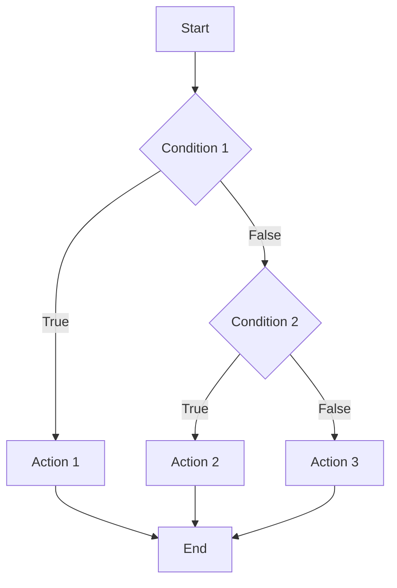
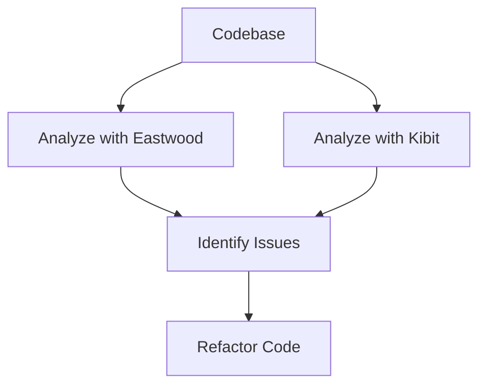

## 15.9.2 Analyzing Quality Metrics

As experienced Java developers transitioning to Clojure, understanding and analyzing quality metrics is crucial for maintaining high standards in your codebase. This section will guide you through key quality metrics such as cyclomatic complexity and code smells, and introduce you to tools like `eastwood` and `kibit` that can help you analyze and improve your Clojure code quality.

### Understanding Quality Metrics

Quality metrics are essential for assessing the maintainability, readability, and overall quality of your code. They provide insights into potential problem areas and help you make informed decisions about refactoring and improving your codebase.

#### Cyclomatic Complexity

Cyclomatic complexity is a metric used to measure the complexity of a program. It is calculated based on the number of linearly independent paths through the program's source code. In simpler terms, it reflects the number of decision points in a program, such as `if` statements, loops, and case statements.

**Why Cyclomatic Complexity Matters:**

- **Maintainability:** High cyclomatic complexity can make code difficult to understand and maintain.
- **Testability:** Code with high complexity often requires more test cases to achieve adequate coverage.
- **Readability:** Complex code can be harder for developers to read and comprehend.

**Calculating Cyclomatic Complexity:**

In Clojure, cyclomatic complexity can be calculated similarly to Java, but with a focus on functional constructs. Consider the following Clojure function:

```clojure
(defn calculate-discount [price customer-type]
  (cond
    (= customer-type :vip) (* price 0.8)
    (= customer-type :regular) (* price 0.9)
    :else price))
```

This function has a cyclomatic complexity of 3, as there are three decision points: one for each condition in the `cond` expression.

**Try It Yourself:**

- Modify the function to add more customer types and observe how the cyclomatic complexity changes.
- Experiment with different functional constructs like `case` or `if` to see their impact on complexity.

#### Code Smells

Code smells are indicators of potential issues in your code that may hinder its readability, maintainability, or performance. They are not bugs but rather symptoms of deeper problems in the code structure.

**Common Code Smells in Clojure:**

- **Long Functions:** Functions that do too much can be hard to understand and test.
- **Duplicated Code:** Repeated code blocks can lead to maintenance challenges.
- **Complex Conditionals:** Nested or overly complex conditionals can reduce readability.

**Example of a Code Smell:**

```clojure
(defn process-order [order]
  (let [total (calculate-total order)
        discount (if (= (:customer-type order) :vip)
                   (* total 0.2)
                   (if (= (:customer-type order) :regular)
                     (* total 0.1)
                     0))]
    (- total discount)))
```

This function has a code smell due to the nested `if` statements, which can be refactored for clarity.

**Refactored Version:**

```clojure
(defn process-order [order]
  (let [total (calculate-total order)
        discount-rate (case (:customer-type order)
                        :vip 0.2
                        :regular 0.1
                        0)]
    (- total (* total discount-rate))))
```

**Try It Yourself:**

- Identify code smells in your existing Clojure projects and refactor them for improved readability.
- Use `case` or `cond` to simplify complex conditionals.

### Tools for Analyzing Code Quality

Clojure offers several tools to help you analyze and improve code quality. Two popular tools are `eastwood` and `kibit`.

#### Eastwood

Eastwood is a Clojure linting tool that helps identify potential issues in your code. It checks for common mistakes, code smells, and potential bugs.

**Using Eastwood:**

To use Eastwood, add it to your project dependencies and run it from the command line:

```clojure
;; Add to your project.clj
:plugins [[jonase/eastwood "0.3.5"]]

;; Run Eastwood
lein eastwood
```

Eastwood will analyze your code and provide warnings and suggestions for improvement.

**Example Output:**

```
== Linting src/my_project/core.clj ==
src/my_project/core.clj:12:3: unused-ret-vals: Return value of (println ...) is discarded.
src/my_project/core.clj:20:1: constant-test: Test expression is always logical true or always logical false.
```

**Try It Yourself:**

- Run Eastwood on your Clojure projects and address the warnings it generates.
- Experiment with different code styles to see how Eastwood responds.

#### Kibit

Kibit is a static code analyzer that suggests idiomatic Clojure code improvements. It helps you write more concise and idiomatic Clojure code.

**Using Kibit:**

To use Kibit, add it to your project dependencies and run it from the command line:

```clojure
;; Add to your project.clj
:plugins [[lein-kibit "0.1.8"]]

;; Run Kibit
lein kibit
```

Kibit will analyze your code and suggest improvements.

**Example Output:**

```
At src/my_project/core.clj:15:
Consider using:
  (when-not condition
    (do-something))
instead of:
  (if (not condition)
    (do-something))
```

**Try It Yourself:**

- Run Kibit on your Clojure code and apply its suggestions.
- Compare the before and after versions of your code to understand the improvements.

### Comparing Clojure and Java Quality Metrics

While Clojure and Java share some quality metrics, their approaches to code quality can differ due to their paradigms.

**Cyclomatic Complexity:**

- **Java:** Often involves complex class hierarchies and imperative constructs.
- **Clojure:** Focuses on functional constructs, which can reduce complexity through higher-order functions and immutability.

**Code Smells:**

- **Java:** Common smells include long methods, large classes, and excessive use of inheritance.
- **Clojure:** Smells often relate to complex conditionals, nested functions, and lack of idiomatic constructs.

**Tooling:**

- **Java:** Tools like SonarQube and Checkstyle are popular for analyzing Java code quality.
- **Clojure:** Eastwood and Kibit provide similar functionality tailored to Clojure's functional paradigm.

### Visualizing Quality Metrics

Visualizing quality metrics can help you understand your codebase's health and identify areas for improvement. Let's explore some diagrams that illustrate these concepts.

#### Cyclomatic Complexity Flowchart



*This flowchart represents a simple decision-making process with two conditions, illustrating how cyclomatic complexity is calculated.*

#### Code Smell Detection



*This diagram shows the process of detecting and addressing code smells using Eastwood and Kibit.*

### Best Practices for Analyzing Quality Metrics

- **Regular Analysis:** Regularly analyze your codebase to catch issues early and maintain high quality.
- **Automate Tools:** Integrate tools like Eastwood and Kibit into your CI/CD pipeline for continuous monitoring.
- **Refactor Incrementally:** Address issues incrementally to avoid overwhelming changes and ensure stability.
- **Collaborate with Peers:** Engage with your team to review and discuss quality metrics and improvements.

### Exercises and Practice Problems

1. **Cyclomatic Complexity Exercise:** Calculate the cyclomatic complexity of a Clojure function in your project and refactor it to reduce complexity.
2. **Code Smell Identification:** Identify and refactor code smells in a Clojure project, focusing on simplifying complex conditionals.
3. **Tool Integration:** Integrate Eastwood and Kibit into your CI/CD pipeline and analyze the results.

### Summary and Key Takeaways

- **Cyclomatic Complexity:** A key metric for assessing code complexity and maintainability.
- **Code Smells:** Indicators of potential issues that can hinder code quality.
- **Tools:** Eastwood and Kibit are valuable tools for analyzing and improving Clojure code quality.
- **Best Practices:** Regular analysis, automation, and collaboration are essential for maintaining high code quality.

By understanding and analyzing quality metrics, you can ensure your Clojure codebase remains maintainable, readable, and efficient. Now that we've explored these concepts, let's apply them to enhance the quality of your Clojure projects.

### Further Reading

- [Official Clojure Documentation](https://clojure.org/reference/documentation)
- [ClojureDocs](https://clojuredocs.org/)
- [Eastwood GitHub Repository](https://github.com/jonase/eastwood)
- [Kibit GitHub Repository](https://github.com/jonase/kibit)

---

## Quiz: Mastering Quality Metrics in Clojure



### What is cyclomatic complexity?

- [x] A measure of the number of linearly independent paths through a program's source code.
- [ ] A measure of the number of lines of code in a program.
- [ ] A measure of the number of functions in a program.
- [ ] A measure of the number of variables in a program.

> **Explanation:** Cyclomatic complexity measures the number of linearly independent paths through a program's source code, reflecting its complexity.

### Which tool is used for linting Clojure code?

- [x] Eastwood
- [ ] Checkstyle
- [ ] SonarQube
- [ ] JUnit

> **Explanation:** Eastwood is a linting tool specifically designed for Clojure code.

### What is a code smell?

- [x] An indicator of potential issues in code that may hinder readability or maintainability.
- [ ] A bug in the code that causes it to crash.
- [ ] A feature that enhances code performance.
- [ ] A tool for analyzing code quality.

> **Explanation:** A code smell is an indicator of potential issues in code that may hinder its readability or maintainability.

### How can you reduce cyclomatic complexity in Clojure?

- [x] By using higher-order functions and simplifying conditionals.
- [ ] By adding more functions to the code.
- [ ] By increasing the number of variables.
- [ ] By using more loops.

> **Explanation:** Reducing cyclomatic complexity involves using higher-order functions and simplifying conditionals to make the code more maintainable.

### Which tool suggests idiomatic Clojure code improvements?

- [x] Kibit
- [ ] Eastwood
- [ ] SonarQube
- [ ] Checkstyle

> **Explanation:** Kibit is a static code analyzer that suggests idiomatic Clojure code improvements.

### What is the purpose of using Eastwood in a Clojure project?

- [x] To identify potential issues and code smells.
- [ ] To compile the Clojure code.
- [ ] To run unit tests.
- [ ] To deploy the application.

> **Explanation:** Eastwood is used to identify potential issues and code smells in Clojure projects.

### What is a common code smell in Clojure?

- [x] Complex conditionals
- [ ] Short functions
- [ ] Minimal use of variables
- [ ] Extensive documentation

> **Explanation:** Complex conditionals are a common code smell in Clojure, as they can reduce readability.

### How can you automate code quality analysis in Clojure?

- [x] By integrating tools like Eastwood and Kibit into the CI/CD pipeline.
- [ ] By manually reviewing the code every week.
- [ ] By writing more unit tests.
- [ ] By increasing the number of developers on the team.

> **Explanation:** Automating code quality analysis involves integrating tools like Eastwood and Kibit into the CI/CD pipeline for continuous monitoring.

### What is the benefit of using Kibit?

- [x] It suggests idiomatic Clojure code improvements.
- [ ] It compiles the Clojure code.
- [ ] It runs performance benchmarks.
- [ ] It manages project dependencies.

> **Explanation:** Kibit suggests idiomatic Clojure code improvements, helping developers write more concise and idiomatic code.

### True or False: Cyclomatic complexity is only relevant to object-oriented programming.

- [ ] True
- [x] False

> **Explanation:** Cyclomatic complexity is relevant to all programming paradigms, including functional programming, as it measures the complexity of decision points in code.



---
