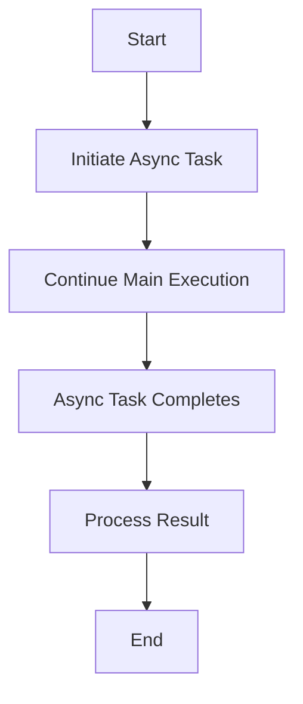

## 16.1.1 Introduction to Asynchronous Concepts

In the realm of modern software development, **asynchronous programming** has emerged as a pivotal paradigm, enabling applications to perform tasks more efficiently and responsively. This section delves into the core concepts of asynchronous programming, highlighting its significance, benefits, and practical applications, especially for developers transitioning from Java to Clojure.

### Understanding Asynchronous Programming

Asynchronous programming is a programming paradigm that allows multiple tasks to run concurrently without blocking the execution of other tasks. Unlike synchronous programming, where tasks are executed sequentially, asynchronous programming enables tasks to start, pause, and resume as resources become available, leading to more efficient use of system resources.

#### The Limitations of Synchronous Programming

In synchronous programming, tasks are executed one after the other, which can lead to inefficiencies, especially when dealing with I/O operations. For instance, when a program reads data from a file or a network, it must wait for the operation to complete before proceeding to the next task. This waiting period can result in idle CPU time and reduced application responsiveness.

Consider the following Java code snippet that demonstrates synchronous file reading:

```java
import java.nio.file.Files;
import java.nio.file.Paths;
import java.io.IOException;

public class SyncFileReader {
    public static void main(String[] args) {
        try {
            String content = new String(Files.readAllBytes(Paths.get("example.txt")));
            System.out.println(content);
        } catch (IOException e) {
            e.printStackTrace();
        }
    }
}
```

In this example, the program blocks while reading the file, preventing other tasks from executing until the operation is complete.

#### The Advantages of Asynchronous Programming

Asynchronous programming addresses these limitations by allowing tasks to run independently of each other. This approach is particularly beneficial in scenarios involving high-volume I/O operations, real-time data processing, and user interface responsiveness. By not blocking the execution flow, asynchronous programming can lead to more responsive and efficient applications.

Let's explore a Clojure example that demonstrates asynchronous file reading using the `core.async` library:

```clojure
(require '[clojure.core.async :refer [go <!]])

(defn async-file-reader [file-path]
  (go
    (let [content (<! (slurp file-path))]
      (println content))))

(async-file-reader "example.txt")
```

In this Clojure example, the `go` block allows the file reading operation to be non-blocking, enabling other tasks to proceed concurrently.

### Key Concepts in Asynchronous Programming

To fully grasp asynchronous programming, it's essential to understand several key concepts:

#### Non-Blocking I/O

Non-blocking I/O is a technique that allows a program to initiate an I/O operation and continue executing other tasks while waiting for the operation to complete. This approach is crucial for building responsive applications that can handle multiple I/O operations simultaneously.

#### Event-Driven Architecture

Asynchronous programming often relies on an event-driven architecture, where the flow of the program is determined by events such as user actions, sensor outputs, or messages from other programs. This architecture enables applications to respond to events as they occur, rather than following a predetermined sequence of operations.

#### Concurrency vs. Parallelism

While both concurrency and parallelism involve executing multiple tasks simultaneously, they differ in their approach. Concurrency is about managing multiple tasks at the same time, while parallelism involves executing multiple tasks simultaneously on different processors. Asynchronous programming primarily focuses on concurrency, allowing tasks to progress independently.

### Scenarios Benefiting from Asynchronous Programming

Asynchronous programming is particularly advantageous in the following scenarios:

- **High-Volume I/O Operations**: Applications that perform numerous I/O operations, such as web servers or database clients, can benefit from asynchronous programming by handling multiple requests concurrently.
- **Real-Time Data Processing**: Systems that process data in real-time, such as financial trading platforms or sensor networks, require asynchronous programming to maintain responsiveness and throughput.
- **User Interface Responsiveness**: In GUI applications, asynchronous programming ensures that the user interface remains responsive while performing background tasks, such as data loading or network communication.

### Asynchronous Programming in Clojure vs. Java

Clojure offers several unique features that enhance asynchronous programming, making it a compelling choice for developers familiar with Java. Let's compare the two languages in terms of asynchronous capabilities:

#### Java's Asynchronous Capabilities

Java provides several mechanisms for asynchronous programming, including threads, the `ExecutorService`, and the `CompletableFuture` API introduced in Java 8. These tools allow developers to execute tasks asynchronously and manage concurrency effectively.

Here's an example of using `CompletableFuture` in Java:

```java
import java.util.concurrent.CompletableFuture;

public class AsyncExample {
    public static void main(String[] args) {
        CompletableFuture<Void> future = CompletableFuture.runAsync(() -> {
            // Simulate a long-running task
            try {
                Thread.sleep(2000);
            } catch (InterruptedException e) {
                e.printStackTrace();
            }
            System.out.println("Task completed!");
        });

        // Continue with other tasks
        System.out.println("Main thread continues...");
        future.join(); // Wait for the async task to complete
    }
}
```

#### Clojure's Asynchronous Capabilities

Clojure's `core.async` library provides powerful abstractions for asynchronous programming, including channels and go blocks. These constructs enable developers to write non-blocking code that is both concise and expressive.

Here's a similar example using Clojure's `core.async`:

```clojure
(require '[clojure.core.async :refer [go <!]])

(defn async-task []
  (go
    (Thread/sleep 2000) ; Simulate a long-running task
    (println "Task completed!")))

(async-task)
(println "Main thread continues...")
```

In this Clojure example, the `go` block allows the task to run asynchronously, while the main thread continues executing other tasks.

### Visualizing Asynchronous Flow

To better understand the flow of asynchronous programming, let's visualize the process using a flowchart:



**Figure 1**: This flowchart illustrates the asynchronous execution flow, where the main execution continues while the asynchronous task runs in the background.

### Try It Yourself

To deepen your understanding of asynchronous programming, try modifying the provided Clojure and Java examples:

- **Experiment with Different Delays**: Change the delay duration in the asynchronous tasks to observe how it affects the program's execution.
- **Add Multiple Asynchronous Tasks**: Introduce additional asynchronous tasks to see how they interact and affect the overall flow.
- **Implement Error Handling**: Enhance the examples by adding error handling mechanisms to manage potential exceptions.

### Key Takeaways

- **Asynchronous programming** allows tasks to run concurrently, improving application responsiveness and efficiency.
- **Non-blocking I/O** and **event-driven architecture** are fundamental concepts in asynchronous programming.
- Clojure's `core.async` library provides powerful tools for writing asynchronous code, offering a compelling alternative to Java's asynchronous capabilities.
- Asynchronous programming is beneficial in scenarios involving high-volume I/O operations, real-time data processing, and user interface responsiveness.

By embracing asynchronous programming, developers can build more efficient and responsive applications, leveraging the strengths of both Clojure and Java.

### Further Reading

For more information on asynchronous programming and Clojure's capabilities, consider exploring the following resources:

- [Official Clojure Documentation](https://clojure.org/)
- [ClojureDocs](https://clojuredocs.org/)
- [Java CompletableFuture API](https://docs.oracle.com/javase/8/docs/api/java/util/concurrent/CompletableFuture.html)

---

## Quiz: Mastering Asynchronous Programming Concepts



### What is the primary benefit of asynchronous programming?

- [x] It allows tasks to run concurrently without blocking each other.
- [ ] It ensures tasks are executed in a strict sequence.
- [ ] It simplifies code by reducing the number of lines.
- [ ] It eliminates the need for error handling.

> **Explanation:** Asynchronous programming allows tasks to run concurrently, improving application responsiveness and efficiency by not blocking the execution flow.

### Which Clojure library is commonly used for asynchronous programming?

- [x] core.async
- [ ] clojure.java.jdbc
- [ ] ring
- [ ] compojure

> **Explanation:** The `core.async` library in Clojure provides abstractions for asynchronous programming, such as channels and go blocks.

### How does non-blocking I/O improve application performance?

- [x] By allowing the application to continue executing other tasks while waiting for I/O operations to complete.
- [ ] By executing I/O operations in a strict sequence.
- [ ] By reducing the number of I/O operations.
- [ ] By simplifying the code structure.

> **Explanation:** Non-blocking I/O allows applications to continue executing other tasks while waiting for I/O operations to complete, leading to more efficient resource utilization.

### What is the difference between concurrency and parallelism?

- [x] Concurrency is about managing multiple tasks at the same time, while parallelism involves executing tasks simultaneously on different processors.
- [ ] Concurrency and parallelism are the same concepts.
- [ ] Concurrency is faster than parallelism.
- [ ] Parallelism is only used in single-threaded applications.

> **Explanation:** Concurrency involves managing multiple tasks at the same time, while parallelism involves executing tasks simultaneously on different processors.

### Which Java API introduced in Java 8 is used for asynchronous programming?

- [x] CompletableFuture
- [ ] ExecutorService
- [ ] Thread
- [ ] Future

> **Explanation:** The `CompletableFuture` API, introduced in Java 8, provides a framework for asynchronous programming in Java.

### In Clojure, what construct is used to create non-blocking asynchronous tasks?

- [x] go block
- [ ] defn
- [ ] let
- [ ] loop

> **Explanation:** The `go` block in Clojure's `core.async` library is used to create non-blocking asynchronous tasks.

### What is a common use case for asynchronous programming?

- [x] Handling high-volume I/O operations
- [ ] Executing tasks in a strict sequence
- [ ] Simplifying code structure
- [ ] Reducing the number of lines of code

> **Explanation:** Asynchronous programming is commonly used to handle high-volume I/O operations, allowing tasks to run concurrently without blocking.

### How does Clojure's `core.async` differ from Java's `CompletableFuture`?

- [x] `core.async` uses channels and go blocks, while `CompletableFuture` uses a future-based API.
- [ ] `core.async` is synchronous, while `CompletableFuture` is asynchronous.
- [ ] `core.async` is only for I/O operations, while `CompletableFuture` is for all tasks.
- [ ] `core.async` is slower than `CompletableFuture`.

> **Explanation:** Clojure's `core.async` uses channels and go blocks for asynchronous programming, while Java's `CompletableFuture` uses a future-based API.

### What is the role of an event-driven architecture in asynchronous programming?

- [x] It determines the flow of the program based on events, allowing for responsive applications.
- [ ] It ensures tasks are executed in a strict sequence.
- [ ] It simplifies code by reducing the number of lines.
- [ ] It eliminates the need for error handling.

> **Explanation:** An event-driven architecture determines the flow of the program based on events, enabling applications to respond to events as they occur.

### True or False: Asynchronous programming can improve user interface responsiveness.

- [x] True
- [ ] False

> **Explanation:** True. Asynchronous programming can improve user interface responsiveness by allowing background tasks to run without blocking the main execution flow.


