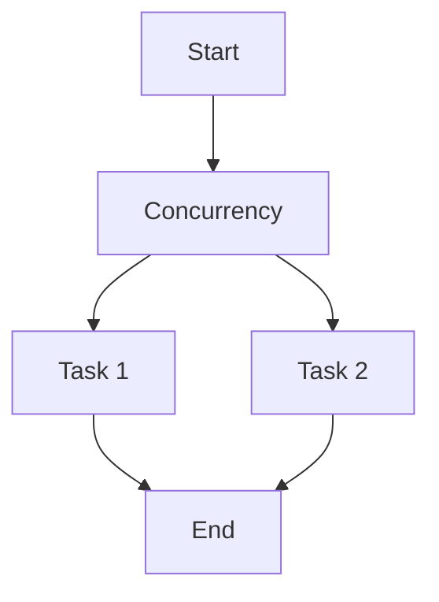
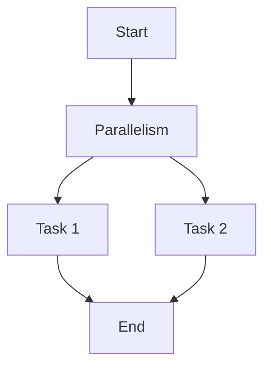

## 16.1.2 Concurrency vs. Parallelism

In the realm of software development, especially when transitioning from Java to Clojure, understanding the concepts of concurrency and parallelism is crucial. These terms are often used interchangeably, but they represent distinct ideas that can significantly impact how we design and optimize our applications. In this section, we'll delve into these concepts, explore their differences, and see how they relate to asynchronous programming in Clojure.

### Understanding Concurrency

**Concurrency** is about dealing with lots of things at once. It's the ability of a program to manage multiple tasks simultaneously, but not necessarily executing them at the same time. Concurrency is more about the structure of the program and how it handles multiple tasks, allowing them to make progress without necessarily running in parallel.

In Java, concurrency is often managed using threads. A thread is a lightweight process that can run independently within a program. Java provides several mechanisms to handle concurrency, such as the `Thread` class, `Runnable` interface, and the `ExecutorService` framework.

#### Concurrency in Java

Here's a simple example of concurrency in Java using threads:

```java
public class ConcurrencyExample {
    public static void main(String[] args) {
        Runnable task1 = () -> {
            for (int i = 0; i < 5; i++) {
                System.out.println("Task 1 - Count: " + i);
            }
        };

        Runnable task2 = () -> {
            for (int i = 0; i < 5; i++) {
                System.out.println("Task 2 - Count: " + i);
            }
        };

        Thread thread1 = new Thread(task1);
        Thread thread2 = new Thread(task2);

        thread1.start();
        thread2.start();
    }
}
```

In this example, two tasks are defined and run concurrently. The tasks are not necessarily executed simultaneously, but they are interleaved, allowing both to make progress.

#### Concurrency in Clojure

Clojure, being a functional language, approaches concurrency differently. It provides several concurrency primitives like **atoms**, **refs**, **agents**, and **futures** to manage state changes safely across threads.

Here's a simple example using Clojure's `future` to achieve concurrency:

```clojure
(defn task [name]
  (dotimes [i 5]
    (println (str name " - Count: " i))))

(def task1 (future (task "Task 1")))
(def task2 (future (task "Task 2")))

@task1
@task2
```

In this Clojure example, `future` is used to run tasks concurrently. The `@` symbol is used to dereference the future, ensuring that the main thread waits for the tasks to complete.

### Understanding Parallelism

**Parallelism** is about doing lots of things at once. It involves executing multiple tasks simultaneously, typically on multiple CPU cores. Parallelism is a subset of concurrency, where tasks are not only managed concurrently but are also executed in parallel.

#### Parallelism in Java

Java provides the `ForkJoinPool` and parallel streams to facilitate parallelism. Here's an example using Java's parallel streams:

```java
import java.util.stream.IntStream;

public class ParallelismExample {
    public static void main(String[] args) {
        IntStream.range(0, 10).parallel().forEach(i -> {
            System.out.println("Processing: " + i);
        });
    }
}
```

In this example, the `parallel()` method is used to process elements in parallel, leveraging multiple CPU cores.

#### Parallelism in Clojure

Clojure's `pmap` function allows for parallel processing of collections. Here's an example:

```clojure
(defn process [n]
  (println (str "Processing: " n)))

(pmap process (range 10))
```

In this Clojure example, `pmap` is used to apply the `process` function to each element in the range in parallel.

### Concurrency vs. Parallelism: Key Differences

- **Concurrency** is about managing multiple tasks at once, while **parallelism** is about executing multiple tasks simultaneously.
- Concurrency can be achieved on a single-core processor, whereas parallelism requires multiple cores.
- Concurrency is more about the design and structure of the program, while parallelism is about execution.

### Asynchronous Programming and Concurrency

Asynchronous programming is a form of concurrency that allows a single thread to manage multiple tasks efficiently. It enables non-blocking operations, where tasks can be initiated and then completed at a later time, allowing the program to continue executing other tasks in the meantime.

#### Asynchronous Programming in Java

Java provides the `CompletableFuture` class for asynchronous programming:

```java
import java.util.concurrent.CompletableFuture;

public class AsyncExample {
    public static void main(String[] args) {
        CompletableFuture<Void> future = CompletableFuture.runAsync(() -> {
            System.out.println("Running async task");
        });

        future.join(); // Wait for the task to complete
    }
}
```

In this example, `CompletableFuture.runAsync` is used to run a task asynchronously.

#### Asynchronous Programming in Clojure

Clojure's `core.async` library provides channels and go blocks for asynchronous programming:

```clojure
(require '[clojure.core.async :refer [go <! >! chan]])

(defn async-task [c]
  (go
    (Thread/sleep 1000)
    (>! c "Task completed")))

(let [c (chan)]
  (async-task c)
  (println "Waiting for task...")
  (println (<! c)))
```

In this Clojure example, a channel `c` is created, and a task is run asynchronously using a `go` block. The main thread waits for the task to complete by reading from the channel.

### Diagrams and Visualizations

To better understand these concepts, let's visualize the flow of tasks in concurrency and parallelism.



**Diagram 1: Concurrency Flow** - This diagram illustrates how tasks are managed concurrently, allowing them to progress without necessarily running in parallel.



**Diagram 2: Parallelism Flow** - This diagram shows tasks being executed simultaneously, leveraging multiple CPU cores.

### Try It Yourself

Experiment with the code examples provided. Try modifying the number of tasks or the operations performed within each task. Observe how concurrency and parallelism affect the execution and performance of your programs.

### Further Reading

For more information on concurrency and parallelism, consider exploring the following resources:

- [Java Concurrency Documentation](https://docs.oracle.com/javase/tutorial/essential/concurrency/)
- [Clojure Concurrency Reference](https://clojure.org/reference/atoms)
- [Clojure core.async Guide](https://clojure.github.io/core.async/)

### Exercises

1. Modify the Java concurrency example to include a third task. Observe how the tasks are interleaved.
2. Use Clojure's `pmap` to process a larger collection in parallel. Measure the performance difference compared to using `map`.
3. Implement an asynchronous task in Clojure using `core.async` that reads from multiple channels.

### Key Takeaways

- **Concurrency** involves managing multiple tasks at once, while **parallelism** involves executing tasks simultaneously.
- Asynchronous programming enhances concurrency by allowing tasks to be managed efficiently without blocking.
- Clojure provides powerful concurrency primitives and libraries like `core.async` to facilitate concurrent and asynchronous programming.

Now that we've explored the differences between concurrency and parallelism, let's apply these concepts to build more efficient and responsive applications in Clojure.

## Quiz: Test Your Understanding of Concurrency and Parallelism



### What is concurrency primarily about?

- [x] Managing multiple tasks at once
- [ ] Executing multiple tasks simultaneously
- [ ] Increasing CPU usage
- [ ] Reducing memory consumption

> **Explanation:** Concurrency is about managing multiple tasks at once, allowing them to make progress without necessarily running in parallel.

### What is parallelism primarily about?

- [ ] Managing multiple tasks at once
- [x] Executing multiple tasks simultaneously
- [ ] Increasing CPU usage
- [ ] Reducing memory consumption

> **Explanation:** Parallelism involves executing multiple tasks simultaneously, typically on multiple CPU cores.

### Which Clojure function is used for parallel processing of collections?

- [ ] map
- [x] pmap
- [ ] reduce
- [ ] filter

> **Explanation:** `pmap` is used in Clojure for parallel processing of collections.

### What does asynchronous programming allow?

- [x] Non-blocking operations
- [ ] Blocking operations
- [ ] Sequential execution
- [ ] Synchronous execution

> **Explanation:** Asynchronous programming allows non-blocking operations, enabling tasks to be initiated and completed at a later time.

### Which Java class is used for asynchronous programming?

- [ ] Thread
- [x] CompletableFuture
- [ ] ExecutorService
- [ ] Runnable

> **Explanation:** `CompletableFuture` is used in Java for asynchronous programming.

### What is the role of the `go` block in Clojure's core.async?

- [x] To run tasks asynchronously
- [ ] To run tasks synchronously
- [ ] To block the main thread
- [ ] To create new threads

> **Explanation:** The `go` block in Clojure's core.async is used to run tasks asynchronously.

### How does Clojure's `future` facilitate concurrency?

- [x] By allowing tasks to run concurrently
- [ ] By blocking tasks
- [ ] By executing tasks sequentially
- [ ] By creating new threads

> **Explanation:** Clojure's `future` allows tasks to run concurrently, enabling non-blocking execution.

### What is the main difference between concurrency and parallelism?

- [x] Concurrency is about managing tasks, while parallelism is about executing tasks simultaneously.
- [ ] Concurrency is about executing tasks simultaneously, while parallelism is about managing tasks.
- [ ] Concurrency and parallelism are the same.
- [ ] Concurrency is faster than parallelism.

> **Explanation:** Concurrency is about managing tasks, while parallelism is about executing tasks simultaneously.

### Which Clojure library provides channels for asynchronous programming?

- [ ] clojure.core
- [x] core.async
- [ ] clojure.java
- [ ] clojure.parallel

> **Explanation:** The `core.async` library in Clojure provides channels for asynchronous programming.

### True or False: Parallelism requires multiple CPU cores.

- [x] True
- [ ] False

> **Explanation:** Parallelism requires multiple CPU cores to execute tasks simultaneously.


