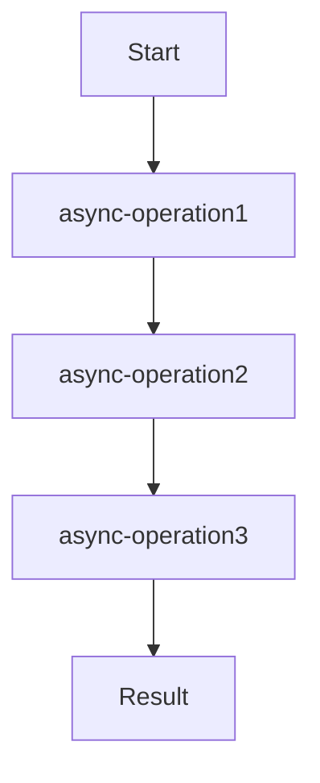

## 16.1.3 Challenges in Asynchronous Programming

Asynchronous programming is a powerful paradigm that allows developers to write non-blocking code, enabling applications to handle multiple tasks simultaneously without waiting for each task to complete before starting the next. However, it comes with its own set of challenges, especially for developers transitioning from a synchronous, imperative language like Java to a functional, asynchronous language like Clojure. In this section, we will explore these challenges and how Clojure's `core.async` library provides solutions.

### Understanding the Challenges

#### Callback Hell

One of the most notorious challenges in asynchronous programming is **callback hell**. This occurs when multiple asynchronous operations are nested within each other, leading to deeply indented and hard-to-read code. In JavaScript, this is often seen with nested callbacks, but similar issues can arise in Java when using asynchronous libraries.

**Java Example:**

```java
// Java example of callback hell using nested callbacks
public void fetchData() {
    asyncOperation1(result1 -> {
        asyncOperation2(result2 -> {
            asyncOperation3(result3 -> {
                // Process results
            });
        });
    });
}
```

In this example, each asynchronous operation depends on the result of the previous one, leading to a pyramid of doom.

**Clojure Solution:**

Clojure's `core.async` provides a way to manage asynchronous operations using channels and go blocks, which can help flatten the callback pyramid.

```clojure
(require '[clojure.core.async :refer [go <! >! chan]])

(defn fetch-data []
  (let [c (chan)]
    (go
      (let [result1 (<! (async-operation1))
            result2 (<! (async-operation2 result1))
            result3 (<! (async-operation3 result2))]
        (>! c result3)))
    c))
```

In this Clojure example, the `go` block allows us to write asynchronous code in a sequential style, improving readability and maintainability.

#### Error Handling

Handling errors in asynchronous code can be complex. In synchronous code, exceptions can be caught and handled using try-catch blocks. However, in asynchronous code, errors may occur in callbacks or separate threads, making it difficult to propagate and handle them effectively.

**Java Example:**

```java
// Java example of error handling in asynchronous code
public void fetchData() {
    try {
        asyncOperation1(result1 -> {
            try {
                asyncOperation2(result2 -> {
                    try {
                        asyncOperation3(result3 -> {
                            // Process results
                        });
                    } catch (Exception e) {
                        handleError(e);
                    }
                });
            } catch (Exception e) {
                handleError(e);
            }
        });
    } catch (Exception e) {
        handleError(e);
    }
}
```

This approach leads to repetitive and cluttered error handling logic.

**Clojure Solution:**

Clojure's `core.async` allows for centralized error handling by using channels to communicate errors.

```clojure
(defn fetch-data []
  (let [c (chan)]
    (go
      (try
        (let [result1 (<! (async-operation1))
              result2 (<! (async-operation2 result1))
              result3 (<! (async-operation3 result2))]
          (>! c result3))
        (catch Exception e
          (>! c {:error e}))))
    c))
```

Here, errors are caught within the `go` block and sent through the channel, allowing for centralized error handling.

#### Code Readability and Maintainability

Asynchronous code can quickly become difficult to read and maintain due to its non-linear execution flow. This is exacerbated by the use of callbacks and the need to manage state across asynchronous operations.

**Java Example:**

```java
// Java example of complex asynchronous code
public void fetchData() {
    asyncOperation1(result1 -> {
        if (result1.isValid()) {
            asyncOperation2(result2 -> {
                if (result2.isSuccessful()) {
                    asyncOperation3(result3 -> {
                        // Process results
                    });
                } else {
                    handleError(new Exception("Operation 2 failed"));
                }
            });
        } else {
            handleError(new Exception("Operation 1 failed"));
        }
    });
}
```

This code is difficult to follow due to the nested logic and error handling.

**Clojure Solution:**

Clojure's `core.async` allows for a more linear and readable approach.

```clojure
(defn fetch-data []
  (let [c (chan)]
    (go
      (try
        (let [result1 (<! (async-operation1))]
          (when (valid? result1)
            (let [result2 (<! (async-operation2 result1))]
              (when (successful? result2)
                (let [result3 (<! (async-operation3 result2))]
                  (>! c result3))))))
        (catch Exception e
          (>! c {:error e}))))
    c))
```

By using `go` blocks and channels, we can write asynchronous code that is easier to read and maintain.

### Event Loops and Non-blocking I/O

In traditional threading models, each task is assigned to a separate thread, which can be resource-intensive and lead to issues such as thread contention and deadlocks. Event loops and non-blocking I/O provide an alternative approach by allowing a single thread to manage multiple tasks through an event-driven model.

**Java Example:**

Java's `CompletableFuture` and `ExecutorService` provide some support for non-blocking I/O, but they can still be complex to manage.

```java
// Java example using CompletableFuture for non-blocking I/O
CompletableFuture.supplyAsync(() -> {
    return asyncOperation1();
}).thenApply(result1 -> {
    return asyncOperation2(result1);
}).thenApply(result2 -> {
    return asyncOperation3(result2);
}).exceptionally(ex -> {
    handleError(ex);
    return null;
});
```

While this approach is more readable than nested callbacks, it still requires careful management of futures and error handling.

**Clojure Solution:**

Clojure's `core.async` provides a more straightforward approach to non-blocking I/O using channels and go blocks.

```clojure
(defn fetch-data []
  (let [c (chan)]
    (go
      (try
        (let [result1 (<! (async-operation1))
              result2 (<! (async-operation2 result1))
              result3 (<! (async-operation3 result2))]
          (>! c result3))
        (catch Exception e
          (>! c {:error e}))))
    c))
```

This approach leverages Clojure's functional programming model to simplify asynchronous code.

### Traditional Threading Models

Traditional threading models, such as those used in Java, can be complex and resource-intensive. Managing threads, locks, and synchronization can lead to issues such as deadlocks and race conditions.

**Java Example:**

```java
// Java example of traditional threading model
ExecutorService executor = Executors.newFixedThreadPool(3);

Future<String> future1 = executor.submit(() -> asyncOperation1());
Future<String> future2 = executor.submit(() -> asyncOperation2(future1.get()));
Future<String> future3 = executor.submit(() -> asyncOperation3(future2.get()));

try {
    String result = future3.get();
} catch (InterruptedException | ExecutionException e) {
    handleError(e);
}
```

This approach requires careful management of threads and synchronization.

**Clojure Solution:**

Clojure's `core.async` abstracts away the complexity of thread management, allowing developers to focus on the logic of their applications.

```clojure
(defn fetch-data []
  (let [c (chan)]
    (go
      (try
        (let [result1 (<! (async-operation1))
              result2 (<! (async-operation2 result1))
              result3 (<! (async-operation3 result2))]
          (>! c result3))
        (catch Exception e
          (>! c {:error e}))))
    c))
```

By using channels and go blocks, Clojure simplifies the management of asynchronous operations.

### Better Abstractions with `core.async`

Clojure's `core.async` library provides better abstractions for asynchronous programming by using channels and go blocks to manage concurrency. This approach allows developers to write asynchronous code in a more linear and readable style, reducing the complexity of managing callbacks, error handling, and thread synchronization.

#### Channels

Channels are a core concept in `core.async`, providing a way to communicate between different parts of an application asynchronously.

```clojure
(require '[clojure.core.async :refer [chan >! <! go]])

(defn async-operation []
  (let [c (chan)]
    (go
      (Thread/sleep 1000) ; Simulate a long-running operation
      (>! c "Operation complete"))
    c))

(defn fetch-data []
  (let [c (chan)]
    (go
      (let [result (<! (async-operation))]
        (println "Result:" result)))
    c))
```

In this example, `async-operation` returns a channel that will receive the result of the operation once it completes. The `fetch-data` function waits for the result using the `<!` operator, allowing the code to proceed asynchronously.

#### Go Blocks

Go blocks are used to create lightweight threads that can perform asynchronous operations without blocking the main thread.

```clojure
(defn fetch-data []
  (let [c (chan)]
    (go
      (let [result1 (<! (async-operation1))
            result2 (<! (async-operation2 result1))
            result3 (<! (async-operation3 result2))]
        (>! c result3)))
    c))
```

Go blocks allow developers to write asynchronous code in a sequential style, improving readability and maintainability.

### Try It Yourself

To better understand how `core.async` can simplify asynchronous programming, try modifying the code examples above. Experiment with different asynchronous operations and error handling strategies to see how they affect the readability and maintainability of your code.

### Diagrams and Visualizations

To further illustrate the concepts discussed in this section, let's use a Mermaid.js diagram to visualize the flow of data through asynchronous operations using `core.async`.



**Diagram Description:** This flowchart represents the sequence of asynchronous operations using `core.async`. Each operation depends on the result of the previous one, and the final result is sent through a channel.

### Key Takeaways

- **Callback Hell:** Clojure's `core.async` helps mitigate callback hell by allowing asynchronous code to be written in a more linear and readable style.
- **Error Handling:** Centralized error handling is possible with `core.async`, reducing repetitive and cluttered error handling logic.
- **Code Readability:** By using channels and go blocks, Clojure improves the readability and maintainability of asynchronous code.
- **Event Loops and Non-blocking I/O:** Clojure's approach to non-blocking I/O simplifies the management of asynchronous operations compared to traditional threading models.
- **Better Abstractions:** `core.async` provides better abstractions for asynchronous programming, allowing developers to focus on the logic of their applications rather than the complexity of managing callbacks and threads.

### Exercises

1. **Refactor a Java Asynchronous Code:** Take a piece of asynchronous Java code and refactor it using Clojure's `core.async`. Focus on improving readability and error handling.
2. **Implement a Simple Web Crawler:** Use `core.async` to implement a simple web crawler that fetches data from multiple URLs concurrently.
3. **Create a Chat Server:** Build a basic chat server using `core.async` to handle multiple clients simultaneously.

By understanding and addressing the challenges of asynchronous programming, you can write more efficient and maintainable code in Clojure. Now that we've explored these challenges, let's continue our journey into the world of asynchronous and reactive programming with Clojure.

## Quiz: Mastering Asynchronous Programming Challenges



### What is a common problem in asynchronous programming known as "callback hell"?

- [x] Deeply nested callbacks leading to hard-to-read code
- [ ] Using too many threads
- [ ] Blocking I/O operations
- [ ] Lack of error handling

> **Explanation:** Callback hell occurs when multiple asynchronous operations are nested within each other, leading to deeply indented and hard-to-read code.

### How does Clojure's `core.async` help mitigate callback hell?

- [x] By allowing asynchronous code to be written in a linear style using go blocks
- [ ] By using more threads
- [ ] By avoiding asynchronous operations
- [ ] By using blocking I/O

> **Explanation:** Clojure's `core.async` allows asynchronous code to be written in a more linear and readable style using go blocks, reducing the complexity of nested callbacks.

### What is a key advantage of using channels in `core.async`?

- [x] They provide a way to communicate between different parts of an application asynchronously
- [ ] They eliminate the need for error handling
- [ ] They make code execution faster
- [ ] They replace all synchronous operations

> **Explanation:** Channels in `core.async` provide a way to communicate between different parts of an application asynchronously, facilitating non-blocking operations.

### How does `core.async` improve error handling in asynchronous code?

- [x] By allowing centralized error handling through channels
- [ ] By eliminating errors entirely
- [ ] By using more complex error handling logic
- [ ] By ignoring errors

> **Explanation:** `core.async` allows for centralized error handling by using channels to communicate errors, reducing repetitive and cluttered error handling logic.

### What is a challenge of traditional threading models in Java?

- [x] Managing threads, locks, and synchronization can lead to issues like deadlocks
- [ ] They are too simple to implement
- [ ] They do not support asynchronous operations
- [ ] They are always faster than asynchronous models

> **Explanation:** Traditional threading models in Java can be complex and resource-intensive, leading to issues such as deadlocks and race conditions.

### What is the role of go blocks in `core.async`?

- [x] To create lightweight threads that perform asynchronous operations without blocking the main thread
- [ ] To replace all synchronous code
- [ ] To make code execution slower
- [ ] To eliminate the need for channels

> **Explanation:** Go blocks in `core.async` create lightweight threads that can perform asynchronous operations without blocking the main thread, improving code readability and maintainability.

### What is a benefit of using non-blocking I/O in asynchronous programming?

- [x] It allows a single thread to manage multiple tasks through an event-driven model
- [ ] It requires more resources
- [ ] It blocks the main thread
- [ ] It eliminates the need for error handling

> **Explanation:** Non-blocking I/O allows a single thread to manage multiple tasks through an event-driven model, reducing resource usage and improving performance.

### How does `core.async` simplify the management of asynchronous operations?

- [x] By abstracting away the complexity of thread management
- [ ] By using more complex code
- [ ] By eliminating asynchronous operations
- [ ] By using blocking I/O

> **Explanation:** `core.async` abstracts away the complexity of thread management, allowing developers to focus on the logic of their applications.

### What is a key takeaway from using `core.async` for asynchronous programming?

- [x] It provides better abstractions for asynchronous programming, improving code readability and maintainability
- [ ] It makes code execution slower
- [ ] It eliminates the need for error handling
- [ ] It requires more resources

> **Explanation:** `core.async` provides better abstractions for asynchronous programming, allowing developers to write more readable and maintainable code.

### True or False: Clojure's `core.async` can only be used for asynchronous programming.

- [ ] True
- [x] False

> **Explanation:** While `core.async` is primarily used for asynchronous programming, it can also be used for other purposes, such as managing concurrency and communication between different parts of an application.


