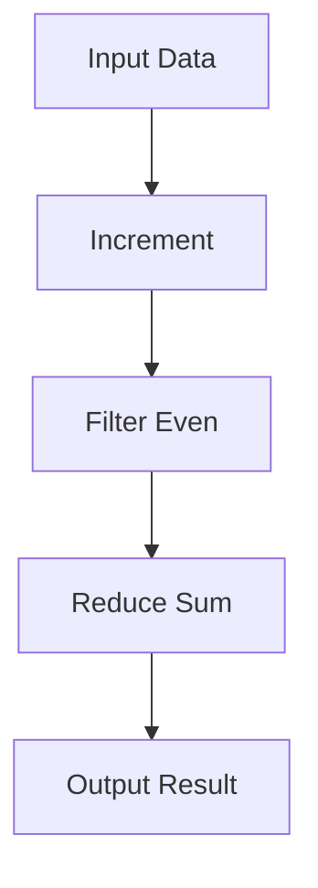

## 16.10.1 Designing for Asynchrony

Designing asynchronous systems is a critical skill for developers transitioning from Java to Clojure. Asynchronous programming allows applications to handle multiple tasks concurrently, improving responsiveness and resource utilization. In this section, we'll explore best practices for designing asynchronous systems in Clojure, focusing on maintaining purity in functions, designing robust APIs, and managing data flow effectively.

### Understanding Asynchrony in Clojure

Asynchrony in Clojure is primarily facilitated through the `core.async` library, which provides a set of abstractions for asynchronous programming, including channels, go blocks, and thread management. These abstractions allow developers to write non-blocking code that can handle concurrent tasks efficiently.

#### Key Concepts

- **Channels**: Used for communication between different parts of a program, allowing data to be passed asynchronously.
- **Go Blocks**: Lightweight threads that enable asynchronous execution of code.
- **Thread Management**: Handling the execution of tasks across multiple threads without blocking the main application flow.

### Pure Functions and Asynchrony

One of the core principles of functional programming is the use of pure functions. Pure functions are deterministic and side-effect-free, making them easier to test and reason about. In asynchronous systems, maintaining purity can help ensure that concurrent tasks do not interfere with each other.

#### Benefits of Pure Functions

- **Predictability**: Pure functions always produce the same output for the same input, reducing the complexity of debugging asynchronous code.
- **Testability**: Since pure functions have no side effects, they can be tested in isolation, simplifying the testing process.
- **Concurrency**: Pure functions can be executed concurrently without risk of data corruption, as they do not modify shared state.

### Designing APIs for Asynchronous Systems

When designing APIs for asynchronous systems, it's essential to consider how data will flow through the system and how different components will interact. A well-designed API can simplify the integration of asynchronous components and improve the overall robustness of the system.

#### Key Considerations

- **Consistency**: Ensure that APIs provide a consistent interface for asynchronous operations, making it easier for developers to understand and use them.
- **Error Handling**: Design APIs to handle errors gracefully, providing meaningful feedback to users and developers.
- **Data Flow**: Clearly define how data will be passed between components, using channels and other asynchronous constructs to facilitate communication.

### Managing Data Flow in Asynchronous Systems

Effective data flow management is crucial in asynchronous systems, where data may be processed by multiple components concurrently. By carefully designing the flow of data, developers can ensure that the system remains responsive and efficient.

#### Techniques for Managing Data Flow

- **Channels**: Use channels to pass data between components asynchronously, allowing for non-blocking communication.
- **Pipelines**: Implement data processing pipelines to handle complex transformations and aggregations in a structured manner.
- **Backpressure**: Implement backpressure mechanisms to prevent data overload and ensure that components can handle the incoming data rate.

### Code Examples

Let's explore some code examples to illustrate these concepts in Clojure.

#### Example 1: Using Channels for Asynchronous Communication

```clojure
(require '[clojure.core.async :as async])

(defn async-task [input]
  (async/go
    (let [result (+ input 10)]
      (println "Processed result:" result)
      result)))

(defn main []
  (let [ch (async/chan)]
    (async/go
      (async/>! ch (async-task 5)))
    (async/go
      (let [result (async/<! ch)]
        (println "Received result:" result)))))

(main)
```

*Comments:*
- We define an asynchronous task using `async/go`, which processes an input and returns a result.
- A channel `ch` is created to facilitate communication between tasks.
- The main function sends a task to the channel and retrieves the result asynchronously.

#### Example 2: Implementing a Data Processing Pipeline

```clojure
(defn process-data [data]
  (->> data
       (map inc)
       (filter even?)
       (reduce +)))

(defn async-pipeline [input]
  (async/go
    (let [result (process-data input)]
      (println "Pipeline result:" result)
      result)))

(defn main-pipeline []
  (let [ch (async/chan)]
    (async/go
      (async/>! ch (async-pipeline [1 2 3 4 5])))
    (async/go
      (let [result (async/<! ch)]
        (println "Final result:" result)))))

(main-pipeline)
```

*Comments:*
- We define a data processing function `process-data` that increments, filters, and reduces a collection.
- The `async-pipeline` function processes data asynchronously using a channel.
- The main function demonstrates how to use the pipeline in an asynchronous context.

### Diagrams and Visualizations

Below is a diagram illustrating the flow of data through an asynchronous pipeline in Clojure.



*Caption:* This diagram shows the flow of data through a processing pipeline, where data is incremented, filtered, and reduced to produce a final result.

### Comparing with Java

In Java, asynchronous programming is often achieved using threads, futures, and the `CompletableFuture` API. While these constructs provide powerful tools for concurrency, they can be more complex to manage compared to Clojure's `core.async`.

#### Java Example: Using CompletableFuture

```java
import java.util.concurrent.CompletableFuture;

public class AsyncExample {
    public static void main(String[] args) {
        CompletableFuture<Integer> future = CompletableFuture.supplyAsync(() -> {
            int result = 5 + 10;
            System.out.println("Processed result: " + result);
            return result;
        });

        future.thenAccept(result -> System.out.println("Received result: " + result));
    }
}
```

*Comments:*
- We use `CompletableFuture` to perform an asynchronous computation.
- The `supplyAsync` method executes a task asynchronously, and `thenAccept` handles the result.

### Try It Yourself

Experiment with the Clojure examples by modifying the input data or processing functions. Try adding additional transformations or error handling to see how the system behaves.

### Exercises

1. Modify the `async-task` function to perform a different computation, such as multiplying the input by a factor.
2. Implement error handling in the `async-pipeline` function to manage potential exceptions during data processing.
3. Create a new data processing pipeline that includes additional transformations, such as sorting or grouping data.

### Summary and Key Takeaways

- **Pure Functions**: Use pure functions to simplify testing and reasoning about asynchronous code.
- **API Design**: Design APIs that provide consistent interfaces and handle errors gracefully.
- **Data Flow**: Manage data flow using channels, pipelines, and backpressure mechanisms to ensure system responsiveness.

By following these best practices, you can design robust and efficient asynchronous systems in Clojure that leverage the power of functional programming and concurrency.

### Further Reading

- [Official Clojure Documentation](https://clojure.org/reference/documentation)
- [ClojureDocs](https://clojuredocs.org/)
- [core.async GitHub Repository](https://github.com/clojure/core.async)

## Quiz: Mastering Asynchronous Design in Clojure



### What is a key benefit of using pure functions in asynchronous programming?

- [x] Predictability
- [ ] Complexity
- [ ] Side effects
- [ ] State mutation

> **Explanation:** Pure functions are predictable as they always produce the same output for the same input, which simplifies debugging and testing in asynchronous systems.

### Which Clojure construct is used for non-blocking communication between tasks?

- [x] Channels
- [ ] Threads
- [ ] Atoms
- [ ] Vars

> **Explanation:** Channels in Clojure's `core.async` library are used for non-blocking communication between different parts of a program.

### What is the purpose of go blocks in Clojure?

- [x] To enable asynchronous execution of code
- [ ] To manage state
- [ ] To handle errors
- [ ] To create threads

> **Explanation:** Go blocks in Clojure allow for asynchronous execution of code, enabling concurrent task management.

### How does Clojure's approach to asynchrony differ from Java's?

- [x] Clojure uses channels and go blocks, while Java uses threads and futures.
- [ ] Clojure uses threads, while Java uses channels.
- [ ] Both use the same constructs.
- [ ] Clojure does not support asynchrony.

> **Explanation:** Clojure uses channels and go blocks for asynchrony, whereas Java typically uses threads and futures.

### What is a common technique for managing data flow in asynchronous systems?

- [x] Pipelines
- [ ] Loops
- [ ] Recursion
- [ ] Synchronization

> **Explanation:** Pipelines are a common technique for managing data flow in asynchronous systems, allowing for structured data processing.

### Which of the following is a benefit of designing APIs with consistent interfaces?

- [x] Easier integration
- [ ] Increased complexity
- [ ] More errors
- [ ] Less documentation

> **Explanation:** Consistent interfaces make it easier for developers to understand and integrate APIs into their systems.

### What is backpressure used for in asynchronous systems?

- [x] To prevent data overload
- [ ] To increase data flow
- [ ] To reduce latency
- [ ] To enhance security

> **Explanation:** Backpressure is used to prevent data overload by controlling the rate at which data is processed.

### Which Java construct is similar to Clojure's go blocks?

- [x] CompletableFuture
- [ ] Threads
- [ ] Executors
- [ ] Streams

> **Explanation:** CompletableFuture in Java provides a similar asynchronous execution model to Clojure's go blocks.

### What is a key consideration when designing asynchronous APIs?

- [x] Error handling
- [ ] Code duplication
- [ ] Global state
- [ ] Synchronous execution

> **Explanation:** Error handling is crucial in asynchronous APIs to provide meaningful feedback and ensure system robustness.

### True or False: Pure functions can be executed concurrently without risk of data corruption.

- [x] True
- [ ] False

> **Explanation:** Pure functions do not modify shared state, allowing them to be executed concurrently without risk of data corruption.


