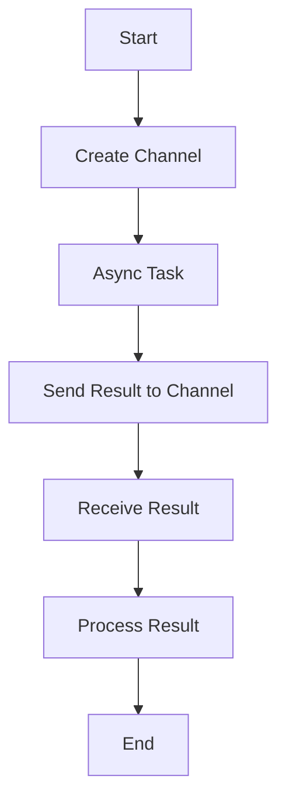

## 16.10.2 Managing Complexity in Asynchronous Programming

Asynchronous programming can significantly enhance the performance and responsiveness of applications by allowing multiple operations to proceed concurrently. However, it also introduces complexity, which can make code difficult to read, maintain, and debug. In this section, we'll explore strategies for managing this complexity in Clojure, focusing on code readability, proper abstraction, and modularization. We'll draw parallels with Java to help you leverage your existing knowledge as you transition to Clojure.

### Understanding Asynchronous Complexity

Asynchronous programming involves executing tasks independently of the main program flow, often using constructs like callbacks, promises, or futures. This can lead to complex control flows, making it challenging to understand the sequence of operations and manage shared state.

#### Key Challenges

- **Control Flow**: Unlike synchronous code, where execution follows a straightforward path, asynchronous code can jump between different contexts, making it harder to trace.
- **State Management**: Managing shared state across asynchronous tasks can lead to race conditions and data inconsistencies.
- **Error Handling**: Errors in asynchronous code can be difficult to catch and propagate, leading to silent failures.

### Strategies for Managing Complexity

To manage the complexity of asynchronous code, we can employ several strategies:

1. **Code Readability**: Write clear, concise code that is easy to understand.
2. **Proper Abstraction**: Use abstractions to hide complexity and expose simple interfaces.
3. **Modularization**: Break down code into smaller, manageable pieces.

Let's delve into each of these strategies with examples and comparisons to Java.

### Code Readability

Readable code is easier to maintain and debug. In Clojure, we can enhance readability by using idiomatic constructs and avoiding deeply nested expressions.

#### Use of Idiomatic Constructs

Clojure provides several constructs that can simplify asynchronous programming. For example, `core.async` channels can be used to manage communication between concurrent tasks.

```clojure
(require '[clojure.core.async :as async])

(defn async-task [ch]
  (async/go
    (let [result (do-some-work)]
      (async/>! ch result))))

(defn process-results []
  (let [ch (async/chan)]
    (async-task ch)
    (async/go
      (let [result (async/<! ch)]
        (println "Result:" result)))))
```

**Explanation**: In this example, we use `core.async` to manage asynchronous tasks. The `async/go` block allows us to write asynchronous code in a synchronous style, improving readability.

#### Avoiding Deep Nesting

Deeply nested code can be difficult to follow. Instead, use functions to encapsulate logic and reduce nesting.

```clojure
(defn handle-result [result]
  (println "Processed result:" result))

(defn process-results []
  (let [ch (async/chan)]
    (async-task ch)
    (async/go
      (let [result (async/<! ch)]
        (handle-result result)))))
```

**Explanation**: By extracting the result handling logic into a separate function, we reduce the complexity of the `process-results` function.

### Proper Abstraction

Abstraction helps manage complexity by hiding implementation details and exposing simple interfaces.

#### Using Higher-Order Functions

Higher-order functions can abstract common patterns in asynchronous code, making it more reusable and easier to understand.

```clojure
(defn async-map [f coll]
  (let [ch (async/chan)]
    (doseq [item coll]
      (async/go
        (async/>! ch (f item))))
    ch))

(defn process-collection []
  (let [ch (async-map inc [1 2 3])]
    (async/go-loop []
      (when-let [result (async/<! ch)]
        (println "Processed:" result)
        (recur)))))
```

**Explanation**: The `async-map` function abstracts the pattern of applying a function to each item in a collection asynchronously. This abstraction simplifies the `process-collection` function.

#### Encapsulating State

Encapsulating state in abstractions like atoms or refs can help manage shared state across asynchronous tasks.

```clojure
(def state (atom {}))

(defn update-state [key value]
  (swap! state assoc key value))

(defn async-update [key value]
  (async/go
    (update-state key value)))
```

**Explanation**: By encapsulating state updates in a function, we can manage state changes consistently across asynchronous tasks.

### Modularization

Modularization involves breaking down code into smaller, independent modules. This makes it easier to understand, test, and maintain.

#### Breaking Down Tasks

Divide complex tasks into smaller, independent functions or modules.

```clojure
(defn fetch-data []
  ;; Simulate data fetching
  (Thread/sleep 1000)
  {:data "Sample data"})

(defn process-data [data]
  (println "Processing data:" data))

(defn async-fetch-and-process []
  (async/go
    (let [data (fetch-data)]
      (process-data data))))
```

**Explanation**: By separating data fetching and processing into distinct functions, we simplify the `async-fetch-and-process` function.

#### Using Namespaces

Organize code into namespaces to separate concerns and improve modularity.

```clojure
(ns myapp.async
  (:require [clojure.core.async :as async]))

(defn async-task [ch]
  (async/go
    (let [result (do-some-work)]
      (async/>! ch result))))
```

**Explanation**: By organizing code into namespaces, we can manage dependencies and separate concerns more effectively.

### Comparing with Java

In Java, managing asynchronous complexity often involves using threads, executors, or frameworks like CompletableFuture. Let's compare some Clojure and Java examples.

#### Java Example: CompletableFuture

```java
import java.util.concurrent.CompletableFuture;

public class AsyncExample {
    public static void main(String[] args) {
        CompletableFuture.supplyAsync(() -> doSomeWork())
            .thenAccept(result -> System.out.println("Result: " + result));
    }

    private static String doSomeWork() {
        // Simulate work
        return "Sample result";
    }
}
```

**Explanation**: Java's `CompletableFuture` provides a way to handle asynchronous tasks, but it can become complex with nested callbacks.

#### Clojure Example: core.async

```clojure
(require '[clojure.core.async :as async])

(defn async-task []
  (async/go
    (let [result (do-some-work)]
      (println "Result:" result))))

(async-task)
```

**Explanation**: Clojure's `core.async` allows us to write asynchronous code in a more linear and readable style, reducing complexity.

### Try It Yourself

Experiment with the provided Clojure code examples by:

- Modifying the `async-task` function to perform different operations.
- Adding error handling to manage exceptions in asynchronous tasks.
- Creating a new abstraction for a common asynchronous pattern in your code.

### Diagrams and Visualizations

To better understand the flow of data and control in asynchronous Clojure code, let's use some diagrams.



**Diagram Explanation**: This flowchart illustrates the flow of data in an asynchronous task using `core.async`. The task sends a result to a channel, which is then received and processed.

### Exercises

1. **Refactor the Code**: Take a piece of complex asynchronous code and refactor it using the strategies discussed. Focus on improving readability and modularity.
2. **Create a New Abstraction**: Identify a common pattern in your asynchronous code and create a higher-order function to abstract it.
3. **Implement Error Handling**: Add error handling to an asynchronous task using `try-catch` blocks or error channels.

### Key Takeaways

- **Readability**: Write clear, concise code using idiomatic constructs and avoid deep nesting.
- **Abstraction**: Use higher-order functions and encapsulate state to manage complexity.
- **Modularization**: Break down tasks into smaller modules and organize code into namespaces.
- **Comparison with Java**: Clojure's `core.async` provides a more readable and manageable approach to asynchronous programming compared to Java's `CompletableFuture`.

By applying these strategies, you can effectively manage the complexity of asynchronous programming in Clojure, leading to more maintainable and robust applications.

### Further Reading

- [Clojure Official Documentation](https://clojure.org/)
- [ClojureDocs](https://clojuredocs.org/)
- [core.async GitHub Repository](https://github.com/clojure/core.async)

Now that we've explored how to manage complexity in asynchronous Clojure code, let's apply these concepts to build more efficient and maintainable applications.

## Quiz: Mastering Complexity in Asynchronous Clojure Programming



### What is a key challenge of asynchronous programming?

- [x] Control flow complexity
- [ ] Synchronous execution
- [ ] Lack of concurrency
- [ ] Simplified error handling

> **Explanation:** Asynchronous programming introduces complexity in control flow, making it harder to trace the sequence of operations.

### How can Clojure's `core.async` improve code readability?

- [x] By allowing asynchronous code to be written in a synchronous style
- [ ] By eliminating the need for channels
- [ ] By using only synchronous constructs
- [ ] By avoiding the use of functions

> **Explanation:** `core.async` allows asynchronous code to be written in a synchronous style using `go` blocks, improving readability.

### What is the benefit of using higher-order functions in asynchronous code?

- [x] They abstract common patterns, making code more reusable
- [ ] They increase code complexity
- [ ] They eliminate the need for channels
- [ ] They make code synchronous

> **Explanation:** Higher-order functions abstract common patterns, making asynchronous code more reusable and easier to understand.

### Why is modularization important in managing asynchronous complexity?

- [x] It breaks down code into smaller, manageable pieces
- [ ] It increases code size
- [ ] It reduces the need for functions
- [ ] It makes code synchronous

> **Explanation:** Modularization involves breaking down code into smaller, independent modules, making it easier to understand, test, and maintain.

### What is a key difference between Java's `CompletableFuture` and Clojure's `core.async`?

- [x] `core.async` provides a more linear and readable style
- [ ] `CompletableFuture` is more readable
- [ ] `core.async` is synchronous
- [ ] `CompletableFuture` uses channels

> **Explanation:** Clojure's `core.async` allows for a more linear and readable style of asynchronous programming compared to Java's `CompletableFuture`.

### How can encapsulating state help manage asynchronous complexity?

- [x] By providing consistent state management across tasks
- [ ] By eliminating the need for state
- [ ] By increasing state complexity
- [ ] By making state mutable

> **Explanation:** Encapsulating state in abstractions like atoms or refs provides consistent state management across asynchronous tasks.

### What is the purpose of using namespaces in Clojure?

- [x] To organize code and separate concerns
- [ ] To increase code complexity
- [ ] To eliminate the need for functions
- [ ] To make code synchronous

> **Explanation:** Namespaces help organize code and separate concerns, improving modularity and manageability.

### How can error handling be implemented in asynchronous Clojure code?

- [x] Using `try-catch` blocks or error channels
- [ ] By ignoring errors
- [ ] By making code synchronous
- [ ] By eliminating functions

> **Explanation:** Error handling in asynchronous Clojure code can be implemented using `try-catch` blocks or error channels to manage exceptions.

### What is a benefit of avoiding deep nesting in code?

- [x] It improves code readability
- [ ] It increases code complexity
- [ ] It eliminates the need for functions
- [ ] It makes code synchronous

> **Explanation:** Avoiding deep nesting improves code readability by making it easier to follow the logic and structure.

### True or False: Modularization reduces the need for functions in asynchronous programming.

- [ ] True
- [x] False

> **Explanation:** Modularization involves breaking down code into smaller, independent modules, which often involves creating more functions, not fewer.


