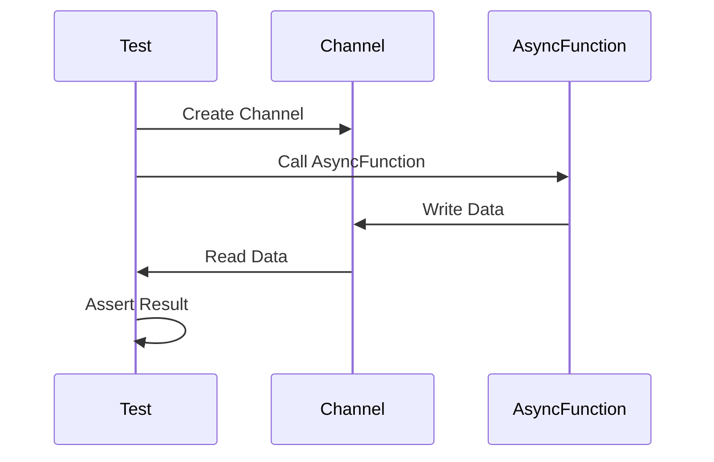

## 16.10.3 Testing Asynchronous Code

Asynchronous programming is a powerful paradigm that allows applications to perform tasks concurrently, improving responsiveness and resource utilization. However, testing asynchronous code can be challenging due to its non-deterministic nature. In this section, we'll explore techniques for effectively testing asynchronous code in Clojure, leveraging your existing Java knowledge to ease the transition.

### Understanding Asynchronous Code Testing

Testing asynchronous code involves verifying that concurrent operations complete successfully and produce the expected results. Unlike synchronous code, where operations execute in a predictable sequence, asynchronous code can execute in any order, making it crucial to account for timing and concurrency issues in tests.

#### Key Challenges in Testing Asynchronous Code

1. **Non-Determinism**: Asynchronous operations may complete in different orders across test runs.
2. **Timing Issues**: Tests must account for delays and ensure operations complete within expected timeframes.
3. **State Management**: Shared state can lead to race conditions and inconsistent test results.
4. **External Dependencies**: Asynchronous code often interacts with external systems, requiring mocks or stubs for isolation.

### Setting Up Your Testing Environment

Before diving into testing techniques, ensure your development environment is set up for testing asynchronous Clojure code. You'll need a Clojure testing library, such as `clojure.test`, and an async testing library like `core.async` or `manifold`.

#### Installing Necessary Libraries

Add the following dependencies to your `project.clj` or `deps.edn` file:

```clojure
;; project.clj
:dependencies [[org.clojure/clojure "1.10.3"]
               [org.clojure/core.async "1.3.618"]
               [manifold "0.1.9"]]

;; deps.edn
{:deps {org.clojure/clojure {:mvn/version "1.10.3"}
        org.clojure/core.async {:mvn/version "1.3.618"}
        manifold {:mvn/version "0.1.9"}}}
```

### Writing Unit Tests for Asynchronous Code

Unit tests for asynchronous code should verify that async operations complete successfully and produce the expected results. We'll explore using `clojure.test` with `core.async` to write effective tests.

#### Basic Asynchronous Test Example

Let's start with a simple example using `core.async` to test an asynchronous function that fetches data from a channel.

```clojure
(ns async-test.core
  (:require [clojure.test :refer :all]
            [clojure.core.async :refer [go chan >! <!]]))

(defn async-fetch [ch]
  (go
    (<! (timeout 100)) ;; Simulate delay
    (>! ch "data")))

(deftest test-async-fetch
  (let [ch (chan)]
    (async-fetch ch)
    (is (= "data" (<!! ch))))) ;; Use <!! to block until result is available
```

**Explanation**:
- We define an `async-fetch` function that writes "data" to a channel after a delay.
- The test `test-async-fetch` creates a channel, invokes `async-fetch`, and asserts that the channel receives "data".

#### Handling Timeouts

Asynchronous operations may not complete within expected timeframes, leading to test failures. Use timeouts to handle such scenarios.

```clojure
(deftest test-async-fetch-with-timeout
  (let [ch (chan)]
    (async-fetch ch)
    (is (= "data" (alt!! [ch] ([v] v)
                         (timeout 200) :timeout))))) ;; Use alt!! for timeout
```

**Explanation**:
- `alt!!` waits for the first result from multiple channels, allowing us to specify a timeout channel.

### Using Mocks and Stubs for External Dependencies

Asynchronous code often interacts with external systems, such as databases or APIs. Use mocks or stubs to isolate tests from these dependencies.

#### Creating a Mock Service

Suppose we have an asynchronous function that fetches user data from an external API. We'll create a mock service to simulate the API.

```clojure
(defn mock-user-service [ch]
  (go
    (<! (timeout 50)) ;; Simulate API delay
    (>! ch {:id 1 :name "Alice"})))

(deftest test-user-fetch
  (let [ch (chan)]
    (mock-user-service ch)
    (is (= {:id 1 :name "Alice"} (<!! ch)))))
```

**Explanation**:
- `mock-user-service` simulates an API call by writing a user map to a channel after a delay.
- The test `test-user-fetch` verifies that the channel receives the expected user data.

### Advanced Testing Techniques

For more complex asynchronous code, consider using advanced techniques such as property-based testing and integration tests.

#### Property-Based Testing

Property-based testing verifies that code behaves correctly for a wide range of inputs. Use `test.check` to generate random inputs and test properties of asynchronous functions.

```clojure
(ns async-test.property
  (:require [clojure.test.check :refer [quick-check]]
            [clojure.test.check.generators :as gen]
            [clojure.test.check.properties :as prop]))

(defn async-add [a b ch]
  (go
    (<! (timeout 10))
    (>! ch (+ a b))))

(def add-property
  (prop/for-all [a gen/int
                 b gen/int]
    (let [ch (chan)]
      (async-add a b ch)
      (= (+ a b) (<!! ch)))))

(deftest test-async-add-property
  (is (quick-check 100 add-property)))
```

**Explanation**:
- `async-add` is an asynchronous function that adds two numbers and writes the result to a channel.
- `add-property` defines a property that checks if `async-add` produces the correct sum for random integers.
- `quick-check` runs the property test with 100 random inputs.

### Comparing Clojure and Java Asynchronous Testing

Java developers may be familiar with testing asynchronous code using frameworks like JUnit and Mockito. Let's compare these approaches with Clojure's testing techniques.

#### Java Example: Testing Asynchronous Code with CompletableFuture

```java
import org.junit.jupiter.api.Test;
import java.util.concurrent.CompletableFuture;
import static org.junit.jupiter.api.Assertions.assertEquals;

public class AsyncTest {
    @Test
    public void testAsyncFetch() throws Exception {
        CompletableFuture<String> future = CompletableFuture.supplyAsync(() -> {
            try {
                Thread.sleep(100);
            } catch (InterruptedException e) {
                throw new IllegalStateException(e);
            }
            return "data";
        });

        assertEquals("data", future.get());
    }
}
```

**Comparison**:
- **Clojure**: Uses channels and `go` blocks for asynchronous operations, with `alt!!` for timeouts.
- **Java**: Uses `CompletableFuture` for asynchronous operations, with `get()` to block until completion.

### Try It Yourself

Experiment with the provided Clojure examples by modifying the delay times or channel values. Try creating a more complex asynchronous function that involves multiple channels and see how you can test it effectively.

### Diagrams and Visual Aids

To better understand the flow of data in asynchronous code, consider the following sequence diagram illustrating the interaction between asynchronous functions and channels.



**Diagram Explanation**:
- The sequence diagram shows the interaction between the test, the channel, and the asynchronous function, highlighting the flow of data.

### Exercises and Practice Problems

1. **Exercise 1**: Modify the `async-fetch` function to introduce a random delay and update the test to handle this variability.
2. **Exercise 2**: Create a mock service that simulates a failure and write a test to verify that your code handles the failure gracefully.
3. **Exercise 3**: Implement a property-based test for an asynchronous function that processes a collection of data.

### Summary and Key Takeaways

- Testing asynchronous code in Clojure involves handling non-determinism, timing issues, and external dependencies.
- Use `core.async` and `manifold` for writing and testing asynchronous functions.
- Leverage timeouts and mocks to isolate tests from external systems.
- Property-based testing can help verify code correctness for a wide range of inputs.
- Compare and contrast Clojure's testing techniques with Java's to leverage your existing knowledge.

By mastering these techniques, you'll be well-equipped to test asynchronous code effectively in Clojure, ensuring your applications are robust and reliable.

---

## Quiz: Mastering Asynchronous Code Testing in Clojure



### Which library is commonly used in Clojure for asynchronous programming?

- [x] core.async
- [ ] JUnit
- [ ] Mockito
- [ ] Spring

> **Explanation:** `core.async` is a Clojure library for asynchronous programming, providing tools like channels and go blocks.

### What is the purpose of using `alt!!` in Clojure tests?

- [x] To handle timeouts in asynchronous operations
- [ ] To create channels
- [ ] To block until a result is available
- [ ] To simulate API calls

> **Explanation:** `alt!!` is used to handle timeouts by waiting for the first result from multiple channels, including a timeout channel.

### How can you simulate an external API call in a test?

- [x] By creating a mock service that writes to a channel
- [ ] By using `CompletableFuture`
- [ ] By blocking the main thread
- [ ] By using `Thread.sleep()`

> **Explanation:** Creating a mock service that writes to a channel simulates an external API call, allowing tests to verify expected behavior.

### What is a key challenge in testing asynchronous code?

- [x] Non-determinism
- [ ] Lack of libraries
- [ ] Excessive memory usage
- [ ] Slow execution

> **Explanation:** Non-determinism is a key challenge in testing asynchronous code, as operations may complete in different orders.

### Which testing technique verifies code behavior for a wide range of inputs?

- [x] Property-based testing
- [ ] Unit testing
- [ ] Integration testing
- [ ] System testing

> **Explanation:** Property-based testing verifies code behavior for a wide range of inputs by generating random test cases.

### What is the equivalent of `core.async` in Java for asynchronous programming?

- [x] CompletableFuture
- [ ] FutureTask
- [ ] ThreadPoolExecutor
- [ ] Callable

> **Explanation:** `CompletableFuture` is a Java class for asynchronous programming, similar to `core.async` in Clojure.

### How do you block until a result is available in Clojure?

- [x] Using `<!!`
- [ ] Using `Thread.sleep()`
- [ ] Using `get()`
- [ ] Using `await()`

> **Explanation:** `<!!` is used in Clojure to block until a result is available from a channel.

### What is a benefit of using mocks in tests?

- [x] Isolating tests from external dependencies
- [ ] Increasing code complexity
- [ ] Reducing test coverage
- [ ] Slowing down test execution

> **Explanation:** Mocks isolate tests from external dependencies, ensuring tests focus on the code being tested.

### Which Clojure library is used for property-based testing?

- [x] test.check
- [ ] clojure.test
- [ ] manifold
- [ ] core.async

> **Explanation:** `test.check` is a Clojure library for property-based testing, generating random inputs to verify code behavior.

### True or False: Asynchronous code testing in Clojure is identical to Java.

- [ ] True
- [x] False

> **Explanation:** Asynchronous code testing in Clojure differs from Java, with unique libraries and techniques like `core.async` and channels.


