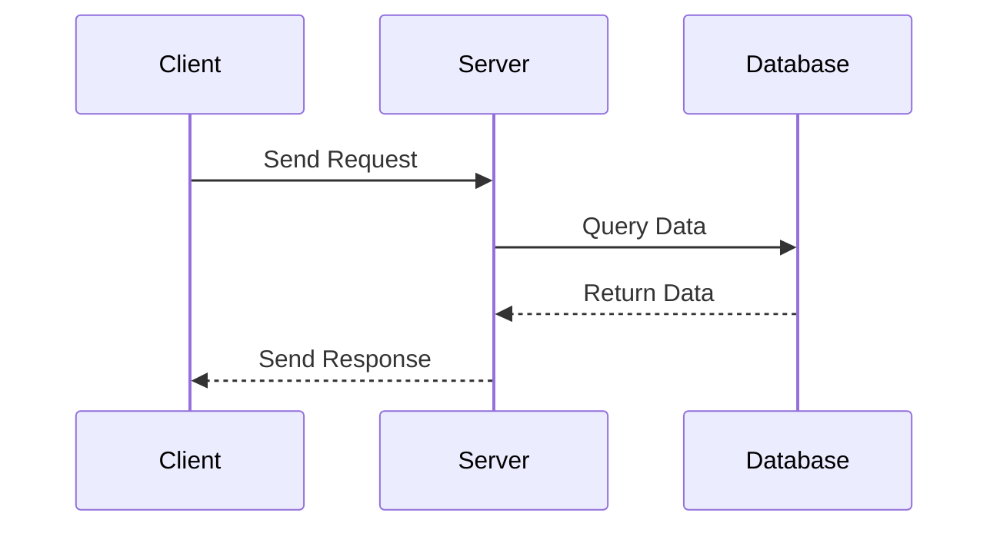

## 16.10.4 Debugging Asynchronous Systems

Debugging asynchronous systems can be challenging, especially for developers transitioning from Java to Clojure. Asynchronous programming introduces complexities such as race conditions, deadlocks, and non-deterministic behavior, which can be difficult to diagnose and resolve. In this section, we'll explore effective strategies for debugging asynchronous applications in Clojure, leveraging logging, visualization tools, and tracing techniques to follow the flow of asynchronous events.

### Understanding Asynchronous Systems

Before diving into debugging techniques, it's essential to understand the nature of asynchronous systems. In asynchronous programming, tasks are executed independently of the main program flow, allowing for non-blocking operations and improved performance. This is particularly beneficial in I/O-bound applications, where waiting for external resources can be a bottleneck.

**Key Concepts:**
- **Concurrency vs. Parallelism:** Concurrency involves managing multiple tasks at once, while parallelism involves executing multiple tasks simultaneously. Asynchronous programming often deals with concurrency.
- **Non-blocking Operations:** Asynchronous systems use non-blocking operations to avoid waiting for tasks to complete, improving responsiveness.
- **Event-driven Architecture:** Asynchronous systems often follow an event-driven architecture, where events trigger specific actions.

### Common Challenges in Debugging Asynchronous Systems

Debugging asynchronous systems presents unique challenges compared to synchronous systems:

1. **Race Conditions:** Occur when multiple threads access shared resources concurrently, leading to unpredictable behavior.
2. **Deadlocks:** Happen when two or more threads wait indefinitely for resources held by each other.
3. **Non-deterministic Behavior:** Asynchronous systems can exhibit different behavior on each run due to varying execution order.
4. **Complex Control Flow:** The flow of execution in asynchronous systems can be difficult to trace, making it hard to identify the source of issues.

### Effective Debugging Strategies

#### 1. Logging

Logging is a fundamental technique for debugging asynchronous systems. It provides insights into the application's behavior and helps identify issues.

- **Structured Logging:** Use structured logging to capture detailed information about asynchronous events. This includes timestamps, thread IDs, and contextual data.
- **Log Levels:** Utilize different log levels (e.g., DEBUG, INFO, WARN, ERROR) to filter relevant information.
- **Correlation IDs:** Implement correlation IDs to trace related events across distributed systems.

**Clojure Example:**

```clojure
(require '[clojure.tools.logging :as log])

(defn async-task [task-id]
  (log/info "Starting async task" {:task-id task-id})
  ;; Simulate asynchronous work
  (Thread/sleep 1000)
  (log/info "Completed async task" {:task-id task-id}))

;; Execute tasks
(doseq [id (range 5)]
  (future (async-task id)))
```

In this example, we use the `clojure.tools.logging` library to log the start and completion of asynchronous tasks. Each task is executed in a separate thread using `future`, and logs include a task ID for correlation.

#### 2. Visualization Tools

Visualization tools help developers understand the flow of asynchronous events and identify bottlenecks or issues.

- **Sequence Diagrams:** Use sequence diagrams to visualize the interactions between components in an asynchronous system.
- **Flowcharts:** Create flowcharts to map out the control flow and decision points in your application.

**Mermaid.js Sequence Diagram:**



This sequence diagram illustrates the interaction between a client, server, and database in an asynchronous system. It helps visualize the flow of requests and responses.

#### 3. Tracing

Tracing involves tracking the execution of asynchronous tasks to identify performance bottlenecks and issues.

- **Distributed Tracing:** Use distributed tracing to follow requests across multiple services in a microservices architecture.
- **Span and Trace IDs:** Implement span and trace IDs to correlate events and measure latency.

**Clojure Example with OpenTelemetry:**

```clojure
(require '[opentelemetry.api.trace :as otel])

(defn traced-task [task-id]
  (otel/with-span [span (otel/span "async-task" {:task-id task-id})]
    ;; Simulate asynchronous work
    (Thread/sleep 1000)
    (otel/add-event span "Task completed")))

;; Execute tasks
(doseq [id (range 5)]
  (future (traced-task id)))
```

In this example, we use OpenTelemetry to trace asynchronous tasks. Each task is wrapped in a span, and events are added to capture task completion.

#### 4. Debugging Tools

Utilize debugging tools to inspect the state of asynchronous systems and identify issues.

- **REPL Debugging:** Use the Clojure REPL to interactively debug asynchronous code. This allows you to evaluate expressions and inspect state.
- **Breakpoints:** Set breakpoints in your code to pause execution and examine variables.

**Try It Yourself:**

Experiment with the provided Clojure examples by modifying the task duration or adding additional logging statements. Observe how changes affect the flow of asynchronous events.

### Comparing Debugging in Java and Clojure

Java developers transitioning to Clojure may find differences in debugging asynchronous systems:

- **Java's CompletableFuture:** Java's `CompletableFuture` provides a structured way to handle asynchronous tasks, with methods for chaining and combining futures.
- **Clojure's core.async:** Clojure's `core.async` library offers channels and go blocks for managing asynchronous workflows.

**Java Example with CompletableFuture:**

```java
import java.util.concurrent.CompletableFuture;

public class AsyncExample {
    public static void main(String[] args) {
        CompletableFuture<Void> future = CompletableFuture.runAsync(() -> {
            System.out.println("Running async task");
            try {
                Thread.sleep(1000);
            } catch (InterruptedException e) {
                e.printStackTrace();
            }
            System.out.println("Completed async task");
        });

        future.join();
    }
}
```

**Clojure Example with core.async:**

```clojure
(require '[clojure.core.async :refer [go <!]])

(defn async-task []
  (go
    (println "Running async task")
    (<! (timeout 1000))
    (println "Completed async task")))

;; Execute task
(async-task)
```

In these examples, both Java and Clojure handle asynchronous tasks, but Clojure's `core.async` provides a more concise and expressive syntax.

### Exercises and Practice Problems

1. **Exercise 1:** Modify the Clojure logging example to include additional contextual information, such as thread IDs and timestamps. Analyze the logs to understand the flow of asynchronous events.

2. **Exercise 2:** Create a sequence diagram for a simple asynchronous system, such as a chat application. Use the diagram to identify potential bottlenecks or race conditions.

3. **Exercise 3:** Implement distributed tracing in a Clojure application using OpenTelemetry. Track the flow of requests across multiple services and analyze the trace data.

### Key Takeaways

- Debugging asynchronous systems requires a combination of logging, visualization, and tracing techniques.
- Clojure's functional programming paradigm offers unique advantages for managing asynchronous workflows.
- Visualization tools, such as sequence diagrams, help developers understand complex control flows.
- Tracing provides insights into performance bottlenecks and helps identify issues in distributed systems.
- Java developers can leverage their existing knowledge of asynchronous programming while embracing Clojure's expressive syntax and powerful concurrency primitives.

Now that we've explored debugging techniques for asynchronous systems in Clojure, let's apply these concepts to enhance the reliability and performance of your applications.

### Further Reading

- [Clojure Official Documentation](https://clojure.org/reference/documentation)
- [ClojureDocs](https://clojuredocs.org/)
- [OpenTelemetry for Clojure](https://github.com/open-telemetry/opentelemetry-java-instrumentation)

---

## Quiz: Mastering Debugging Techniques for Asynchronous Systems in Clojure



### What is a common challenge in debugging asynchronous systems?

- [x] Race conditions
- [ ] Synchronous execution
- [ ] Deterministic behavior
- [ ] Simple control flow

> **Explanation:** Race conditions occur when multiple threads access shared resources concurrently, leading to unpredictable behavior in asynchronous systems.


### Which tool can be used for distributed tracing in Clojure?

- [x] OpenTelemetry
- [ ] Log4j
- [ ] JUnit
- [ ] Mockito

> **Explanation:** OpenTelemetry is a tool used for distributed tracing, allowing developers to track requests across multiple services.


### What is the purpose of using correlation IDs in logging?

- [x] To trace related events across distributed systems
- [ ] To increase log verbosity
- [ ] To reduce log size
- [ ] To anonymize user data

> **Explanation:** Correlation IDs help trace related events across distributed systems, making it easier to follow the flow of asynchronous events.


### Which Clojure library provides channels and go blocks for managing asynchronous workflows?

- [x] core.async
- [ ] clojure.test
- [ ] clojure.java.jdbc
- [ ] clojure.tools.logging

> **Explanation:** The `core.async` library provides channels and go blocks for managing asynchronous workflows in Clojure.


### What is a benefit of using sequence diagrams in debugging?

- [x] Visualizing interactions between components
- [ ] Reducing code complexity
- [ ] Increasing execution speed
- [ ] Simplifying data structures

> **Explanation:** Sequence diagrams help visualize interactions between components, making it easier to understand the flow of asynchronous events.


### How can you pause execution and examine variables in Clojure?

- [x] Set breakpoints
- [ ] Use println statements
- [ ] Increase log level
- [ ] Use a different IDE

> **Explanation:** Setting breakpoints allows developers to pause execution and examine variables, aiding in debugging.


### What is a key difference between Java's CompletableFuture and Clojure's core.async?

- [x] CompletableFuture provides a structured way to handle asynchronous tasks, while core.async offers channels and go blocks.
- [ ] CompletableFuture is used for synchronous programming, while core.async is for asynchronous programming.
- [ ] CompletableFuture is specific to Clojure, while core.async is specific to Java.
- [ ] CompletableFuture is a logging library, while core.async is a testing library.

> **Explanation:** CompletableFuture provides a structured way to handle asynchronous tasks, while core.async offers channels and go blocks for managing workflows.


### What is the role of structured logging in debugging asynchronous systems?

- [x] Capturing detailed information about asynchronous events
- [ ] Reducing log file size
- [ ] Anonymizing user data
- [ ] Simplifying code syntax

> **Explanation:** Structured logging captures detailed information about asynchronous events, aiding in debugging.


### Which of the following is a visualization tool for understanding asynchronous systems?

- [x] Sequence diagrams
- [ ] JUnit
- [ ] Mockito
- [ ] Log4j

> **Explanation:** Sequence diagrams are a visualization tool used to understand the interactions and flow of asynchronous systems.


### True or False: Non-blocking operations improve responsiveness in asynchronous systems.

- [x] True
- [ ] False

> **Explanation:** Non-blocking operations allow tasks to be executed independently, improving responsiveness in asynchronous systems.


