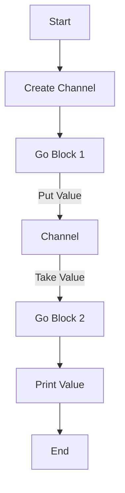

## 16.2.1 Introduction to core.async

Asynchronous programming is a crucial aspect of modern software development, allowing applications to perform tasks concurrently without blocking the main execution thread. In Clojure, `core.async` is a powerful library that facilitates asynchronous programming by providing a set of abstractions for managing concurrency. Inspired by Communicating Sequential Processes (CSP) and the Go language's channels and goroutines, `core.async` enables developers to write concurrent code that is both expressive and efficient.

### Understanding the Need for Asynchronous Programming

Before diving into `core.async`, let's briefly discuss why asynchronous programming is important. In traditional synchronous programming, tasks are executed sequentially, which can lead to inefficiencies, especially when dealing with I/O operations, network requests, or any task that involves waiting. Asynchronous programming allows these tasks to be executed concurrently, improving the responsiveness and throughput of applications.

In Java, asynchronous programming is often achieved using threads, the `ExecutorService`, or the `CompletableFuture` API. While these tools are powerful, they can also be complex and error-prone, especially when dealing with shared mutable state. Clojure's `core.async` provides a more functional approach to concurrency, leveraging immutable data structures and a simple, yet powerful, model for communication between concurrent tasks.

### Introducing core.async

`core.async` is a Clojure library that brings asynchronous programming capabilities to both Clojure and ClojureScript. It is inspired by CSP, a formal language for describing patterns of interaction in concurrent systems, and the Go language's channels and goroutines. At its core, `core.async` provides two main abstractions: **channels** and **go blocks**.

- **Channels**: Channels are queues that facilitate communication between different parts of a program. They allow data to be passed between concurrent tasks without shared mutable state.
- **Go Blocks**: Go blocks are lightweight threads that can perform asynchronous operations. They are similar to goroutines in Go and allow for non-blocking execution of code.

### Channels: The Backbone of core.async

Channels are a fundamental concept in `core.async`. They act as conduits for data, enabling communication between different parts of a program. Channels can be thought of as message queues that support both synchronous and asynchronous operations.

#### Creating and Using Channels

In `core.async`, channels are created using the `chan` function. Here's a simple example:

```clojure
(require '[clojure.core.async :refer [chan >!! <!!]])

;; Create a channel
(def my-channel (chan))

;; Put a value onto the channel
(>!! my-channel "Hello, core.async!")

;; Take a value from the channel
(println (<!! my-channel))  ;; Output: Hello, core.async!
```

In this example, we create a channel using `chan`, put a value onto the channel using `>!!`, and take a value from the channel using `<!!`. The `>!!` and `<!!` functions are blocking operations, meaning they will wait until the operation can be completed.

#### Non-blocking Operations

`core.async` also provides non-blocking operations for channels, which are useful in scenarios where you don't want to block the execution of your program. These operations are `>!` and `<!` for putting and taking values, respectively. However, they must be used within a go block.

### Go Blocks: Lightweight Threads for Asynchronous Execution

Go blocks are a key feature of `core.async`, allowing you to write asynchronous code that is both simple and efficient. Go blocks are created using the `go` macro, which transforms the code inside it into a state machine that can be paused and resumed.

Here's an example of using a go block with a channel:

```clojure
(require '[clojure.core.async :refer [chan go >! <!]])

;; Create a channel
(def my-channel (chan))

;; Start a go block
(go
  ;; Put a value onto the channel
  (>! my-channel "Hello from go block!"))

;; Start another go block
(go
  ;; Take a value from the channel
  (println (<! my-channel)))  ;; Output: Hello from go block!
```

In this example, we use the `go` macro to create two concurrent tasks. The first task puts a value onto the channel, and the second task takes the value and prints it. The `>!` and `<!` operations are non-blocking and must be used within a go block.

### Comparing core.async with Java's Concurrency Model

Java developers are familiar with threads, `ExecutorService`, and `CompletableFuture` for managing concurrency. While these tools are powerful, they often require careful management of shared state and synchronization. `core.async` offers a more functional approach, focusing on message passing and immutability.

#### Java Example: Using CompletableFuture

Here's a simple example of asynchronous programming in Java using `CompletableFuture`:

```java
import java.util.concurrent.CompletableFuture;

public class AsyncExample {
    public static void main(String[] args) {
        CompletableFuture.supplyAsync(() -> "Hello, CompletableFuture!")
            .thenAccept(System.out::println);
    }
}
```

In this Java example, we use `CompletableFuture` to perform an asynchronous operation. The `supplyAsync` method runs a task in a separate thread, and `thenAccept` is used to handle the result.

#### Clojure Example: Using core.async

The equivalent Clojure code using `core.async` is simpler and more expressive:

```clojure
(require '[clojure.core.async :refer [go <!]])

(go
  (let [result "Hello, core.async!"]
    (println result)))
```

In this Clojure example, we use a go block to perform an asynchronous operation. The code is concise and leverages Clojure's immutable data structures, reducing the risk of concurrency-related bugs.

### Visualizing core.async Concepts

To better understand the flow of data in `core.async`, let's visualize the interaction between channels and go blocks using a Mermaid.js diagram.



**Diagram Description**: This diagram illustrates the flow of data in a `core.async` program. A channel is created, and two go blocks are used to put and take a value from the channel, demonstrating non-blocking communication.

### Try It Yourself

Now that we've explored the basics of `core.async`, try modifying the code examples to deepen your understanding:

1. **Experiment with Channel Buffers**: Modify the channel creation to include a buffer size and observe how it affects the behavior of your program.
2. **Create Multiple Go Blocks**: Add more go blocks to perform different tasks concurrently and see how they interact through channels.
3. **Implement Error Handling**: Introduce error handling within go blocks to manage exceptions gracefully.

### Key Takeaways

- `core.async` is a powerful library for asynchronous programming in Clojure, inspired by CSP and Go's concurrency model.
- Channels facilitate communication between concurrent tasks without shared mutable state.
- Go blocks provide a simple and efficient way to write asynchronous code.
- `core.async` offers a more functional approach to concurrency compared to Java's traditional tools.

### Further Reading

For more information on `core.async`, consider exploring the following resources:

- [Official Clojure Documentation](https://clojure.org/reference/async)
- [ClojureDocs: core.async](https://clojuredocs.org/clojure.core.async)
- [GitHub Repository for core.async](https://github.com/clojure/core.async)

### Exercises

1. **Create a Channel Pipeline**: Implement a series of go blocks that transform data as it passes through a series of channels.
2. **Simulate a Producer-Consumer Model**: Use channels and go blocks to simulate a producer-consumer scenario, where one go block produces data and another consumes it.
3. **Implement a Timeout Mechanism**: Use `alts!` to implement a timeout mechanism for channel operations.

## Quiz: Mastering core.async in Clojure



### What is the primary purpose of `core.async` in Clojure?

- [x] To facilitate asynchronous programming using channels and go blocks
- [ ] To provide a GUI framework for Clojure applications
- [ ] To enhance Clojure's mathematical computation capabilities
- [ ] To manage database connections in Clojure

> **Explanation:** `core.async` is designed to enable asynchronous programming in Clojure by using channels and go blocks for concurrency.

### Which concept in `core.async` is inspired by Go's goroutines?

- [x] Go blocks
- [ ] Channels
- [ ] Atoms
- [ ] Refs

> **Explanation:** Go blocks in `core.async` are inspired by Go's goroutines, allowing for lightweight concurrent execution.

### How do channels in `core.async` facilitate communication?

- [x] By acting as message queues between concurrent tasks
- [ ] By directly modifying shared state
- [ ] By using locks and semaphores
- [ ] By creating new threads for each message

> **Explanation:** Channels in `core.async` act as message queues, enabling communication between concurrent tasks without shared mutable state.

### What is the function used to create a channel in `core.async`?

- [x] `chan`
- [ ] `create-channel`
- [ ] `new-channel`
- [ ] `make-channel`

> **Explanation:** The `chan` function is used to create a new channel in `core.async`.

### Which operation is non-blocking and must be used within a go block?

- [x] `<!`
- [ ] `<!!`
- [ ] `>!!`
- [ ] `put!`

> **Explanation:** The `<!` operation is non-blocking and must be used within a go block to take a value from a channel.

### What is the equivalent of Java's `CompletableFuture` in `core.async`?

- [x] Go blocks
- [ ] Atoms
- [ ] Refs
- [ ] Vars

> **Explanation:** Go blocks in `core.async` provide a similar mechanism for asynchronous execution as Java's `CompletableFuture`.

### How does `core.async` differ from Java's traditional concurrency tools?

- [x] It uses message passing and immutability instead of shared state and synchronization
- [ ] It relies on creating new threads for each task
- [ ] It uses semaphores and locks extensively
- [ ] It is only suitable for single-threaded applications

> **Explanation:** `core.async` focuses on message passing and immutability, reducing the complexity associated with shared state and synchronization in Java.

### What is the role of the `go` macro in `core.async`?

- [x] To create lightweight threads for asynchronous execution
- [ ] To define new channels
- [ ] To manage database transactions
- [ ] To handle exceptions in Clojure

> **Explanation:** The `go` macro is used to create lightweight threads, known as go blocks, for asynchronous execution in `core.async`.

### Can channels in `core.async` be buffered?

- [x] True
- [ ] False

> **Explanation:** Channels in `core.async` can be buffered, allowing for more flexible communication patterns.

### What is a key advantage of using `core.async` over traditional Java concurrency tools?

- [x] Simplified concurrency model with message passing and immutability
- [ ] Faster execution speed
- [ ] Built-in support for GUI applications
- [ ] Automatic memory management

> **Explanation:** `core.async` offers a simplified concurrency model that leverages message passing and immutability, reducing the complexity of managing shared state.



By understanding and applying the concepts of `core.async`, you can harness the power of asynchronous programming in Clojure, creating efficient and responsive applications. As you continue your journey, remember to experiment with different patterns and explore the rich ecosystem of tools and libraries available in the Clojure community.
