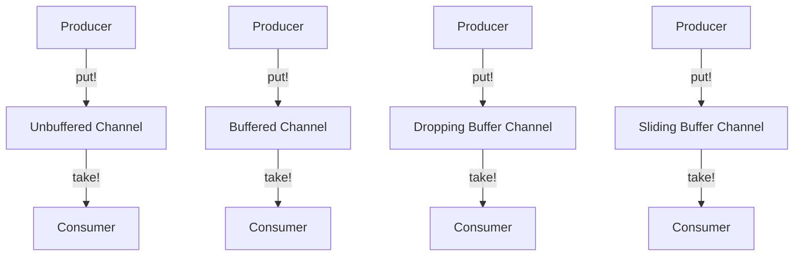

## 16.2.2 Understanding Channels

In the world of concurrent programming, managing communication between different parts of a program is crucial. Clojure's `core.async` library introduces **channels**, a powerful abstraction for handling asynchronous communication. Channels act as conduits for passing messages between different parts of a program, facilitating a decoupled and non-blocking communication model.

### What Are Channels?

Channels in `core.async` are akin to queues that allow different parts of a program to communicate by passing messages. They are similar to Java's `BlockingQueue`, but with added flexibility and capabilities tailored for asynchronous programming. Channels can be thought of as conduits through which data flows, enabling different threads or processes to exchange information without direct interaction.

#### Types of Channels

Clojure provides several types of channels, each suited for different use cases:

1. **Unbuffered Channels**: These channels do not have any buffer. A `put` operation will block until a corresponding `take` operation is ready to receive the message, and vice versa. This is similar to a rendezvous point where both the producer and consumer must be present for the data to be exchanged.

2. **Buffered Channels**: These channels have a fixed-size buffer. A `put` operation will only block if the buffer is full, and a `take` operation will block if the buffer is empty. Buffered channels are useful when you want to allow some slack between producers and consumers.

3. **Dropping Buffer Channels**: These channels have a buffer, but if the buffer is full, new messages are dropped. This is useful when you want to ensure that the system does not block or slow down due to backpressure.

4. **Sliding Buffer Channels**: These channels also have a buffer, but when the buffer is full, the oldest messages are dropped to make room for new ones. This is suitable for scenarios where you want to keep the most recent data available.

### Creating Channels

To create a channel, we use the `chan` function. Let's explore how to create different types of channels:

```clojure
(require '[clojure.core.async :refer [chan]])

;; Unbuffered channel
(def unbuffered-chan (chan))

;; Buffered channel with a buffer size of 10
(def buffered-chan (chan 10))

;; Dropping buffer channel with a buffer size of 10
(def dropping-chan (chan (dropping-buffer 10)))

;; Sliding buffer channel with a buffer size of 10
(def sliding-chan (chan (sliding-buffer 10)))
```

### Basic Channel Operations

Once a channel is created, we can perform various operations to send and receive messages. The primary operations are `put!`, `take!`, `>!`, and `<!`.

#### Putting Messages on a Channel

- **`put!`**: Asynchronously puts a message onto a channel. It does not block the calling thread.

- **`>!`**: Used within a `go` block to put a message onto a channel. It will park the current go block if the channel is full.

```clojure
(require '[clojure.core.async :refer [chan put! >! go]])

(def my-chan (chan 5))

;; Asynchronous put
(put! my-chan "Hello, World!")

;; Using >! within a go block
(go
  (>! my-chan "Hello from go block"))
```

#### Taking Messages from a Channel

- **`take!`**: Asynchronously takes a message from a channel. It does not block the calling thread.

- **`<!`**: Used within a `go` block to take a message from a channel. It will park the current go block if the channel is empty.

```clojure
(require '[clojure.core.async :refer [chan take! <! go]])

(def my-chan (chan 5))

;; Asynchronous take
(take! my-chan println)

;; Using <! within a go block
(go
  (let [message (<! my-chan)]
    (println "Received:" message)))
```

### When to Use Each Type of Channel

- **Unbuffered Channels**: Use when you want strict synchronization between producers and consumers. Ideal for scenarios where you want to ensure that every message is processed immediately.

- **Buffered Channels**: Use when you want to decouple the producer and consumer, allowing them to operate at different speeds. Suitable for scenarios where you expect bursts of messages.

- **Dropping Buffer Channels**: Use when you want to prevent blocking and are okay with losing some messages. Ideal for scenarios where the latest data is not critical.

- **Sliding Buffer Channels**: Use when you want to keep the most recent messages and discard older ones. Suitable for scenarios where you want to maintain a sliding window of data.

### Comparing with Java

In Java, you might use `BlockingQueue` for similar purposes. However, Clojure's channels offer more flexibility with their non-blocking nature and the ability to use them within `go` blocks for lightweight concurrency.

**Java Example with BlockingQueue**:

```java
import java.util.concurrent.BlockingQueue;
import java.util.concurrent.LinkedBlockingQueue;

public class ChannelExample {
    public static void main(String[] args) throws InterruptedException {
        BlockingQueue<String> queue = new LinkedBlockingQueue<>(10);

        // Producer
        new Thread(() -> {
            try {
                queue.put("Hello, World!");
            } catch (InterruptedException e) {
                Thread.currentThread().interrupt();
            }
        }).start();

        // Consumer
        new Thread(() -> {
            try {
                String message = queue.take();
                System.out.println("Received: " + message);
            } catch (InterruptedException e) {
                Thread.currentThread().interrupt();
            }
        }).start();
    }
}
```

**Clojure Example with Channels**:

```clojure
(require '[clojure.core.async :refer [chan >! <! go]])

(def my-chan (chan 10))

;; Producer
(go
  (>! my-chan "Hello, World!"))

;; Consumer
(go
  (let [message (<! my-chan)]
    (println "Received:" message)))
```

### Try It Yourself

Experiment with the following modifications to deepen your understanding:

- Change the buffer size of a channel and observe how it affects the behavior of producers and consumers.
- Implement a scenario where multiple producers and consumers interact with the same channel.
- Use different types of buffers and note the differences in message handling.

### Diagrams and Visualizations

To better understand how channels work, let's visualize the flow of data through different types of channels.



**Diagram Explanation**: This diagram illustrates how producers and consumers interact with different types of channels. Each channel type handles message flow differently, affecting how data is processed and consumed.

### Further Reading

For more in-depth information on Clojure's `core.async` library and channels, consider exploring the following resources:

- [Official Clojure Documentation](https://clojure.org/reference/async)
- [ClojureDocs on core.async](https://clojuredocs.org/clojure.core.async)
- [GitHub Repository for core.async](https://github.com/clojure/core.async)

### Exercises

1. **Implement a Producer-Consumer Model**: Create a simple producer-consumer model using buffered channels. Experiment with different buffer sizes and observe the effects on throughput and latency.

2. **Simulate a Real-Time Data Stream**: Use sliding buffer channels to simulate a real-time data stream where only the most recent data is relevant.

3. **Build a Simple Chat Application**: Use channels to build a simple chat application where multiple users can send and receive messages asynchronously.

### Key Takeaways

- **Channels** in Clojure's `core.async` library provide a flexible and powerful way to handle asynchronous communication.
- Different types of channels (unbuffered, buffered, dropping, sliding) offer various trade-offs in terms of synchronization and data handling.
- Channels enable decoupled communication between different parts of a program, facilitating a more modular and scalable architecture.
- Understanding how to use channels effectively can significantly enhance your ability to build responsive and concurrent applications in Clojure.

Now that we've explored the fundamentals of channels in Clojure, let's apply these concepts to build more robust and efficient asynchronous systems.

## Quiz: Mastering Channels in Clojure's Core.async



### What is the primary purpose of channels in Clojure's core.async library?

- [x] To facilitate asynchronous communication between different parts of a program.
- [ ] To manage memory allocation in Clojure applications.
- [ ] To replace Java's `BlockingQueue`.
- [ ] To handle exceptions in concurrent programming.

> **Explanation:** Channels in Clojure's core.async library are designed to facilitate asynchronous communication by acting as message queues between different parts of a program.

### Which type of channel should you use if you want to ensure that no messages are dropped, and both producer and consumer must be present for data exchange?

- [x] Unbuffered Channel
- [ ] Buffered Channel
- [ ] Dropping Buffer Channel
- [ ] Sliding Buffer Channel

> **Explanation:** Unbuffered channels require both the producer and consumer to be present for data exchange, ensuring no messages are dropped.

### What happens when a `put!` operation is performed on a full buffered channel?

- [ ] The operation completes immediately.
- [x] The operation blocks until space is available.
- [ ] The oldest message is dropped to make space.
- [ ] The newest message is dropped.

> **Explanation:** In a buffered channel, a `put!` operation will block if the buffer is full until space becomes available.

### How does a sliding buffer channel handle new messages when the buffer is full?

- [ ] It blocks the producer until space is available.
- [ ] It drops the newest message.
- [x] It drops the oldest message to make space for the new one.
- [ ] It throws an exception.

> **Explanation:** Sliding buffer channels drop the oldest message when the buffer is full to make space for new messages.

### Which function is used within a `go` block to put a message onto a channel?

- [ ] put!
- [x] >!
- [ ] <! 
- [ ] take!

> **Explanation:** The `>!` function is used within a `go` block to put a message onto a channel, parking the go block if necessary.

### What is the main difference between `put!` and `>!`?

- [x] `put!` is asynchronous and does not block, while `>!` is used within a `go` block and can park the block.
- [ ] `put!` is used for taking messages, while `>!` is used for putting messages.
- [ ] `put!` is for buffered channels, while `>!` is for unbuffered channels.
- [ ] There is no difference; they are interchangeable.

> **Explanation:** `put!` is asynchronous and does not block, while `>!` is used within a `go` block and can park the block if the channel is full.

### What is the purpose of a dropping buffer channel?

- [ ] To ensure no messages are lost.
- [ ] To block the producer when the buffer is full.
- [x] To drop new messages when the buffer is full.
- [ ] To drop old messages when the buffer is full.

> **Explanation:** Dropping buffer channels drop new messages when the buffer is full, preventing blocking.

### Which operation is used to take a message from a channel within a `go` block?

- [ ] put!
- [ ] >!
- [x] <! 
- [ ] take!

> **Explanation:** The `<!` operation is used within a `go` block to take a message from a channel, parking the block if necessary.

### What is a key advantage of using channels over Java's `BlockingQueue`?

- [x] Channels support non-blocking operations and can be used within lightweight `go` blocks.
- [ ] Channels are faster than `BlockingQueue`.
- [ ] Channels are easier to implement in Java applications.
- [ ] Channels automatically handle exceptions.

> **Explanation:** Channels support non-blocking operations and can be used within lightweight `go` blocks, offering more flexibility than Java's `BlockingQueue`.

### True or False: Sliding buffer channels are ideal for scenarios where the latest data is not critical.

- [ ] True
- [x] False

> **Explanation:** Sliding buffer channels are ideal for scenarios where you want to keep the most recent data and discard older messages, making them suitable when the latest data is critical.


