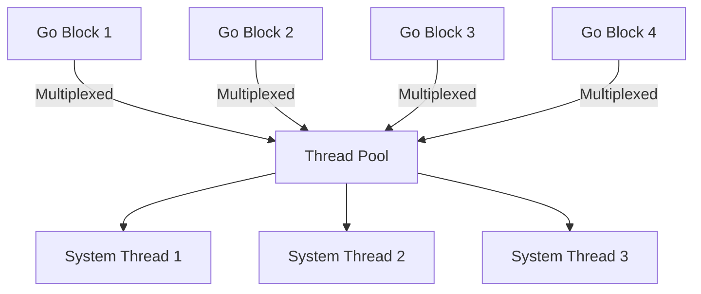

## 16.2.3 Go Blocks and Threads

As experienced Java developers, you're likely familiar with the concept of threads and the challenges associated with managing them. In Clojure, the `core.async` library introduces **go blocks**, a powerful tool for asynchronous programming that leverages lightweight concurrency. In this section, we'll delve into the mechanics of go blocks, compare them with traditional threads, and explore their syntax and use cases.

### Understanding Go Blocks

Go blocks in Clojure are a construct provided by the `core.async` library that allows for asynchronous execution of code. They are designed to be lightweight and efficient, enabling developers to write concurrent programs without the overhead of managing system threads directly.

#### Key Characteristics of Go Blocks

- **Lightweight Concurrency**: Go blocks do not map one-to-one with system threads. Instead, they are multiplexed over a smaller number of actual threads, allowing for thousands of go blocks to run concurrently without exhausting system resources.
- **Non-blocking I/O**: Within a go block, operations that would typically block, such as I/O, are handled asynchronously, allowing other go blocks to continue executing.
- **Channel Communication**: Go blocks often communicate with each other using channels, which are first-class constructs in `core.async` for passing messages between concurrent processes.

### Syntax and Usage of Go Blocks

To create a go block, we use the `go` macro provided by `core.async`. This macro transforms the code within the block into a state machine that can be paused and resumed, allowing for asynchronous execution.

```clojure
(require '[clojure.core.async :refer [go chan <! >!]])

(defn async-process []
  (let [c (chan)]
    (go
      (let [result (<! (some-async-operation))]
        (>! c result)))
    c))
```

In this example, we define a function `async-process` that creates a channel `c`. Inside the go block, we perform an asynchronous operation and then place the result onto the channel using `>!`. The `<!` operator is used to take a value from a channel, and `>!` is used to put a value onto a channel.

### Comparing Go Blocks with Java Threads

Java threads are a fundamental part of the Java concurrency model, allowing for parallel execution of code. However, they come with certain limitations and complexities, such as:

- **Resource Intensive**: Each thread consumes system resources, and creating a large number of threads can lead to performance issues.
- **Complex Synchronization**: Managing shared state between threads often requires complex synchronization mechanisms, such as locks and semaphores.

In contrast, go blocks offer a more efficient and simpler model for concurrency:

- **Efficiency**: Go blocks are multiplexed over a smaller number of threads, reducing resource consumption.
- **Simplified Communication**: Channels provide a straightforward way to communicate between go blocks, avoiding the need for explicit locks.

### Threads in Clojure

While go blocks are ideal for many asynchronous tasks, there are scenarios where you might still want to use traditional threads. Clojure provides the `thread` macro for creating system threads.

```clojure
(defn threaded-task []
  (let [result (atom nil)]
    (thread
      (reset! result (some-intensive-task)))
    result))
```

In this example, we use the `thread` macro to execute `some-intensive-task` on a separate system thread. The result is stored in an atom, which is a mutable reference type in Clojure.

### Go Blocks vs. Threads: Use Cases

- **Go Blocks**: Best suited for tasks that involve I/O operations, such as network requests or file reading, where non-blocking behavior is beneficial.
- **Threads**: More appropriate for CPU-bound tasks that require dedicated processing power.

### Execution Model of Go Blocks

To understand the execution model of go blocks, let's visualize how they operate within a thread pool:



**Diagram Explanation**: This diagram illustrates how multiple go blocks are multiplexed over a smaller number of system threads, allowing for efficient concurrency.

### Practical Example: Asynchronous Web Scraper

Let's build a simple web scraper using go blocks to fetch data from multiple URLs concurrently.

```clojure
(require '[clj-http.client :as http])
(require '[clojure.core.async :refer [go chan <! >! <!!]])

(defn fetch-url [url]
  (let [c (chan)]
    (go
      (let [response (http/get url)]
        (>! c (:body response))))
    c))

(defn scrape-urls [urls]
  (let [results (map fetch-url urls)]
    (map <!! results)))

;; Usage
(def urls ["http://example.com" "http://example.org" "http://example.net"])
(scrape-urls urls)
```

In this example, `fetch-url` creates a go block for each URL, fetching the content asynchronously. The `scrape-urls` function collects the results from each channel using `<!!`, which is a blocking operation that waits for the result.

### Try It Yourself

Experiment with the web scraper example by:

- Adding more URLs to the list and observing the performance.
- Modifying the `fetch-url` function to handle errors gracefully.
- Implementing a timeout mechanism for requests.

### Further Reading

For more information on go blocks and asynchronous programming in Clojure, consider exploring the following resources:

- [Clojure Core.async Documentation](https://clojure.github.io/core.async/)
- [ClojureDocs: core.async](https://clojuredocs.org/clojure.core.async)

### Exercises

1. Modify the web scraper to handle JSON responses and parse them into Clojure data structures.
2. Implement a rate limiter to control the number of concurrent requests.
3. Create a go block that performs a series of dependent asynchronous operations, such as fetching data, processing it, and storing the result.

### Key Takeaways

- **Go blocks** provide a lightweight and efficient model for asynchronous programming in Clojure, leveraging a thread pool for execution.
- **Channels** facilitate communication between go blocks, simplifying concurrency management.
- **Threads** are still useful for CPU-bound tasks, offering dedicated processing power.
- Understanding the differences between go blocks and threads helps in choosing the right tool for the task at hand.

By mastering go blocks and threads, you can harness the full power of Clojure's concurrency model, writing efficient and scalable applications.

## Quiz: Mastering Go Blocks and Threads in Clojure



### What is a key advantage of using go blocks over traditional threads in Clojure?

- [x] Go blocks are lightweight and can be multiplexed over fewer system threads.
- [ ] Go blocks require explicit locks for synchronization.
- [ ] Go blocks consume more system resources than threads.
- [ ] Go blocks are only suitable for CPU-bound tasks.

> **Explanation:** Go blocks are designed to be lightweight and are multiplexed over a smaller number of system threads, making them efficient for asynchronous tasks.

### How do go blocks communicate with each other in Clojure?

- [x] Through channels.
- [ ] Using shared memory.
- [ ] By passing messages directly.
- [ ] Through global variables.

> **Explanation:** Go blocks use channels to communicate, which are first-class constructs in `core.async` for passing messages between concurrent processes.

### What is the primary use case for using the `thread` macro in Clojure?

- [x] CPU-bound tasks that require dedicated processing power.
- [ ] Non-blocking I/O operations.
- [ ] Lightweight concurrency.
- [ ] Communicating between go blocks.

> **Explanation:** The `thread` macro is used for CPU-bound tasks that require dedicated processing power, as it creates a separate system thread.

### In the context of go blocks, what does the `<!` operator do?

- [x] Takes a value from a channel.
- [ ] Puts a value onto a channel.
- [ ] Creates a new channel.
- [ ] Closes a channel.

> **Explanation:** The `<!` operator is used to take a value from a channel within a go block.

### Which of the following is true about go blocks?

- [x] They are multiplexed over a smaller number of system threads.
- [ ] They map one-to-one with system threads.
- [x] They are suitable for I/O-bound tasks.
- [ ] They require explicit synchronization mechanisms.

> **Explanation:** Go blocks are multiplexed over fewer system threads and are ideal for I/O-bound tasks due to their non-blocking nature.

### What is the role of the `>!` operator in a go block?

- [x] It puts a value onto a channel.
- [ ] It takes a value from a channel.
- [ ] It creates a new go block.
- [ ] It closes a channel.

> **Explanation:** The `>!` operator is used to put a value onto a channel within a go block.

### How does the `core.async` library handle blocking operations within go blocks?

- [x] By transforming them into non-blocking operations.
- [ ] By using system threads for each operation.
- [ ] By pausing all other go blocks.
- [ ] By using explicit locks.

> **Explanation:** The `core.async` library transforms blocking operations into non-blocking ones within go blocks, allowing other go blocks to continue executing.

### What is a common use case for using channels in Clojure?

- [x] Passing messages between go blocks.
- [ ] Storing global state.
- [ ] Synchronizing threads.
- [ ] Managing system resources.

> **Explanation:** Channels are commonly used for passing messages between go blocks, facilitating communication in concurrent programs.

### Which of the following best describes the execution model of go blocks?

- [x] Go blocks are multiplexed over a smaller number of system threads.
- [ ] Each go block runs on its own system thread.
- [ ] Go blocks require explicit synchronization.
- [ ] Go blocks are only suitable for CPU-bound tasks.

> **Explanation:** Go blocks are multiplexed over a smaller number of system threads, allowing for efficient concurrency.

### True or False: Go blocks in Clojure are ideal for CPU-bound tasks.

- [ ] True
- [x] False

> **Explanation:** Go blocks are ideal for I/O-bound tasks due to their lightweight and non-blocking nature, while CPU-bound tasks are better suited for system threads.


