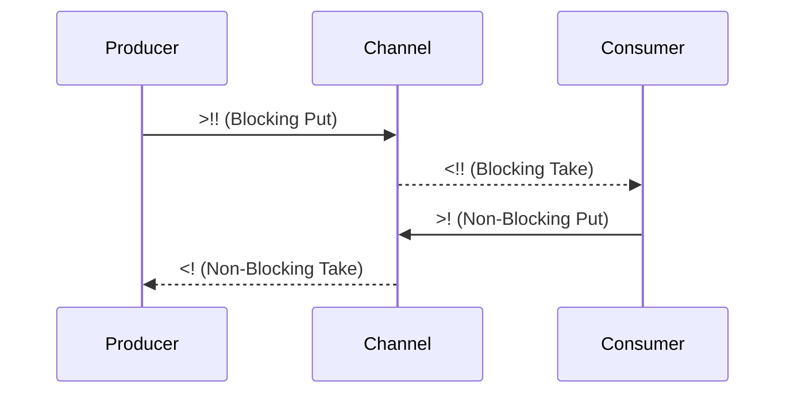

## 16.2.4 Async vs. Blocking Operations

As experienced Java developers, you're likely familiar with the challenges of managing concurrency and the importance of non-blocking operations to ensure efficient resource utilization. In Clojure, the `core.async` library provides powerful tools for asynchronous programming, allowing you to write concurrent code that is both expressive and efficient. In this section, we'll delve into the differences between blocking and non-blocking operations, focusing on their use within `go` blocks in Clojure's `core.async`.

### Understanding Blocking and Non-Blocking Operations

In the context of concurrent programming, **blocking operations** are those that halt the execution of a thread until a certain condition is met, such as the availability of data or the completion of a task. This can lead to inefficiencies, especially in environments where threads are a limited resource. Conversely, **non-blocking operations** allow a program to continue executing other tasks while waiting for a condition to be satisfied, thus improving the overall throughput and responsiveness of the application.

#### Blocking Operations in Clojure

In Clojure's `core.async`, blocking operations are represented by `<!!` and `>!!`. These operations are used to take from and put onto channels, respectively, but they block the calling thread until the operation can be completed.

```clojure
(require '[clojure.core.async :refer [chan <!! >!!]])

(let [c (chan)]
  (future
    (Thread/sleep 1000)
    (>!! c "Hello, World!")) ; Blocking put operation
  (println (<!! c))) ; Blocking take operation
```

In this example, the `>!!` operation blocks until the value can be placed onto the channel, and `<!!` blocks until a value can be taken from the channel.

#### Non-Blocking Operations in Clojure

Non-blocking operations in `core.async` are represented by `<!` and `>!`. These operations are designed to be used within `go` blocks, which are lightweight threads managed by Clojure's runtime.

```clojure
(require '[clojure.core.async :refer [chan go <! >!]])

(let [c (chan)]
  (go
    (Thread/sleep 1000)
    (>! c "Hello, World!")) ; Non-blocking put operation
  (go
    (println (<! c)))) ; Non-blocking take operation
```

Here, the `>!` and `<!` operations do not block the thread. Instead, they allow the `go` block to yield control, enabling other tasks to proceed while waiting for the operation to complete.

### The Importance of Non-Blocking Operations in `go` Blocks

Using blocking operations within `go` blocks can lead to **thread starvation**, a situation where threads are unable to progress because they are waiting for resources that are held by other threads. This is particularly problematic in environments with limited thread pools, as it can lead to deadlocks and reduced application performance.

#### Why Avoid Blocking in `go` Blocks?

1. **Resource Efficiency**: `go` blocks are designed to be lightweight and efficient, allowing many concurrent tasks to be managed with minimal overhead. Blocking operations negate this advantage by tying up threads unnecessarily.

2. **Scalability**: Non-blocking operations enable applications to scale more effectively by allowing tasks to be interleaved and executed concurrently without waiting for each other.

3. **Responsiveness**: Applications that rely on non-blocking operations are generally more responsive, as they can continue processing other tasks while waiting for I/O or other long-running operations to complete.

#### Example: Comparing Blocking and Non-Blocking Operations

Let's consider an example where we simulate a simple producer-consumer scenario using both blocking and non-blocking operations.

**Blocking Example:**

```clojure
(require '[clojure.core.async :refer [chan <!! >!!]])

(defn producer [c]
  (future
    (Thread/sleep 1000)
    (>!! c "Produced item")))

(defn consumer [c]
  (println "Consumed:" (<!! c)))

(let [c (chan)]
  (producer c)
  (consumer c))
```

In this blocking example, the consumer must wait for the producer to finish before it can proceed, potentially leading to inefficiencies if the producer is delayed.

**Non-Blocking Example:**

```clojure
(require '[clojure.core.async :refer [chan go <! >!]])

(defn producer [c]
  (go
    (Thread/sleep 1000)
    (>! c "Produced item")))

(defn consumer [c]
  (go
    (println "Consumed:" (<! c))))

(let [c (chan)]
  (producer c)
  (consumer c))
```

In the non-blocking example, both the producer and consumer can proceed independently, improving the overall efficiency and responsiveness of the system.

### Visualizing Blocking vs. Non-Blocking Operations

To better understand the flow of blocking and non-blocking operations, let's visualize the process using a sequence diagram.



**Diagram Description**: This sequence diagram illustrates the interaction between a producer, a channel, and a consumer using both blocking and non-blocking operations. The blocking operations (`>!!`, `<!!`) halt the flow until the operation is complete, while non-blocking operations (`>!`, `<!`) allow the flow to continue without waiting.

### Best Practices for Using Non-Blocking Operations

1. **Use `go` Blocks for Concurrency**: Leverage `go` blocks to manage concurrency efficiently, using non-blocking operations to avoid thread starvation.

2. **Avoid Blocking Calls in `go` Blocks**: Ensure that all operations within `go` blocks are non-blocking to maintain the lightweight nature of these constructs.

3. **Design for Asynchrony**: Structure your application logic to take advantage of asynchronous operations, allowing tasks to be interleaved and executed concurrently.

4. **Monitor and Optimize**: Regularly monitor the performance of your concurrent code and optimize as necessary to ensure that resources are used efficiently.

### Try It Yourself

Experiment with the code examples provided by modifying the delay times or adding additional producers and consumers. Observe how the system behaves with blocking versus non-blocking operations and consider the impact on performance and responsiveness.

### Further Reading

- [Clojure Official Documentation on core.async](https://clojure.org/reference/async)
- [ClojureDocs: core.async](https://clojuredocs.org/clojure.core.async)
- [Java Concurrency in Practice](https://www.oreilly.com/library/view/java-concurrency-in/0321349601/)

### Exercises

1. Modify the non-blocking example to include multiple producers and consumers. How does this affect the system's performance?
2. Implement a timeout mechanism for the non-blocking operations using `alts!`. How does this change the behavior of your application?
3. Compare the performance of a blocking versus non-blocking implementation in a high-load scenario. What differences do you observe?

### Key Takeaways

- **Non-blocking operations** are essential for efficient concurrency in Clojure's `core.async`.
- **Blocking operations** should be avoided within `go` blocks to prevent thread starvation and ensure resource efficiency.
- **Designing for asynchrony** allows applications to scale and respond more effectively to varying loads.

By understanding and applying these concepts, you'll be well-equipped to harness the power of Clojure's `core.async` for building responsive, scalable applications.

## Quiz: Mastering Async vs. Blocking Operations in Clojure



### What is the primary advantage of non-blocking operations in Clojure's core.async?

- [x] They allow tasks to proceed without waiting, improving efficiency.
- [ ] They are easier to implement than blocking operations.
- [ ] They require fewer resources than blocking operations.
- [ ] They are only used for error handling.

> **Explanation:** Non-blocking operations enable tasks to continue executing without waiting for conditions to be met, improving overall efficiency and responsiveness.

### Which operations are considered blocking in Clojure's core.async?

- [x] `<!!` and `>!!`
- [ ] `<!` and `>!`
- [ ] `go` and `chan`
- [ ] `async` and `await`

> **Explanation:** `<!!` and `>!!` are blocking operations that halt execution until the operation can be completed.

### Why should blocking operations be avoided in go blocks?

- [x] They can lead to thread starvation and inefficiencies.
- [ ] They are deprecated in recent Clojure versions.
- [ ] They are only suitable for single-threaded applications.
- [ ] They increase the complexity of the code.

> **Explanation:** Blocking operations in `go` blocks can cause thread starvation, as they prevent other tasks from proceeding, leading to inefficiencies.

### What is the role of go blocks in Clojure's core.async?

- [x] To manage concurrency efficiently with non-blocking operations.
- [ ] To execute blocking operations in parallel.
- [ ] To handle exceptions in asynchronous code.
- [ ] To create new threads for each task.

> **Explanation:** `go` blocks are designed to manage concurrency efficiently by using non-blocking operations, allowing tasks to be interleaved and executed concurrently.

### How can you simulate a timeout for non-blocking operations in Clojure?

- [x] By using `alts!` with a timeout channel.
- [ ] By using `Thread.sleep` within a `go` block.
- [ ] By implementing a custom timeout function.
- [ ] By using `try-catch` blocks.

> **Explanation:** `alts!` can be used with a timeout channel to simulate a timeout for non-blocking operations, allowing the program to proceed if the operation takes too long.

### What is the impact of using non-blocking operations on application scalability?

- [x] They improve scalability by allowing tasks to be interleaved.
- [ ] They reduce scalability due to increased complexity.
- [ ] They have no impact on scalability.
- [ ] They are only beneficial for small applications.

> **Explanation:** Non-blocking operations improve scalability by allowing tasks to be interleaved and executed concurrently, making better use of available resources.

### Which of the following is a best practice for using non-blocking operations in Clojure?

- [x] Avoid blocking calls in `go` blocks.
- [ ] Use blocking operations for critical tasks.
- [ ] Implement non-blocking operations only in single-threaded applications.
- [ ] Avoid using `go` blocks for concurrency.

> **Explanation:** Avoiding blocking calls in `go` blocks is a best practice to maintain the lightweight and efficient nature of these constructs.

### What is a potential consequence of using blocking operations in a high-load scenario?

- [x] Reduced application performance and responsiveness.
- [ ] Increased application security.
- [ ] Simplified error handling.
- [ ] Improved code readability.

> **Explanation:** Using blocking operations in a high-load scenario can reduce application performance and responsiveness due to thread starvation and inefficient resource utilization.

### How do non-blocking operations affect application responsiveness?

- [x] They improve responsiveness by allowing tasks to proceed without waiting.
- [ ] They decrease responsiveness due to increased complexity.
- [ ] They have no effect on responsiveness.
- [ ] They are only beneficial for batch processing.

> **Explanation:** Non-blocking operations improve application responsiveness by allowing tasks to proceed without waiting for conditions to be met.

### True or False: Non-blocking operations in Clojure's core.async are only useful for I/O-bound tasks.

- [ ] True
- [x] False

> **Explanation:** Non-blocking operations are useful for both I/O-bound and CPU-bound tasks, as they allow tasks to be interleaved and executed concurrently, improving overall efficiency.


