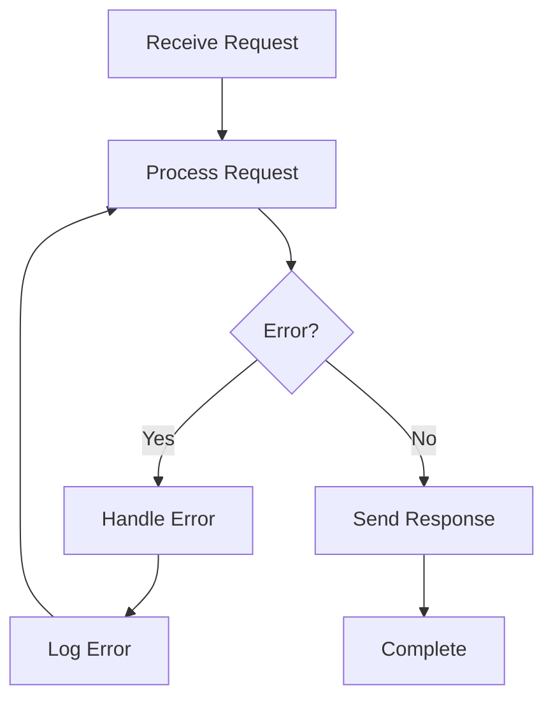

## 16.3.1 Principles of Reactive Programming

As we delve into the world of reactive programming, we embark on a journey to build systems that are not only responsive but also resilient, scalable, and capable of handling real-time data streams. Reactive programming is a paradigm that has gained significant traction in recent years, particularly in the context of modern web applications and distributed systems. In this section, we will explore the core principles of reactive programming and how Clojure's `core.async` library supports these principles, enabling us to create robust and efficient systems.

### Understanding Reactive Programming

Reactive programming is a programming paradigm oriented around data flows and the propagation of change. It is a declarative programming style that focuses on building systems that react to changes in data and events. The key principles of reactive programming are:

- **Responsiveness**: Systems should respond in a timely manner, ensuring a positive user experience.
- **Resilience**: Systems should remain responsive in the face of failure, recovering gracefully from errors.
- **Scalability**: Systems should handle varying loads efficiently, scaling up or down as needed.
- **Event-Driven Architecture**: Systems should be designed around events, reacting to changes in state and data.

These principles are encapsulated in the [Reactive Manifesto](https://www.reactivemanifesto.org/), which provides a framework for building reactive systems.

### Core Principles of Reactive Programming

#### 1. Responsiveness

Responsiveness is the cornerstone of reactive systems. A responsive system provides rapid and consistent feedback to users, ensuring a seamless experience. This is achieved by minimizing latency and ensuring that the system can handle requests in a timely manner.

In Clojure, responsiveness is often achieved through the use of asynchronous programming techniques, such as those provided by the `core.async` library. By leveraging non-blocking operations, we can ensure that our systems remain responsive even under heavy load.

#### 2. Resilience

Resilience refers to the ability of a system to remain responsive in the face of failure. Reactive systems are designed to handle failures gracefully, using techniques such as replication, isolation, and delegation to ensure that failures do not propagate throughout the system.

Clojure's immutable data structures and functional programming paradigm contribute to resilience by reducing the likelihood of side effects and making it easier to reason about system behavior. Additionally, `core.async` provides tools for managing errors and retries, allowing us to build systems that can recover from failures.

#### 3. Scalability

Scalability is the ability of a system to handle varying loads efficiently. Reactive systems are designed to scale both vertically (by adding more resources to a single node) and horizontally (by adding more nodes to the system).

Clojure's lightweight concurrency model, combined with the power of `core.async`, allows us to build scalable systems that can handle large volumes of data and requests. By using channels and go blocks, we can distribute work across multiple threads and cores, ensuring that our systems can scale to meet demand.

#### 4. Event-Driven Architecture

Event-driven architecture is a key component of reactive systems. In an event-driven system, components communicate by emitting and responding to events, rather than relying on direct method calls or shared state.

Clojure's `core.async` library provides a powerful abstraction for building event-driven systems. By using channels to pass messages between components, we can decouple our system and build flexible, modular applications.

### Building Reactive Systems with Clojure

Now that we have a solid understanding of the principles of reactive programming, let's explore how we can apply these principles in Clojure using the `core.async` library.

#### Introduction to `core.async`

`core.async` is a Clojure library that provides facilities for asynchronous programming and communication. It is inspired by [Communicating Sequential Processes (CSP)](https://en.wikipedia.org/wiki/Communicating_sequential_processes), a formal language for describing patterns of interaction in concurrent systems.

At the heart of `core.async` are **channels**, which are used to pass messages between different parts of a program. Channels can be thought of as queues that allow data to be transferred between threads or processes.

```clojure
(require '[clojure.core.async :refer [chan go >! <!]])

;; Create a channel
(def my-channel (chan))

;; Start a go block to put a value onto the channel
(go
  (>! my-channel "Hello, World!"))

;; Start another go block to take a value from the channel
(go
  (let [message (<! my-channel)]
    (println "Received message:" message)))
```

In this example, we create a channel and use two `go` blocks to send and receive a message. The `go` macro is used to create lightweight threads that can perform asynchronous operations without blocking the main thread.

#### Non-Blocking Communication

One of the key features of `core.async` is its support for non-blocking communication. By using channels, we can pass messages between different parts of our program without blocking the main thread. This allows us to build responsive systems that can handle multiple requests concurrently.

```clojure
(require '[clojure.core.async :refer [chan go >! <! timeout]])

(defn process-request [request]
  (println "Processing request:" request))

(def request-channel (chan))

;; Simulate receiving requests
(go
  (dotimes [i 5]
    (>! request-channel (str "Request " i))
    (<! (timeout 1000)))) ; Simulate delay between requests

;; Process requests asynchronously
(go
  (while true
    (let [request (<! request-channel)]
      (process-request request))))
```

In this example, we simulate receiving requests and processing them asynchronously using channels. The `timeout` function is used to introduce a delay between requests, simulating a real-world scenario where requests arrive at different times.

#### Error Handling and Resilience

Building resilient systems requires robust error handling. In `core.async`, we can use channels to propagate errors and implement retry logic.

```clojure
(require '[clojure.core.async :refer [chan go >! <! timeout]])

(defn process-request [request]
  (if (= request "Request 2")
    (throw (Exception. "Simulated error"))
    (println "Processing request:" request)))

(def request-channel (chan))
(def error-channel (chan))

;; Simulate receiving requests
(go
  (dotimes [i 5]
    (>! request-channel (str "Request " i))
    (<! (timeout 1000))))

;; Process requests asynchronously with error handling
(go
  (while true
    (let [request (<! request-channel)]
      (try
        (process-request request)
        (catch Exception e
          (>! error-channel (.getMessage e)))))))

;; Handle errors
(go
  (while true
    (let [error (<! error-channel)]
      (println "Error occurred:" error))))
```

In this example, we introduce error handling by using a separate channel for errors. When an error occurs, it is sent to the `error-channel`, where it can be logged or handled appropriately.

### Comparing Reactive Programming in Java and Clojure

Java developers may be familiar with reactive programming libraries such as [RxJava](https://github.com/ReactiveX/RxJava) and [Project Reactor](https://projectreactor.io/). These libraries provide similar functionality to `core.async`, allowing developers to build reactive systems in Java.

#### Java Example with RxJava

```java
import io.reactivex.Observable;

public class ReactiveExample {
    public static void main(String[] args) {
        Observable<String> observable = Observable.create(emitter -> {
            for (int i = 0; i < 5; i++) {
                if (i == 2) {
                    emitter.onError(new Exception("Simulated error"));
                } else {
                    emitter.onNext("Request " + i);
                }
            }
            emitter.onComplete();
        });

        observable.subscribe(
            request -> System.out.println("Processing request: " + request),
            error -> System.out.println("Error occurred: " + error.getMessage())
        );
    }
}
```

In this Java example, we use RxJava to create an observable that emits requests. We handle errors using the `onError` method, similar to how we use channels in Clojure to propagate errors.

#### Key Differences

- **Syntax and Abstractions**: Clojure's `core.async` uses channels and go blocks, while RxJava uses observables and subscribers. The syntax and abstractions differ, but the underlying principles are similar.
- **Immutability**: Clojure's emphasis on immutability and functional programming makes it easier to reason about system behavior and build resilient systems.
- **Concurrency Model**: Clojure's lightweight concurrency model, combined with `core.async`, provides a powerful framework for building scalable systems.

### Try It Yourself

To deepen your understanding of reactive programming in Clojure, try modifying the examples above:

- **Experiment with Different Delays**: Change the delay between requests in the non-blocking communication example to see how it affects system responsiveness.
- **Implement Retry Logic**: Modify the error handling example to implement retry logic for failed requests.
- **Create a New Example**: Build a simple event-driven system using `core.async` that reacts to user input or external events.

### Diagrams and Visualizations

To better understand the flow of data in reactive systems, let's visualize the process using a Mermaid.js diagram.



**Diagram Caption**: This flowchart illustrates the process of receiving and processing requests in a reactive system. It shows how errors are handled and logged, and how the system continues processing requests.

### Exercises and Practice Problems

1. **Implement a Retry Mechanism**: Extend the error handling example to implement a retry mechanism for failed requests. Use a separate channel to track retry attempts and limit the number of retries.

2. **Build a Simple Chat Application**: Use `core.async` to build a simple chat application that allows multiple users to send and receive messages in real-time. Implement channels for message passing and error handling.

3. **Create a Real-Time Data Stream**: Simulate a real-time data stream using `core.async` and process the data asynchronously. Implement error handling and logging for the data stream.

### Key Takeaways

- Reactive programming is a powerful paradigm for building responsive, resilient, and scalable systems.
- Clojure's `core.async` library provides tools for building reactive systems using channels and go blocks.
- The principles of reactive programming, such as responsiveness, resilience, scalability, and event-driven architecture, are essential for modern web applications and distributed systems.
- By leveraging Clojure's functional programming paradigm and immutable data structures, we can build robust and efficient systems that handle asynchronous data streams effectively.

### Further Reading

For more information on reactive programming and `core.async`, consider exploring the following resources:

- [Reactive Manifesto](https://www.reactivemanifesto.org/)
- [Clojure core.async Documentation](https://clojure.github.io/core.async/)
- [RxJava Documentation](https://github.com/ReactiveX/RxJava)
- [Project Reactor Documentation](https://projectreactor.io/)

Now that we've explored the principles of reactive programming, let's apply these concepts to build responsive and resilient systems in Clojure.

## Quiz: Test Your Knowledge of Reactive Programming Principles



### What is the primary goal of reactive programming?

- [x] To build systems that are responsive, resilient, and scalable
- [ ] To simplify code syntax
- [ ] To improve memory management
- [ ] To enhance graphical user interfaces

> **Explanation:** Reactive programming focuses on building systems that are responsive, resilient, and scalable, handling asynchronous data streams effectively.

### Which Clojure library is commonly used for asynchronous programming?

- [x] core.async
- [ ] clojure.java.jdbc
- [ ] clojure.test
- [ ] clojure.spec

> **Explanation:** The `core.async` library is used for asynchronous programming in Clojure, providing tools for non-blocking communication.

### What is a key feature of reactive systems?

- [x] Event-driven architecture
- [ ] Synchronous processing
- [ ] High memory usage
- [ ] Complex error handling

> **Explanation:** Reactive systems are characterized by an event-driven architecture, where components communicate by emitting and responding to events.

### How does Clojure's `core.async` library support non-blocking communication?

- [x] By using channels to pass messages between threads
- [ ] By using global variables
- [ ] By blocking the main thread
- [ ] By using synchronous method calls

> **Explanation:** `core.async` uses channels to enable non-blocking communication between threads, allowing for asynchronous data processing.

### What is the purpose of the `go` macro in `core.async`?

- [x] To create lightweight threads for asynchronous operations
- [ ] To define global variables
- [ ] To block the main thread
- [ ] To handle exceptions

> **Explanation:** The `go` macro is used to create lightweight threads that perform asynchronous operations without blocking the main thread.

### Which principle of reactive programming focuses on handling failures gracefully?

- [x] Resilience
- [ ] Responsiveness
- [ ] Scalability
- [ ] Efficiency

> **Explanation:** Resilience is the principle that focuses on handling failures gracefully, ensuring that systems remain responsive in the face of errors.

### What is a common use case for `core.async` in Clojure?

- [x] Building event-driven systems
- [ ] Managing global state
- [ ] Performing synchronous calculations
- [ ] Enhancing graphical user interfaces

> **Explanation:** `core.async` is commonly used to build event-driven systems by enabling asynchronous communication between components.

### How can errors be propagated in a `core.async` system?

- [x] By using separate channels for errors
- [ ] By using global variables
- [ ] By blocking the main thread
- [ ] By ignoring them

> **Explanation:** Errors can be propagated in a `core.async` system by using separate channels dedicated to handling errors.

### What is the benefit of using immutable data structures in reactive systems?

- [x] They reduce the likelihood of side effects
- [ ] They increase memory usage
- [ ] They simplify syntax
- [ ] They enhance graphical user interfaces

> **Explanation:** Immutable data structures reduce the likelihood of side effects, making it easier to reason about system behavior in reactive systems.

### True or False: Reactive programming is only applicable to web applications.

- [ ] True
- [x] False

> **Explanation:** Reactive programming is applicable to a wide range of systems, including web applications, distributed systems, and real-time data processing.


