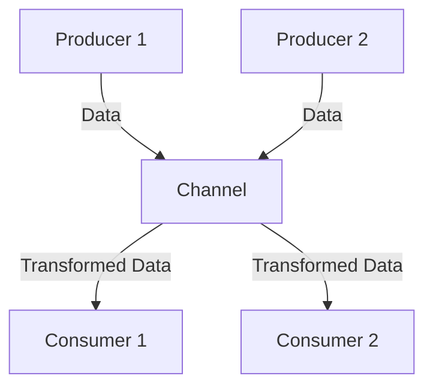

## 16.3.2 Creating Data Pipelines with core.async

As Java developers, you're likely familiar with the challenges of building asynchronous systems. Clojure's `core.async` library offers a powerful model for managing concurrency and building reactive systems through the use of channels and go blocks. In this guide, we'll explore how to create data pipelines using `core.async`, focusing on producer-consumer patterns and efficient data transformation with transducers.

### Understanding core.async

`core.async` is a Clojure library that provides facilities for asynchronous programming using channels. Channels are conduits through which data can flow, allowing different parts of your program to communicate without being tightly coupled. This model is similar to Java's `BlockingQueue`, but with more flexibility and less boilerplate.

#### Key Concepts

- **Channels**: These are the primary means of communication in `core.async`. They can be thought of as queues that can be used to pass messages between different parts of a program.
- **Go Blocks**: These are lightweight threads that allow you to write asynchronous code in a synchronous style. They are similar to Java's `CompletableFuture` but are more integrated into the language.
- **Transducers**: These are composable and reusable transformations that can be applied to data as it flows through channels, providing a way to efficiently process data without intermediate collections.

### Setting Up a Simple Data Pipeline

Let's start by setting up a simple data pipeline using `core.async`. We'll create a producer that generates data, a channel to transport the data, and a consumer that processes the data.

#### Step 1: Creating a Channel

First, we'll create a channel. In `core.async`, channels are created using the `chan` function.

```clojure
(require '[clojure.core.async :refer [chan]])

(def data-channel (chan))
```

#### Step 2: Setting Up a Producer

Next, we'll set up a producer that puts data onto the channel. We'll use a go block to simulate asynchronous data production.

```clojure
(require '[clojure.core.async :refer [go >!]])

(go
  (dotimes [i 10]
    (>! data-channel i)
    (Thread/sleep 100))) ; Simulate delay
```

In this example, the producer sends numbers from 0 to 9 onto the channel, simulating a delay with `Thread/sleep`.

#### Step 3: Setting Up a Consumer

Now, let's create a consumer that reads from the channel and processes the data.

```clojure
(require '[clojure.core.async :refer [<!]])

(go
  (loop []
    (when-let [value (<! data-channel)]
      (println "Received:" value)
      (recur))))
```

The consumer reads values from the channel and prints them. The `<!` operator is used to take values from the channel.

### Enhancing the Pipeline with Transducers

Transducers allow us to apply transformations to data as it flows through the channel, without creating intermediate collections. This can lead to more efficient data processing.

#### Applying a Transducer

Let's modify our pipeline to double each number before it reaches the consumer.

```clojure
(require '[clojure.core.async :refer [chan transduce]])

(def transducer (map #(* 2 %)))

(def transformed-channel (chan 10 transducer))

(go
  (dotimes [i 10]
    (>! transformed-channel i)
    (Thread/sleep 100)))

(go
  (loop []
    (when-let [value (<! transformed-channel)]
      (println "Transformed Received:" value)
      (recur))))
```

In this example, the `map` transducer doubles each number before it is consumed.

### Producer-Consumer Patterns

In real-world applications, you often need to manage multiple producers and consumers. `core.async` makes it easy to set up these patterns.

#### Multiple Producers

Let's extend our example to include multiple producers.

```clojure
(defn producer [id channel]
  (go
    (dotimes [i 5]
      (>! channel [id i])
      (Thread/sleep 100))))

(def multi-channel (chan))

(producer 1 multi-channel)
(producer 2 multi-channel)

(go
  (loop []
    (when-let [value (<! multi-channel)]
      (println "Multi-Producer Received:" value)
      (recur))))
```

Here, two producers send data to the same channel, each tagged with an identifier.

#### Multiple Consumers

Similarly, you can have multiple consumers reading from the same channel.

```clojure
(defn consumer [id channel]
  (go
    (loop []
      (when-let [value (<! channel)]
        (println (str "Consumer " id " received:") value)
        (recur)))))

(consumer 1 multi-channel)
(consumer 2 multi-channel)
```

Each consumer processes the data independently, demonstrating how `core.async` can handle complex data flows.

### Using core.async with Java

Clojure's interoperability with Java allows you to integrate `core.async` into existing Java applications. You can use Java's `ExecutorService` to manage threads and integrate with Clojure's channels.

#### Example: Integrating with Java

Suppose you have a Java application that processes data asynchronously. You can use `core.async` to manage the data flow.

```java
import clojure.java.api.Clojure;
import clojure.lang.IFn;
import clojure.lang.PersistentVector;

public class AsyncIntegration {
    public static void main(String[] args) {
        IFn require = Clojure.var("clojure.core", "require");
        require.invoke(Clojure.read("clojure.core.async"));

        IFn chan = Clojure.var("clojure.core.async", "chan");
        Object channel = chan.invoke();

        IFn go = Clojure.var("clojure.core.async", "go");
        IFn putBang = Clojure.var("clojure.core.async", ">!");

        go.invoke(() -> {
            for (int i = 0; i < 10; i++) {
                putBang.invoke(channel, i);
                Thread.sleep(100);
            }
            return null;
        });

        IFn takeBang = Clojure.var("clojure.core.async", "<!");
        go.invoke(() -> {
            while (true) {
                Object value = takeBang.invoke(channel);
                System.out.println("Java Received: " + value);
            }
        });
    }
}
```

This example demonstrates how to use `core.async` channels in a Java application, leveraging Clojure's interoperability.

### Try It Yourself

Experiment with the examples above by modifying the producer and consumer logic. Try adding more producers or consumers, or apply different transducers to see how they affect the data flow.

### Visualizing Data Flow

To better understand the flow of data through channels, let's visualize the process using a Mermaid.js diagram.



**Diagram Description**: This diagram illustrates a data pipeline with two producers sending data to a channel, which is then consumed by two consumers. The channel applies a transformation to the data before it reaches the consumers.

### Best Practices for core.async

- **Keep Channels Simple**: Use channels to pass data, not to manage state or control flow.
- **Avoid Blocking Operations**: Use non-blocking operations within go blocks to prevent thread starvation.
- **Leverage Transducers**: Use transducers for efficient data transformations without intermediate collections.
- **Monitor Channel Usage**: Ensure channels are properly closed to avoid memory leaks.

### Exercises

1. **Modify the Producer**: Change the producer to generate random numbers and observe how the consumer processes them.
2. **Add Error Handling**: Implement error handling in the consumer to gracefully handle unexpected data.
3. **Create a Complex Pipeline**: Set up a pipeline with multiple stages of data transformation using transducers.

### Key Takeaways

- `core.async` provides a powerful model for building asynchronous data pipelines in Clojure.
- Channels and go blocks enable efficient communication between different parts of a program.
- Transducers allow for efficient data transformation without intermediate collections.
- Clojure's interoperability with Java allows you to integrate `core.async` into existing Java applications.

For further reading, explore the [Official Clojure Documentation](https://clojure.org/reference/async) and [ClojureDocs](https://clojuredocs.org/clojure.core.async).

Now that we've explored how to create data pipelines with `core.async`, let's apply these concepts to build more complex and efficient asynchronous systems.

---

## Quiz: Mastering Data Pipelines with core.async



### What is the primary purpose of channels in core.async?

- [x] To facilitate communication between different parts of a program
- [ ] To manage application state
- [ ] To replace Java's `CompletableFuture`
- [ ] To handle exceptions in asynchronous code

> **Explanation:** Channels in `core.async` are used to facilitate communication between different parts of a program, allowing data to flow asynchronously.

### How do go blocks in core.async differ from Java's CompletableFuture?

- [x] Go blocks provide a synchronous style for writing asynchronous code
- [ ] Go blocks are used for error handling
- [ ] Go blocks are only for parallel processing
- [ ] Go blocks are a replacement for Java threads

> **Explanation:** Go blocks allow you to write asynchronous code in a synchronous style, making it easier to manage complex data flows.

### What is a transducer in the context of core.async?

- [x] A composable transformation applied to data as it flows through a channel
- [ ] A type of channel in core.async
- [ ] A method for error handling
- [ ] A replacement for Java's Stream API

> **Explanation:** Transducers are composable transformations that can be applied to data as it flows through a channel, allowing for efficient data processing.

### In a producer-consumer pattern, what role does the channel play?

- [x] It acts as a conduit for data between producers and consumers
- [ ] It processes data before it reaches the consumer
- [ ] It manages the state of the application
- [ ] It handles error logging

> **Explanation:** The channel acts as a conduit for data, allowing producers to send data and consumers to receive it asynchronously.

### How can you apply a transformation to data flowing through a channel?

- [x] By using a transducer
- [ ] By modifying the consumer logic
- [ ] By using a different type of channel
- [ ] By changing the producer logic

> **Explanation:** Transducers allow you to apply transformations to data as it flows through a channel, without modifying the producer or consumer logic.

### What is a key advantage of using transducers with channels?

- [x] They allow for efficient data transformation without intermediate collections
- [ ] They simplify error handling
- [ ] They increase the speed of data processing
- [ ] They replace the need for go blocks

> **Explanation:** Transducers provide efficient data transformation by eliminating the need for intermediate collections, thus improving performance.

### How can you integrate core.async with a Java application?

- [x] By using Clojure's interoperability features to manage channels within Java code
- [ ] By rewriting the Java application in Clojure
- [ ] By using Java's `CompletableFuture`
- [ ] By using Java's `ExecutorService`

> **Explanation:** Clojure's interoperability features allow you to manage `core.async` channels within Java code, integrating asynchronous data processing into existing Java applications.

### What is a common use case for multiple consumers in a core.async pipeline?

- [x] To process data in parallel for increased throughput
- [ ] To manage application state
- [ ] To handle error logging
- [ ] To replace Java threads

> **Explanation:** Multiple consumers can process data in parallel, increasing the throughput of the system by distributing the workload.

### What should you avoid doing within a go block?

- [x] Performing blocking operations
- [ ] Using channels
- [ ] Applying transducers
- [ ] Creating new threads

> **Explanation:** Blocking operations within a go block can lead to thread starvation, as go blocks are designed to be non-blocking and lightweight.

### True or False: Transducers can only be used with core.async channels.

- [ ] True
- [x] False

> **Explanation:** Transducers are a general-purpose feature in Clojure and can be used with any sequence processing, not just with `core.async` channels.


