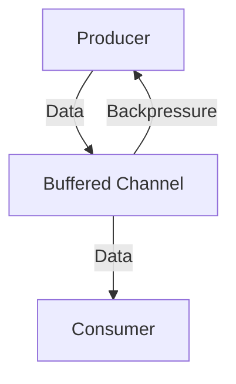

## 16.4.1 Understanding Backpressure

In the realm of asynchronous and reactive programming, **backpressure** is a pivotal concept that ensures the stability and efficiency of data processing systems. As experienced Java developers transitioning to Clojure, understanding backpressure will help you design systems that can handle varying loads gracefully, preventing resource exhaustion and maintaining performance.

### What is Backpressure?

Backpressure refers to the mechanism by which a system regulates the flow of data between producers and consumers. In asynchronous systems, producers often generate data at a rate that consumers cannot match. Without a backpressure mechanism, this imbalance can lead to memory overflow, resource exhaustion, and ultimately, system failure.

**Key Concepts:**
- **Producer**: An entity that generates data.
- **Consumer**: An entity that processes data.
- **Flow Control**: Techniques to manage the rate of data flow between producers and consumers.

### Why is Backpressure Important?

Backpressure is crucial in asynchronous systems for several reasons:

1. **Resource Management**: Prevents memory overflow by controlling the data flow rate.
2. **System Stability**: Maintains system stability by avoiding bottlenecks and resource exhaustion.
3. **Performance Optimization**: Ensures optimal performance by balancing load across the system.

### Scenarios Illustrating Backpressure

Consider a scenario where a producer generates data at a high rate, such as a sensor streaming data to a processing unit. If the consumer cannot process data at the same rate, the unprocessed data accumulates, leading to memory overflow.

#### Example: Data Stream Processing

Imagine a real-time analytics system where data from multiple sensors is aggregated and processed. If the processing unit (consumer) cannot keep up with the incoming data (producer), the system needs a way to handle the excess data without crashing.

### Backpressure in Java vs. Clojure

Java developers may be familiar with traditional concurrency mechanisms like blocking queues and thread pools to manage data flow. However, these approaches can be cumbersome and may not scale well in highly asynchronous environments.

Clojure, with its functional programming paradigm, offers more elegant solutions for handling backpressure, leveraging its concurrency primitives and libraries like `core.async`.

#### Java Example: Blocking Queue

```java
import java.util.concurrent.BlockingQueue;
import java.util.concurrent.LinkedBlockingQueue;

public class BackpressureExample {
    public static void main(String[] args) {
        BlockingQueue<String> queue = new LinkedBlockingQueue<>(10);

        // Producer
        new Thread(() -> {
            try {
                while (true) {
                    queue.put("Data");
                    System.out.println("Produced Data");
                }
            } catch (InterruptedException e) {
                Thread.currentThread().interrupt();
            }
        }).start();

        // Consumer
        new Thread(() -> {
            try {
                while (true) {
                    String data = queue.take();
                    System.out.println("Consumed " + data);
                }
            } catch (InterruptedException e) {
                Thread.currentThread().interrupt();
            }
        }).start();
    }
}
```

**Explanation**: In this Java example, a `BlockingQueue` is used to manage the flow of data between a producer and a consumer. The queue size limits the number of unprocessed items, providing a basic form of backpressure.

#### Clojure Example: core.async Channels

```clojure
(require '[clojure.core.async :as async])

(let [ch (async/chan 10)] ; Channel with buffer size 10
  ;; Producer
  (async/go-loop []
    (when (async/>! ch "Data")
      (println "Produced Data")
      (recur)))

  ;; Consumer
  (async/go-loop []
    (when-let [data (async/<! ch)]
      (println "Consumed" data)
      (recur))))
```

**Explanation**: In Clojure, `core.async` channels provide a more flexible and composable way to handle backpressure. The channel's buffer size controls the flow of data, similar to a blocking queue, but with more idiomatic Clojure constructs.

### How Clojure Handles Backpressure

Clojure's `core.async` library is a powerful tool for managing asynchronous data flow and backpressure. It provides channels, which are queues that can be used to communicate between different parts of a program, and go blocks, which are lightweight threads for asynchronous operations.

#### Channels and Buffers

Channels in `core.async` can be buffered or unbuffered. Buffered channels can hold a fixed number of items, providing a natural way to implement backpressure.

- **Buffered Channels**: Limit the number of items that can be queued, providing backpressure.
- **Unbuffered Channels**: Require a consumer to be ready to receive each item, naturally slowing down the producer.

#### Go Blocks and Parking

Go blocks in `core.async` allow for non-blocking asynchronous operations. When a go block tries to put an item into a full channel, it "parks" until space becomes available, effectively implementing backpressure.

```clojure
(let [ch (async/chan 10)]
  (async/go-loop []
    (when (async/>! ch "Data")
      (println "Produced Data")
      (recur)))

  (async/go-loop []
    (when-let [data (async/<! ch)]
      (println "Consumed" data)
      (recur))))
```

**Explanation**: In this example, the producer go block will park if the channel buffer is full, waiting for the consumer to process some items and make space available.

### Visualizing Backpressure

Below is a diagram illustrating the flow of data between a producer and a consumer, with backpressure applied through a buffered channel.



**Diagram Explanation**: The diagram shows how data flows from the producer to the consumer through a buffered channel. When the channel is full, backpressure is applied, slowing down the producer.

### Best Practices for Managing Backpressure

1. **Use Appropriate Buffer Sizes**: Choose buffer sizes based on expected data rates and processing capabilities.
2. **Monitor System Performance**: Continuously monitor system performance to adjust buffer sizes and processing rates.
3. **Implement Graceful Degradation**: Design systems to degrade gracefully under load, prioritizing critical data.
4. **Leverage Clojure's Concurrency Primitives**: Use `core.async` channels and go blocks to manage data flow effectively.

### Try It Yourself

Experiment with the Clojure example by changing the buffer size of the channel and observing how it affects the producer and consumer behavior. Try adding delays to simulate varying processing times.

### Further Reading

- [Clojure Official Documentation](https://clojure.org/reference/documentation)
- [ClojureDocs](https://clojuredocs.org/)
- [core.async GitHub Repository](https://github.com/clojure/core.async)

### Exercises

1. Modify the Clojure example to use an unbuffered channel. What changes do you observe in the producer-consumer interaction?
2. Implement a priority queue using `core.async` channels to handle high-priority data differently.
3. Create a system with multiple producers and consumers. How does backpressure affect the overall system performance?

### Key Takeaways

- **Backpressure** is essential for managing data flow in asynchronous systems, preventing resource exhaustion.
- Clojure's `core.async` library provides powerful tools for implementing backpressure through channels and go blocks.
- Understanding and managing backpressure is crucial for building robust and efficient asynchronous systems.

By mastering backpressure in Clojure, you'll be well-equipped to design systems that handle varying loads gracefully, ensuring stability and performance.

Now that we've explored how backpressure works in Clojure, let's apply these concepts to build more resilient and efficient asynchronous systems.

## Quiz: Mastering Backpressure in Clojure



### What is backpressure in the context of asynchronous systems?

- [x] A mechanism to regulate data flow between producers and consumers
- [ ] A method to increase data production rate
- [ ] A technique to reduce memory usage
- [ ] A way to prioritize data processing

> **Explanation:** Backpressure is a mechanism to regulate the flow of data between producers and consumers, ensuring system stability and preventing resource exhaustion.

### Why is backpressure important in asynchronous systems?

- [x] It prevents memory overflow and resource exhaustion
- [ ] It increases data processing speed
- [ ] It simplifies code structure
- [ ] It reduces the need for error handling

> **Explanation:** Backpressure is crucial because it prevents memory overflow and resource exhaustion by managing the data flow rate.

### How does Clojure's `core.async` handle backpressure?

- [x] By using buffered channels to control data flow
- [ ] By increasing the number of threads
- [ ] By reducing data production rate
- [ ] By prioritizing consumer tasks

> **Explanation:** Clojure's `core.async` handles backpressure using buffered channels, which limit the number of items that can be queued.

### What happens when a go block in Clojure tries to put an item into a full channel?

- [x] It parks until space becomes available
- [ ] It throws an exception
- [ ] It discards the item
- [ ] It creates a new channel

> **Explanation:** When a go block tries to put an item into a full channel, it parks until space becomes available, effectively implementing backpressure.

### Which of the following is a best practice for managing backpressure?

- [x] Use appropriate buffer sizes
- [ ] Increase data production rate
- [ ] Reduce consumer processing speed
- [ ] Ignore system performance metrics

> **Explanation:** Using appropriate buffer sizes is a best practice for managing backpressure, ensuring that the system can handle data flow efficiently.

### In Java, what is a common way to implement backpressure?

- [x] Using a BlockingQueue
- [ ] Increasing thread pool size
- [ ] Reducing data production rate
- [ ] Prioritizing consumer tasks

> **Explanation:** In Java, a common way to implement backpressure is by using a `BlockingQueue`, which limits the number of unprocessed items.

### How can you experiment with backpressure in Clojure?

- [x] Change the buffer size of a channel
- [ ] Increase the number of go blocks
- [ ] Reduce the number of producers
- [ ] Ignore consumer processing speed

> **Explanation:** You can experiment with backpressure in Clojure by changing the buffer size of a channel and observing the effects on producer-consumer interaction.

### What is the role of flow control in backpressure?

- [x] To manage the rate of data flow between producers and consumers
- [ ] To increase data production rate
- [ ] To reduce memory usage
- [ ] To prioritize data processing

> **Explanation:** Flow control manages the rate of data flow between producers and consumers, ensuring system stability and preventing resource exhaustion.

### What is a buffered channel in Clojure?

- [x] A channel with a fixed number of items it can hold
- [ ] A channel that requires a consumer to be ready for each item
- [ ] A channel that discards excess items
- [ ] A channel that increases data production rate

> **Explanation:** A buffered channel in Clojure is a channel with a fixed number of items it can hold, providing a natural way to implement backpressure.

### True or False: Backpressure is only relevant in Clojure systems.

- [ ] True
- [x] False

> **Explanation:** False. Backpressure is relevant in any asynchronous system where producers and consumers operate at different rates, not just in Clojure.


