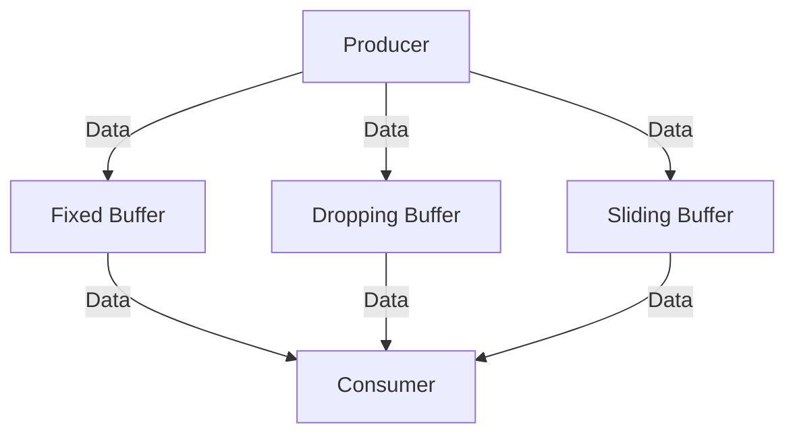
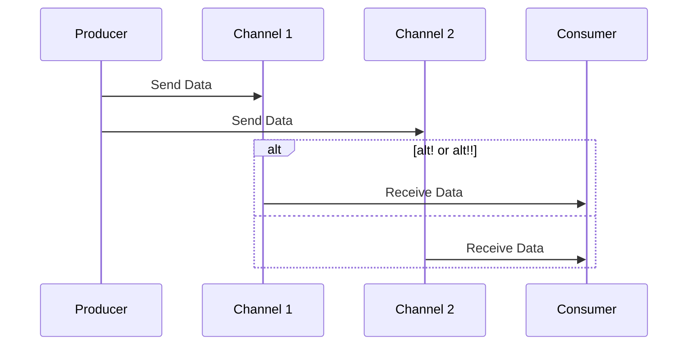

## 16.4.2 Implementing Backpressure with core.async

In the realm of asynchronous programming, **backpressure** is a crucial concept that ensures systems remain stable and responsive under varying loads. In Clojure, the `core.async` library provides powerful tools to manage backpressure effectively. This section will guide you through implementing backpressure using buffered channels, control flow mechanisms, and advanced techniques like `alt!` and `alt!!`.

### Understanding Backpressure

Backpressure is a mechanism to prevent overwhelming a system with more data than it can handle. It ensures that producers and consumers of data remain in sync, preventing resource exhaustion and maintaining system stability. In Java, backpressure is often managed using blocking queues or reactive streams. Clojure's `core.async` offers a more flexible approach with channels and buffers.

### Buffered Channels in core.async

Buffered channels in `core.async` allow you to control the flow of data between producers and consumers. By using different types of buffers, you can manage how data is stored and processed.

#### Types of Buffers

1. **Fixed Buffers**: These have a fixed size and block the producer when full.
2. **Dropping Buffers**: These discard new data when full, preventing blocking.
3. **Sliding Buffers**: These remove the oldest data to make room for new data when full.

Let's explore how these buffers work with code examples.

#### Fixed Buffers

Fixed buffers are straightforward and block the producer when the buffer is full. This is similar to Java's `BlockingQueue`.

```clojure
(require '[clojure.core.async :refer [chan >!! <!!]])

;; Create a channel with a fixed buffer of size 3
(def fixed-buffer-channel (chan 3))

;; Producer: Puts data into the channel
(dotimes [i 5]
  (println "Putting" i "into fixed buffer")
  (>!! fixed-buffer-channel i))

;; Consumer: Takes data from the channel
(dotimes [_ 5]
  (println "Taking from fixed buffer:" (<!! fixed-buffer-channel)))
```

In this example, the producer will block when trying to put the fourth item into the channel, as the buffer size is only 3.

#### Dropping Buffers

Dropping buffers discard new data when the buffer is full, allowing the producer to continue without blocking.

```clojure
(require '[clojure.core.async :refer [chan >!! <!! dropping-buffer]])

;; Create a channel with a dropping buffer of size 3
(def dropping-buffer-channel (chan (dropping-buffer 3)))

;; Producer: Puts data into the channel
(dotimes [i 5]
  (println "Putting" i "into dropping buffer")
  (>!! dropping-buffer-channel i))

;; Consumer: Takes data from the channel
(dotimes [_ 5]
  (println "Taking from dropping buffer:" (<!! dropping-buffer-channel)))
```

Here, only the first three items will be stored, and the rest will be dropped.

#### Sliding Buffers

Sliding buffers remove the oldest data to make room for new data when full.

```clojure
(require '[clojure.core.async :refer [chan >!! <!! sliding-buffer]])

;; Create a channel with a sliding buffer of size 3
(def sliding-buffer-channel (chan (sliding-buffer 3)))

;; Producer: Puts data into the channel
(dotimes [i 5]
  (println "Putting" i "into sliding buffer")
  (>!! sliding-buffer-channel i))

;; Consumer: Takes data from the channel
(dotimes [_ 5]
  (println "Taking from sliding buffer:" (<!! sliding-buffer-channel)))
```

In this case, the last three items will be retained, and the first two will be discarded.

### Control Flow Mechanisms

In addition to buffers, `core.async` provides control flow mechanisms like `offer!`, `poll!`, and timeouts to manage backpressure.

#### Using `offer!` and `poll!`

- **`offer!`**: Non-blocking put operation that returns `true` if successful, `false` otherwise.
- **`poll!`**: Non-blocking take operation that returns `nil` if the channel is empty.

```clojure
(require '[clojure.core.async :refer [chan offer! poll!]])

(def control-channel (chan 3))

;; Attempt to put data into the channel without blocking
(println "Offer result:" (offer! control-channel 1))

;; Attempt to take data from the channel without blocking
(println "Poll result:" (poll! control-channel))
```

These functions are useful when you want to avoid blocking operations and handle backpressure gracefully.

#### Implementing Timeouts

Timeouts can be used to prevent indefinite blocking when waiting for data.

```clojure
(require '[clojure.core.async :refer [chan timeout alt!!]])

(def timeout-channel (chan))

;; Use alt!! to wait for data or timeout
(alt!!
  timeout-channel ([v] (println "Received:" v))
  (timeout 1000) (println "Timeout occurred"))
```

In this example, if no data is received within 1000 milliseconds, a timeout message is printed.

### Advanced Techniques with `alt!` and `alt!!`

The `alt!` and `alt!!` functions allow you to handle multiple channels and timeouts simultaneously, providing a powerful way to manage complex asynchronous workflows.

#### Using `alt!` for Non-blocking Operations

`alt!` is used for non-blocking operations, allowing you to choose between multiple channels.

```clojure
(require '[clojure.core.async :refer [chan alt!]])

(def channel-a (chan))
(def channel-b (chan))

;; Use alt! to choose between multiple channels
(alt!
  channel-a ([v] (println "Received from channel-a:" v))
  channel-b ([v] (println "Received from channel-b:" v)))
```

#### Using `alt!!` for Blocking Operations

`alt!!` is similar to `alt!` but is used for blocking operations.

```clojure
(require '[clojure.core.async :refer [chan alt!!]])

(def blocking-channel-a (chan))
(def blocking-channel-b (chan))

;; Use alt!! to block until a value is received from one of the channels
(alt!!
  blocking-channel-a ([v] (println "Received from blocking-channel-a:" v))
  blocking-channel-b ([v] (println "Received from blocking-channel-b:" v)))
```

### Managing Overflow with Dropping and Sliding Buffers

When dealing with high-throughput systems, managing overflow is critical. Dropping and sliding buffers provide strategies to handle excess data without blocking producers.

#### Dropping Buffers in Practice

Dropping buffers are ideal when data loss is acceptable, such as in logging systems.

```clojure
(require '[clojure.core.async :refer [chan dropping-buffer >!!]])

(def log-channel (chan (dropping-buffer 100)))

;; Simulate high-frequency logging
(dotimes [i 200]
  (println "Logging event" i)
  (>!! log-channel i))
```

#### Sliding Buffers in Practice

Sliding buffers are useful when the most recent data is more important than older data, such as in real-time analytics.

```clojure
(require '[clojure.core.async :refer [chan sliding-buffer >!!]])

(def analytics-channel (chan (sliding-buffer 100)))

;; Simulate real-time data feed
(dotimes [i 200]
  (println "Processing data point" i)
  (>!! analytics-channel i))
```

### Try It Yourself

Experiment with the code examples provided. Try changing buffer sizes, using different buffer types, and implementing your own control flow mechanisms. Observe how these changes affect the behavior of your channels and the flow of data.

### Diagrams and Visualizations

To better understand the flow of data and the role of buffers, let's visualize these concepts using Mermaid.js diagrams.

#### Buffer Types and Data Flow



*Diagram 1: This diagram illustrates how data flows through different types of buffers in core.async.*

#### Control Flow with alt! and alt!!



*Diagram 2: This sequence diagram shows how alt! and alt!! can be used to handle multiple channels.*

### Further Reading

For more in-depth information on `core.async` and backpressure, consider exploring the following resources:

- [Official Clojure Documentation](https://clojure.org/reference/async)
- [ClojureDocs on core.async](https://clojuredocs.org/clojure.core.async)
- [GitHub - core.async Examples](https://github.com/clojure/core.async)

### Exercises

1. **Modify Buffer Sizes**: Change the buffer sizes in the examples and observe how it affects the flow of data.
2. **Implement Custom Control Flow**: Create a custom control flow mechanism using `offer!` and `poll!`.
3. **Simulate High Load**: Simulate a high-load scenario and use dropping and sliding buffers to manage overflow.

### Key Takeaways

- **Backpressure** is essential for maintaining system stability in asynchronous programming.
- **Buffered channels** in `core.async` provide various strategies to manage data flow and prevent overflow.
- **Control flow mechanisms** like `offer!`, `poll!`, and `alt!`/`alt!!` offer flexible ways to handle multiple channels and timeouts.
- **Dropping and sliding buffers** are effective for managing overflow in high-throughput systems.

By mastering these concepts, you'll be well-equipped to handle backpressure in your Clojure applications, ensuring they remain responsive and efficient under load.

---

## Quiz: Mastering Backpressure with core.async



### What is the primary purpose of backpressure in asynchronous systems?

- [x] To prevent overwhelming the system with more data than it can handle
- [ ] To increase the speed of data processing
- [ ] To reduce the memory usage of the system
- [ ] To simplify the code structure

> **Explanation:** Backpressure is used to prevent overwhelming a system with more data than it can handle, ensuring stability and responsiveness.

### Which type of buffer in core.async discards new data when full?

- [ ] Fixed Buffer
- [x] Dropping Buffer
- [ ] Sliding Buffer
- [ ] Expanding Buffer

> **Explanation:** Dropping buffers discard new data when full, allowing the producer to continue without blocking.

### What does the `offer!` function do in core.async?

- [x] Performs a non-blocking put operation on a channel
- [ ] Performs a blocking put operation on a channel
- [ ] Performs a non-blocking take operation on a channel
- [ ] Performs a blocking take operation on a channel

> **Explanation:** `offer!` is a non-blocking put operation that returns `true` if successful, `false` otherwise.

### How does a sliding buffer manage overflow?

- [ ] By blocking the producer
- [ ] By discarding new data
- [x] By removing the oldest data to make room for new data
- [ ] By expanding the buffer size

> **Explanation:** Sliding buffers remove the oldest data to make room for new data when full.

### Which function is used for blocking operations with multiple channels?

- [ ] alt!
- [x] alt!!
- [ ] offer!
- [ ] poll!

> **Explanation:** `alt!!` is used for blocking operations, allowing you to choose between multiple channels.

### In the context of core.async, what is a fixed buffer?

- [x] A buffer with a fixed size that blocks the producer when full
- [ ] A buffer that discards new data when full
- [ ] A buffer that removes the oldest data when full
- [ ] A buffer that dynamically adjusts its size

> **Explanation:** A fixed buffer has a set size and blocks the producer when it reaches capacity.

### What is the purpose of using timeouts in core.async?

- [ ] To increase the speed of data processing
- [x] To prevent indefinite blocking when waiting for data
- [ ] To reduce memory usage
- [ ] To simplify code structure

> **Explanation:** Timeouts are used to prevent indefinite blocking when waiting for data, ensuring the system remains responsive.

### Which buffer type is ideal for logging systems where data loss is acceptable?

- [ ] Fixed Buffer
- [x] Dropping Buffer
- [ ] Sliding Buffer
- [ ] Expanding Buffer

> **Explanation:** Dropping buffers are ideal for logging systems where data loss is acceptable, as they discard new data when full.

### How can you handle multiple channels simultaneously in core.async?

- [ ] Using poll!
- [ ] Using offer!
- [x] Using alt! or alt!!
- [ ] Using timeout

> **Explanation:** `alt!` and `alt!!` allow you to handle multiple channels simultaneously, providing flexibility in managing asynchronous workflows.

### True or False: Sliding buffers block the producer when full.

- [ ] True
- [x] False

> **Explanation:** Sliding buffers do not block the producer; they remove the oldest data to make room for new data when full.


