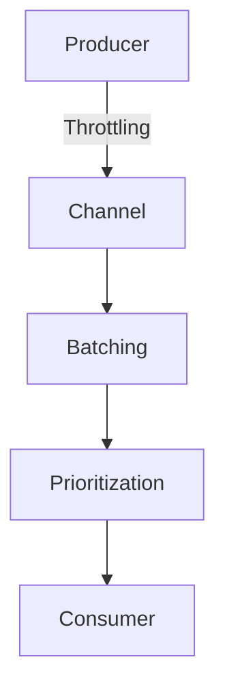

## 16.4.3 Flow Control Strategies

In the realm of asynchronous programming, managing the flow of data efficiently is crucial to building responsive and resilient systems. Flow control strategies help us handle the rate at which data is produced and consumed, ensuring that our systems remain stable and performant. In this section, we'll explore various flow control strategies such as throttling producers, batching messages, and prioritizing tasks, with practical examples using Clojure's `core.async` library.

### Understanding Flow Control

Flow control is the process of managing the rate of data transmission between producers and consumers in a system. Without proper flow control, a fast producer can overwhelm a slower consumer, leading to resource exhaustion and degraded performance. Flow control strategies are essential in asynchronous systems where tasks are executed concurrently, and the timing of data production and consumption can vary.

#### Key Concepts in Flow Control

- **Throttling**: Limiting the rate at which data is produced or consumed to prevent overwhelming the system.
- **Batching**: Grouping multiple data items into a single batch to process them together, reducing overhead and improving efficiency.
- **Prioritization**: Assigning different priorities to tasks or data items to ensure that critical tasks are processed first.

### Throttling Producers

Throttling is a technique used to control the rate at which data is produced. It is particularly useful when dealing with high-throughput systems where the producer can generate data faster than the consumer can process it. By throttling the producer, we can prevent resource exhaustion and ensure that the system remains responsive.

#### Implementing Throttling with `core.async`

In Clojure, we can use `core.async` to implement throttling by introducing delays in the data production process. Here's an example of how to throttle a producer using `core.async`:

```clojure
(require '[clojure.core.async :refer [chan go >! <! timeout]])

(defn throttled-producer [out-chan delay-ms]
  (go
    (loop [i 0]
      (>! out-chan i) ; Send data to the channel
      (<! (timeout delay-ms)) ; Introduce a delay
      (recur (inc i)))))

(defn consumer [in-chan]
  (go
    (loop []
      (when-let [value (<! in-chan)]
        (println "Consumed:" value)
        (recur)))))

(let [ch (chan)]
  (throttled-producer ch 1000) ; Throttle producer to 1 message per second
  (consumer ch))
```

In this example, the `throttled-producer` function sends integers to the `out-chan` at a rate of one message per second, controlled by the `timeout` function. The consumer simply prints each received value.

### Batching Messages

Batching is a strategy that involves grouping multiple data items into a single batch for processing. This approach can reduce the overhead associated with processing each item individually and improve throughput.

#### Implementing Batching with `core.async`

We can implement batching in `core.async` by accumulating messages in a buffer and processing them together. Here's an example:

```clojure
(require '[clojure.core.async :refer [chan go >! <! timeout]])

(defn batch-producer [out-chan batch-size]
  (go
    (loop [batch []]
      (when (< (count batch) batch-size)
        (let [value (rand-int 100)]
          (recur (conj batch value))))
      (>! out-chan batch)
      (<! (timeout 1000)) ; Wait before producing the next batch
      (recur []))))

(defn batch-consumer [in-chan]
  (go
    (loop []
      (when-let [batch (<! in-chan)]
        (println "Consumed batch:" batch)
        (recur)))))

(let [ch (chan)]
  (batch-producer ch 5) ; Produce batches of 5 items
  (batch-consumer ch))
```

In this example, the `batch-producer` function generates batches of random integers and sends them to the `out-chan`. The consumer processes each batch as a whole.

### Prioritizing Tasks

Prioritization is a strategy that involves assigning different priorities to tasks or data items, ensuring that high-priority tasks are processed before lower-priority ones. This strategy is useful in systems where certain tasks are more critical than others.

#### Implementing Prioritization with `core.async`

To implement prioritization, we can use multiple channels, each representing a different priority level. Here's an example:

```clojure
(require '[clojure.core.async :refer [chan go >! <! alts!]])

(defn prioritized-producer [high-chan low-chan]
  (go
    (loop [i 0]
      (if (even? i)
        (>! high-chan i) ; Send even numbers to high-priority channel
        (>! low-chan i)) ; Send odd numbers to low-priority channel
      (<! (timeout 500))
      (recur (inc i)))))

(defn prioritized-consumer [high-chan low-chan]
  (go
    (loop []
      (let [[value ch] (alts! [high-chan low-chan])]
        (println "Consumed from" (if (= ch high-chan) "high" "low") "priority:" value)
        (recur)))))

(let [high-chan (chan)
      low-chan (chan)]
  (prioritized-producer high-chan low-chan)
  (prioritized-consumer high-chan low-chan))
```

In this example, the `prioritized-producer` sends even numbers to a high-priority channel and odd numbers to a low-priority channel. The consumer uses `alts!` to prioritize messages from the high-priority channel.

### Visualizing Flow Control Strategies

To better understand these strategies, let's visualize the flow of data through a system using a Mermaid.js diagram.



**Diagram Description**: This diagram illustrates the flow of data through a system with throttling, batching, and prioritization. The producer generates data, which is throttled before being sent to a channel. The data is then batched and prioritized before being consumed.

### Comparing with Java

In Java, flow control is often managed using thread pools, rate limiters, and priority queues. While these tools are effective, they can be more complex to implement and manage compared to Clojure's `core.async`, which provides a more declarative and functional approach to flow control.

#### Java Example: Throttling with ScheduledExecutorService

```java
import java.util.concurrent.Executors;
import java.util.concurrent.ScheduledExecutorService;
import java.util.concurrent.TimeUnit;

public class ThrottledProducer {
    private final ScheduledExecutorService scheduler = Executors.newScheduledThreadPool(1);

    public void start() {
        scheduler.scheduleAtFixedRate(() -> {
            System.out.println("Produced: " + System.currentTimeMillis());
        }, 0, 1, TimeUnit.SECONDS);
    }

    public static void main(String[] args) {
        new ThrottledProducer().start();
    }
}
```

In this Java example, we use a `ScheduledExecutorService` to throttle the production of messages, similar to the `timeout` function in Clojure.

### Try It Yourself

Experiment with the Clojure examples by modifying the delay in the throttled producer or changing the batch size in the batch producer. Observe how these changes affect the flow of data through the system.

### Exercises

1. **Implement a Rate Limiter**: Create a Clojure function that limits the rate of data consumption to a specified number of items per second.
2. **Batch Processing with Prioritization**: Combine batching and prioritization strategies to process high-priority batches before low-priority ones.
3. **Dynamic Throttling**: Implement a dynamic throttling mechanism that adjusts the rate based on system load.

### Key Takeaways

- Flow control strategies such as throttling, batching, and prioritization are essential for managing data flow in asynchronous systems.
- Clojure's `core.async` provides a powerful and flexible way to implement these strategies using channels and go blocks.
- By understanding and applying these strategies, we can build more resilient and efficient systems.

For further reading, explore the [Official Clojure Documentation](https://clojure.org/reference/async) and [ClojureDocs](https://clojuredocs.org/clojure.core.async).

---

## Quiz: Mastering Flow Control Strategies in Clojure



### What is the primary purpose of flow control in asynchronous systems?

- [x] To manage the rate of data transmission between producers and consumers
- [ ] To increase the speed of data processing
- [ ] To reduce the complexity of code
- [ ] To ensure data security

> **Explanation:** Flow control is used to manage the rate of data transmission to prevent overwhelming the system.


### Which Clojure library is commonly used for implementing flow control strategies?

- [x] core.async
- [ ] clojure.java.jdbc
- [ ] clojure.spec
- [ ] clojure.test

> **Explanation:** `core.async` is a Clojure library that provides tools for asynchronous programming, including flow control strategies.


### How does throttling help in flow control?

- [x] By limiting the rate at which data is produced or consumed
- [ ] By increasing the speed of data processing
- [ ] By reducing the number of data items
- [ ] By prioritizing certain tasks

> **Explanation:** Throttling limits the rate of data production or consumption to prevent overwhelming the system.


### What is the benefit of batching messages in flow control?

- [x] Reducing overhead and improving efficiency
- [ ] Increasing the speed of data processing
- [ ] Ensuring data security
- [ ] Simplifying code complexity

> **Explanation:** Batching reduces overhead by processing multiple data items together, improving efficiency.


### In Clojure, which function is used to introduce a delay in data production?

- [x] timeout
- [ ] delay
- [ ] future
- [ ] promise

> **Explanation:** The `timeout` function in `core.async` is used to introduce a delay in data production.


### What is the purpose of prioritization in flow control?

- [x] To ensure that high-priority tasks are processed before lower-priority ones
- [ ] To increase the speed of data processing
- [ ] To reduce the number of data items
- [ ] To ensure data security

> **Explanation:** Prioritization ensures that critical tasks are processed first, maintaining system responsiveness.


### Which Clojure function can be used to handle multiple channels with different priorities?

- [x] alts!
- [ ] go
- [ ] chan
- [ ] >!

> **Explanation:** The `alts!` function is used to handle multiple channels, allowing prioritization of data processing.


### How does `core.async` compare to Java's thread pools for flow control?

- [x] It provides a more declarative and functional approach
- [ ] It is more complex to implement
- [ ] It is less efficient
- [ ] It is not suitable for asynchronous programming

> **Explanation:** `core.async` offers a declarative and functional approach to flow control, simplifying implementation compared to Java's thread pools.


### What is a common use case for batching in asynchronous systems?

- [x] Grouping multiple data items for processing together
- [ ] Increasing the speed of data processing
- [ ] Ensuring data security
- [ ] Simplifying code complexity

> **Explanation:** Batching is used to group multiple data items for processing together, reducing overhead.


### True or False: Throttling can prevent resource exhaustion in high-throughput systems.

- [x] True
- [ ] False

> **Explanation:** Throttling limits the rate of data production, preventing resource exhaustion in high-throughput systems.


