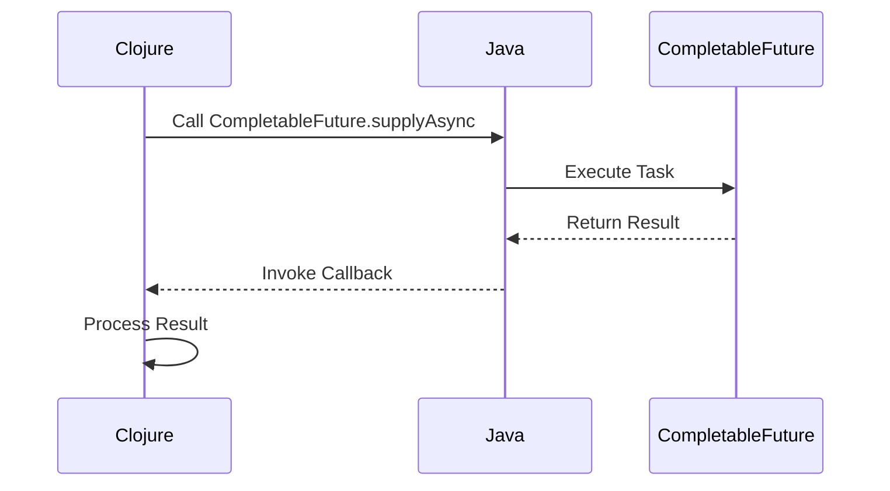

## 16.5.1 Working with Java Futures and Callbacks

As experienced Java developers, you are likely familiar with Java's asynchronous programming constructs, such as `CompletableFuture` and callback-based interfaces. In this section, we will explore how to integrate these Java asynchronous APIs with Clojure's concurrency model, focusing on the challenges and solutions for bridging callback-based models with Clojure's channel-based concurrency.

### Understanding Java's Asynchronous Constructs

Java provides several mechanisms for asynchronous programming, with `CompletableFuture` being one of the most prominent. It allows you to write non-blocking code by providing a way to execute tasks asynchronously and handle their results once they are completed.

#### CompletableFuture

`CompletableFuture` is a flexible and powerful tool for asynchronous programming in Java. It allows you to create a future that can be completed manually or through a series of asynchronous computations.

```java
import java.util.concurrent.CompletableFuture;

public class CompletableFutureExample {
    public static void main(String[] args) {
        CompletableFuture<String> future = CompletableFuture.supplyAsync(() -> {
            // Simulate a long-running task
            return "Hello, World!";
        });

        future.thenAccept(result -> {
            // Handle the result
            System.out.println(result);
        });

        // Keep the main thread alive to see the result
        future.join();
    }
}
```

In this example, `supplyAsync` is used to run a task asynchronously, and `thenAccept` is a callback that processes the result once it's available.

#### Callback-Based Interfaces

Java also supports callback-based programming, where a method takes a callback function as an argument and invokes it once a task is complete. This pattern is common in libraries that perform asynchronous operations.

```java
interface Callback {
    void onComplete(String result);
}

class AsyncOperation {
    void performAsync(Callback callback) {
        new Thread(() -> {
            // Simulate a long-running task
            String result = "Task Completed";
            callback.onComplete(result);
        }).start();
    }
}

public class CallbackExample {
    public static void main(String[] args) {
        AsyncOperation operation = new AsyncOperation();
        operation.performAsync(result -> System.out.println(result));
    }
}
```

### Integrating Java's Asynchronous APIs with Clojure

Clojure provides its own set of concurrency primitives, such as `core.async`, which uses channels to manage asynchronous operations. Integrating Java's asynchronous APIs with Clojure involves bridging these two models.

#### Using CompletableFuture in Clojure

To use `CompletableFuture` in Clojure, we can leverage Clojure's Java interoperability features. Here's how you can create and handle a `CompletableFuture` in Clojure:

```clojure
(import '[java.util.concurrent CompletableFuture])

(defn async-task []
  (CompletableFuture/supplyAsync
    (reify java.util.function.Supplier
      (get [_]
        ;; Simulate a long-running task
        "Hello from Clojure!"))))

(defn handle-result [future]
  (.thenAccept future
    (reify java.util.function.Consumer
      (accept [_ result]
        ;; Handle the result
        (println result)))))

(def future (async-task))
(handle-result future)

;; Keep the main thread alive to see the result
(.join future)
```

**Explanation:**

- **`CompletableFuture/supplyAsync`**: Initiates an asynchronous task.
- **`reify`**: Creates an anonymous implementation of Java interfaces, allowing us to define the behavior of `Supplier` and `Consumer`.
- **`.thenAccept`**: Registers a callback to process the result.

#### Bridging Callback-Based Interfaces

To handle callback-based interfaces in Clojure, we can use `reify` to implement the callback interface and pass it to the Java method.

```clojure
(import '[java.util.concurrent Executors])

(defn perform-async [callback]
  (let [executor (Executors/newSingleThreadExecutor)]
    (.submit executor
      (fn []
        ;; Simulate a long-running task
        (Thread/sleep 1000)
        (.onComplete callback "Task Completed")))))

(defn callback-handler []
  (reify Callback
    (onComplete [_ result]
      ;; Handle the result
      (println result))))

(perform-async (callback-handler))
```

**Explanation:**

- **`reify Callback`**: Implements the `Callback` interface in Clojure.
- **`perform-async`**: Executes the task asynchronously and invokes the callback upon completion.

### Challenges of Bridging Callback-Based Models

Integrating callback-based models with Clojure's channel-based concurrency can present several challenges:

1. **Callback Hell**: Deeply nested callbacks can lead to complex and hard-to-read code.
2. **Error Handling**: Managing errors in callback chains can be cumbersome.
3. **State Management**: Maintaining state across asynchronous operations can be tricky.

### Solutions and Best Practices

To address these challenges, consider the following solutions and best practices:

#### Use Promises for Better Control

Clojure's `promise` can be used to manage asynchronous results more effectively, providing a way to deliver a value to a future computation.

```clojure
(defn async-operation []
  (let [p (promise)]
    (future
      ;; Simulate a long-running task
      (Thread/sleep 1000)
      (deliver p "Operation Complete"))
    p))

(let [result (async-operation)]
  (println "Waiting for result...")
  (println @result))
```

**Explanation:**

- **`promise`**: Creates a promise that can be delivered a value.
- **`deliver`**: Sets the value of the promise.
- **`@`**: Dereferences the promise to obtain its value.

#### Use core.async for Channel-Based Concurrency

Clojure's `core.async` library provides a powerful way to manage concurrency using channels, which can help avoid callback hell.

```clojure
(require '[clojure.core.async :refer [go chan >! <!]])

(defn async-channel-operation []
  (let [c (chan)]
    (go
      ;; Simulate a long-running task
      (Thread/sleep 1000)
      (>! c "Channel Operation Complete"))
    c))

(let [c (async-channel-operation)]
  (println "Waiting for channel result...")
  (println (<!! c)))
```

**Explanation:**

- **`chan`**: Creates a new channel.
- **`go`**: Launches a concurrent process.
- **`>!` and `<!!`**: Put and take operations on the channel.

#### Error Handling with Try-Catch

Use try-catch blocks to manage errors in asynchronous operations, ensuring that exceptions are caught and handled appropriately.

```clojure
(defn safe-async-task []
  (try
    (CompletableFuture/supplyAsync
      (reify java.util.function.Supplier
        (get [_]
          ;; Simulate a task that might fail
          (if (< (rand) 0.5)
            (throw (Exception. "Random Failure"))
            "Success")))
      (.exceptionally
        (reify java.util.function.Function
          (apply [_ ex]
            ;; Handle the exception
            (str "Error: " (.getMessage ex))))))
    (catch Exception e
      (println "Caught exception:" (.getMessage e)))))
```

**Explanation:**

- **`try-catch`**: Catches exceptions thrown during asynchronous operations.
- **`.exceptionally`**: Provides a way to handle exceptions in `CompletableFuture`.

### Visualizing the Flow of Asynchronous Operations

To better understand the flow of asynchronous operations, let's visualize the process using a sequence diagram.



**Diagram Description**: This sequence diagram illustrates the flow of an asynchronous operation using `CompletableFuture`. Clojure initiates the task, Java executes it, and the result is returned to Clojure for processing.

### Try It Yourself

To deepen your understanding, try modifying the code examples:

- Change the task duration in the `CompletableFuture` example and observe the behavior.
- Implement a callback-based interface with multiple methods and handle them in Clojure.
- Use `core.async` to manage multiple asynchronous tasks and synchronize their results.

### Further Reading

For more information on Clojure's concurrency model and Java interoperability, consider the following resources:

- [Official Clojure Documentation](https://clojure.org/reference/documentation)
- [ClojureDocs](https://clojuredocs.org/)
- [Java CompletableFuture Documentation](https://docs.oracle.com/javase/8/docs/api/java/util/concurrent/CompletableFuture.html)

### Exercises

1. Implement a Clojure function that uses `CompletableFuture` to perform multiple asynchronous tasks and combine their results.
2. Create a callback-based interface in Java and implement it in Clojure using `reify`.
3. Use `core.async` to build a simple producer-consumer model and visualize the data flow.

### Key Takeaways

- **Java's Asynchronous Constructs**: `CompletableFuture` and callback-based interfaces are powerful tools for non-blocking programming.
- **Clojure Integration**: Use Clojure's Java interoperability features to work with these constructs.
- **Challenges and Solutions**: Address callback hell, error handling, and state management with promises and `core.async`.
- **Best Practices**: Leverage Clojure's concurrency model for cleaner, more maintainable asynchronous code.

By integrating Java's asynchronous APIs with Clojure, you can harness the strengths of both languages to build efficient, scalable applications. Now that we've explored these concepts, let's apply them to create robust, concurrent systems.

## Quiz: Mastering Java Futures and Callbacks in Clojure



### What is the primary purpose of Java's CompletableFuture?

- [x] To perform asynchronous computations and handle their results
- [ ] To manage database connections
- [ ] To create graphical user interfaces
- [ ] To handle file I/O operations

> **Explanation:** CompletableFuture is designed for asynchronous programming, allowing tasks to be executed without blocking the main thread.

### How can you implement a Java interface in Clojure?

- [x] Using the `reify` function
- [ ] Using the `defn` function
- [ ] Using the `let` function
- [ ] Using the `fn` function

> **Explanation:** The `reify` function in Clojure allows you to create an anonymous implementation of a Java interface.

### What is a common challenge when working with callback-based models?

- [x] Callback hell
- [ ] Lack of concurrency
- [ ] Insufficient memory
- [ ] Slow execution

> **Explanation:** Callback hell refers to the complexity and difficulty in managing deeply nested callbacks.

### Which Clojure construct can be used to manage asynchronous results?

- [x] Promise
- [ ] Atom
- [ ] Ref
- [ ] Var

> **Explanation:** A promise in Clojure is used to manage asynchronous results by delivering a value to a future computation.

### What is the role of the `go` block in Clojure's core.async?

- [x] To launch a concurrent process
- [ ] To define a new function
- [ ] To create a new namespace
- [ ] To handle exceptions

> **Explanation:** The `go` block in core.async is used to start a concurrent process that can perform asynchronous operations.

### How can you handle exceptions in a CompletableFuture?

- [x] Using the `.exceptionally` method
- [ ] Using the `catch` keyword
- [ ] Using the `try` keyword
- [ ] Using the `finally` keyword

> **Explanation:** The `.exceptionally` method in CompletableFuture allows you to handle exceptions that occur during asynchronous operations.

### What is a benefit of using core.async channels in Clojure?

- [x] They help avoid callback hell
- [ ] They increase memory usage
- [ ] They slow down execution
- [ ] They require more code

> **Explanation:** Core.async channels provide a cleaner way to manage concurrency, helping to avoid the complexity of nested callbacks.

### What does the `deliver` function do in Clojure?

- [x] Sets the value of a promise
- [ ] Creates a new thread
- [ ] Defines a new function
- [ ] Initializes a new variable

> **Explanation:** The `deliver` function in Clojure is used to set the value of a promise, making it available to future computations.

### Which method is used to register a callback in a CompletableFuture?

- [x] `.thenAccept`
- [ ] `.get`
- [ ] `.join`
- [ ] `.wait`

> **Explanation:** The `.thenAccept` method in CompletableFuture is used to register a callback that processes the result once it's available.

### True or False: Clojure's `core.async` library is based on callback-based concurrency.

- [ ] True
- [x] False

> **Explanation:** Clojure's `core.async` library is based on channel-based concurrency, not callback-based concurrency.


