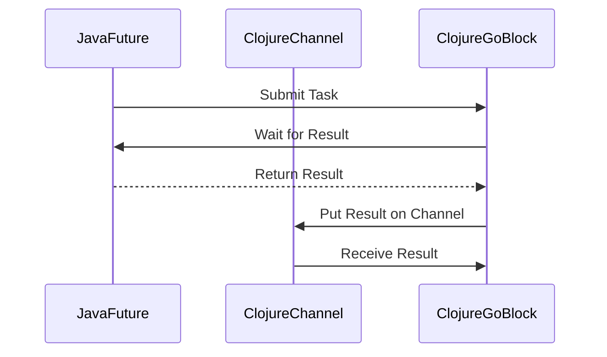

## 16.5.2 Asynchronous Interop Techniques

In this section, we will delve into the techniques for integrating Java's asynchronous APIs with Clojure's `core.async`. As experienced Java developers, you're likely familiar with Java's concurrency mechanisms, such as futures and callbacks. We'll explore how to convert these into `core.async` channels, allowing for seamless integration and efficient concurrency management in Clojure applications.

### Understanding Java's Asynchronous APIs

Java provides several mechanisms for asynchronous programming, including:

- **Futures**: Represent the result of an asynchronous computation. Futures can be obtained through the `ExecutorService` interface.
- **Callbacks**: Allow you to specify a function to be executed upon the completion of an asynchronous operation.

Let's start by examining how these concepts work in Java before transitioning to their Clojure counterparts.

#### Java Futures

A `Future` in Java is a placeholder for a result that will be available in the future. Here's a simple example of using a `Future` with an `ExecutorService`:

```java
import java.util.concurrent.*;

public class FutureExample {
    public static void main(String[] args) throws ExecutionException, InterruptedException {
        ExecutorService executor = Executors.newSingleThreadExecutor();
        Future<Integer> future = executor.submit(() -> {
            // Simulate long-running task
            Thread.sleep(1000);
            return 42;
        });

        // Do other work while the task is running

        // Get the result of the future
        Integer result = future.get();
        System.out.println("Result: " + result);

        executor.shutdown();
    }
}
```

In this example, a task is submitted to an executor, and a `Future` is returned. The `get()` method blocks until the result is available.

#### Java Callbacks

Callbacks in Java are often used in asynchronous APIs, such as those for network operations. Here's a simple example using a callback:

```java
public class CallbackExample {
    public static void main(String[] args) {
        performAsyncTask(result -> System.out.println("Callback received: " + result));
    }

    public static void performAsyncTask(Callback callback) {
        new Thread(() -> {
            try {
                // Simulate long-running task
                Thread.sleep(1000);
                callback.onComplete(42);
            } catch (InterruptedException e) {
                e.printStackTrace();
            }
        }).start();
    }

    interface Callback {
        void onComplete(int result);
    }
}
```

In this example, a callback interface is defined, and an asynchronous task is performed in a separate thread. The callback is invoked once the task is complete.

### Converting Java Futures to core.async Channels

Clojure's `core.async` library provides channels, which are powerful abstractions for managing concurrency. To integrate Java futures with `core.async`, we can convert futures into channels. This allows us to leverage Clojure's concurrency model while interacting with Java's asynchronous APIs.

#### Creating a Channel from a Future

To convert a Java `Future` into a `core.async` channel, we can use the `go` block to perform the asynchronous operation and put the result onto a channel. Here's how:

```clojure
(require '[clojure.core.async :refer [chan go <!]])

(defn future-to-channel [future]
  (let [c (chan)]
    (go
      (let [result (.get future)]
        (>! c result)))
    c))

;; Usage example
(let [executor (java.util.concurrent.Executors/newSingleThreadExecutor)
      future (.submit executor (fn [] (Thread/sleep 1000) 42))
      c (future-to-channel future)]
  (go
    (println "Result from channel:" (<! c)))
  (.shutdown executor))
```

**Explanation:**

- We define a function `future-to-channel` that takes a `Future` as an argument.
- A new channel `c` is created.
- Inside a `go` block, we wait for the future's result using `.get` and then put the result onto the channel using `>!`.
- The channel `c` is returned, allowing us to use it in a non-blocking manner.

### Wrapping Java Callbacks with core.async

Java callbacks can be wrapped into `core.async` channels by creating a channel and putting the callback result onto it. This approach allows us to handle asynchronous events in a more functional and composable way.

#### Creating a Channel from a Callback

Here's how you can wrap a Java callback into a `core.async` channel:

```clojure
(require '[clojure.core.async :refer [chan go >!]])

(defn callback-to-channel [callback-fn]
  (let [c (chan)]
    (callback-fn (reify Callback
                   (onComplete [_ result]
                     (go (>! c result)))))
    c))

;; Usage example
(let [c (callback-to-channel performAsyncTask)]
  (go
    (println "Callback result from channel:" (<! c))))
```

**Explanation:**

- We define a function `callback-to-channel` that takes a callback function `callback-fn`.
- A new channel `c` is created.
- The callback function is invoked with a reified `Callback` implementation that puts the result onto the channel.
- The channel `c` is returned for further processing.

### Utility Functions for Asynchronous Interop

To streamline the process of converting Java futures and callbacks into `core.async` channels, we can create utility functions or wrappers. These utilities can handle common patterns and edge cases, making it easier to integrate Java's asynchronous APIs with Clojure.

#### Utility Function for Futures

Here's a utility function that handles exceptions and timeouts when converting a future to a channel:

```clojure
(require '[clojure.core.async :refer [chan go >!]])

(defn future-to-channel-with-timeout [future timeout-ms]
  (let [c (chan)]
    (go
      (try
        (let [result (.get future timeout-ms java.util.concurrent.TimeUnit/MILLISECONDS)]
          (>! c {:status :success :result result}))
        (catch java.util.concurrent.TimeoutException e
          (>! c {:status :timeout :error e}))
        (catch Exception e
          (>! c {:status :error :error e}))))
    c))

;; Usage example
(let [executor (java.util.concurrent.Executors/newSingleThreadExecutor)
      future (.submit executor (fn [] (Thread/sleep 1000) 42))
      c (future-to-channel-with-timeout future 500)]
  (go
    (println "Future result:" (<! c)))
  (.shutdown executor))
```

**Explanation:**

- The function `future-to-channel-with-timeout` takes a `Future` and a timeout in milliseconds.
- Inside a `go` block, we attempt to get the future's result with a timeout.
- We handle `TimeoutException` and other exceptions, putting a map with status and result/error onto the channel.

#### Utility Function for Callbacks

Here's a utility function that wraps a callback-based API into a channel, handling errors gracefully:

```clojure
(require '[clojure.core.async :refer [chan go >!]])

(defn callback-to-channel-with-error-handling [callback-fn]
  (let [c (chan)]
    (try
      (callback-fn (reify Callback
                     (onComplete [_ result]
                       (go (>! c {:status :success :result result})))
                     (onError [_ error]
                       (go (>! c {:status :error :error error})))))
      (catch Exception e
        (go (>! c {:status :error :error e}))))
    c))

;; Usage example
(let [c (callback-to-channel-with-error-handling performAsyncTask)]
  (go
    (println "Callback result:" (<! c))))
```

**Explanation:**

- The function `callback-to-channel-with-error-handling` takes a callback function `callback-fn`.
- A channel `c` is created, and the callback function is invoked with a reified `Callback` that handles both success and error cases.
- Errors are caught and put onto the channel as maps with status and error information.

### Visualizing Asynchronous Interop

To better understand the flow of data and control in asynchronous interop, let's visualize the process using a sequence diagram.



**Diagram Description**: This sequence diagram illustrates the process of converting a Java future into a Clojure `core.async` channel. The task is submitted to the Java future, and the result is awaited in a Clojure `go` block. Once the result is available, it is put onto a channel for further processing.

### Try It Yourself

To deepen your understanding, try modifying the code examples:

1. **Change the Task Duration**: Modify the sleep duration in the Java future example to see how it affects the channel result timing.
2. **Add Error Handling**: Introduce an error condition in the callback example and observe how the error is propagated through the channel.
3. **Experiment with Timeouts**: Adjust the timeout in the `future-to-channel-with-timeout` function to see how it handles different scenarios.

### Exercises

1. **Convert a Java CompletableFuture**: Write a function to convert a Java `CompletableFuture` into a `core.async` channel.
2. **Wrap a Java API with Callbacks**: Choose a Java library with a callback-based API and wrap it into a `core.async` channel.
3. **Implement a Timeout Mechanism**: Extend the callback-to-channel utility to support timeouts.

### Key Takeaways

- **Seamless Integration**: Clojure's `core.async` allows for seamless integration with Java's asynchronous APIs, enabling efficient concurrency management.
- **Utility Functions**: Creating utility functions for converting futures and callbacks into channels simplifies the integration process and handles common patterns.
- **Error Handling**: Proper error handling is crucial when dealing with asynchronous operations, ensuring robustness and reliability.

By mastering these asynchronous interop techniques, you can effectively leverage both Java's and Clojure's strengths in building concurrent applications. Now that we've explored these techniques, let's apply them to enhance the concurrency capabilities of your Clojure applications.

For further reading, explore the [Official Clojure Documentation](https://clojure.org/reference/async) and [ClojureDocs](https://clojuredocs.org/clojure.core.async).

---

## Quiz: Mastering Asynchronous Interop Techniques in Clojure



### What is the primary purpose of converting Java futures into Clojure's core.async channels?

- [x] To leverage Clojure's concurrency model for seamless integration
- [ ] To replace Java's concurrency mechanisms entirely
- [ ] To simplify Java code
- [ ] To avoid using Java's ExecutorService

> **Explanation:** Converting Java futures into Clojure's core.async channels allows developers to leverage Clojure's concurrency model, enabling seamless integration and efficient concurrency management.

### Which Clojure function is used to create a new channel?

- [x] `chan`
- [ ] `go`
- [ ] `<!`
- [ ] `>!`

> **Explanation:** The `chan` function is used to create a new channel in Clojure's core.async library.

### In the provided example, what does the `go` block do?

- [x] It performs asynchronous operations and puts results onto a channel
- [ ] It blocks the current thread until the operation is complete
- [ ] It creates a new channel
- [ ] It handles errors in asynchronous operations

> **Explanation:** The `go` block in Clojure is used to perform asynchronous operations and put results onto a channel, allowing for non-blocking concurrency.

### How can you handle timeouts when converting a Java future to a core.async channel?

- [x] By using a utility function that catches TimeoutException
- [ ] By blocking the thread until the future completes
- [ ] By using a callback function
- [ ] By ignoring the timeout

> **Explanation:** Handling timeouts when converting a Java future to a core.async channel can be done by using a utility function that catches `TimeoutException` and puts an appropriate status on the channel.

### What is the role of the `reify` function in wrapping Java callbacks?

- [x] It creates an implementation of a Java interface
- [ ] It converts a future into a channel
- [ ] It handles errors in asynchronous operations
- [ ] It creates a new channel

> **Explanation:** The `reify` function in Clojure is used to create an implementation of a Java interface, allowing for the wrapping of Java callbacks into core.async channels.

### Which of the following is a benefit of using core.async channels over Java's callback mechanism?

- [x] Improved composability and functional programming integration
- [ ] Increased complexity
- [ ] Reduced performance
- [ ] More verbose code

> **Explanation:** Using core.async channels over Java's callback mechanism provides improved composability and better integration with functional programming paradigms.

### What is a common pattern for handling errors in asynchronous interop with core.async?

- [x] Putting error information onto the channel as a map
- [ ] Ignoring errors
- [ ] Logging errors to the console
- [ ] Blocking the thread until the error is resolved

> **Explanation:** A common pattern for handling errors in asynchronous interop with core.async is to put error information onto the channel as a map, allowing for structured error handling.

### How can you visualize the flow of data in asynchronous interop between Java and Clojure?

- [x] Using a sequence diagram
- [ ] Using a class diagram
- [ ] Using a flowchart
- [ ] Using a pie chart

> **Explanation:** A sequence diagram is an effective way to visualize the flow of data and control in asynchronous interop between Java and Clojure.

### What is the purpose of the `<!` operator in core.async?

- [x] To take a value from a channel
- [ ] To put a value onto a channel
- [ ] To create a new channel
- [ ] To handle errors in asynchronous operations

> **Explanation:** The `<!` operator in core.async is used to take a value from a channel, allowing for non-blocking retrieval of data.

### True or False: Clojure's core.async can only be used with Clojure-specific asynchronous operations.

- [ ] True
- [x] False

> **Explanation:** False. Clojure's core.async can be used to integrate with Java's asynchronous operations, such as futures and callbacks, enabling seamless interop between the two languages.


