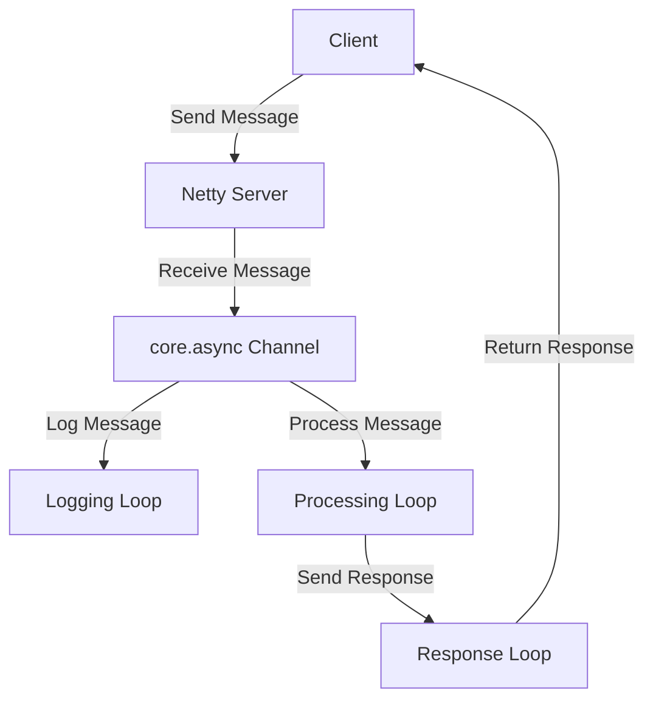

## 16.5.3 Case Study: Integrating with an Async Java Library

In this case study, we will explore how to integrate Clojure with a popular asynchronous Java library, Netty, using Clojure's `core.async`. This integration allows us to leverage the strengths of both languages: Java's robust ecosystem and Clojure's expressive functional programming capabilities. We will walk through setting up the integration, handling asynchronous events, and managing data flow effectively.

### Introduction to Netty and core.async

**Netty** is a high-performance, asynchronous event-driven network application framework for rapid development of maintainable high-performance protocol servers and clients. It provides a robust foundation for building scalable network applications.

**core.async** is a Clojure library that provides facilities for asynchronous programming and communication. It allows you to write complex asynchronous code in a straightforward and manageable way using channels and go blocks.

### Setting Up the Integration

#### Prerequisites

Before we begin, ensure you have the following installed:

- Java Development Kit (JDK) 8 or higher
- Clojure 1.10 or higher
- Leiningen for project management

#### Creating the Clojure Project

Let's start by creating a new Clojure project using Leiningen:

```bash
lein new app netty-clojure-integration
```

This command creates a new directory named `netty-clojure-integration` with the basic structure of a Clojure application.

#### Adding Dependencies

Next, we need to add dependencies for Netty and core.async in the `project.clj` file:

```clojure
(defproject netty-clojure-integration "0.1.0-SNAPSHOT"
  :description "A Clojure project integrating with Netty using core.async"
  :dependencies [[org.clojure/clojure "1.10.3"]
                 [org.clojure/core.async "1.3.618"]
                 [io.netty/netty-all "4.1.68.Final"]])
```

### Implementing the Integration

#### Setting Up a Netty Server

First, let's set up a simple Netty server. We'll create a basic server that listens for incoming connections and echoes received messages.

```clojure
(ns netty-clojure-integration.server
  (:import (io.netty.bootstrap ServerBootstrap)
           (io.netty.channel ChannelInitializer ChannelPipeline)
           (io.netty.channel.nio NioEventLoopGroup)
           (io.netty.channel.socket.nio NioServerSocketChannel)
           (io.netty.channel.socket SocketChannel)
           (io.netty.handler.codec.string StringDecoder StringEncoder)))

(defn start-server []
  (let [boss-group (NioEventLoopGroup.)
        worker-group (NioEventLoopGroup.)]
    (try
      (let [bootstrap (ServerBootstrap.)]
        (.group bootstrap boss-group worker-group)
        (.channel bootstrap NioServerSocketChannel)
        (.childHandler bootstrap
                       (proxy [ChannelInitializer] []
                         (initChannel [ch]
                           (let [pipeline (.pipeline ch)]
                             (.addLast pipeline (StringDecoder.))
                             (.addLast pipeline (StringEncoder.))
                             (.addLast pipeline
                                       (proxy [io.netty.channel.ChannelInboundHandlerAdapter] []
                                         (channelRead [ctx msg]
                                           (println "Received message:" msg)
                                           (.writeAndFlush ctx msg))))))))
        (let [channel-future (.bind bootstrap 8080)]
          (.sync channel-future)
          (println "Server started on port 8080")
          (.closeFuture (.channel channel-future))
          (.sync)))
      (finally
        (.shutdownGracefully boss-group)
        (.shutdownGracefully worker-group)))))

;; Start the server
(start-server)
```

**Explanation:**

- We use `ServerBootstrap` to set up the server.
- `NioEventLoopGroup` is used for handling I/O operations.
- `ChannelInitializer` configures the pipeline for each new channel.
- `StringDecoder` and `StringEncoder` are used for handling string messages.
- The server listens on port 8080 and echoes received messages.

#### Integrating core.async

Now, let's integrate `core.async` to handle asynchronous events. We'll use channels to manage incoming messages.

```clojure
(ns netty-clojure-integration.async-server
  (:require [clojure.core.async :refer [chan go-loop <! >!]])
  (:import (io.netty.bootstrap ServerBootstrap)
           (io.netty.channel ChannelInitializer ChannelPipeline)
           (io.netty.channel.nio NioEventLoopGroup)
           (io.netty.channel.socket.nio NioServerSocketChannel)
           (io.netty.channel.socket SocketChannel)
           (io.netty.handler.codec.string StringDecoder StringEncoder)))

(defn start-async-server []
  (let [boss-group (NioEventLoopGroup.)
        worker-group (NioEventLoopGroup.)
        message-chan (chan)]
    (go-loop []
      (let [msg (<! message-chan)]
        (println "Processing message:" msg)
        ;; Process the message asynchronously
        (recur)))
    (try
      (let [bootstrap (ServerBootstrap.)]
        (.group bootstrap boss-group worker-group)
        (.channel bootstrap NioServerSocketChannel)
        (.childHandler bootstrap
                       (proxy [ChannelInitializer] []
                         (initChannel [ch]
                           (let [pipeline (.pipeline ch)]
                             (.addLast pipeline (StringDecoder.))
                             (.addLast pipeline (StringEncoder.))
                             (.addLast pipeline
                                       (proxy [io.netty.channel.ChannelInboundHandlerAdapter] []
                                         (channelRead [ctx msg]
                                           (println "Received message:" msg)
                                           (>! message-chan msg))))))))
        (let [channel-future (.bind bootstrap 8080)]
          (.sync channel-future)
          (println "Async server started on port 8080")
          (.closeFuture (.channel channel-future))
          (.sync)))
      (finally
        (.shutdownGracefully boss-group)
        (.shutdownGracefully worker-group)))))

;; Start the async server
(start-async-server)
```

**Explanation:**

- We create a channel `message-chan` to handle incoming messages.
- `go-loop` is used to process messages asynchronously.
- Messages are read from the channel using `<!` and processed in the loop.

### Handling Asynchronous Events

With the server set up, we can now focus on handling asynchronous events. The use of `core.async` channels allows us to decouple message reception from processing, enabling efficient handling of concurrent connections.

#### Managing Data Flow

To manage data flow effectively, we can introduce additional channels for different processing stages. For example, we can have separate channels for logging, processing, and responding to messages.

```clojure
(defn start-advanced-async-server []
  (let [boss-group (NioEventLoopGroup.)
        worker-group (NioEventLoopGroup.)
        message-chan (chan)
        log-chan (chan)
        response-chan (chan)]
    ;; Logging loop
    (go-loop []
      (let [msg (<! log-chan)]
        (println "Log:" msg)
        (recur)))
    ;; Processing loop
    (go-loop []
      (let [msg (<! message-chan)]
        (println "Processing message:" msg)
        (>! response-chan (str "Processed: " msg))
        (recur)))
    ;; Response loop
    (go-loop []
      (let [response (<! response-chan)]
        (println "Sending response:" response)
        ;; Send response back to client
        (recur)))
    (try
      (let [bootstrap (ServerBootstrap.)]
        (.group bootstrap boss-group worker-group)
        (.channel bootstrap NioServerSocketChannel)
        (.childHandler bootstrap
                       (proxy [ChannelInitializer] []
                         (initChannel [ch]
                           (let [pipeline (.pipeline ch)]
                             (.addLast pipeline (StringDecoder.))
                             (.addLast pipeline (StringEncoder.))
                             (.addLast pipeline
                                       (proxy [io.netty.channel.ChannelInboundHandlerAdapter] []
                                         (channelRead [ctx msg]
                                           (println "Received message:" msg)
                                           (>! log-chan msg)
                                           (>! message-chan msg))))))))
        (let [channel-future (.bind bootstrap 8080)]
          (.sync channel-future)
          (println "Advanced async server started on port 8080")
          (.closeFuture (.channel channel-future))
          (.sync)))
      (finally
        (.shutdownGracefully boss-group)
        (.shutdownGracefully worker-group)))))

;; Start the advanced async server
(start-advanced-async-server)
```

**Explanation:**

- We introduce `log-chan` and `response-chan` for logging and responding.
- Each channel has a dedicated `go-loop` for processing messages.
- This setup allows for clear separation of concerns and efficient data flow management.

### Comparing with Java's CompletableFuture

Java's `CompletableFuture` provides a similar mechanism for handling asynchronous computations. Let's compare it with our Clojure implementation.

#### Java Example

```java
import java.util.concurrent.CompletableFuture;

public class AsyncExample {
    public static void main(String[] args) {
        CompletableFuture.supplyAsync(() -> {
            System.out.println("Processing...");
            return "Hello, World!";
        }).thenAccept(result -> {
            System.out.println("Result: " + result);
        });
    }
}
```

**Comparison:**

- **CompletableFuture**: Provides a fluent API for asynchronous programming in Java. It allows chaining of tasks and handling of results.
- **core.async**: Offers a more flexible approach with channels and go blocks, enabling complex data flow management.

### Try It Yourself

Experiment with the code by modifying the server to handle different types of messages or by adding additional processing stages. Consider implementing a simple protocol or adding error handling mechanisms.

### Diagrams

#### Data Flow Diagram



*Diagram 1: This diagram illustrates the flow of data through the Netty server and core.async channels, highlighting the separation of concerns.*

### Key Takeaways

- **Integration**: Combining Clojure with Java libraries like Netty allows leveraging the strengths of both ecosystems.
- **Asynchronous Programming**: `core.async` provides powerful tools for managing asynchronous events and data flow.
- **Separation of Concerns**: Using channels and go loops enables clear separation of different processing stages.

### Exercises

1. Modify the server to handle JSON messages instead of plain strings.
2. Implement error handling for invalid messages.
3. Add a new channel for metrics collection and log the number of processed messages.

### Conclusion

Integrating Clojure with asynchronous Java libraries like Netty using `core.async` provides a robust framework for building scalable and maintainable applications. By leveraging the strengths of both languages, you can create efficient systems that handle concurrent connections with ease.

For further reading, explore the [Official Clojure Documentation](https://clojure.org/reference/documentation) and [Netty Project](https://netty.io/).

## Quiz: Mastering Clojure and Java Integration



### What is the primary purpose of using Netty in this case study?

- [x] To provide a high-performance, asynchronous event-driven network framework
- [ ] To simplify synchronous programming
- [ ] To replace core.async in Clojure
- [ ] To handle database operations

> **Explanation:** Netty is used for its high-performance, asynchronous event-driven capabilities, making it suitable for network applications.

### How does core.async help in managing asynchronous events in Clojure?

- [x] By providing channels and go blocks for asynchronous programming
- [ ] By replacing Java's CompletableFuture
- [ ] By simplifying synchronous code
- [ ] By handling database transactions

> **Explanation:** core.async provides channels and go blocks, which are essential for managing asynchronous events and data flow in Clojure.

### What is the role of `NioEventLoopGroup` in the Netty server setup?

- [x] It handles I/O operations for the server
- [ ] It processes HTTP requests
- [ ] It manages database connections
- [ ] It logs server events

> **Explanation:** `NioEventLoopGroup` is responsible for handling I/O operations, which is crucial for the server's performance.

### In the Clojure example, what is the purpose of the `go-loop` construct?

- [x] To process messages asynchronously
- [ ] To handle synchronous tasks
- [ ] To manage database transactions
- [ ] To log server events

> **Explanation:** `go-loop` is used to process messages asynchronously, allowing for efficient handling of concurrent tasks.

### How does the Clojure implementation differ from Java's CompletableFuture?

- [x] Clojure uses channels and go blocks, while Java uses a fluent API
- [ ] Clojure is synchronous, while Java is asynchronous
- [ ] Clojure handles database operations, while Java does not
- [ ] Clojure is less efficient than Java

> **Explanation:** Clojure's core.async uses channels and go blocks for asynchronous programming, whereas Java's CompletableFuture provides a fluent API.

### What is the advantage of using channels in core.async?

- [x] They enable decoupling of message reception and processing
- [ ] They simplify synchronous programming
- [ ] They replace Java's CompletableFuture
- [ ] They handle database operations

> **Explanation:** Channels allow for the decoupling of message reception and processing, which is essential for managing asynchronous events.

### What is the purpose of the `StringDecoder` and `StringEncoder` in the Netty server?

- [x] To handle string message encoding and decoding
- [ ] To manage database connections
- [ ] To process HTTP requests
- [ ] To log server events

> **Explanation:** `StringDecoder` and `StringEncoder` are used to handle the encoding and decoding of string messages in the server.

### How can you modify the server to handle JSON messages?

- [x] By using a JSON decoder and encoder in the pipeline
- [ ] By replacing core.async with CompletableFuture
- [ ] By adding a new channel for JSON processing
- [ ] By using a different port

> **Explanation:** To handle JSON messages, you can use a JSON decoder and encoder in the Netty pipeline.

### What is the benefit of separating concerns using channels in core.async?

- [x] It allows for clear separation of different processing stages
- [ ] It simplifies synchronous programming
- [ ] It replaces Java's CompletableFuture
- [ ] It handles database operations

> **Explanation:** Separating concerns using channels allows for clear separation of different processing stages, improving code organization and maintainability.

### True or False: Netty is a synchronous programming framework.

- [ ] True
- [x] False

> **Explanation:** Netty is an asynchronous event-driven network framework, designed for high-performance applications.


