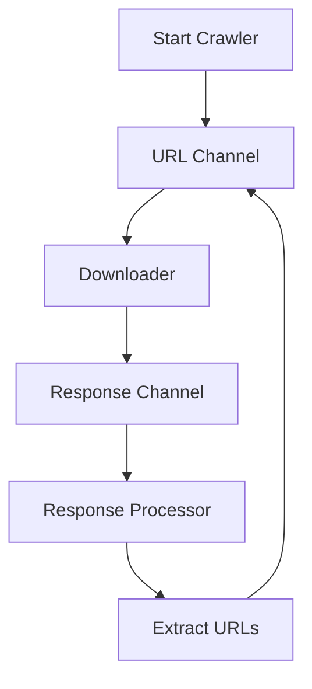

## 16.6.1 Implementing a Web Crawler

In this section, we'll embark on an exciting journey to build an asynchronous web crawler using Clojure's `core.async` library. As experienced Java developers, you are likely familiar with the challenges of managing concurrency and asynchronous operations. Clojure offers a powerful and elegant approach to these challenges, leveraging functional programming principles and immutable data structures. Let's dive into the world of Clojure and explore how we can efficiently crawl the web.

### Understanding the Basics of Web Crawling

Before we dive into the implementation, let's briefly discuss what a web crawler is and its primary components. A web crawler, also known as a web spider or web robot, is a program that systematically browses the internet, typically for the purpose of indexing web content. The main components of a web crawler include:

1. **URL Frontier**: A queue of URLs to visit.
2. **Downloader**: Fetches the content of web pages.
3. **Parser**: Extracts useful information and additional URLs from the fetched content.
4. **Data Storage**: Stores the extracted data for further processing.

In our implementation, we'll focus on managing the URL frontier and downloading web pages asynchronously using Clojure's `core.async`.

### Why Use Clojure for Web Crawling?

Clojure is a functional programming language that runs on the Java Virtual Machine (JVM). It offers several advantages for building a web crawler:

- **Immutability**: Clojure's immutable data structures make it easier to reason about concurrent programs.
- **Concurrency**: The `core.async` library provides powerful abstractions for managing concurrency using channels and go blocks.
- **Interoperability**: Clojure can seamlessly interoperate with Java libraries, allowing us to leverage existing HTTP clients and parsers.

### Setting Up the Development Environment

Before we start coding, ensure that you have Clojure and Leiningen installed on your system. If you haven't set up your environment yet, refer to [Chapter 2: Setting Up Your Development Environment](#) for detailed instructions.

### Designing the Web Crawler

Let's outline the design of our web crawler. We'll use `core.async` channels to manage the flow of URLs and responses. Here's a high-level overview of the components:

- **URL Channel**: A channel that holds URLs to be visited.
- **Response Channel**: A channel that holds the responses from downloaded web pages.
- **Go Blocks**: Asynchronous blocks that perform tasks such as fetching URLs and processing responses.

We'll use a simple architecture where URLs are fetched and processed concurrently, allowing us to efficiently crawl multiple pages at once.

### Implementing the Web Crawler

Let's start by implementing the core components of our web crawler.

#### Step 1: Setting Up core.async

First, we'll include the `core.async` library in our project. Add the following dependency to your `project.clj` file:

```clojure
(defproject web-crawler "0.1.0-SNAPSHOT"
  :dependencies [[org.clojure/clojure "1.10.3"]
                 [org.clojure/core.async "1.3.610"]])
```

#### Step 2: Creating Channels

We'll create two channels: one for URLs and another for responses. Channels are used to communicate between different parts of our program asynchronously.

```clojure
(ns web-crawler.core
  (:require [clojure.core.async :refer [chan go <! >! close!]]))

(def url-channel (chan))
(def response-channel (chan))
```

#### Step 3: Fetching URLs

Next, we'll implement a function to fetch URLs. We'll use Java's `HttpURLConnection` for simplicity, but you can use any HTTP client library you prefer.

```clojure
(import '[java.net URL HttpURLConnection])

(defn fetch-url [url]
  (let [connection (.openConnection (URL. url))]
    (.setRequestMethod connection "GET")
    (with-open [stream (.getInputStream connection)]
      (slurp stream))))
```

#### Step 4: Implementing the Downloader

We'll create a go block to fetch URLs from the `url-channel` and put the responses into the `response-channel`.

```clojure
(defn start-downloader []
  (go
    (loop []
      (when-let [url (<! url-channel)]
        (let [response (fetch-url url)]
          (>! response-channel {:url url :response response}))
        (recur)))))
```

#### Step 5: Processing Responses

We'll implement another go block to process responses from the `response-channel`.

```clojure
(defn start-response-processor []
  (go
    (loop []
      (when-let [{:keys [url response]} (<! response-channel)]
        (println "Fetched URL:" url)
        ;; Here you can parse the response and extract more URLs
        (recur)))))
```

#### Step 6: Starting the Crawler

Finally, we'll start the crawler by putting some initial URLs into the `url-channel` and launching the downloader and response processor.

```clojure
(defn start-crawler [initial-urls]
  (doseq [url initial-urls]
    (>! url-channel url))
  (start-downloader)
  (start-response-processor))

;; Start the crawler with some initial URLs
(start-crawler ["http://example.com" "http://example.org"])
```

### Understanding core.async Channels

Channels in `core.async` are similar to queues in Java's concurrency libraries, but they provide additional flexibility and power. They allow us to decouple producers and consumers, making it easier to manage concurrency.

#### Channel Operations

- **`chan`**: Creates a new channel.
- **`<!`**: Takes a value from a channel (asynchronously).
- **`>!`**: Puts a value into a channel (asynchronously).
- **`close!`**: Closes a channel, indicating no more values will be put into it.

### Comparing with Java's Concurrency Model

In Java, you might use `ExecutorService` and `BlockingQueue` to manage concurrency. Here's a simple comparison:

- **ExecutorService**: Manages a pool of threads for executing tasks.
- **BlockingQueue**: A thread-safe queue for passing data between threads.

Clojure's `core.async` provides a more flexible and composable model, allowing us to build complex asynchronous workflows with ease.

### Enhancing the Web Crawler

Now that we have a basic web crawler, let's explore some enhancements:

#### Handling Errors

We can improve our crawler by handling errors gracefully. For example, we can catch exceptions during URL fetching and log them.

```clojure
(defn fetch-url [url]
  (try
    (let [connection (.openConnection (URL. url))]
      (.setRequestMethod connection "GET")
      (with-open [stream (.getInputStream connection)]
        (slurp stream)))
    (catch Exception e
      (println "Error fetching URL:" url (.getMessage e))
      nil)))
```

#### Limiting Concurrency

To avoid overwhelming the target server, we can limit the number of concurrent requests. We can achieve this by using a fixed-size thread pool or by controlling the number of active go blocks.

```clojure
(defn start-limited-downloader [concurrency-limit]
  (dotimes [_ concurrency-limit]
    (start-downloader)))
```

#### Extracting URLs

We can extend our response processor to extract URLs from the fetched content and add them to the `url-channel`.

```clojure
(defn extract-urls [content]
  ;; Use a regex or HTML parser to extract URLs
  [])

(defn start-response-processor []
  (go
    (loop []
      (when-let [{:keys [url response]} (<! response-channel)]
        (println "Fetched URL:" url)
        (let [new-urls (extract-urls response)]
          (doseq [new-url new-urls]
            (>! url-channel new-url)))
        (recur)))))
```

### Visualizing the Web Crawler Workflow

To better understand the flow of data through our web crawler, let's visualize the workflow using a Mermaid.js diagram.



**Diagram Description**: This diagram illustrates the flow of data in our web crawler. URLs are placed in the URL Channel, fetched by the Downloader, and the responses are processed by the Response Processor. Extracted URLs are added back to the URL Channel for further crawling.

### Try It Yourself

Now that we've built a basic web crawler, try experimenting with the following:

- **Add More Features**: Implement additional features such as URL filtering, content parsing, and data storage.
- **Improve Error Handling**: Enhance the error handling logic to retry failed requests or log errors to a file.
- **Optimize Performance**: Experiment with different concurrency limits and observe the impact on performance.

### Summary and Key Takeaways

In this section, we've explored how to build an asynchronous web crawler using Clojure's `core.async` library. We've seen how channels and go blocks can be used to manage concurrency effectively, allowing us to crawl multiple web pages concurrently. By leveraging Clojure's functional programming principles and immutable data structures, we've built a robust and efficient web crawler.

### Further Reading

For more information on Clojure and `core.async`, check out the following resources:

- [Official Clojure Documentation](https://clojure.org/)
- [ClojureDocs](https://clojuredocs.org/)
- [core.async GitHub Repository](https://github.com/clojure/core.async)

### Exercises

1. **Implement URL Filtering**: Modify the crawler to filter out URLs based on specific criteria, such as domain or file type.
2. **Add Data Storage**: Extend the crawler to store fetched content in a database or file system.
3. **Enhance Error Handling**: Implement a retry mechanism for failed requests with exponential backoff.

By completing these exercises, you'll gain a deeper understanding of asynchronous programming in Clojure and build a more feature-rich web crawler.

## Quiz: Test Your Knowledge on Building an Asynchronous Web Crawler with Clojure



### What is the primary purpose of a web crawler?

- [x] To systematically browse the internet and index web content
- [ ] To download files from the internet
- [ ] To manage user sessions on a website
- [ ] To provide search engine optimization

> **Explanation:** A web crawler is designed to systematically browse the internet and index web content for search engines or data analysis.

### Which Clojure library is used for managing concurrency in our web crawler?

- [x] core.async
- [ ] clojure.java.io
- [ ] clojure.data.json
- [ ] clojure.string

> **Explanation:** The `core.async` library is used for managing concurrency in Clojure applications, providing channels and go blocks for asynchronous operations.

### What is the role of the URL Channel in our web crawler?

- [x] To hold URLs that need to be visited
- [ ] To store responses from downloaded web pages
- [ ] To manage error logs
- [ ] To parse HTML content

> **Explanation:** The URL Channel holds URLs that need to be visited by the web crawler, allowing for asynchronous processing.

### How does the `fetch-url` function handle HTTP requests?

- [x] It uses Java's HttpURLConnection to perform GET requests
- [ ] It uses Clojure's built-in HTTP client
- [ ] It sends POST requests to the server
- [ ] It reads from a local file

> **Explanation:** The `fetch-url` function uses Java's `HttpURLConnection` to perform GET requests and fetch web page content.

### What is the purpose of the `response-channel` in our web crawler?

- [x] To hold responses from downloaded web pages
- [ ] To store URLs that need to be visited
- [ ] To manage error logs
- [ ] To parse HTML content

> **Explanation:** The `response-channel` holds responses from downloaded web pages, allowing for asynchronous processing of the content.

### How can we limit the number of concurrent requests in our web crawler?

- [x] By controlling the number of active go blocks
- [ ] By using a larger URL channel
- [ ] By increasing the response channel size
- [ ] By using a different HTTP client

> **Explanation:** We can limit the number of concurrent requests by controlling the number of active go blocks, effectively managing the concurrency level.

### What is the advantage of using `core.async` channels over Java's BlockingQueue?

- [x] Channels provide more flexibility and composability
- [ ] Channels are faster than BlockingQueue
- [ ] Channels are easier to implement
- [ ] Channels require less memory

> **Explanation:** `core.async` channels provide more flexibility and composability, allowing for complex asynchronous workflows.

### What is a potential enhancement for our web crawler?

- [x] Implementing URL filtering
- [ ] Using a different programming language
- [ ] Reducing the number of channels
- [ ] Removing error handling

> **Explanation:** Implementing URL filtering is a potential enhancement that allows the crawler to focus on specific types of content.

### Which diagram tool is used to visualize the web crawler workflow?

- [x] Mermaid.js
- [ ] PlantUML
- [ ] Graphviz
- [ ] Lucidchart

> **Explanation:** Mermaid.js is used to create diagrams that visualize the workflow of the web crawler.

### True or False: Clojure's immutable data structures make it easier to reason about concurrent programs.

- [x] True
- [ ] False

> **Explanation:** True. Clojure's immutable data structures simplify reasoning about concurrent programs by eliminating issues related to shared mutable state.



By completing this section, you've gained valuable insights into building an asynchronous web crawler with Clojure. Keep experimenting and exploring the power of functional programming and concurrency in Clojure!
