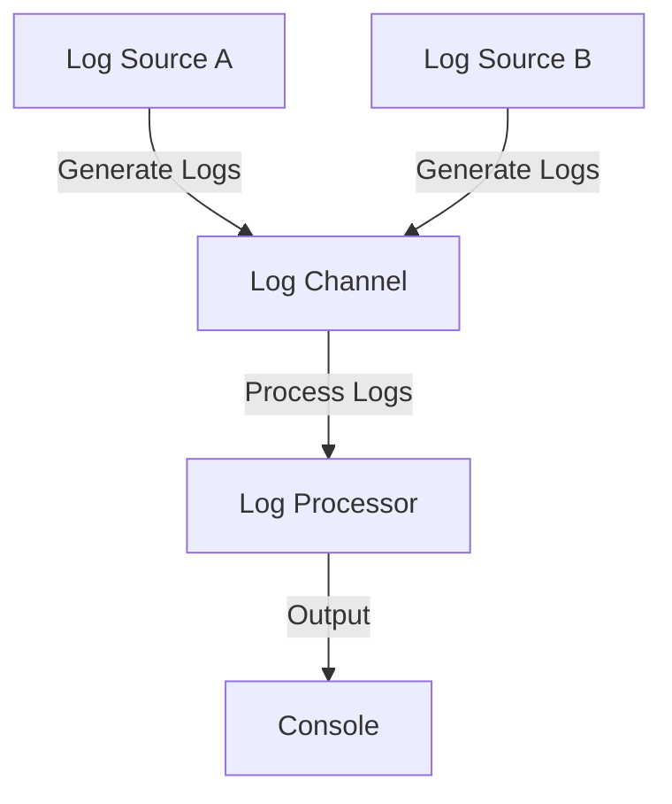

## 16.6.2 Real-Time Data Processing

In today's fast-paced digital world, the ability to process data in real-time is crucial for applications ranging from log aggregation to monitoring tools. Clojure, with its robust concurrency primitives and functional programming paradigms, offers a powerful toolkit for building real-time data processing applications. In this section, we'll explore how to leverage Clojure's `core.async` library to handle streaming data asynchronously, drawing parallels to Java's concurrency mechanisms to facilitate your transition.

### Understanding Real-Time Data Processing

Real-time data processing involves the continuous input, processing, and output of data. Unlike batch processing, which handles large volumes of data at intervals, real-time processing deals with data as it arrives, enabling immediate insights and actions. This is particularly useful in scenarios like:

- **Log Aggregation**: Collecting and analyzing logs from multiple sources to monitor system health.
- **Monitoring Tools**: Tracking metrics and events to ensure optimal performance and detect anomalies.
- **Financial Transactions**: Processing trades and transactions in real-time to prevent fraud and ensure compliance.

### Clojure's Approach to Real-Time Processing

Clojure's `core.async` library provides a set of abstractions for asynchronous programming, allowing you to build complex data pipelines with ease. It introduces concepts like channels, go blocks, and transducers, which facilitate the handling of streaming data.

#### Key Concepts in `core.async`

- **Channels**: Serve as conduits for data flow, allowing you to pass messages between different parts of your application.
- **Go Blocks**: Lightweight threads that enable asynchronous execution without blocking the main thread.
- **Transducers**: Composable algorithmic transformations that can be applied to data streams, enhancing performance and modularity.

Let's delve into these concepts with practical examples.

### Building a Real-Time Log Aggregator

To illustrate real-time data processing in Clojure, we'll build a simple log aggregator. This application will collect log entries from multiple sources, process them asynchronously, and output aggregated results.

#### Setting Up the Project

First, let's create a new Clojure project using Leiningen:

```bash
lein new app log-aggregator
```

Navigate to the project directory:

```bash
cd log-aggregator
```

Add `core.async` to your `project.clj` dependencies:

```clojure
(defproject log-aggregator "0.1.0-SNAPSHOT"
  :dependencies [[org.clojure/clojure "1.10.3"]
                 [org.clojure/core.async "1.3.618"]])
```

#### Implementing the Log Aggregator

We'll start by defining a channel to receive log entries:

```clojure
(ns log-aggregator.core
  (:require [clojure.core.async :refer [chan go >! <!]]))

(def log-channel (chan 100)) ; Create a channel with a buffer size of 100
```

**Explanation**: The `chan` function creates a channel with a specified buffer size, allowing for temporary storage of messages.

Next, we'll simulate log entry generation from multiple sources:

```clojure
(defn generate-logs [source]
  (go
    (loop [i 0]
      (when (< i 100)
        (let [log-entry (str "Log from " source ": Entry " i)]
          (>! log-channel log-entry) ; Send log entry to the channel
          (Thread/sleep 100) ; Simulate delay
          (recur (inc i)))))))
```

**Explanation**: The `go` block creates a lightweight thread that continuously generates log entries and sends them to the `log-channel`.

Now, let's process these log entries asynchronously:

```clojure
(defn process-logs []
  (go
    (loop []
      (when-let [log-entry (<! log-channel)] ; Receive log entry from the channel
        (println "Processing:" log-entry)
        (recur)))))
```

**Explanation**: The `<!` operator is used to receive messages from the channel, and the `go` block ensures that processing occurs asynchronously.

#### Running the Log Aggregator

To run the log aggregator, we'll start multiple log generators and the log processor:

```clojure
(defn -main []
  (generate-logs "Source A")
  (generate-logs "Source B")
  (process-logs))
```

Execute the application using Leiningen:

```bash
lein run
```

### Comparing with Java's Concurrency Model

In Java, real-time data processing often involves using threads, executors, and concurrent collections. Here's a simple Java example for comparison:

```java
import java.util.concurrent.BlockingQueue;
import java.util.concurrent.LinkedBlockingQueue;

public class LogAggregator {
    private static final BlockingQueue<String> logQueue = new LinkedBlockingQueue<>();

    public static void main(String[] args) {
        new Thread(() -> generateLogs("Source A")).start();
        new Thread(() -> generateLogs("Source B")).start();
        new Thread(LogAggregator::processLogs).start();
    }

    private static void generateLogs(String source) {
        for (int i = 0; i < 100; i++) {
            try {
                logQueue.put("Log from " + source + ": Entry " + i);
                Thread.sleep(100);
            } catch (InterruptedException e) {
                Thread.currentThread().interrupt();
            }
        }
    }

    private static void processLogs() {
        while (true) {
            try {
                String logEntry = logQueue.take();
                System.out.println("Processing: " + logEntry);
            } catch (InterruptedException e) {
                Thread.currentThread().interrupt();
            }
        }
    }
}
```

**Comparison**: While Java uses threads and blocking queues, Clojure's `core.async` provides a more declarative and composable approach, reducing boilerplate and enhancing readability.

### Enhancing the Log Aggregator with Transducers

Transducers allow us to apply transformations to data streams efficiently. Let's enhance our log aggregator to filter and transform log entries:

```clojure
(defn transform-log [log-entry]
  (str (clojure.string/upper-case log-entry) " [PROCESSED]"))

(defn process-logs-with-transducers []
  (let [xf (comp
             (filter #(clojure.string/includes? % "Source A"))
             (map transform-log))]
    (go
      (loop []
        (when-let [log-entry (<! (async/into [] xf log-channel))]
          (println "Processed with Transducers:" log-entry)
          (recur))))))
```

**Explanation**: The `comp` function composes a series of transformations, and `async/into` applies these transformations to the channel's data.

### Visualizing Data Flow with Mermaid.js

To better understand the flow of data through our log aggregator, let's visualize it using a Mermaid.js diagram:



**Diagram Description**: This flowchart illustrates how log entries are generated by multiple sources, sent through a channel, processed asynchronously, and output to the console.

### Try It Yourself

Experiment with the log aggregator by modifying the code:

- **Add More Sources**: Introduce additional log sources and observe how the system handles increased load.
- **Change Buffer Size**: Adjust the channel's buffer size and see its impact on performance.
- **Implement New Transformations**: Use transducers to apply different transformations to log entries.

### Further Reading and Resources

- [Clojure Official Documentation](https://clojure.org/reference/documentation)
- [core.async GitHub Repository](https://github.com/clojure/core.async)
- [ClojureDocs: core.async](https://clojuredocs.org/clojure.core.async)

### Exercises

1. **Implement a Monitoring Tool**: Extend the log aggregator to monitor specific keywords and trigger alerts.
2. **Integrate with a Database**: Store processed log entries in a database for persistence and analysis.
3. **Build a Real-Time Dashboard**: Create a web interface to visualize log data in real-time.

### Key Takeaways

- **Clojure's `core.async`** provides powerful abstractions for building real-time data processing applications.
- **Channels and Go Blocks** facilitate asynchronous data flow, reducing complexity compared to traditional Java concurrency models.
- **Transducers** enhance data processing by allowing composable transformations on data streams.

By leveraging Clojure's functional programming paradigms and concurrency primitives, you can build efficient, scalable real-time data processing applications. Now that we've explored how to handle streaming data in Clojure, let's apply these concepts to your next project!

## Real-Time Data Processing Quiz



### What is the primary purpose of real-time data processing?

- [x] To process data as it arrives for immediate insights and actions
- [ ] To process large volumes of data at intervals
- [ ] To store data for future analysis
- [ ] To archive data for compliance purposes

> **Explanation:** Real-time data processing deals with data as it arrives, enabling immediate insights and actions.

### Which Clojure library is primarily used for asynchronous programming?

- [x] core.async
- [ ] clojure.java.jdbc
- [ ] clojure.test
- [ ] clojure.core

> **Explanation:** The `core.async` library provides abstractions for asynchronous programming in Clojure.

### What is the role of channels in `core.async`?

- [x] To serve as conduits for data flow
- [ ] To block threads during execution
- [ ] To manage database connections
- [ ] To handle HTTP requests

> **Explanation:** Channels in `core.async` are used to pass messages between different parts of an application.

### How do go blocks in Clojure differ from Java threads?

- [x] Go blocks are lightweight and non-blocking
- [ ] Go blocks are heavier and blocking
- [ ] Go blocks require more resources than Java threads
- [ ] Go blocks are used for database operations

> **Explanation:** Go blocks are lightweight threads that enable asynchronous execution without blocking the main thread.

### What is a transducer in Clojure?

- [x] A composable algorithmic transformation
- [ ] A data storage mechanism
- [ ] A type of channel
- [ ] A concurrency primitive

> **Explanation:** Transducers are composable algorithmic transformations that can be applied to data streams.

### What is the benefit of using transducers in data processing?

- [x] They enhance performance and modularity
- [ ] They increase memory usage
- [ ] They simplify database interactions
- [ ] They reduce code readability

> **Explanation:** Transducers enhance performance and modularity by allowing composable transformations on data streams.

### In the log aggregator example, what does the `<!` operator do?

- [x] Receives messages from the channel
- [ ] Sends messages to the channel
- [ ] Closes the channel
- [ ] Opens a new channel

> **Explanation:** The `<!` operator is used to receive messages from a channel in `core.async`.

### How does Clojure's approach to concurrency differ from Java's?

- [x] Clojure uses declarative and composable abstractions
- [ ] Clojure relies on explicit thread management
- [ ] Clojure uses blocking queues
- [ ] Clojure requires manual synchronization

> **Explanation:** Clojure's `core.async` provides a more declarative and composable approach to concurrency compared to Java's explicit thread management.

### What is the purpose of the `comp` function in Clojure?

- [x] To compose a series of transformations
- [ ] To create a new channel
- [ ] To manage database transactions
- [ ] To handle HTTP requests

> **Explanation:** The `comp` function is used to compose a series of transformations, often used with transducers.

### True or False: Real-time data processing is only useful for log aggregation.

- [ ] True
- [x] False

> **Explanation:** Real-time data processing is useful for a variety of applications, including monitoring tools, financial transactions, and more.


