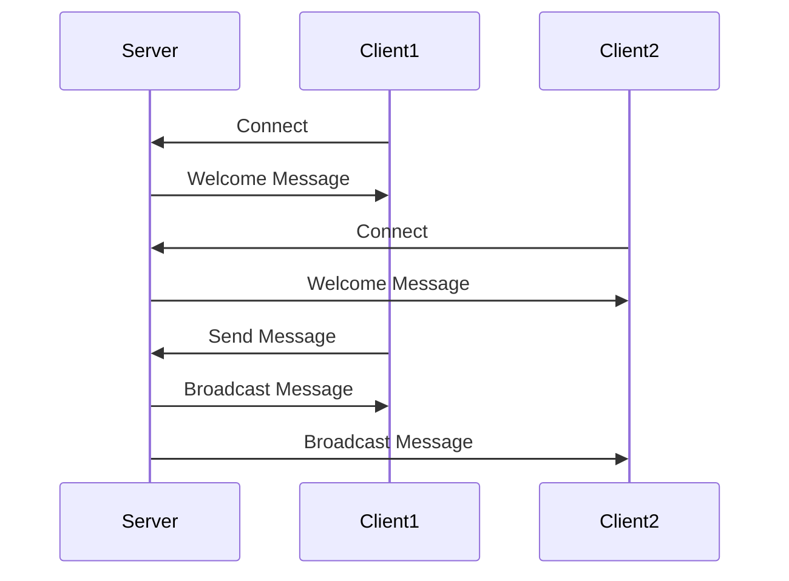

## 16.6.3 Building a Chat Server

In this section, we will explore how to build a simple chat server using Clojure's `core.async` library. This project will demonstrate how to manage client connections, broadcast messages, and handle user input/output asynchronously. By leveraging Clojure's functional programming paradigms and `core.async` channels, we can create a robust and efficient chat server. 

### Introduction to Asynchronous Programming with core.async

Asynchronous programming allows us to perform tasks concurrently without blocking the main execution thread. In Clojure, `core.async` provides a powerful abstraction for asynchronous programming using channels and go blocks. Channels are used to communicate between different parts of the program, while go blocks allow us to write asynchronous code that looks synchronous.

#### Key Concepts

- **Channels**: These are queues that allow communication between different parts of the program. They can be thought of as conduits through which data flows.
- **Go Blocks**: These are lightweight threads that allow us to write asynchronous code in a synchronous style.
- **Pipelines**: These are used to process data through a series of transformations asynchronously.

### Setting Up the Project

Before we dive into the code, let's set up our Clojure project. We'll use Leiningen, a popular build tool for Clojure, to create and manage our project.

1. **Create a New Project**: Open your terminal and run the following command to create a new Clojure project:

   ```bash
   lein new chat-server
   ```

2. **Add Dependencies**: Open the `project.clj` file and add `core.async` as a dependency:

   ```clojure
   (defproject chat-server "0.1.0-SNAPSHOT"
     :dependencies [[org.clojure/clojure "1.10.3"]
                    [org.clojure/core.async "1.3.610"]])
   ```

3. **Start the REPL**: Navigate to your project directory and start the REPL:

   ```bash
   cd chat-server
   lein repl
   ```

### Building the Chat Server

Now that our project is set up, let's start building the chat server. We'll break down the implementation into several parts: managing client connections, broadcasting messages, and handling user input/output.

#### Managing Client Connections

We'll use a channel to manage client connections. Each client will have its own channel for sending and receiving messages.

```clojure
(ns chat-server.core
  (:require [clojure.core.async :refer [chan go <! >! close!]]))

(def clients (atom {})) ; A map to store client channels

(defn add-client [client-id]
  (let [client-chan (chan)]
    (swap! clients assoc client-id client-chan)
    client-chan))

(defn remove-client [client-id]
  (when-let [client-chan (@clients client-id)]
    (close! client-chan)
    (swap! clients dissoc client-id)))
```

**Explanation**:
- We use an `atom` to store client channels. Atoms provide a way to manage shared, synchronous, independent state.
- The `add-client` function creates a new channel for each client and stores it in the `clients` map.
- The `remove-client` function closes the client's channel and removes it from the map.

#### Broadcasting Messages

Next, we'll implement a function to broadcast messages to all connected clients.

```clojure
(defn broadcast-message [message]
  (doseq [[_ client-chan] @clients]
    (go (>! client-chan message))))
```

**Explanation**:
- The `broadcast-message` function iterates over all client channels and sends the message asynchronously using a `go` block.

#### Handling User Input/Output

We'll create a function to handle user input and output. This function will read messages from a client's channel and print them to the console.

```clojure
(defn handle-client [client-id]
  (let [client-chan (add-client client-id)]
    (go-loop []
      (when-let [message (<! client-chan)]
        (println (str "Client " client-id ": " message))
        (recur)))))
```

**Explanation**:
- The `handle-client` function creates a loop that reads messages from the client's channel and prints them to the console.
- The `go-loop` construct is used to create an infinite loop within a `go` block.

### Integrating the Components

Now that we have the basic components, let's integrate them to create a working chat server.

```clojure
(defn start-server []
  (println "Chat server started...")
  (go-loop [client-id 1]
    (let [client-chan (add-client client-id)]
      (handle-client client-id)
      (<! (timeout 5000)) ; Simulate a new client connection every 5 seconds
      (recur (inc client-id)))))
```

**Explanation**:
- The `start-server` function simulates a new client connection every 5 seconds. In a real-world scenario, this would be replaced with actual network code to accept client connections.
- The `timeout` function is used to create a delay between client connections.

### Try It Yourself

Now that we've built a basic chat server, try modifying the code to add new features. Here are some ideas:

- Implement a command to list all connected clients.
- Add a feature to send private messages to specific clients.
- Enhance the server to handle client disconnections gracefully.

### Visualizing the Chat Server Architecture

To better understand the flow of data in our chat server, let's visualize the architecture using a sequence diagram.



**Diagram Explanation**:
- The sequence diagram shows the interaction between the server and clients.
- Clients connect to the server, receive a welcome message, and can send messages that are broadcast to all connected clients.

### Comparing with Java

In Java, building a chat server would typically involve using threads and sockets. Here's a simple example of how you might handle client connections in Java:

```java
import java.io.*;
import java.net.*;
import java.util.concurrent.*;

public class ChatServer {
    private static final ExecutorService pool = Executors.newFixedThreadPool(10);

    public static void main(String[] args) throws IOException {
        ServerSocket serverSocket = new ServerSocket(12345);
        System.out.println("Chat server started...");

        while (true) {
            Socket clientSocket = serverSocket.accept();
            pool.execute(new ClientHandler(clientSocket));
        }
    }
}

class ClientHandler implements Runnable {
    private final Socket clientSocket;

    public ClientHandler(Socket socket) {
        this.clientSocket = socket;
    }

    @Override
    public void run() {
        try (BufferedReader in = new BufferedReader(new InputStreamReader(clientSocket.getInputStream()));
             PrintWriter out = new PrintWriter(clientSocket.getOutputStream(), true)) {
            String message;
            while ((message = in.readLine()) != null) {
                System.out.println("Received: " + message);
                out.println("Echo: " + message);
            }
        } catch (IOException e) {
            e.printStackTrace();
        }
    }
}
```

**Comparison**:
- In Java, we use threads to handle each client connection, which can lead to complex synchronization issues.
- Clojure's `core.async` provides a more straightforward and scalable approach to handling concurrency using channels and go blocks.

### Exercises and Practice Problems

1. **Exercise 1**: Modify the chat server to support private messaging between clients. Implement a command that allows a client to send a message to a specific client.

2. **Exercise 2**: Enhance the server to handle client disconnections gracefully. Ensure that resources are cleaned up when a client disconnects.

3. **Exercise 3**: Implement a feature to list all connected clients. Allow clients to query the server for a list of active connections.

4. **Exercise 4**: Add logging to the server to track client connections, disconnections, and messages. Use Clojure's logging libraries to implement this feature.

### Key Takeaways

- Clojure's `core.async` library provides powerful abstractions for asynchronous programming using channels and go blocks.
- Building a chat server in Clojure is straightforward and scalable, thanks to its functional programming paradigms.
- By leveraging Clojure's concurrency primitives, we can create efficient and robust applications without the complexity of traditional threading models.

### Further Reading

- [Clojure Official Documentation](https://clojure.org/)
- [core.async GitHub Repository](https://github.com/clojure/core.async)
- [ClojureDocs](https://clojuredocs.org/)

Now that we've explored how to build a chat server using Clojure's `core.async`, let's continue to apply these concepts to create more complex and scalable applications.

## Quiz: Building a Chat Server with Clojure



### What is the primary purpose of using `core.async` in Clojure?

- [x] To handle asynchronous programming using channels and go blocks
- [ ] To manage database connections
- [ ] To perform synchronous I/O operations
- [ ] To create graphical user interfaces

> **Explanation:** `core.async` is used for asynchronous programming in Clojure, allowing communication between different parts of a program using channels and go blocks.

### In the chat server example, what is the role of the `clients` atom?

- [x] To store client channels for message broadcasting
- [ ] To manage database connections
- [ ] To handle file I/O operations
- [ ] To store user authentication data

> **Explanation:** The `clients` atom is used to store client channels, enabling the server to broadcast messages to all connected clients.

### How does the `broadcast-message` function send messages to clients?

- [x] It iterates over client channels and sends messages asynchronously using a go block
- [ ] It uses a single thread to send messages to all clients
- [ ] It writes messages to a database
- [ ] It sends messages using HTTP requests

> **Explanation:** The `broadcast-message` function iterates over client channels and sends messages asynchronously using a go block.

### What is the purpose of the `go-loop` construct in the chat server?

- [x] To create an infinite loop within a go block for handling client messages
- [ ] To perform synchronous I/O operations
- [ ] To manage database transactions
- [ ] To create graphical user interfaces

> **Explanation:** The `go-loop` construct is used to create an infinite loop within a go block, allowing the server to handle client messages continuously.

### Which of the following is a key advantage of using Clojure's `core.async` over Java's threading model?

- [x] Simplified concurrency management using channels
- [ ] Faster execution speed
- [ ] Better integration with databases
- [ ] Easier file I/O operations

> **Explanation:** Clojure's `core.async` simplifies concurrency management by using channels, reducing the complexity associated with traditional threading models.

### What is the function of the `timeout` function in the chat server example?

- [x] To create a delay between client connections
- [ ] To manage database timeouts
- [ ] To handle file I/O operations
- [ ] To synchronize threads

> **Explanation:** The `timeout` function is used to create a delay between client connections, simulating new client connections every 5 seconds.

### In the Java example, what is the role of the `ExecutorService`?

- [x] To manage a pool of threads for handling client connections
- [ ] To perform database transactions
- [ ] To handle file I/O operations
- [ ] To create graphical user interfaces

> **Explanation:** The `ExecutorService` in Java is used to manage a pool of threads for handling client connections, allowing concurrent processing.

### How can you modify the chat server to support private messaging between clients?

- [x] Implement a command that allows a client to send a message to a specific client
- [ ] Use a single channel for all clients
- [ ] Store messages in a database
- [ ] Use HTTP requests for messaging

> **Explanation:** To support private messaging, you can implement a command that allows a client to send a message to a specific client, using separate channels for each client.

### What is a potential challenge when using Java's threading model for a chat server?

- [x] Complex synchronization issues
- [ ] Lack of database support
- [ ] Slow execution speed
- [ ] Difficulty in handling file I/O operations

> **Explanation:** Java's threading model can lead to complex synchronization issues, making concurrency management challenging.

### True or False: Clojure's `core.async` allows for synchronous programming using channels.

- [ ] True
- [x] False

> **Explanation:** Clojure's `core.async` is designed for asynchronous programming, allowing communication between different parts of a program using channels.


