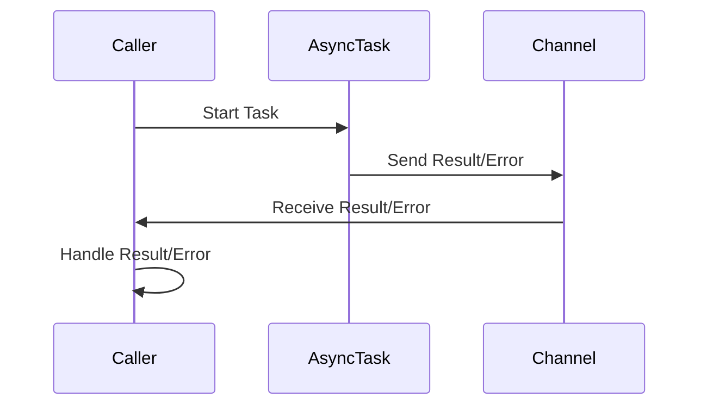

## 16.7.1 Challenges of Error Handling in Asynchronous Code

Asynchronous programming is a powerful paradigm that allows us to write non-blocking code, making applications more responsive and efficient. However, it introduces unique challenges, particularly in error handling. In this section, we will explore the intricacies of managing errors in asynchronous Clojure code, focusing on the differences from traditional synchronous error handling, and how to effectively manage exceptions in asynchronous workflows.

### Understanding Asynchronous Error Handling

In synchronous programming, error handling is straightforward: exceptions propagate up the call stack until they are caught by a `try-catch` block. However, in asynchronous programming, the flow of execution is non-linear, and errors do not propagate in the same way. This can make it difficult to manage exceptions and ensure that errors are handled appropriately.

#### Error Propagation in Asynchronous Systems

In asynchronous systems, tasks are often executed in separate threads or processes, and the traditional call stack is not maintained. This means that exceptions cannot simply bubble up to a higher level in the code. Instead, errors must be explicitly captured and handled within the asynchronous context.

**Java Example:**

```java
// Java example of synchronous error handling
try {
    int result = divide(10, 0);
} catch (ArithmeticException e) {
    System.out.println("Caught exception: " + e.getMessage());
}

public int divide(int a, int b) {
    return a / b; // Throws ArithmeticException if b is 0
}
```

In this Java example, the `ArithmeticException` is caught by the `try-catch` block, allowing the program to handle the error gracefully.

**Clojure Example:**

```clojure
;; Clojure example of asynchronous error handling using core.async
(require '[clojure.core.async :refer [go <! >! chan]])

(defn async-divide [a b]
  (let [c (chan)]
    (go
      (try
        (>! c (/ a b))
        (catch ArithmeticException e
          (>! c (str "Caught exception: " (.getMessage e))))))
    c))

(let [result-chan (async-divide 10 0)]
  (go
    (println "Result:" (<! result-chan))))
```

In this Clojure example, we use `core.async` to perform an asynchronous division. The `try-catch` block is used within the `go` block to handle exceptions, and the result (or error message) is sent to a channel.

### Challenges in Asynchronous Error Handling

1. **Lack of Propagation**: Unlike synchronous code, exceptions in asynchronous code do not automatically propagate to the caller. This requires explicit handling of errors within each asynchronous task.

2. **Complex Control Flow**: Asynchronous code often involves complex control flows with multiple tasks running concurrently. This makes it challenging to track where errors occur and how they should be handled.

3. **State Management**: Managing state in asynchronous systems can be difficult, especially when errors occur. Ensuring that the system remains in a consistent state despite errors is a key challenge.

4. **Error Context**: Providing meaningful error messages and context can be difficult in asynchronous systems, where the execution context may be lost.

### Best Practices for Error Handling in Asynchronous Clojure Code

To effectively manage errors in asynchronous Clojure code, consider the following best practices:

- **Use Channels for Error Propagation**: Use channels to propagate errors back to the caller. This allows you to handle errors in a centralized location and maintain control over the error handling process.

- **Centralize Error Handling**: Where possible, centralize error handling logic to avoid duplication and ensure consistency. This can be achieved by creating utility functions or middleware that handle common error scenarios.

- **Provide Contextual Information**: Include contextual information in error messages to aid debugging. This can include details about the task that failed, the input parameters, and the state of the system.

- **Leverage Logging**: Use logging to capture detailed information about errors and the state of the system. This can be invaluable for diagnosing issues in production environments.

- **Test Asynchronous Code Thoroughly**: Asynchronous code can be difficult to test, but it is essential to ensure that error handling logic is robust. Use unit tests and integration tests to verify that errors are handled correctly.

### Clojure's `core.async` and Error Handling

Clojure's `core.async` library provides powerful tools for asynchronous programming, but it also introduces unique challenges for error handling. Let's explore how `core.async` handles errors and how we can manage them effectively.

#### Go Blocks and Exception Handling

In `core.async`, the `go` block is used to create lightweight threads for asynchronous tasks. However, exceptions thrown within a `go` block do not propagate in the same way as synchronous code. Instead, they must be caught and handled within the `go` block itself.

**Example:**

```clojure
(require '[clojure.core.async :refer [go <! >! chan]])

(defn safe-divide [a b]
  (let [c (chan)]
    (go
      (try
        (>! c (/ a b))
        (catch ArithmeticException e
          (>! c (str "Caught exception: " (.getMessage e))))))
    c))

(let [result-chan (safe-divide 10 0)]
  (go
    (println "Result:" (<! result-chan))))
```

In this example, we use a `try-catch` block within the `go` block to handle exceptions. The result or error message is sent to a channel, allowing the caller to handle the error appropriately.

#### Handling Errors with Channels

Channels are a fundamental part of `core.async`, and they can be used to propagate errors back to the caller. By sending error messages or error objects through channels, we can centralize error handling logic and ensure that errors are managed consistently.

**Example:**

```clojure
(require '[clojure.core.async :refer [go <! >! chan]])

(defn async-task [c]
  (go
    (try
      ;; Simulate a task that may fail
      (if (< (rand) 0.5)
        (throw (Exception. "Random failure"))
        (>! c "Success"))
      (catch Exception e
        (>! c (str "Error: " (.getMessage e)))))))

(let [c (chan)]
  (async-task c)
  (go
    (println "Task result:" (<! c))))
```

In this example, we simulate an asynchronous task that may fail. The error message is sent through a channel, allowing the caller to handle it appropriately.

### Comparing Error Handling in Java and Clojure

Java and Clojure handle errors differently, especially in asynchronous contexts. Let's compare the two approaches to highlight the differences and similarities.

#### Java's Approach

In Java, asynchronous programming is often achieved using threads, `CompletableFuture`, or other concurrency utilities. Error handling typically involves catching exceptions within the asynchronous task and propagating them using callbacks or future methods.

**Java Example:**

```java
import java.util.concurrent.CompletableFuture;

public class AsyncExample {
    public static void main(String[] args) {
        CompletableFuture<Integer> future = CompletableFuture.supplyAsync(() -> {
            if (Math.random() < 0.5) {
                throw new RuntimeException("Random failure");
            }
            return 42;
        });

        future.exceptionally(ex -> {
            System.out.println("Caught exception: " + ex.getMessage());
            return null;
        }).thenAccept(result -> {
            if (result != null) {
                System.out.println("Result: " + result);
            }
        });
    }
}
```

In this Java example, we use `CompletableFuture` to perform an asynchronous task. The `exceptionally` method is used to handle exceptions, and the `thenAccept` method processes the result.

#### Clojure's Approach

In Clojure, `core.async` provides a different model for asynchronous programming. Errors must be handled within `go` blocks, and channels are used to propagate errors back to the caller.

**Clojure Example:**

```clojure
(require '[clojure.core.async :refer [go <! >! chan]])

(defn async-task [c]
  (go
    (try
      ;; Simulate a task that may fail
      (if (< (rand) 0.5)
        (throw (Exception. "Random failure"))
        (>! c "Success"))
      (catch Exception e
        (>! c (str "Error: " (.getMessage e)))))))

(let [c (chan)]
  (async-task c)
  (go
    (println "Task result:" (<! c))))
```

In this Clojure example, we use `core.async` to perform an asynchronous task. Errors are caught within the `go` block and sent through a channel.

### Visualizing Error Handling in Asynchronous Code

To better understand the flow of error handling in asynchronous code, let's visualize the process using a sequence diagram.



**Diagram Description**: This sequence diagram illustrates the flow of error handling in asynchronous code. The caller starts an asynchronous task, which sends the result or error to a channel. The caller then receives the result or error from the channel and handles it appropriately.

### Exercises and Practice Problems

To reinforce your understanding of error handling in asynchronous Clojure code, try the following exercises:

1. **Modify the `async-task` Function**: Change the probability of failure and observe how the error handling logic behaves. What happens if the task always succeeds or always fails?

2. **Create a Multi-Step Asynchronous Workflow**: Implement a series of asynchronous tasks that depend on each other. Ensure that errors are propagated correctly through the workflow.

3. **Implement a Retry Mechanism**: Modify the `async-task` function to retry the task a certain number of times before giving up. How does this affect error handling?

4. **Compare with Java's CompletableFuture**: Implement a similar asynchronous workflow in Java using `CompletableFuture`. Compare the error handling logic with the Clojure version.

### Key Takeaways

- Asynchronous error handling in Clojure requires explicit management of exceptions within `go` blocks.
- Channels are a powerful tool for propagating errors back to the caller and centralizing error handling logic.
- Comparing Java and Clojure approaches highlights the differences in error handling models and the importance of understanding each language's concurrency primitives.
- Visualizing error handling flows can aid in understanding and designing robust asynchronous systems.

By mastering these concepts, you can write more robust and reliable asynchronous Clojure code, leveraging the power of `core.async` to build responsive and efficient applications.

### Further Reading

For more information on asynchronous programming and error handling in Clojure, consider exploring the following resources:

- [Official Clojure Documentation](https://clojure.org/reference/documentation)
- [ClojureDocs](https://clojuredocs.org/)
- [Clojure core.async GitHub Repository](https://github.com/clojure/core.async)

---

## Quiz: Mastering Error Handling in Asynchronous Clojure Code



### What is a primary challenge of error handling in asynchronous Clojure code?

- [x] Lack of automatic error propagation
- [ ] Excessive memory usage
- [ ] Slow execution speed
- [ ] Limited language support

> **Explanation:** In asynchronous Clojure code, errors do not automatically propagate up the call stack, requiring explicit handling within each asynchronous task.

### How can errors be propagated back to the caller in Clojure's core.async?

- [x] Using channels
- [ ] Using global variables
- [ ] Using exceptions
- [ ] Using logging

> **Explanation:** Channels are used in core.async to propagate errors back to the caller, allowing centralized error handling.

### What is a common method for handling exceptions within a go block in Clojure?

- [x] Using a try-catch block
- [ ] Using a finally block
- [ ] Using a global error handler
- [ ] Using a retry mechanism

> **Explanation:** A try-catch block is used within a go block to handle exceptions and manage errors effectively.

### In Java, which method is used to handle exceptions in a CompletableFuture?

- [x] exceptionally
- [ ] thenApply
- [ ] handle
- [ ] supplyAsync

> **Explanation:** The `exceptionally` method is used in Java's CompletableFuture to handle exceptions.

### What is a benefit of centralizing error handling logic in asynchronous code?

- [x] Consistency and reduced duplication
- [ ] Faster execution speed
- [ ] Increased memory usage
- [ ] Simplified syntax

> **Explanation:** Centralizing error handling logic ensures consistency and reduces duplication, making the code easier to maintain.

### Which Clojure construct is used to create lightweight threads for asynchronous tasks?

- [x] go block
- [ ] defn
- [ ] let
- [ ] loop

> **Explanation:** The `go` block is used in Clojure to create lightweight threads for asynchronous tasks.

### What is a key difference between error handling in Java and Clojure?

- [x] Java uses exceptions, while Clojure uses channels for error propagation
- [ ] Java is faster than Clojure
- [ ] Clojure has better syntax than Java
- [ ] Java supports more data types than Clojure

> **Explanation:** Java uses exceptions for error propagation, while Clojure uses channels to manage errors in asynchronous code.

### How can logging be used in asynchronous error handling?

- [x] To capture detailed information about errors and system state
- [ ] To increase execution speed
- [ ] To reduce memory usage
- [ ] To simplify code syntax

> **Explanation:** Logging captures detailed information about errors and system state, aiding in diagnosing issues in production environments.

### What is a common challenge in testing asynchronous code?

- [x] Ensuring robust error handling logic
- [ ] Reducing code complexity
- [ ] Increasing execution speed
- [ ] Simplifying syntax

> **Explanation:** Testing asynchronous code can be challenging, especially in ensuring that error handling logic is robust and effective.

### True or False: In Clojure, exceptions in go blocks automatically propagate to the caller.

- [ ] True
- [x] False

> **Explanation:** False. In Clojure, exceptions in go blocks do not automatically propagate to the caller; they must be explicitly handled within the go block.


