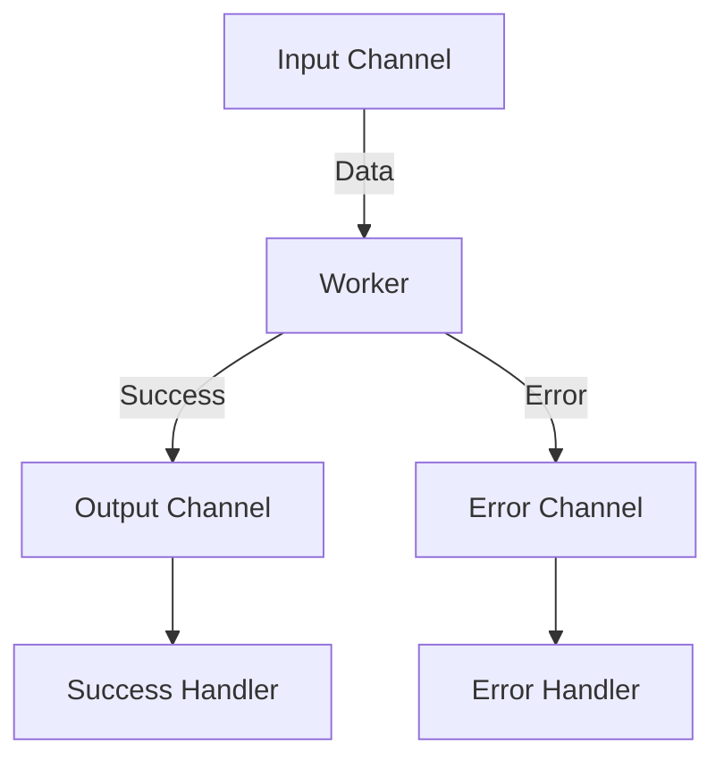

## 16.7.2 Strategies for Error Handling with core.async

Asynchronous programming in Clojure, particularly with `core.async`, offers powerful tools for building responsive and efficient applications. However, handling errors in asynchronous code can be challenging. In this section, we'll explore various strategies for managing errors effectively in `core.async`, drawing parallels with Java's concurrency mechanisms to ease the transition for Java developers.

### Understanding Error Handling in Asynchronous Programming

Before diving into specific strategies, let's briefly discuss the nature of errors in asynchronous programming. Unlike synchronous code, where exceptions can be caught and handled in a straightforward manner, asynchronous code often involves multiple threads or processes, making error propagation and handling more complex. In Clojure's `core.async`, errors can occur within `go` blocks, during channel operations, or in the coordination between asynchronous tasks.

### Wrapping `go` Block Code in `try/catch` Blocks

One of the most direct methods to handle errors in `core.async` is by using `try/catch` blocks within `go` blocks. This approach is similar to Java's try-catch mechanism, allowing you to catch exceptions locally and handle them appropriately.

```clojure
(require '[clojure.core.async :refer [go chan >! <!]])

(defn process-data [data]
  (go
    (try
      ;; Simulate processing that might throw an exception
      (if (nil? data)
        (throw (Exception. "Data cannot be nil"))
        (println "Processing data:" data))
      (catch Exception e
        (println "Error occurred:" (.getMessage e))))))
```

In this example, the `process-data` function uses a `go` block to simulate data processing. If the data is `nil`, an exception is thrown and caught within the `try/catch` block, allowing for graceful error handling.

#### Key Points:
- **Local Error Handling**: Errors are handled within the same `go` block, making it easier to manage specific exceptions.
- **Immediate Feedback**: Provides immediate feedback on errors, which can be logged or used to trigger other actions.

### Using Special Messages or Sentinel Values

Another strategy involves using channels to communicate errors explicitly. By sending special messages or sentinel values over channels, you can signal errors to other parts of your system.

```clojure
(defn worker [input-ch output-ch]
  (go
    (let [data (<! input-ch)]
      (if (nil? data)
        (>! output-ch {:status :error :message "Received nil data"})
        (>! output-ch {:status :success :result (str "Processed " data)})))))

(defn supervisor []
  (let [input-ch (chan)
        output-ch (chan)]
    (worker input-ch output-ch)
    (go
      (let [result (<! output-ch)]
        (case (:status result)
          :success (println "Success:" (:result result))
          :error (println "Error:" (:message result)))))))

(supervisor)
```

In this example, the `worker` function processes data from `input-ch` and sends a status message to `output-ch`. The `supervisor` function listens for these messages and handles them based on their status.

#### Key Points:
- **Decoupled Error Handling**: Errors are communicated through channels, allowing for separation of concerns.
- **Flexible Error Propagation**: Enables flexible error propagation across different components of the system.

### Implementing Supervision Strategies

Supervision strategies involve monitoring tasks and restarting them if they fail. This approach is inspired by the actor model, commonly used in systems like Erlang and Akka, and can be adapted to `core.async`.

```clojure
(defn supervised-worker [input-ch output-ch]
  (go-loop []
    (let [data (<! input-ch)]
      (try
        (if (nil? data)
          (throw (Exception. "Data cannot be nil"))
          (>! output-ch {:status :success :result (str "Processed " data)}))
        (catch Exception e
          (println "Error occurred, restarting worker:" (.getMessage e))
          (recur))))))

(defn supervisor []
  (let [input-ch (chan)
        output-ch (chan)]
    (supervised-worker input-ch output-ch)
    (go
      (let [result (<! output-ch)]
        (case (:status result)
          :success (println "Success:" (:result result))
          :error (println "Error:" (:message result)))))))

(supervisor)
```

Here, the `supervised-worker` function uses a `go-loop` to continuously process data. If an error occurs, it logs the error and restarts the worker by calling `recur`.

#### Key Points:
- **Resilience**: Automatically restarts tasks upon failure, increasing system resilience.
- **Isolation**: Each worker operates independently, reducing the impact of failures.

### Comparing with Java's Concurrency Mechanisms

Java developers are familiar with handling exceptions in multithreaded environments using constructs like `try-catch` within `Runnable` or `Callable` tasks. Clojure's `core.async` provides similar capabilities but with a functional twist. The use of channels for communication and error signaling offers a more declarative approach compared to Java's imperative style.

### Diagram: Error Handling Flow in core.async

Below is a diagram illustrating the flow of data and error handling in a `core.async` system:



**Diagram Description**: This diagram shows a typical flow in a `core.async` system where data is processed by a worker. Success and error messages are sent to separate channels, allowing for distinct handling paths.

### Best Practices for Error Handling with core.async

- **Centralize Error Handling**: Consider centralizing error handling logic to simplify maintenance and improve consistency.
- **Use Logging**: Implement logging within `catch` blocks to capture error details for debugging and monitoring.
- **Graceful Degradation**: Design your system to degrade gracefully in the presence of errors, maintaining core functionality.
- **Test Error Scenarios**: Regularly test error scenarios to ensure your error handling strategies are effective.

### Try It Yourself

Experiment with the provided code examples by modifying the data processing logic or introducing new error conditions. Observe how the system behaves and adjust the error handling strategies accordingly.

### Further Reading

For more information on `core.async` and error handling, consider exploring the following resources:

- [Official Clojure Documentation](https://clojure.org/reference/async)
- [ClojureDocs - core.async](https://clojuredocs.org/clojure.core.async)
- [GitHub - core.async Examples](https://github.com/clojure/core.async)

### Exercises

1. Modify the `supervised-worker` function to handle multiple types of errors with different retry strategies.
2. Implement a logging mechanism that records all errors to a file for later analysis.
3. Create a system that uses channels to propagate errors to a central error handler.

### Summary and Key Takeaways

In this section, we've explored various strategies for handling errors in `core.async`, including `try/catch` blocks, sentinel values, and supervision strategies. By leveraging these techniques, you can build robust and resilient asynchronous systems in Clojure. Remember to test your error handling strategies thoroughly and adapt them to your specific application needs.

---

## Quiz: Mastering Error Handling with core.async



### What is the primary purpose of using `try/catch` blocks within `go` blocks in core.async?

- [x] To handle exceptions locally within asynchronous tasks
- [ ] To improve performance of asynchronous tasks
- [ ] To simplify the syntax of `go` blocks
- [ ] To automatically restart failed tasks

> **Explanation:** `try/catch` blocks are used to handle exceptions locally within `go` blocks, allowing for specific error handling logic.

### How can errors be communicated across different components in a core.async system?

- [x] By sending special messages or sentinel values over channels
- [ ] By using global variables to store error states
- [ ] By throwing exceptions that propagate through channels
- [ ] By logging errors to the console

> **Explanation:** Errors can be communicated by sending special messages or sentinel values over channels, which allows for decoupled error handling.

### What is a key advantage of using supervision strategies in core.async?

- [x] They increase system resilience by automatically restarting failed tasks
- [ ] They eliminate the need for error handling
- [ ] They improve the performance of asynchronous tasks
- [ ] They simplify the syntax of `go` blocks

> **Explanation:** Supervision strategies increase system resilience by automatically restarting tasks that fail, ensuring continuous operation.

### In the context of core.async, what is a sentinel value?

- [x] A special message used to indicate an error or specific condition
- [ ] A default value used when no data is available
- [ ] A variable that stores the state of a channel
- [ ] A function that processes data in a channel

> **Explanation:** A sentinel value is a special message sent over a channel to indicate an error or specific condition, allowing for explicit error handling.

### Which of the following is NOT a recommended practice for error handling in core.async?

- [ ] Centralizing error handling logic
- [ ] Implementing logging within `catch` blocks
- [x] Using global variables for error states
- [ ] Designing for graceful degradation

> **Explanation:** Using global variables for error states is not recommended as it can lead to tightly coupled code and difficult-to-manage error handling.

### What is the role of a supervisor in a core.async system?

- [x] To monitor and restart failing tasks
- [ ] To process data from input channels
- [ ] To log errors to a file
- [ ] To manage channel lifecycles

> **Explanation:** A supervisor monitors tasks and restarts them if they fail, ensuring system resilience and continuous operation.

### How can you test error handling strategies in core.async?

- [x] By simulating error conditions and observing system behavior
- [ ] By using global variables to track errors
- [ ] By disabling error handling and checking for failures
- [ ] By logging all channel operations

> **Explanation:** Testing error handling strategies involves simulating error conditions and observing how the system responds, ensuring robustness.

### What is a potential downside of using sentinel values for error handling?

- [x] It can lead to complex and hard-to-maintain code if overused
- [ ] It simplifies error handling too much
- [ ] It requires additional libraries
- [ ] It is not compatible with `go` blocks

> **Explanation:** Overusing sentinel values can lead to complex and hard-to-maintain code, as it requires careful management of message types and handling logic.

### Why is logging important in error handling with core.async?

- [x] It helps capture error details for debugging and monitoring
- [ ] It automatically resolves errors
- [ ] It improves the performance of `go` blocks
- [ ] It simplifies channel operations

> **Explanation:** Logging is important for capturing error details, which aids in debugging and monitoring the health of the system.

### True or False: Supervision strategies in core.async are inspired by the actor model.

- [x] True
- [ ] False

> **Explanation:** True. Supervision strategies in core.async are inspired by the actor model, which is known for its resilience and fault-tolerance.


