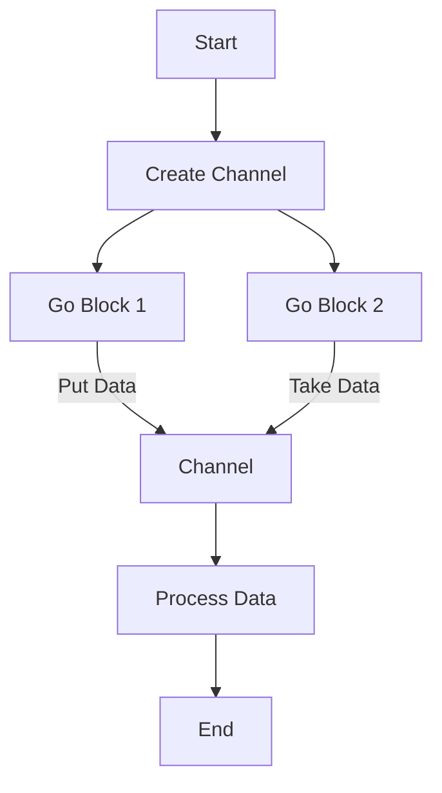

## 16.8.1 Understanding core.async Performance

As experienced Java developers, you're likely familiar with the complexities of managing concurrency and asynchronous operations. Clojure's `core.async` library offers a powerful alternative to traditional Java concurrency mechanisms, providing a higher-level abstraction for asynchronous programming. In this section, we'll delve into the performance characteristics of `core.async`, examining the overhead of channels and go blocks, and discussing when `core.async` is the right tool for the job.

### Introduction to core.async

`core.async` is a Clojure library that facilitates asynchronous programming using channels and lightweight threads called go blocks. It draws inspiration from the Communicating Sequential Processes (CSP) model, allowing developers to write concurrent code that is easier to reason about and maintain.

#### Key Concepts

- **Channels**: These are conduits for passing messages between different parts of a program. Channels can be buffered or unbuffered, and they support operations like `put!`, `take!`, and `close!`.
- **Go Blocks**: These are lightweight threads that allow you to write asynchronous code in a synchronous style. They use channels to communicate and can be paused and resumed without blocking the underlying thread.

### Performance Characteristics of core.async

Understanding the performance implications of using `core.async` is crucial for making informed decisions about when and how to use it in your applications.

#### Overhead of Channels

Channels in `core.async` introduce some overhead due to their design and functionality. Here's a breakdown of the factors contributing to this overhead:

1. **Synchronization**: Channels require synchronization to ensure thread safety, which can introduce latency, especially in high-throughput scenarios.
2. **Buffering**: Buffered channels can help mitigate synchronization overhead by allowing multiple messages to be queued, but they also consume additional memory.
3. **Garbage Collection**: Channels, especially those with large buffers, can increase the pressure on the garbage collector, potentially affecting performance.

#### Go Blocks and Thread Management

Go blocks are designed to be lightweight, but they still incur some overhead:

1. **Context Switching**: Although go blocks are more efficient than traditional threads, they still involve context switching, which can impact performance.
2. **Blocking Operations**: Go blocks should avoid blocking operations, as they can tie up the underlying thread pool, reducing concurrency.
3. **Resource Utilization**: Efficient use of go blocks requires careful management of resources to avoid excessive memory and CPU usage.

### When to Use core.async

`core.async` is a powerful tool, but it's not always the best choice for every scenario. Here are some guidelines to help you decide when to use `core.async`:

#### Appropriate Use Cases

- **Complex Asynchronous Workflows**: When you need to coordinate multiple asynchronous tasks, `core.async` provides a clear and maintainable way to manage these workflows.
- **Non-blocking I/O**: For applications that require non-blocking I/O operations, `core.async` can help you write clean and efficient code.
- **Reactive Systems**: In systems that need to react to a continuous stream of events, `core.async` can simplify the handling of these events.

#### Alternatives to core.async

In some cases, alternative approaches might be more performant:

- **Java's CompletableFuture**: For simple asynchronous tasks, Java's `CompletableFuture` can be more efficient due to its lower overhead.
- **Direct Thread Management**: For tasks that require precise control over threading, managing threads directly might be more appropriate.
- **Other Libraries**: Libraries like RxJava or Akka might be better suited for specific use cases, such as reactive programming or actor-based concurrency.

### Code Examples

Let's explore some code examples to illustrate the performance characteristics of `core.async`.

#### Example 1: Basic Channel Usage

```clojure
(require '[clojure.core.async :as async])

(defn simple-channel []
  (let [ch (async/chan 10)] ; Create a buffered channel with a capacity of 10
    (async/go
      (dotimes [i 10]
        (async/>! ch i) ; Put values into the channel
        (println "Put" i)))
    (async/go
      (dotimes [i 10]
        (let [val (async/<! ch)] ; Take values from the channel
          (println "Took" val))))))
```

**Explanation**: This example demonstrates basic channel usage with a buffered channel. The `go` blocks handle putting and taking values from the channel, showcasing the non-blocking nature of `core.async`.

#### Example 2: Avoiding Blocking Operations

```clojure
(defn non-blocking-example []
  (let [ch (async/chan)]
    (async/go
      (async/>! ch (do-some-work)) ; Perform work asynchronously
      (println "Work done"))
    (async/go
      (let [result (async/<! ch)]
        (println "Result:" result)))))
```

**Explanation**: This example emphasizes the importance of avoiding blocking operations within go blocks. The `do-some-work` function is executed asynchronously, ensuring that the go block doesn't block the underlying thread.

### Diagrams and Visualizations

To better understand the flow of data and control in `core.async`, let's look at a diagram illustrating the interaction between channels and go blocks.



**Diagram Explanation**: This flowchart represents a typical `core.async` workflow, where data is put into a channel by one go block and taken by another. The channel acts as a conduit for data, facilitating communication between different parts of the program.

### Try It Yourself

To deepen your understanding of `core.async`, try modifying the examples above:

- **Experiment with Different Buffer Sizes**: Change the buffer size in the channel and observe how it affects performance.
- **Introduce Blocking Operations**: Add a blocking operation within a go block and see how it impacts the program's behavior.
- **Create a More Complex Workflow**: Design a workflow with multiple channels and go blocks to see how `core.async` handles complexity.

### Exercises

1. **Channel Performance Analysis**: Create a program that measures the time taken to put and take a large number of messages through a channel. Experiment with different buffer sizes and analyze the results.
2. **Go Block Efficiency**: Write a program that uses multiple go blocks to perform a series of tasks. Measure the CPU and memory usage to evaluate the efficiency of go blocks.
3. **Comparing Alternatives**: Implement a simple asynchronous task using both `core.async` and Java's `CompletableFuture`. Compare the performance and discuss the trade-offs.

### Key Takeaways

- **Understand the Overhead**: Be aware of the synchronization and memory overhead associated with channels and go blocks.
- **Choose the Right Tool**: Use `core.async` for complex asynchronous workflows, but consider alternatives for simpler tasks.
- **Optimize Resource Usage**: Manage resources carefully to ensure efficient use of go blocks and channels.

By understanding the performance characteristics of `core.async`, you can make informed decisions about when and how to use it in your Clojure applications. This knowledge will help you write efficient, maintainable, and scalable asynchronous code.

### Further Reading

For more information on `core.async` and its performance characteristics, consider exploring the following resources:

- [Official Clojure Documentation](https://clojure.org/reference/async)
- [ClojureDocs - core.async](https://clojuredocs.org/clojure.core.async)
- [GitHub - core.async](https://github.com/clojure/core.async)

## SEO optimized quiz title



### What is the primary purpose of Clojure's core.async library?

- [x] To facilitate asynchronous programming using channels and go blocks
- [ ] To provide a framework for building web applications
- [ ] To enhance Java's concurrency mechanisms
- [ ] To simplify data serialization

> **Explanation:** Clojure's core.async library is designed to facilitate asynchronous programming using channels and go blocks, providing a higher-level abstraction for managing concurrency.

### Which of the following is a key characteristic of channels in core.async?

- [x] They require synchronization to ensure thread safety
- [ ] They are used for data serialization
- [ ] They are only used in synchronous programming
- [ ] They do not support buffering

> **Explanation:** Channels in core.async require synchronization to ensure thread safety, which can introduce latency in high-throughput scenarios.

### What is a go block in core.async?

- [x] A lightweight thread that allows asynchronous code to be written in a synchronous style
- [ ] A mechanism for managing state in Clojure
- [ ] A type of data structure used in core.async
- [ ] A function for serializing data

> **Explanation:** A go block in core.async is a lightweight thread that allows asynchronous code to be written in a synchronous style, facilitating easier management of concurrency.

### When is core.async most appropriate to use?

- [x] For complex asynchronous workflows and non-blocking I/O operations
- [ ] For simple synchronous tasks
- [ ] For data serialization
- [ ] For building user interfaces

> **Explanation:** core.async is most appropriate for complex asynchronous workflows and non-blocking I/O operations, where its abstractions can simplify code management.

### Which of the following is an alternative to core.async for simple asynchronous tasks?

- [x] Java's CompletableFuture
- [ ] Clojure's defmacro
- [ ] Java's Reflection API
- [ ] Clojure's defn

> **Explanation:** Java's CompletableFuture is an alternative to core.async for simple asynchronous tasks due to its lower overhead.

### What is a potential downside of using buffered channels in core.async?

- [x] Increased memory consumption
- [ ] Reduced synchronization
- [ ] Inability to handle asynchronous tasks
- [ ] Lack of thread safety

> **Explanation:** Buffered channels can increase memory consumption, which is a potential downside when using them in core.async.

### How can go blocks affect resource utilization?

- [x] By tying up the underlying thread pool if blocking operations are used
- [ ] By reducing memory usage
- [ ] By eliminating the need for synchronization
- [ ] By simplifying data serialization

> **Explanation:** Go blocks can affect resource utilization by tying up the underlying thread pool if blocking operations are used, reducing concurrency.

### What is a key benefit of using core.async for reactive systems?

- [x] Simplified handling of continuous event streams
- [ ] Enhanced data serialization capabilities
- [ ] Improved performance for synchronous tasks
- [ ] Reduced memory usage

> **Explanation:** A key benefit of using core.async for reactive systems is the simplified handling of continuous event streams, making it easier to manage asynchronous events.

### Which of the following is a recommended practice when using go blocks?

- [x] Avoid blocking operations within go blocks
- [ ] Use go blocks for data serialization
- [ ] Always use unbuffered channels
- [ ] Avoid using channels altogether

> **Explanation:** It is recommended to avoid blocking operations within go blocks to prevent tying up the underlying thread pool and reducing concurrency.

### True or False: core.async is always the best choice for asynchronous programming in Clojure.

- [ ] True
- [x] False

> **Explanation:** False. While core.async is a powerful tool for asynchronous programming, it is not always the best choice. Alternatives like Java's CompletableFuture may be more appropriate for simpler tasks.


