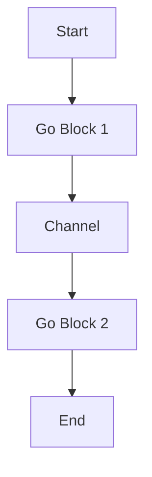

## 16.8.2 Optimizing Asynchronous Code

Asynchronous programming is a powerful paradigm that allows developers to write non-blocking code, enabling applications to handle multiple tasks concurrently. In Clojure, the `core.async` library provides a robust framework for building asynchronous applications using channels and go blocks. However, writing efficient asynchronous code requires careful consideration of performance aspects. In this section, we'll explore strategies to optimize asynchronous code in Clojure, drawing parallels with Java where applicable.

### Understanding Asynchronous Programming in Clojure

Before diving into optimization techniques, let's briefly review how asynchronous programming works in Clojure. The `core.async` library introduces channels, which are conduits for passing messages between different parts of a program, and go blocks, which are lightweight threads that execute asynchronous code.

#### Key Concepts

- **Channels**: Used for communication between go blocks. They can be buffered or unbuffered.
- **Go Blocks**: Lightweight threads that allow non-blocking operations using channels.
- **Thread Pools**: Manage the execution of go blocks and other asynchronous tasks.

### Minimizing Closures in Go Blocks

Closures in go blocks can lead to performance overhead due to the capture of variables from the surrounding context. Minimizing closures can help reduce this overhead.

#### Example: Avoiding Unnecessary Closures

Consider the following example where a closure captures a variable unnecessarily:

```clojure
(require '[clojure.core.async :refer [go chan >! <!]])

(defn process-data [data]
  (let [c (chan)]
    (go
      (let [result (expensive-computation data)]
        (>! c result)))
    c))

;; Optimized version
(defn process-data-optimized [data]
  (let [c (chan)
        result (expensive-computation data)]
    (go
      (>! c result))
    c))
```

In the optimized version, the expensive computation is performed outside the go block, reducing the closure's size.

### Avoiding Unnecessary Channel Operations

Channel operations, such as `>!` and `<!`, can introduce latency if used excessively or unnecessarily. It's important to streamline these operations to improve performance.

#### Example: Streamlining Channel Operations

```clojure
(defn fetch-data [url]
  (let [c (chan)]
    (go
      (let [response (<! (http-get url))]
        (>! c response)))
    c))

;; Optimized version
(defn fetch-data-optimized [url]
  (let [c (chan)]
    (go
      (>! c (<! (http-get url))))
    c))
```

In this example, the channel operation is streamlined by directly passing the result of `http-get` to the channel.

### Properly Sizing Thread Pools and Managing Resources

Thread pools play a crucial role in managing the execution of asynchronous tasks. Proper sizing and management of thread pools can significantly impact performance.

#### Considerations for Thread Pool Sizing

- **Task Characteristics**: Consider the nature of tasks (CPU-bound vs. I/O-bound) when sizing thread pools.
- **System Resources**: Ensure that the thread pool size aligns with available system resources to avoid contention.

#### Example: Configuring a Thread Pool

```clojure
(import '[java.util.concurrent Executors])

(defn create-thread-pool [size]
  (Executors/newFixedThreadPool size))

(def thread-pool (create-thread-pool 10))
```

In this example, a fixed thread pool is created with a specified size. Adjust the size based on the application's requirements and system capabilities.

### Comparing with Java's Asynchronous Programming

Java provides several mechanisms for asynchronous programming, such as `CompletableFuture` and `ExecutorService`. Let's compare these with Clojure's approach.

#### Java Example: Using CompletableFuture

```java
import java.util.concurrent.CompletableFuture;

public class AsyncExample {
    public static CompletableFuture<String> fetchData(String url) {
        return CompletableFuture.supplyAsync(() -> {
            // Simulate HTTP request
            return "Response from " + url;
        });
    }
}
```

#### Clojure Example: Using core.async

```clojure
(require '[clojure.core.async :refer [go chan >!]])

(defn fetch-data [url]
  (let [c (chan)]
    (go
      (>! c (str "Response from " url)))
    c))
```

**Comparison**: Clojure's `core.async` provides a more functional approach with channels and go blocks, while Java's `CompletableFuture` offers a more object-oriented style with futures and callbacks.

### Try It Yourself: Experimenting with Asynchronous Code

To deepen your understanding, try modifying the examples above:

- **Experiment with Channel Buffers**: Change the buffer size of channels and observe the impact on performance.
- **Adjust Thread Pool Sizes**: Modify the thread pool size and measure the effect on task execution times.
- **Refactor Closures**: Identify closures in your code and refactor them to minimize their size.

### Visualizing Asynchronous Code Flow

Below is a diagram illustrating the flow of data through channels and go blocks in a Clojure application:



**Diagram Description**: This diagram shows how data flows from one go block to another through a channel, demonstrating the non-blocking nature of asynchronous code.

### Exercises: Optimizing Asynchronous Code

1. **Refactor a Java Program**: Take a Java program using `CompletableFuture` and refactor it to use Clojure's `core.async`.
2. **Analyze Channel Usage**: Review a Clojure project and identify areas where channel operations can be optimized.
3. **Thread Pool Experimentation**: Create a Clojure application with varying thread pool sizes and measure the impact on performance.

### Key Takeaways

- **Minimize Closures**: Reduce the size of closures in go blocks to improve performance.
- **Streamline Channel Operations**: Avoid unnecessary channel operations to reduce latency.
- **Manage Thread Pools**: Properly size and manage thread pools to optimize resource usage.

By applying these optimization techniques, you can enhance the performance of your asynchronous Clojure applications, making them more efficient and responsive.

### Further Reading

For more information on asynchronous programming in Clojure, consider exploring the following resources:

- [Official Clojure Documentation](https://clojure.org/reference/async)
- [ClojureDocs - core.async](https://clojuredocs.org/clojure.core.async)
- [GitHub - core.async Examples](https://github.com/clojure/core.async)

## Quiz: Mastering Asynchronous Code Optimization in Clojure



### What is the primary purpose of minimizing closures in go blocks?

- [x] To reduce performance overhead
- [ ] To increase code readability
- [ ] To simplify debugging
- [ ] To enhance security

> **Explanation:** Minimizing closures in go blocks reduces the performance overhead associated with capturing variables from the surrounding context.

### Which of the following is a benefit of streamlining channel operations?

- [x] Reduced latency
- [ ] Increased code complexity
- [ ] Enhanced security
- [ ] Improved readability

> **Explanation:** Streamlining channel operations reduces latency by minimizing unnecessary operations.

### How does proper thread pool sizing affect asynchronous code performance?

- [x] It optimizes resource usage
- [ ] It increases code readability
- [ ] It simplifies debugging
- [ ] It enhances security

> **Explanation:** Proper thread pool sizing optimizes resource usage by aligning the pool size with task characteristics and system resources.

### In Clojure, what is the role of channels in asynchronous programming?

- [x] They facilitate communication between go blocks
- [ ] They manage thread pools
- [ ] They handle exceptions
- [ ] They optimize memory usage

> **Explanation:** Channels facilitate communication between go blocks, allowing for non-blocking data transfer.

### What is a key difference between Clojure's core.async and Java's CompletableFuture?

- [x] core.async uses channels and go blocks
- [ ] CompletableFuture uses channels and go blocks
- [ ] core.async is object-oriented
- [ ] CompletableFuture is functional

> **Explanation:** Clojure's core.async uses channels and go blocks, while Java's CompletableFuture relies on futures and callbacks.

### What is the impact of using buffered channels in Clojure?

- [x] It can improve performance by reducing blocking
- [ ] It increases code complexity
- [ ] It simplifies debugging
- [ ] It enhances security

> **Explanation:** Buffered channels can improve performance by reducing blocking, allowing more data to be processed concurrently.

### Why is it important to manage thread pools effectively in asynchronous programming?

- [x] To optimize resource usage and task execution
- [ ] To increase code readability
- [ ] To simplify debugging
- [ ] To enhance security

> **Explanation:** Managing thread pools effectively optimizes resource usage and task execution, ensuring efficient performance.

### How can you reduce the performance overhead of closures in go blocks?

- [x] By performing computations outside the go block
- [ ] By increasing the number of closures
- [ ] By using more channels
- [ ] By adding more go blocks

> **Explanation:** Performing computations outside the go block reduces the size of closures, minimizing performance overhead.

### What is a common use case for using core.async in Clojure?

- [x] Building non-blocking, concurrent applications
- [ ] Managing database transactions
- [ ] Handling file I/O operations
- [ ] Optimizing memory usage

> **Explanation:** core.async is commonly used for building non-blocking, concurrent applications by leveraging channels and go blocks.

### True or False: Properly sizing thread pools is not important for optimizing asynchronous code performance.

- [ ] True
- [x] False

> **Explanation:** Properly sizing thread pools is crucial for optimizing asynchronous code performance, as it ensures efficient resource usage and task execution.


