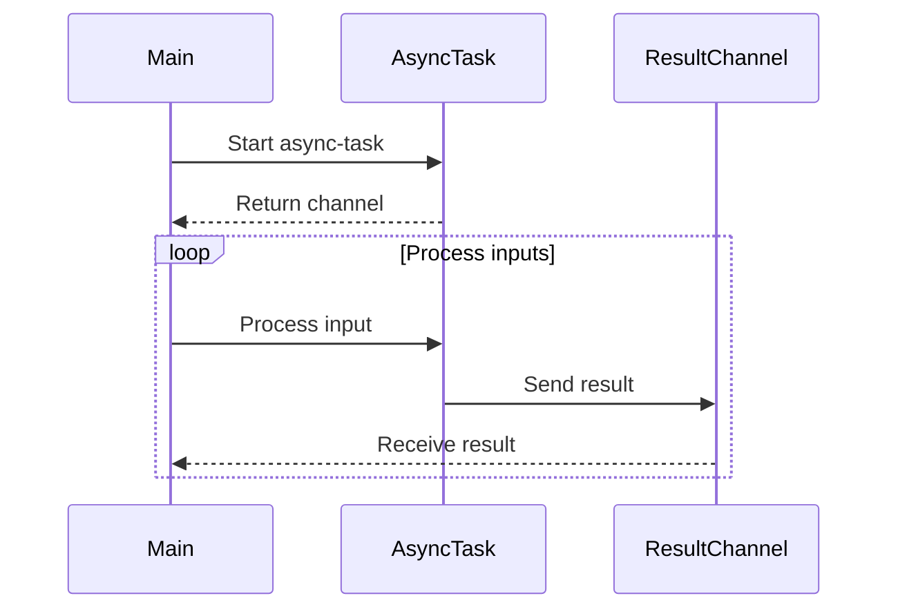

## 16.8.3 Benchmarking and Profiling

As experienced Java developers transitioning to Clojure, understanding how to effectively benchmark and profile your code is crucial for optimizing performance, especially in asynchronous and reactive programming contexts. In this section, we'll delve into the tools and techniques that will help you identify bottlenecks, measure latency, and optimize throughput in your Clojure applications.

### Understanding Benchmarking and Profiling

Before we dive into the specifics, let's clarify what benchmarking and profiling entail:

- **Benchmarking** is the process of measuring the performance of a piece of code, typically focusing on execution time, memory usage, and throughput. It helps you compare different implementations or configurations to determine which performs best under specific conditions.

- **Profiling** involves analyzing a program to understand where it spends most of its time or resources. Profiling tools provide insights into function call frequency, execution time, and memory allocation, helping you pinpoint performance bottlenecks.

### Benchmarking Asynchronous Code in Clojure

Benchmarking asynchronous code can be challenging due to the non-deterministic nature of concurrent operations. However, with the right approach, you can gain valuable insights into your code's performance.

#### Tools for Benchmarking

1. **Criterium**: A popular benchmarking library in Clojure, Criterium provides robust statistical analysis of your code's performance. It accounts for JVM warm-up time and provides detailed reports on execution time and variability.

   ```clojure
   (require '[criterium.core :refer [quick-bench]])

   (defn async-operation []
     ;; Simulate an asynchronous operation
     (Thread/sleep 100)
     :done)

   (quick-bench (async-operation))
   ```

   In this example, `quick-bench` runs the `async-operation` multiple times, providing a detailed report of its performance.

2. **JMH (Java Microbenchmark Harness)**: Although primarily a Java tool, JMH can be used with Clojure to perform microbenchmarks. It offers precise control over benchmarking parameters and is ideal for low-level performance testing.

#### Best Practices for Benchmarking

- **Isolate the Code**: Ensure that the code you're benchmarking is isolated from external factors that could affect its performance, such as I/O operations or network latency.

- **Warm-Up the JVM**: The JVM optimizes code execution over time. Allow your code to run several times before measuring its performance to ensure accurate results.

- **Use Realistic Workloads**: Benchmark your code under conditions that closely resemble its actual usage to obtain meaningful results.

### Profiling Asynchronous Code in Clojure

Profiling helps you understand where your code spends most of its time and resources, allowing you to focus optimization efforts where they will have the greatest impact.

#### Profiling Tools

1. **VisualVM**: A powerful profiling tool that provides insights into CPU usage, memory allocation, and thread activity. It can be used to profile Clojure applications running on the JVM.

   - **CPU Profiling**: Identify which functions consume the most CPU time.
   - **Memory Profiling**: Analyze memory usage patterns and identify potential leaks.

2. **YourKit**: Another comprehensive profiling tool that offers advanced features such as object allocation tracking and thread profiling. It's particularly useful for identifying memory leaks and understanding thread behavior in asynchronous applications.

3. **Rebel Readline**: While not a traditional profiler, Rebel Readline enhances the REPL experience with features like syntax highlighting and command history, making it easier to interactively test and debug code.

#### Profiling Asynchronous Operations

Profiling asynchronous code requires special attention to thread activity and synchronization points. Here are some tips:

- **Monitor Thread Activity**: Use profiling tools to observe thread creation, execution, and synchronization. Look for excessive context switching or thread contention, which can degrade performance.

- **Analyze Synchronization Points**: Identify points in your code where threads synchronize, such as locks or atomic operations. These can become bottlenecks if not managed carefully.

- **Track Memory Usage**: Asynchronous operations can lead to increased memory usage due to the creation of additional objects or data structures. Use memory profiling to identify and optimize these areas.

### Comparing Clojure and Java Profiling

Clojure's functional nature and emphasis on immutability can lead to different performance characteristics compared to Java. Here are some key differences:

- **Immutability**: Clojure's immutable data structures can reduce the risk of concurrency issues but may introduce overhead due to persistent data structures. Profiling can help identify when this overhead becomes significant.

- **Concurrency Models**: Clojure's concurrency primitives (atoms, refs, agents) offer a different approach to managing state compared to Java's synchronized blocks and locks. Profiling can reveal how these models impact performance.

- **Higher-Order Functions**: Clojure's use of higher-order functions and lazy sequences can lead to different performance patterns compared to Java's imperative loops. Profiling can help you understand these patterns and optimize accordingly.

### Code Example: Profiling an Asynchronous Task

Let's consider a simple example of profiling an asynchronous task in Clojure using VisualVM.

```clojure
(require '[clojure.core.async :refer [go <! >! chan]])

(defn async-task [input]
  (go
    (Thread/sleep 100) ;; Simulate a delay
    (println "Processing" input)
    (str "Result: " input)))

(defn process-tasks [inputs]
  (let [results (chan)]
    (doseq [input inputs]
      (go
        (>! results (<! (async-task input)))))
    results))

;; Start profiling with VisualVM
(def inputs (range 10))
(def results (process-tasks inputs))

;; Consume results
(go-loop []
  (when-let [result (<! results)]
    (println result)
    (recur)))
```

In this example, we use `core.async` to process a list of inputs asynchronously. By profiling this code with VisualVM, we can observe thread activity and identify any performance bottlenecks.

### Try It Yourself

Experiment with the code example above by modifying the `async-task` function to introduce different delays or workloads. Use VisualVM to profile the modified code and observe how changes impact performance.

### Diagrams and Visualizations

To better understand the flow of data and control in asynchronous operations, let's visualize the process using a sequence diagram.



**Diagram Description**: This sequence diagram illustrates the interaction between the main process, asynchronous tasks, and the result channel. It highlights the non-blocking nature of asynchronous operations and the flow of data through channels.

### Exercises and Practice Problems

1. **Benchmarking Exercise**: Use Criterium to benchmark a function that performs a computationally intensive task. Compare the performance of different implementations (e.g., iterative vs. recursive) and analyze the results.

2. **Profiling Exercise**: Profile a Clojure application that uses `core.async` to perform concurrent tasks. Use VisualVM to identify bottlenecks and optimize the code for better performance.

3. **Challenge**: Implement a simple web server in Clojure using `ring` and `compojure`. Use JMH to benchmark request handling and VisualVM to profile the server under load.

### Key Takeaways

- **Benchmarking and profiling are essential tools** for optimizing the performance of Clojure applications, especially in asynchronous and reactive contexts.
- **Criterium and JMH** are powerful tools for benchmarking Clojure code, providing detailed insights into execution time and variability.
- **VisualVM and YourKit** offer comprehensive profiling capabilities, helping you identify CPU and memory bottlenecks in your applications.
- **Understanding the differences between Clojure and Java** in terms of concurrency models and data structures can guide your optimization efforts.
- **Experimentation and practice** are key to mastering benchmarking and profiling techniques. Use the exercises provided to reinforce your learning and apply these concepts to real-world scenarios.

By mastering these tools and techniques, you'll be well-equipped to optimize the performance of your Clojure applications and make informed decisions about code design and architecture.

## SEO optimized quiz title



### What is the primary purpose of benchmarking in Clojure?

- [x] To measure the performance of code
- [ ] To debug code
- [ ] To compile code
- [ ] To refactor code

> **Explanation:** Benchmarking is used to measure the performance of code, focusing on execution time, memory usage, and throughput.

### Which tool is commonly used for benchmarking in Clojure?

- [x] Criterium
- [ ] JUnit
- [ ] Mockito
- [ ] Maven

> **Explanation:** Criterium is a popular benchmarking library in Clojure that provides robust statistical analysis of code performance.

### What does profiling help you identify in your code?

- [x] Performance bottlenecks
- [ ] Syntax errors
- [ ] Compilation issues
- [ ] Code style violations

> **Explanation:** Profiling helps identify performance bottlenecks by analyzing where a program spends most of its time or resources.

### Which tool can be used to profile Clojure applications running on the JVM?

- [x] VisualVM
- [ ] Eclipse
- [ ] IntelliJ IDEA
- [ ] NetBeans

> **Explanation:** VisualVM is a powerful profiling tool that provides insights into CPU usage, memory allocation, and thread activity for JVM applications.

### What is a key difference between Clojure and Java in terms of concurrency models?

- [x] Clojure uses atoms, refs, and agents
- [ ] Java uses atoms, refs, and agents
- [ ] Clojure uses synchronized blocks and locks
- [ ] Java uses core.async channels

> **Explanation:** Clojure uses concurrency primitives like atoms, refs, and agents, while Java traditionally uses synchronized blocks and locks.

### What is the purpose of the `quick-bench` function in Criterium?

- [x] To run a function multiple times and provide a performance report
- [ ] To compile a function
- [ ] To refactor a function
- [ ] To debug a function

> **Explanation:** The `quick-bench` function in Criterium runs a function multiple times and provides a detailed performance report.

### Which of the following is a best practice for benchmarking?

- [x] Use realistic workloads
- [ ] Benchmark in isolation from the JVM
- [ ] Avoid warming up the JVM
- [ ] Use synthetic workloads only

> **Explanation:** Using realistic workloads ensures that benchmarking results are meaningful and closely resemble actual usage conditions.

### What does the sequence diagram in the article illustrate?

- [x] The interaction between the main process, asynchronous tasks, and the result channel
- [ ] The compilation process of a Clojure program
- [ ] The syntax of Clojure functions
- [ ] The structure of a Clojure namespace

> **Explanation:** The sequence diagram illustrates the interaction between the main process, asynchronous tasks, and the result channel, highlighting the non-blocking nature of asynchronous operations.

### Which profiling tool offers advanced features like object allocation tracking?

- [x] YourKit
- [ ] Criterium
- [ ] JMH
- [ ] Maven

> **Explanation:** YourKit offers advanced profiling features such as object allocation tracking and thread profiling.

### True or False: Profiling can help identify excessive context switching in asynchronous code.

- [x] True
- [ ] False

> **Explanation:** Profiling can help identify excessive context switching, which can degrade performance in asynchronous code.


