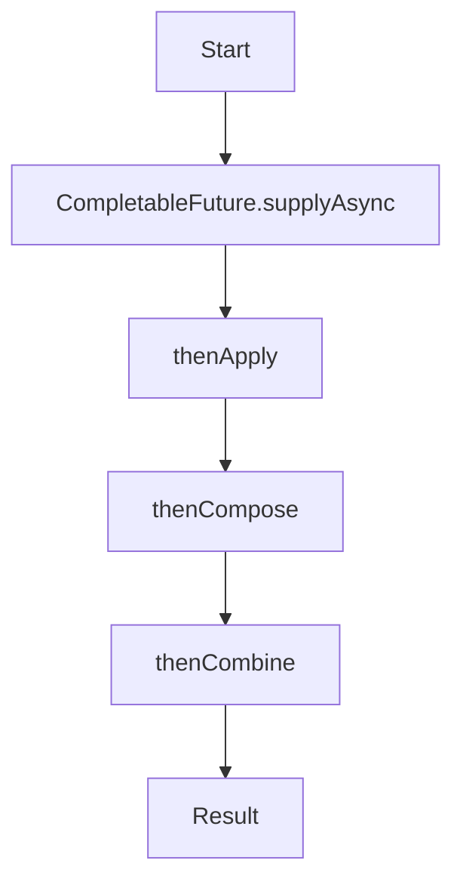

## 16.9.1 Overview of CompletableFuture

As Java developers, many of us are familiar with the challenges of managing asynchronous computations and concurrency. Java's `CompletableFuture` is a powerful tool introduced in Java 8 that simplifies asynchronous programming by providing a more flexible and comprehensive API than traditional `Future`. In this section, we will explore what `CompletableFuture` is, its key features, and how it compares to Clojure's `core.async`.

### What is CompletableFuture?

`CompletableFuture` is part of the `java.util.concurrent` package and represents a future result of an asynchronous computation. It allows you to write non-blocking code by providing a way to execute tasks asynchronously and handle their results or exceptions once they complete.

#### Key Features of CompletableFuture

1. **Asynchronous Execution**: `CompletableFuture` allows you to run tasks asynchronously without blocking the main thread, improving application responsiveness.

2. **Chaining**: You can chain multiple asynchronous operations together, creating a pipeline of tasks that execute sequentially or in parallel.

3. **Combining Futures**: `CompletableFuture` provides methods to combine multiple futures, allowing you to wait for all or any of them to complete before proceeding.

4. **Exception Handling**: It offers robust exception handling mechanisms, enabling you to handle errors gracefully in asynchronous workflows.

5. **Non-blocking API**: Unlike traditional `Future`, `CompletableFuture` provides a non-blocking API, allowing you to register callbacks to be executed upon completion.

### Creating and Completing CompletableFutures

Let's start by creating a simple `CompletableFuture` and completing it manually:

```java
import java.util.concurrent.CompletableFuture;

public class CompletableFutureExample {
    public static void main(String[] args) {
        // Create a CompletableFuture
        CompletableFuture<String> future = new CompletableFuture<>();

        // Complete the future manually
        future.complete("Hello, CompletableFuture!");

        // Get the result
        future.thenAccept(result -> System.out.println(result));
    }
}
```

In this example, we create a `CompletableFuture` and complete it manually with a string value. The `thenAccept` method is used to register a callback that prints the result once the future is completed.

### Running Asynchronous Tasks

`CompletableFuture` provides several static methods to run tasks asynchronously. The `supplyAsync` method is commonly used to execute a task that returns a result:

```java
import java.util.concurrent.CompletableFuture;

public class AsyncTaskExample {
    public static void main(String[] args) {
        // Run a task asynchronously
        CompletableFuture<String> future = CompletableFuture.supplyAsync(() -> {
            // Simulate a long-running task
            try {
                Thread.sleep(2000);
            } catch (InterruptedException e) {
                e.printStackTrace();
            }
            return "Task completed!";
        });

        // Register a callback to handle the result
        future.thenAccept(result -> System.out.println(result));

        // Keep the main thread alive to see the result
        try {
            Thread.sleep(3000);
        } catch (InterruptedException e) {
            e.printStackTrace();
        }
    }
}
```

Here, the `supplyAsync` method runs a task in a separate thread, simulating a long-running operation. The `thenAccept` method registers a callback to print the result once the task completes.

### Chaining CompletableFutures

One of the powerful features of `CompletableFuture` is the ability to chain multiple asynchronous operations. This is done using methods like `thenApply`, `thenCompose`, and `thenCombine`.

#### Using thenApply

The `thenApply` method allows you to transform the result of a future once it completes:

```java
import java.util.concurrent.CompletableFuture;

public class ChainingExample {
    public static void main(String[] args) {
        CompletableFuture<String> future = CompletableFuture.supplyAsync(() -> "Hello")
                .thenApply(greeting -> greeting + ", World!");

        future.thenAccept(System.out::println);

        // Keep the main thread alive to see the result
        try {
            Thread.sleep(1000);
        } catch (InterruptedException e) {
            e.printStackTrace();
        }
    }
}
```

In this example, we chain a transformation to append ", World!" to the initial result.

#### Using thenCompose

The `thenCompose` method is used to chain futures that depend on each other:

```java
import java.util.concurrent.CompletableFuture;

public class ComposeExample {
    public static void main(String[] args) {
        CompletableFuture<String> future = CompletableFuture.supplyAsync(() -> "Hello")
                .thenCompose(greeting -> CompletableFuture.supplyAsync(() -> greeting + ", World!"));

        future.thenAccept(System.out::println);

        // Keep the main thread alive to see the result
        try {
            Thread.sleep(1000);
        } catch (InterruptedException e) {
            e.printStackTrace();
        }
    }
}
```

Here, `thenCompose` is used to chain two asynchronous tasks, where the second task depends on the result of the first.

#### Using thenCombine

The `thenCombine` method allows you to combine two independent futures:

```java
import java.util.concurrent.CompletableFuture;

public class CombineExample {
    public static void main(String[] args) {
        CompletableFuture<String> future1 = CompletableFuture.supplyAsync(() -> "Hello");
        CompletableFuture<String> future2 = CompletableFuture.supplyAsync(() -> "World");

        CompletableFuture<String> combinedFuture = future1.thenCombine(future2, (greeting, name) -> greeting + ", " + name + "!");

        combinedFuture.thenAccept(System.out::println);

        // Keep the main thread alive to see the result
        try {
            Thread.sleep(1000);
        } catch (InterruptedException e) {
            e.printStackTrace();
        }
    }
}
```

In this example, `thenCombine` is used to combine the results of two independent futures.

### Handling Exceptions

`CompletableFuture` provides several methods for handling exceptions, such as `exceptionally`, `handle`, and `whenComplete`.

#### Using exceptionally

The `exceptionally` method allows you to handle exceptions and provide a fallback result:

```java
import java.util.concurrent.CompletableFuture;

public class ExceptionHandlingExample {
    public static void main(String[] args) {
        CompletableFuture<String> future = CompletableFuture.supplyAsync(() -> {
            if (Math.random() > 0.5) {
                throw new RuntimeException("Something went wrong!");
            }
            return "Task completed successfully!";
        }).exceptionally(ex -> "Fallback result due to: " + ex.getMessage());

        future.thenAccept(System.out::println);

        // Keep the main thread alive to see the result
        try {
            Thread.sleep(1000);
        } catch (InterruptedException e) {
            e.printStackTrace();
        }
    }
}
```

Here, `exceptionally` provides a fallback result if an exception occurs during the task execution.

#### Using handle

The `handle` method allows you to handle both the result and exceptions:

```java
import java.util.concurrent.CompletableFuture;

public class HandleExample {
    public static void main(String[] args) {
        CompletableFuture<String> future = CompletableFuture.supplyAsync(() -> {
            if (Math.random() > 0.5) {
                throw new RuntimeException("Something went wrong!");
            }
            return "Task completed successfully!";
        }).handle((result, ex) -> {
            if (ex != null) {
                return "Handled exception: " + ex.getMessage();
            }
            return result;
        });

        future.thenAccept(System.out::println);

        // Keep the main thread alive to see the result
        try {
            Thread.sleep(1000);
        } catch (InterruptedException e) {
            e.printStackTrace();
        }
    }
}
```

In this example, `handle` is used to process both the result and any exceptions that occur.

### CompletableFuture vs. Clojure's core.async

While `CompletableFuture` is a powerful tool for asynchronous programming in Java, Clojure offers its own approach with `core.async`. Let's compare these two:

- **Syntax and Style**: `CompletableFuture` uses a fluent API style, while `core.async` uses channels and go blocks, which are more aligned with Clojure's functional programming paradigm.

- **Concurrency Model**: `CompletableFuture` is based on the ForkJoinPool, whereas `core.async` provides a CSP (Communicating Sequential Processes) model, allowing for more complex concurrency patterns.

- **Error Handling**: Both provide robust error handling, but `core.async` allows for more granular control over error propagation through channels.

- **Integration**: `CompletableFuture` integrates seamlessly with Java's ecosystem, while `core.async` is designed to work naturally within Clojure's functional programming model.

### Try It Yourself

To deepen your understanding, try modifying the examples above:

- Change the delay times in the asynchronous tasks to see how it affects the output order.
- Experiment with different exception handling strategies using `handle` and `exceptionally`.
- Combine more than two futures using `thenCombine` and observe the results.

### Diagrams

Below is a diagram illustrating the flow of data through a series of chained `CompletableFuture` operations:



*Diagram: Flow of data through chained CompletableFuture operations.*

### Key Takeaways

- **`CompletableFuture`** provides a flexible and powerful API for asynchronous programming in Java.
- **Chaining and Combining**: You can chain multiple asynchronous operations and combine futures to create complex workflows.
- **Exception Handling**: Robust mechanisms are available to handle exceptions gracefully.
- **Comparison with Clojure**: While `CompletableFuture` is a great tool in Java, Clojure's `core.async` offers a different approach that aligns with functional programming principles.

### Further Reading

- [Official Java Documentation on CompletableFuture](https://docs.oracle.com/javase/8/docs/api/java/util/concurrent/CompletableFuture.html)
- [Clojure's core.async Documentation](https://clojure.github.io/core.async/)
- [Java Concurrency in Practice](https://www.oreilly.com/library/view/java-concurrency-in/0321349601/)

### Exercises

1. Create a `CompletableFuture` that performs a series of transformations on a string and handles any exceptions that occur.
2. Implement a small application that uses `CompletableFuture` to fetch data from multiple sources and combines the results.
3. Compare the performance of `CompletableFuture` with a similar implementation using `core.async` in Clojure.

## Quiz: Mastering CompletableFuture in Java



### What is the primary purpose of `CompletableFuture` in Java?

- [x] To handle asynchronous computations
- [ ] To manage database connections
- [ ] To perform synchronous I/O operations
- [ ] To replace Java's `Thread` class

> **Explanation:** `CompletableFuture` is designed to handle asynchronous computations, allowing non-blocking execution of tasks.

### Which method is used to chain a transformation to a `CompletableFuture`?

- [ ] thenCombine
- [x] thenApply
- [ ] exceptionally
- [ ] supplyAsync

> **Explanation:** `thenApply` is used to chain a transformation to the result of a `CompletableFuture`.

### How does `CompletableFuture` handle exceptions?

- [ ] By ignoring them
- [x] Using methods like `exceptionally` and `handle`
- [ ] By terminating the program
- [ ] By logging them to a file

> **Explanation:** `CompletableFuture` provides methods like `exceptionally` and `handle` to manage exceptions gracefully.

### What is the difference between `thenCompose` and `thenCombine`?

- [x] `thenCompose` chains dependent futures, while `thenCombine` combines independent futures
- [ ] `thenCompose` is for synchronous tasks, `thenCombine` is for asynchronous tasks
- [ ] `thenCompose` is used for error handling, `thenCombine` is not
- [ ] `thenCompose` is slower than `thenCombine`

> **Explanation:** `thenCompose` is used for chaining dependent futures, while `thenCombine` is for combining independent futures.

### Which Java package contains `CompletableFuture`?

- [ ] java.io
- [ ] java.util
- [x] java.util.concurrent
- [ ] java.lang

> **Explanation:** `CompletableFuture` is part of the `java.util.concurrent` package.

### What is the role of `supplyAsync` in `CompletableFuture`?

- [x] To execute a task asynchronously
- [ ] To block the main thread
- [ ] To handle exceptions
- [ ] To combine multiple futures

> **Explanation:** `supplyAsync` is used to execute a task asynchronously in a separate thread.

### How can you manually complete a `CompletableFuture`?

- [ ] Using the `run` method
- [ ] Using the `execute` method
- [x] Using the `complete` method
- [ ] Using the `finish` method

> **Explanation:** The `complete` method is used to manually complete a `CompletableFuture`.

### What is a key difference between `CompletableFuture` and Clojure's `core.async`?

- [x] `CompletableFuture` uses a fluent API, while `core.async` uses channels and go blocks
- [ ] `CompletableFuture` is synchronous, `core.async` is asynchronous
- [ ] `CompletableFuture` is only for error handling
- [ ] `CompletableFuture` is slower than `core.async`

> **Explanation:** `CompletableFuture` uses a fluent API style, whereas `core.async` uses channels and go blocks for concurrency.

### Which method is used to register a callback for a completed `CompletableFuture`?

- [ ] supplyAsync
- [ ] exceptionally
- [x] thenAccept
- [ ] handle

> **Explanation:** `thenAccept` is used to register a callback that executes when the `CompletableFuture` completes.

### True or False: `CompletableFuture` can only be used for synchronous tasks.

- [ ] True
- [x] False

> **Explanation:** `CompletableFuture` is specifically designed for asynchronous tasks, allowing non-blocking execution.



Now that we've explored the power of `CompletableFuture` in Java, let's delve into how Clojure's `core.async` offers a unique approach to asynchronous programming, leveraging Clojure's functional programming strengths.
