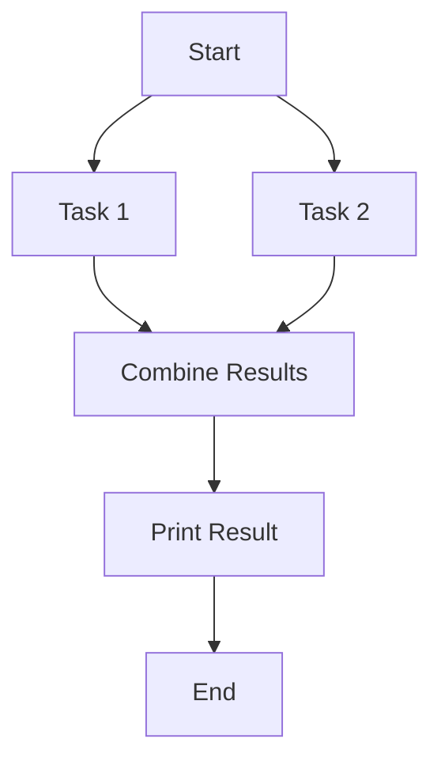
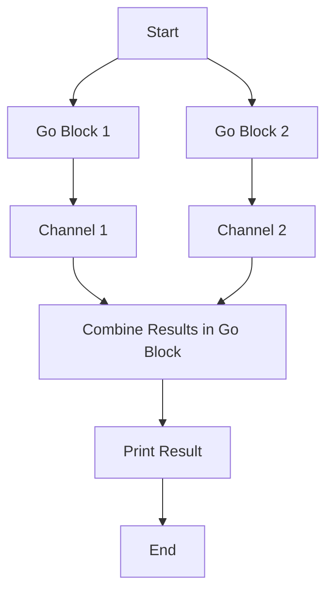

## 16.9.2 Comparing CompletableFuture with core.async

Asynchronous programming is a crucial aspect of modern software development, enabling applications to perform non-blocking operations and improve responsiveness. In Java, `CompletableFuture` is a popular tool for handling asynchronous tasks, while Clojure offers `core.async` as a powerful alternative. In this section, we will delve into the differences between these two approaches, focusing on API design, composability, error handling, and integration with their respective language features.

### Understanding CompletableFuture

`CompletableFuture` is part of the Java 8 `java.util.concurrent` package and provides a flexible way to handle asynchronous computations. It allows developers to write non-blocking code by composing multiple asynchronous tasks and handling their results or exceptions.

#### Key Features of CompletableFuture

- **Composability**: `CompletableFuture` supports chaining of asynchronous operations using methods like `thenApply`, `thenCompose`, and `thenAccept`.
- **Error Handling**: It provides mechanisms to handle exceptions through methods like `exceptionally` and `handle`.
- **Integration with Java Streams**: `CompletableFuture` can be combined with Java Streams for parallel processing.
- **Support for ForkJoinPool**: By default, it uses the common `ForkJoinPool` for executing tasks, but developers can specify custom executors.

#### Basic Example of CompletableFuture

Here's a simple example demonstrating the use of `CompletableFuture` to perform an asynchronous computation:

```java
import java.util.concurrent.CompletableFuture;

public class CompletableFutureExample {
    public static void main(String[] args) {
        CompletableFuture.supplyAsync(() -> {
            // Simulate a long-running task
            return "Hello, World!";
        }).thenAccept(result -> {
            // Process the result
            System.out.println(result);
        }).exceptionally(ex -> {
            // Handle exceptions
            System.err.println("An error occurred: " + ex.getMessage());
            return null;
        });
    }
}
```

### Introducing core.async

Clojure's `core.async` library provides a different model for asynchronous programming, inspired by CSP (Communicating Sequential Processes). It introduces the concept of channels, which are used to communicate between different parts of a program asynchronously.

#### Key Features of core.async

- **Channels**: Channels are used to pass messages between different threads or go blocks.
- **Go Blocks**: Lightweight threads that allow asynchronous code to be written in a synchronous style.
- **Composability**: Supports complex workflows by composing channels and go blocks.
- **Error Handling**: Errors can be managed within go blocks or through channel operations.

#### Basic Example of core.async

Below is a simple example using `core.async` to perform an asynchronous task:

```clojure
(require '[clojure.core.async :refer [go chan >! <!]])

(defn async-greeting []
  (let [c (chan)]
    (go
      ;; Simulate a long-running task
      (>! c "Hello, World!"))
    (go
      ;; Process the result
      (println (<! c)))))

(async-greeting)
```

### Comparing API Design

The API design of `CompletableFuture` and `core.async` reflects their underlying philosophies and intended use cases.

#### CompletableFuture API Design

- **Fluent Interface**: `CompletableFuture` uses a fluent interface, allowing developers to chain method calls for composing asynchronous tasks.
- **Explicit Error Handling**: Error handling is explicit, with dedicated methods for handling exceptions.
- **Integration with Java Ecosystem**: It integrates seamlessly with other Java features like Streams and Executors.

#### core.async API Design

- **Channel-Based Communication**: `core.async` uses channels for communication, which can be more intuitive for developers familiar with message-passing concurrency models.
- **Synchronous Style**: Go blocks allow asynchronous code to be written in a synchronous style, improving readability.
- **Flexible Composition**: Channels and go blocks can be composed in various ways to build complex workflows.

### Composability

Composability is a critical aspect of asynchronous programming, allowing developers to build complex workflows from simpler components.

#### CompletableFuture Composability

- **Chaining**: `CompletableFuture` supports chaining of tasks using methods like `thenApply` and `thenCompose`.
- **Combining Futures**: Multiple futures can be combined using methods like `allOf` and `anyOf`.

#### core.async Composability

- **Channel Composition**: Channels can be composed using operations like `alts!` and `merge`.
- **Go Block Composition**: Go blocks can be nested and combined to create complex asynchronous workflows.

### Error Handling

Handling errors gracefully is essential in asynchronous programming to ensure robustness and reliability.

#### CompletableFuture Error Handling

- **Exceptionally**: Allows handling exceptions by providing a fallback value or action.
- **Handle**: Combines result processing and error handling in a single method.

#### core.async Error Handling

- **Try-Catch in Go Blocks**: Errors can be caught and handled within go blocks using standard Clojure error handling constructs.
- **Channel-Based Error Propagation**: Errors can be propagated through channels and handled by consumers.

### Integration with Language Features

The integration of asynchronous programming constructs with language features can significantly impact the ease of use and expressiveness.

#### CompletableFuture Integration

- **Java Streams**: `CompletableFuture` integrates well with Java Streams, allowing parallel processing of collections.
- **Executor Services**: It can be used with custom executor services for fine-grained control over task execution.

#### core.async Integration

- **Clojure's Functional Paradigm**: `core.async` aligns well with Clojure's functional programming paradigm, enabling elegant solutions to complex problems.
- **Macros and Metaprogramming**: Clojure's macro system can be used to create custom abstractions over `core.async` constructs.

### Code Examples and Comparisons

Let's compare a more complex example involving multiple asynchronous tasks using both `CompletableFuture` and `core.async`.

#### CompletableFuture Example

```java
import java.util.concurrent.CompletableFuture;

public class CompletableFutureComplexExample {
    public static void main(String[] args) {
        CompletableFuture<String> future1 = CompletableFuture.supplyAsync(() -> {
            // Simulate a long-running task
            return "Task 1";
        });

        CompletableFuture<String> future2 = CompletableFuture.supplyAsync(() -> {
            // Simulate another long-running task
            return "Task 2";
        });

        CompletableFuture<Void> combinedFuture = future1.thenCombine(future2, (result1, result2) -> {
            // Combine results
            return result1 + " and " + result2;
        }).thenAccept(System.out::println);

        combinedFuture.join(); // Wait for completion
    }
}
```

#### core.async Example

```clojure
(require '[clojure.core.async :refer [go chan >! <!]])

(defn async-tasks []
  (let [c1 (chan)
        c2 (chan)]
    (go
      ;; Simulate a long-running task
      (>! c1 "Task 1"))
    (go
      ;; Simulate another long-running task
      (>! c2 "Task 2"))
    (go
      ;; Combine results
      (let [result1 (<! c1)
            result2 (<! c2)]
        (println (str result1 " and " result2))))))

(async-tasks)
```

### Try It Yourself

Experiment with the provided code examples by modifying the tasks to perform different operations or introducing intentional errors to observe error handling behavior. Consider changing the execution order or adding additional tasks to explore composability.

### Diagrams and Visualizations

#### CompletableFuture Workflow



*Diagram 1: Workflow of a CompletableFuture example combining two tasks.*

#### core.async Workflow



*Diagram 2: Workflow of a core.async example combining two tasks using channels and go blocks.*

### Further Reading

For more information on `CompletableFuture`, refer to the [Java Documentation](https://docs.oracle.com/javase/8/docs/api/java/util/concurrent/CompletableFuture.html). To explore `core.async` in depth, visit the [Official Clojure Documentation](https://clojure.org/about/concurrent_programming#_coreasync).

### Exercises

1. Modify the `CompletableFuture` example to introduce a delay in one of the tasks and observe how it affects the overall execution.
2. Extend the `core.async` example by adding a third task and combining its result with the existing ones.
3. Implement error handling in the `core.async` example to gracefully handle exceptions within go blocks.

### Key Takeaways

- **API Design**: `CompletableFuture` offers a fluent interface for chaining tasks, while `core.async` uses channels and go blocks for a more message-passing style.
- **Composability**: Both approaches support composability, but `core.async` provides more flexibility with channel operations.
- **Error Handling**: `CompletableFuture` has explicit error handling methods, whereas `core.async` relies on Clojure's error handling constructs.
- **Integration**: `CompletableFuture` integrates well with Java Streams and Executors, while `core.async` aligns with Clojure's functional paradigm and macro system.

By understanding these differences, you can choose the right tool for your asynchronous programming needs, leveraging the strengths of both Java and Clojure.

## Quiz: Mastering Asynchronous Programming with CompletableFuture and core.async



### Which of the following is a key feature of CompletableFuture?

- [x] Composability through chaining
- [ ] Channel-based communication
- [ ] Synchronous style of coding
- [ ] Go blocks for asynchronous tasks

> **Explanation:** CompletableFuture supports composability through chaining of asynchronous tasks using methods like `thenApply` and `thenCompose`.

### What is a primary feature of core.async?

- [ ] Fluent interface for chaining tasks
- [x] Channel-based communication
- [ ] Integration with Java Streams
- [ ] Use of ForkJoinPool

> **Explanation:** core.async uses channels for communication between different parts of a program asynchronously.

### How does CompletableFuture handle errors?

- [x] Using methods like `exceptionally` and `handle`
- [ ] Through channel-based error propagation
- [ ] Using try-catch blocks within go blocks
- [ ] By ignoring errors

> **Explanation:** CompletableFuture provides methods like `exceptionally` and `handle` to manage exceptions.

### What is the purpose of go blocks in core.async?

- [ ] To provide a fluent interface
- [x] To allow asynchronous code to be written in a synchronous style
- [ ] To integrate with Java Streams
- [ ] To handle exceptions

> **Explanation:** Go blocks in core.async allow asynchronous code to be written in a synchronous style, improving readability.

### Which method is used to combine results of two CompletableFutures?

- [x] thenCombine
- [ ] merge
- [ ] alts!
- [ ] exceptionally

> **Explanation:** The `thenCombine` method is used to combine the results of two CompletableFutures.

### What is a key difference between CompletableFuture and core.async?

- [x] CompletableFuture uses a fluent interface, while core.async uses channels.
- [ ] CompletableFuture is channel-based, while core.async is fluent.
- [ ] CompletableFuture supports go blocks, while core.async does not.
- [ ] CompletableFuture is part of Clojure, while core.async is part of Java.

> **Explanation:** CompletableFuture uses a fluent interface for chaining tasks, whereas core.async uses channels for communication.

### How does core.async handle errors?

- [ ] Using methods like `exceptionally`
- [ ] Through a fluent interface
- [x] Using try-catch blocks within go blocks
- [ ] By ignoring errors

> **Explanation:** Errors in core.async can be handled using try-catch blocks within go blocks.

### What is a common use case for CompletableFuture?

- [x] Non-blocking asynchronous computations
- [ ] Channel-based communication
- [ ] Synchronous task execution
- [ ] Macro-based metaprogramming

> **Explanation:** CompletableFuture is commonly used for non-blocking asynchronous computations.

### Which of the following is true about core.async?

- [x] It aligns with Clojure's functional programming paradigm.
- [ ] It is part of Java's standard library.
- [ ] It uses a fluent interface for task chaining.
- [ ] It is primarily used for synchronous programming.

> **Explanation:** core.async aligns well with Clojure's functional programming paradigm, enabling elegant solutions to complex problems.

### True or False: CompletableFuture and core.async can be used interchangeably in Java and Clojure.

- [ ] True
- [x] False

> **Explanation:** CompletableFuture and core.async are designed for different languages and paradigms, and while they both handle asynchronous programming, they are not interchangeable.


