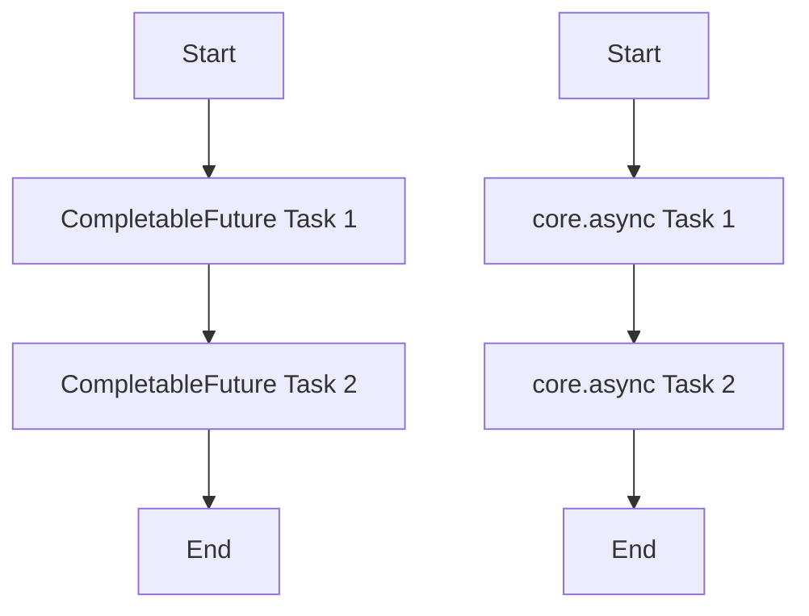

## 16.9.3 When to Use Each Approach

Asynchronous programming is a crucial aspect of modern software development, enabling applications to handle multiple tasks concurrently without blocking the main execution thread. Both Java and Clojure offer powerful tools for asynchronous programming: Java's `CompletableFuture` and Clojure's `core.async`. In this section, we'll explore when to use each approach, considering factors such as team familiarity, performance requirements, and ecosystem integration.

### Understanding CompletableFuture and core.async

Before diving into the specifics of when to use each approach, let's briefly review what `CompletableFuture` and `core.async` offer.

**Java's CompletableFuture**: Introduced in Java 8, `CompletableFuture` is a flexible and powerful tool for asynchronous programming. It allows you to write non-blocking code by providing a way to handle asynchronous computations and compose multiple asynchronous tasks. `CompletableFuture` is part of the `java.util.concurrent` package and integrates seamlessly with Java's existing concurrency framework.

**Clojure's core.async**: `core.async` is a Clojure library that brings asynchronous programming capabilities to the language. It is inspired by the Communicating Sequential Processes (CSP) model and provides channels for communication between concurrent processes. `core.async` allows you to write asynchronous code using a syntax that is more natural for Clojure developers, leveraging the language's functional programming paradigm.

### Key Considerations for Choosing an Approach

When deciding between `CompletableFuture` and `core.async`, several factors come into play. Let's explore these considerations in detail.

#### 1. Team Familiarity and Expertise

- **Java Teams**: If your team is primarily composed of Java developers, they may already be familiar with `CompletableFuture` and the Java concurrency model. In such cases, using `CompletableFuture` can be a natural choice, as it aligns with their existing knowledge and experience.

- **Clojure Teams**: Conversely, if your team is well-versed in Clojure and functional programming, `core.async` might be more intuitive. Clojure developers are likely to appreciate the functional approach and the ability to use channels for communication.

#### 2. Performance Requirements

- **CompletableFuture**: Java's `CompletableFuture` is highly optimized for performance and integrates seamlessly with the Java Virtual Machine (JVM). It is well-suited for scenarios where performance is critical, such as high-throughput applications or systems with stringent latency requirements.

- **core.async**: While `core.async` is performant, it may not match the raw performance of `CompletableFuture` in certain scenarios. However, it excels in scenarios where the functional programming paradigm and ease of use are more important than raw performance.

#### 3. Ecosystem Integration

- **Java Ecosystem**: `CompletableFuture` is part of the Java standard library, making it easy to integrate with other Java libraries and frameworks. If your project relies heavily on Java-based tools and libraries, `CompletableFuture` may offer better integration.

- **Clojure Ecosystem**: `core.async` is a natural fit for Clojure projects and integrates well with other Clojure libraries. If your project is primarily written in Clojure and leverages the Clojure ecosystem, `core.async` may be the better choice.

#### 4. Complexity and Readability

- **CompletableFuture**: While powerful, `CompletableFuture` can lead to complex and hard-to-read code, especially when chaining multiple asynchronous operations. Developers need to be cautious about exception handling and managing the completion of futures.

- **core.async**: `core.async` provides a more declarative approach to asynchronous programming, which can lead to more readable and maintainable code. The use of channels and go blocks can simplify the flow of asynchronous operations.

#### 5. Error Handling

- **CompletableFuture**: Java's `CompletableFuture` provides robust error handling mechanisms, allowing you to handle exceptions at various stages of the asynchronous computation. This can be advantageous in scenarios where precise error handling is required.

- **core.async**: While `core.async` also supports error handling, it may require more effort to manage errors effectively. Developers need to be mindful of how errors propagate through channels and go blocks.

### Code Examples and Comparisons

To illustrate the differences between `CompletableFuture` and `core.async`, let's look at some code examples.

#### Example 1: Basic Asynchronous Task

**Java CompletableFuture Example**

```java
import java.util.concurrent.CompletableFuture;

public class CompletableFutureExample {
    public static void main(String[] args) {
        CompletableFuture<Void> future = CompletableFuture.runAsync(() -> {
            // Simulate a long-running task
            System.out.println("Running async task...");
        });

        // Wait for the task to complete
        future.join();
        System.out.println("Task completed.");
    }
}
```

**Clojure core.async Example**

```clojure
(require '[clojure.core.async :refer [go <!]])

(defn async-task []
  (go
    ;; Simulate a long-running task
    (println "Running async task...")
    ;; Simulate delay
    (<! (timeout 1000))
    (println "Task completed.")))

;; Start the async task
(async-task)
```

In these examples, both `CompletableFuture` and `core.async` are used to run an asynchronous task. The Java example uses `CompletableFuture.runAsync`, while the Clojure example uses a `go` block from `core.async`.

#### Example 2: Composing Asynchronous Tasks

**Java CompletableFuture Example**

```java
import java.util.concurrent.CompletableFuture;

public class CompletableFutureCompose {
    public static void main(String[] args) {
        CompletableFuture<String> future = CompletableFuture.supplyAsync(() -> {
            return "Hello";
        }).thenApplyAsync(greeting -> {
            return greeting + ", World!";
        });

        // Get the result
        String result = future.join();
        System.out.println(result);
    }
}
```

**Clojure core.async Example**

```clojure
(require '[clojure.core.async :refer [go <! >! chan]])

(defn compose-tasks []
  (let [c (chan)]
    (go
      (>! c "Hello")
      (let [greeting (<! c)]
        (println (str greeting ", World!"))))))

;; Start the composed tasks
(compose-tasks)
```

In these examples, both `CompletableFuture` and `core.async` are used to compose asynchronous tasks. The Java example uses `thenApplyAsync` to chain tasks, while the Clojure example uses channels to pass data between tasks.

### Try It Yourself

To deepen your understanding, try modifying the code examples above:

- **Java**: Experiment with different `CompletableFuture` methods, such as `thenCombine` or `exceptionally`, to handle multiple tasks or errors.
- **Clojure**: Modify the `core.async` example to use multiple channels or introduce error handling using `try-catch` within `go` blocks.

### Diagrams and Visualizations

To further illustrate the flow of data and control in asynchronous programming, let's use a Mermaid.js diagram to visualize the process.



**Diagram Caption**: This diagram shows the flow of asynchronous tasks using `CompletableFuture` and `core.async`. Both approaches allow for sequential execution of tasks, but the mechanisms differ.

### Exercises and Practice Problems

1. **Exercise 1**: Implement a simple web scraper using `CompletableFuture` in Java. Use asynchronous tasks to fetch data from multiple URLs concurrently.

2. **Exercise 2**: Create a chat application using `core.async` in Clojure. Use channels to handle incoming and outgoing messages asynchronously.

3. **Exercise 3**: Compare the performance of `CompletableFuture` and `core.async` by implementing a parallel computation task in both Java and Clojure. Measure the execution time and analyze the results.

### Key Takeaways

- **Team Familiarity**: Choose the approach that aligns with your team's expertise and experience.
- **Performance**: Consider the performance requirements of your application when selecting between `CompletableFuture` and `core.async`.
- **Ecosystem Integration**: Evaluate how well each approach integrates with your existing tools and libraries.
- **Complexity and Readability**: Aim for code that is easy to read and maintain, especially in complex asynchronous workflows.
- **Error Handling**: Ensure robust error handling mechanisms are in place, regardless of the approach you choose.

By understanding the strengths and weaknesses of `CompletableFuture` and `core.async`, you can make informed decisions about which approach to use in your projects. Remember to experiment with both tools and leverage their unique features to build efficient and scalable asynchronous applications.

### Further Reading

- [Official Java Documentation on CompletableFuture](https://docs.oracle.com/javase/8/docs/api/java/util/concurrent/CompletableFuture.html)
- [Clojure core.async Documentation](https://clojure.github.io/core.async/)
- [ClojureDocs: core.async](https://clojuredocs.org/clojure.core.async)

## Quiz: Mastering Asynchronous Programming with CompletableFuture and core.async



### Which of the following is a key advantage of using CompletableFuture in Java?

- [x] Seamless integration with Java's concurrency framework
- [ ] Built-in support for Clojure's functional programming paradigm
- [ ] Provides channels for communication between processes
- [ ] Requires less boilerplate code than core.async

> **Explanation:** CompletableFuture integrates seamlessly with Java's existing concurrency framework, making it a natural choice for Java developers.

### What is a primary benefit of using core.async in Clojure?

- [x] Declarative syntax for asynchronous programming
- [ ] Direct integration with Java's CompletableFuture
- [ ] Built-in support for Java's concurrency model
- [ ] Automatic performance optimization

> **Explanation:** core.async provides a declarative syntax for asynchronous programming, which aligns well with Clojure's functional programming paradigm.

### When should you consider using CompletableFuture over core.async?

- [x] When your team is more familiar with Java and its concurrency model
- [ ] When you need to leverage Clojure's functional programming features
- [ ] When you require channels for process communication
- [ ] When performance is not a critical factor

> **Explanation:** CompletableFuture is often preferred when the team has more experience with Java and its concurrency model.

### Which of the following is a challenge when using CompletableFuture?

- [x] Managing complex chains of asynchronous operations
- [ ] Lack of integration with Java libraries
- [ ] Limited error handling capabilities
- [ ] Incompatibility with the JVM

> **Explanation:** Managing complex chains of asynchronous operations can lead to hard-to-read code when using CompletableFuture.

### What is a common use case for core.async in Clojure?

- [x] Building reactive systems with channels
- [ ] Implementing Java's CompletableFuture
- [ ] Optimizing low-level performance
- [ ] Directly integrating with Java's concurrency framework

> **Explanation:** core.async is commonly used for building reactive systems that leverage channels for communication.

### How does core.async handle asynchronous operations?

- [x] Through the use of channels and go blocks
- [ ] By chaining CompletableFuture methods
- [ ] By leveraging Java's concurrency framework
- [ ] By automatically optimizing performance

> **Explanation:** core.async uses channels and go blocks to handle asynchronous operations in a declarative manner.

### Which approach is better suited for high-throughput applications?

- [x] CompletableFuture
- [ ] core.async
- [ ] Both are equally suited
- [ ] Neither is suitable

> **Explanation:** CompletableFuture is highly optimized for performance and is well-suited for high-throughput applications.

### What is a key difference between CompletableFuture and core.async?

- [x] CompletableFuture is part of Java's standard library, while core.async is a Clojure library
- [ ] core.async provides better performance than CompletableFuture
- [ ] CompletableFuture uses channels for communication
- [ ] core.async is incompatible with the JVM

> **Explanation:** CompletableFuture is part of Java's standard library, whereas core.async is a library specifically for Clojure.

### Which of the following is a benefit of using channels in core.async?

- [x] Simplifies communication between concurrent processes
- [ ] Automatically optimizes performance
- [ ] Provides direct integration with Java's concurrency model
- [ ] Reduces the need for error handling

> **Explanation:** Channels in core.async simplify communication between concurrent processes, making it easier to manage asynchronous workflows.

### True or False: CompletableFuture and core.async can be used together in a hybrid Java-Clojure application.

- [x] True
- [ ] False

> **Explanation:** True. CompletableFuture and core.async can be used together in a hybrid Java-Clojure application, allowing developers to leverage the strengths of both approaches.


