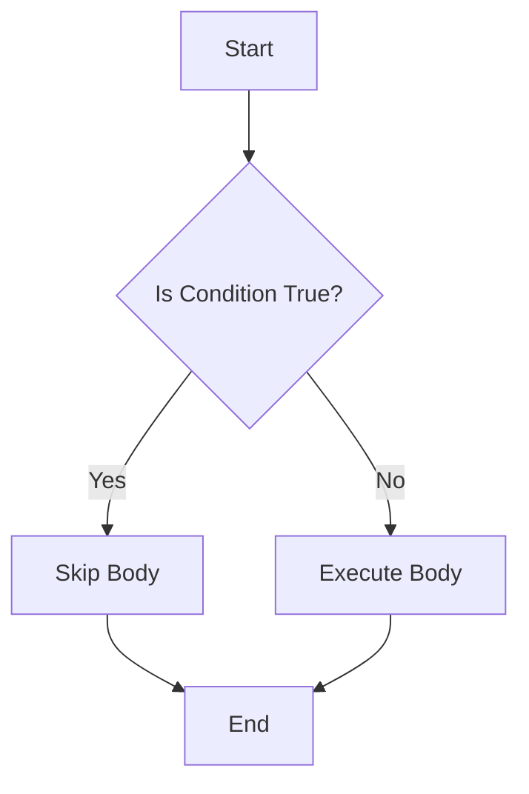

## 17.1.1 What is Metaprogramming?

Metaprogramming is a powerful programming paradigm that involves writing code that can generate or manipulate other code at compile-time or runtime. This approach can significantly enhance the flexibility of your codebase, reduce code duplication, and enable the creation of domain-specific abstractions. In this section, we will explore the concept of metaprogramming, particularly in the context of Clojure, and how it compares to Java.

### Understanding Metaprogramming

At its core, metaprogramming allows developers to write programs that can treat other programs as their data. This means that a metaprogram can read, generate, analyze, or transform other programs, and even modify itself while running. This capability is particularly powerful in languages like Clojure, which is a Lisp dialect, due to its homoiconicity—the property that code and data have the same structure.

#### Key Benefits of Metaprogramming

1. **Increased Flexibility**: Metaprogramming allows you to write more generic and reusable code. By abstracting patterns and behaviors, you can create flexible solutions that adapt to various contexts.

2. **Reduced Code Duplication**: By generating repetitive code automatically, metaprogramming can help eliminate redundancy, making your codebase cleaner and easier to maintain.

3. **Domain-Specific Abstractions**: Metaprogramming enables the creation of domain-specific languages (DSLs), which can simplify complex tasks by providing a more intuitive syntax for specific problem domains.

### Metaprogramming in Clojure

Clojure, as a Lisp dialect, excels in metaprogramming due to its macro system. Macros in Clojure allow you to extend the language by defining new syntactic constructs in a way that feels native to the language itself. This is a stark contrast to Java, where metaprogramming is typically achieved through reflection or bytecode manipulation, which can be cumbersome and less intuitive.

#### Clojure Macros

Macros in Clojure are functions that take code as input and return transformed code as output. They are executed at compile-time, allowing you to manipulate the code before it is evaluated. This capability is what makes Clojure's metaprogramming so powerful.

**Example of a Simple Macro in Clojure:**

```clojure
(defmacro unless [condition & body]
  `(if (not ~condition)
     (do ~@body)))

;; Usage
(unless false
  (println "This will print because the condition is false."))
```

In this example, the `unless` macro is defined to execute the body of code only if the condition is false. The macro uses Clojure's syntax quoting (`~`) and unquoting (`~@`) to construct the code that will be executed.

#### Comparing Clojure Macros to Java Reflection

While Java provides reflection for metaprogramming, it operates at a lower level, allowing you to inspect and modify the behavior of classes and objects at runtime. However, reflection can be verbose and error-prone, lacking the elegance and simplicity of Clojure's macros.

**Java Reflection Example:**

```java
import java.lang.reflect.Method;

public class ReflectionExample {
    public static void main(String[] args) throws Exception {
        Class<?> clazz = Class.forName("java.util.ArrayList");
        Method method = clazz.getMethod("size");
        Object instance = clazz.getDeclaredConstructor().newInstance();
        System.out.println("Size: " + method.invoke(instance));
    }
}
```

In this Java example, reflection is used to dynamically invoke the `size` method on an `ArrayList` instance. While powerful, this approach is more complex and less intuitive than Clojure's macro system.

### Practical Applications of Metaprogramming

Metaprogramming can be applied in various scenarios to enhance your codebase:

1. **Code Generation**: Automatically generate boilerplate code, reducing manual effort and potential errors.

2. **Custom Control Structures**: Create new control structures that are not natively supported by the language, improving code readability and expressiveness.

3. **DSLs**: Develop DSLs tailored to specific domains, making complex tasks more manageable and intuitive.

4. **Aspect-Oriented Programming**: Implement cross-cutting concerns such as logging, security, or transaction management in a modular way.

### Try It Yourself

To get hands-on experience with metaprogramming in Clojure, try modifying the `unless` macro to include an `else` clause. This exercise will help you understand how macros can be used to create custom control structures.

### Diagrams and Visualizations

To better understand the flow of data and control in metaprogramming, let's visualize the process using a flowchart.



**Diagram Description**: This flowchart illustrates the logic of the `unless` macro, where the body is executed only if the condition is false.

### Further Reading

For more information on metaprogramming in Clojure, consider exploring the following resources:

- [Official Clojure Documentation](https://clojure.org/reference/macros)
- [ClojureDocs](https://clojuredocs.org/)
- [GitHub Repositories](https://github.com/clojure)

### Exercises and Practice Problems

1. **Exercise 1**: Create a macro that logs the execution time of a block of code. Use this macro to measure the performance of different algorithms.

2. **Exercise 2**: Develop a simple DSL using macros for defining and executing mathematical expressions.

3. **Exercise 3**: Refactor a piece of Java code that uses reflection to achieve a similar result using Clojure macros.

### Key Takeaways

- Metaprogramming allows code to generate or manipulate other code, enhancing flexibility and reducing duplication.
- Clojure's macro system provides a powerful and intuitive way to perform metaprogramming.
- While Java offers reflection for metaprogramming, Clojure's macros offer a more elegant and concise approach.
- Metaprogramming can be used to create DSLs, custom control structures, and automate repetitive tasks.

Now that we've explored the fundamentals of metaprogramming in Clojure, let's apply these concepts to create more expressive and efficient code.

## Quiz: Test Your Knowledge on Metaprogramming in Clojure



### What is metaprogramming?

- [x] Writing code that can generate or manipulate other code
- [ ] Writing code that only executes at runtime
- [ ] Writing code that is specific to a single domain
- [ ] Writing code that cannot be modified

> **Explanation:** Metaprogramming involves writing code that can generate or manipulate other code, enhancing flexibility and reducing duplication.

### Which of the following is a benefit of metaprogramming?

- [x] Increased flexibility
- [x] Reduced code duplication
- [ ] Increased code complexity
- [ ] Decreased code readability

> **Explanation:** Metaprogramming increases flexibility and reduces code duplication, making codebases cleaner and more maintainable.

### How does Clojure's macro system differ from Java's reflection?

- [x] Macros operate at compile-time, while reflection operates at runtime
- [ ] Macros are more verbose than reflection
- [ ] Reflection is more intuitive than macros
- [ ] Macros cannot manipulate code

> **Explanation:** Clojure's macros operate at compile-time, allowing for more elegant and concise code manipulation compared to Java's runtime reflection.

### What is a common use case for metaprogramming?

- [x] Creating domain-specific languages
- [ ] Writing low-level system code
- [ ] Implementing basic arithmetic operations
- [ ] Managing memory manually

> **Explanation:** Metaprogramming is often used to create domain-specific languages, which simplify complex tasks by providing intuitive syntax.

### In Clojure, what is the purpose of the `defmacro` keyword?

- [x] To define a macro
- [ ] To define a function
- [ ] To declare a variable
- [ ] To import a library

> **Explanation:** The `defmacro` keyword in Clojure is used to define a macro, which can manipulate code at compile-time.

### What is the role of quoting in Clojure macros?

- [x] To prevent code from being evaluated
- [ ] To execute code immediately
- [ ] To import external libraries
- [ ] To declare variables

> **Explanation:** Quoting in Clojure macros prevents code from being evaluated, allowing it to be manipulated as data.

### Which of the following is a characteristic of homoiconicity?

- [x] Code and data have the same structure
- [ ] Code is compiled to machine language
- [ ] Data is stored in binary format
- [ ] Code is interpreted line by line

> **Explanation:** Homoiconicity means that code and data have the same structure, which is a key feature of Lisp languages like Clojure.

### What is a potential risk of using metaprogramming?

- [x] Increased code complexity
- [ ] Decreased code flexibility
- [ ] Reduced code duplication
- [ ] Improved code readability

> **Explanation:** While metaprogramming offers many benefits, it can also increase code complexity if not used carefully.

### How can metaprogramming help in aspect-oriented programming?

- [x] By implementing cross-cutting concerns modularly
- [ ] By writing low-level system code
- [ ] By managing memory manually
- [ ] By executing code at runtime

> **Explanation:** Metaprogramming can help implement cross-cutting concerns like logging and security in a modular way, which is a key aspect of aspect-oriented programming.

### True or False: Metaprogramming is only useful for creating DSLs.

- [ ] True
- [x] False

> **Explanation:** While creating DSLs is a common use case, metaprogramming is also useful for code generation, custom control structures, and more.


