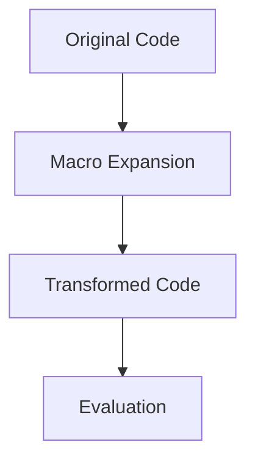

## 17.1.2 Metaprogramming in Lisp Languages

Metaprogramming is a powerful concept that allows developers to write programs that can manipulate other programs or themselves. Lisp languages, including Clojure, are particularly well-suited for metaprogramming due to their unique feature known as **homoiconicity**. This characteristic means that code is represented using the same data structures as regular data, such as lists, vectors, and maps. In this section, we will delve into the world of metaprogramming in Lisp languages, exploring how Clojure leverages these capabilities to provide powerful tools for code manipulation and transformation.

### Understanding Homoiconicity

**Homoiconicity** is a property of some programming languages where the primary representation of programs is also a data structure in a primitive type of the language itself. In Lisp languages, this means that code is written in the form of lists, which are the fundamental data structure. This allows for seamless manipulation of code as data, enabling powerful metaprogramming techniques.

#### Example of Homoiconicity in Clojure

Let's consider a simple example in Clojure to illustrate homoiconicity:

```clojure
;; A simple Clojure expression
(+ 1 2 3)

;; The same expression represented as a list
(list '+ 1 2 3)
```

In the above example, the expression `(+ 1 2 3)` is a function call that adds numbers. However, it can also be represented as a list `(list '+ 1 2 3)`, which can be manipulated programmatically. This ability to treat code as data is the cornerstone of metaprogramming in Lisp languages.

### Metaprogramming with Macros

One of the most powerful features of Lisp languages is the macro system. Macros allow developers to extend the language by defining new syntactic constructs in a way that is not possible with functions alone. In Clojure, macros are used to transform code before it is evaluated, providing a mechanism for code generation and manipulation.

#### Defining a Simple Macro

Let's define a simple macro in Clojure:

```clojure
(defmacro when-not [test & body]
  `(if (not ~test)
     (do ~@body)))

;; Usage of the when-not macro
(when-not false
  (println "This will be printed"))
```

In this example, the `when-not` macro is defined to execute a block of code only if a given test condition is false. The macro uses backticks (`` ` ``) for quoting and `~` for unquoting, allowing us to construct new code expressions dynamically.

#### Macro Expansion

Macros in Clojure are expanded at compile time. This means that the code generated by a macro is inserted into the program before it is executed. We can use the `macroexpand` function to see how a macro is transformed:

```clojure
(macroexpand '(when-not false (println "This will be printed")))
```

This will output:

```clojure
(if (not false)
  (do (println "This will be printed")))
```

The `macroexpand` function reveals that the `when-not` macro is transformed into an `if` expression with a `not` condition, followed by the body wrapped in a `do` block.

### Comparing Macros with Java Reflection

In Java, metaprogramming is often achieved through reflection, which allows inspection and modification of classes and objects at runtime. While reflection provides powerful capabilities, it can be cumbersome and error-prone compared to the elegance of Lisp macros.

#### Java Reflection Example

Here is a simple example of using reflection in Java:

```java
import java.lang.reflect.Method;

public class ReflectionExample {
    public static void main(String[] args) throws Exception {
        Method method = String.class.getMethod("toUpperCase");
        String result = (String) method.invoke("hello");
        System.out.println(result); // Outputs "HELLO"
    }
}
```

In this Java example, we use reflection to invoke the `toUpperCase` method on a string. While this demonstrates the power of reflection, it lacks the compile-time safety and simplicity of Clojure macros.

### Advantages of Metaprogramming in Clojure

Clojure's approach to metaprogramming offers several advantages over traditional Java reflection:

- **Compile-Time Safety**: Macros are expanded at compile time, allowing errors to be caught early.
- **Code Generation**: Macros enable the generation of complex code structures with minimal effort.
- **Language Extension**: Developers can create new language constructs, enhancing expressiveness and reducing boilerplate code.

### Practical Applications of Metaprogramming

Metaprogramming in Clojure can be applied to a wide range of scenarios, including:

- **Domain-Specific Languages (DSLs)**: Creating custom languages tailored to specific problem domains.
- **Code Optimization**: Generating optimized code paths based on compile-time information.
- **Cross-Cutting Concerns**: Implementing features like logging, security, and transaction management.

### Try It Yourself

To deepen your understanding of metaprogramming in Clojure, try modifying the `when-not` macro to include an `else` clause. Experiment with different macro transformations and observe how they affect the generated code.

### Visualizing Code Transformation

To better understand how macros transform code, let's visualize the process using a flowchart:



**Diagram Description**: This flowchart illustrates the process of macro expansion in Clojure. The original code is expanded by the macro, resulting in transformed code that is then evaluated.

### Further Reading

For more information on metaprogramming in Clojure and Lisp languages, consider exploring the following resources:

- [Official Clojure Documentation](https://clojure.org/reference/macros)
- [ClojureDocs](https://clojuredocs.org/)
- [Lisp in Small Pieces](https://mitpress.mit.edu/books/lisp-small-pieces) by Christian Queinnec

### Exercises

1. **Macro Challenge**: Create a macro that implements a `unless` construct, which executes a block of code only if a condition is false.
2. **Code Transformation**: Write a macro that transforms a list of numbers into a series of addition operations.
3. **DSL Creation**: Design a simple DSL for defining mathematical expressions and implement it using Clojure macros.

### Key Takeaways

- **Homoiconicity** in Lisp languages allows code to be treated as data, enabling powerful metaprogramming techniques.
- **Macros** in Clojure provide a mechanism for code transformation and generation, offering compile-time safety and language extension capabilities.
- **Metaprogramming** can be used to create DSLs, optimize code, and implement cross-cutting concerns.

By embracing the metaprogramming capabilities of Clojure, you can unlock new levels of expressiveness and efficiency in your code. Now that we've explored the fundamentals of metaprogramming in Lisp languages, let's continue our journey into the world of Clojure and discover how to harness its full potential.

## Quiz: Mastering Metaprogramming in Lisp Languages



### What is homoiconicity in Lisp languages?

- [x] The property where code is represented using the same data structures as regular data.
- [ ] The ability to execute code at runtime.
- [ ] The use of macros for code transformation.
- [ ] The capability to interact with Java code.

> **Explanation:** Homoiconicity refers to the property where code is represented using the same data structures as regular data, such as lists in Lisp languages.

### How are macros in Clojure different from Java reflection?

- [x] Macros are expanded at compile time, while reflection occurs at runtime.
- [ ] Macros provide runtime type checking.
- [ ] Reflection allows for compile-time code generation.
- [ ] Macros can only be used for logging purposes.

> **Explanation:** Macros in Clojure are expanded at compile time, allowing for early error detection, whereas Java reflection occurs at runtime.

### What is a practical application of metaprogramming in Clojure?

- [x] Creating Domain-Specific Languages (DSLs).
- [ ] Implementing low-level memory management.
- [ ] Writing Java bytecode directly.
- [ ] Performing network operations.

> **Explanation:** Metaprogramming in Clojure is often used to create DSLs, which are custom languages tailored to specific problem domains.

### Which function can be used to see how a macro is transformed in Clojure?

- [x] `macroexpand`
- [ ] `eval`
- [ ] `reflect`
- [ ] `compile`

> **Explanation:** The `macroexpand` function in Clojure is used to see how a macro is transformed into its expanded form.

### What is the primary advantage of using macros in Clojure?

- [x] They allow for language extension and code generation.
- [ ] They provide direct access to the JVM.
- [ ] They enable dynamic typing.
- [ ] They simplify memory management.

> **Explanation:** Macros in Clojure allow for language extension and code generation, enhancing expressiveness and reducing boilerplate.

### What is the result of `(macroexpand '(when-not false (println "Hello")))`?

- [x] `(if (not false) (do (println "Hello")))`
- [ ] `(println "Hello")`
- [ ] `(when false (println "Hello"))`
- [ ] `(not false)`

> **Explanation:** The `when-not` macro expands into an `if` expression with a `not` condition, followed by the body wrapped in a `do` block.

### Which of the following is NOT a feature of Lisp languages?

- [ ] Homoiconicity
- [x] Static typing
- [ ] Macros
- [ ] Code as data

> **Explanation:** Lisp languages are dynamically typed, not statically typed.

### What is the purpose of the `~` symbol in Clojure macros?

- [x] It is used for unquoting within a quoted expression.
- [ ] It denotes a comment.
- [ ] It is used for defining functions.
- [ ] It indicates a loop construct.

> **Explanation:** The `~` symbol is used for unquoting within a quoted expression in Clojure macros.

### Which of the following best describes metaprogramming?

- [x] Writing programs that can manipulate other programs or themselves.
- [ ] Writing programs that only perform arithmetic operations.
- [ ] Writing programs that interact with hardware.
- [ ] Writing programs that manage memory directly.

> **Explanation:** Metaprogramming involves writing programs that can manipulate other programs or themselves, often through code transformation.

### True or False: Clojure macros are evaluated at runtime.

- [ ] True
- [x] False

> **Explanation:** Clojure macros are expanded at compile time, not evaluated at runtime.


