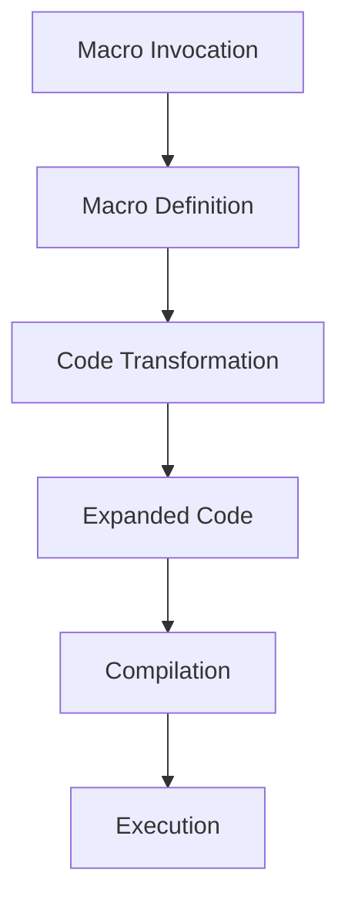

## 17.1.3 The Role of Macros in Clojure Metaprogramming

In the world of Clojure, macros are a powerful tool that allow developers to extend the language itself by writing code that manipulates code before it is compiled. This capability is a hallmark of Lisp languages, and Clojure, being a modern Lisp, leverages macros to provide unparalleled flexibility and expressiveness. For Java developers transitioning to Clojure, understanding macros is crucial to unlocking the full potential of the language.

### Understanding Macros

At their core, macros are functions that take code as input and return transformed code as output. This transformation happens at compile time, allowing developers to introduce new syntactic constructs and abstractions that are not possible with regular functions. Macros enable metaprogramming, where code can generate and manipulate other code, leading to more concise and expressive programs.

#### How Macros Work

Macros operate on the abstract syntax tree (AST) of the code. When a macro is invoked, it receives the unevaluated code as its arguments, processes it, and returns a new piece of code that replaces the original macro invocation. This new code is then compiled and executed.

Here's a simple example to illustrate how macros work in Clojure:

```clojure
(defmacro unless [condition then-branch else-branch]
  `(if (not ~condition)
     ~then-branch
     ~else-branch))

;; Usage
(unless false
  (println "This will print")
  (println "This won't print"))
```

In this example, the `unless` macro takes a condition and two branches of code. It expands into an `if` expression that negates the condition, effectively reversing the logic. The tilde (`~`) is used to unquote the arguments, allowing them to be inserted into the generated code.

### Macros vs. Functions

While both macros and functions can encapsulate reusable logic, they serve different purposes and have distinct characteristics:

- **Evaluation Timing**: Functions evaluate their arguments before execution, whereas macros receive their arguments as raw code and can decide how and when to evaluate them.
- **Code Transformation**: Macros can transform code structures, enabling the creation of new syntactic constructs. Functions cannot alter the code structure.
- **Use Cases**: Macros are ideal for scenarios where you need to manipulate code, such as creating domain-specific languages (DSLs) or implementing control structures.

### Comparing Macros in Clojure and Java

Java, being a statically typed, object-oriented language, does not have a direct equivalent to Clojure's macros. However, Java developers might find parallels in the use of annotations and reflection, which allow for some level of metaprogramming. Annotations can modify behavior at runtime, but they lack the compile-time code transformation capabilities of macros.

#### Java Example: Annotations

```java
@Retention(RetentionPolicy.RUNTIME)
@Target(ElementType.METHOD)
public @interface LogExecutionTime {}

public class Example {
    @LogExecutionTime
    public void performTask() {
        // Task implementation
    }
}
```

In this Java example, the `LogExecutionTime` annotation can be used to modify the behavior of the `performTask` method, such as logging its execution time. However, this requires additional tooling or frameworks to process the annotation, whereas Clojure macros directly transform code at compile time.

### Creating Custom Macros

Creating custom macros in Clojure involves defining a macro using the `defmacro` keyword and specifying the transformation logic. Let's explore a more complex example:

```clojure
(defmacro with-logging [expr]
  `(let [start# (System/nanoTime)
         result# ~expr
         end# (System/nanoTime)]
     (println "Execution time:" (- end# start#) "ns")
     result#))

;; Usage
(with-logging
  (Thread/sleep 1000))
```

In this macro, `with-logging` measures the execution time of an expression and prints it. The `#` character is used to generate unique symbols, ensuring that the macro's internal variables do not clash with those in the user's code.

### Best Practices for Using Macros

While macros are powerful, they should be used judiciously. Here are some best practices to consider:

- **Simplicity**: Keep macros simple and focused. Complex macros can be difficult to understand and maintain.
- **Documentation**: Clearly document the purpose and usage of macros, as their behavior may not be immediately obvious.
- **Testing**: Thoroughly test macros to ensure they expand correctly and handle edge cases.
- **Alternatives**: Consider whether a function or higher-order function can achieve the desired behavior before resorting to macros.

### Try It Yourself

Experiment with the `unless` and `with-logging` macros by modifying their logic or creating new macros. For instance, try implementing a `when-not` macro that behaves like `unless` but only takes a single branch of code.

### Visualizing Macro Expansion

To better understand how macros transform code, let's visualize the expansion process using a flowchart:



**Diagram Description**: This flowchart illustrates the process of macro expansion in Clojure, from the initial invocation to the final execution of the expanded code.

### Further Reading

For more information on macros and metaprogramming in Clojure, consider exploring the following resources:

- [Official Clojure Documentation on Macros](https://clojure.org/reference/macros)
- [ClojureDocs: Macros](https://clojuredocs.org/quickref#macros)
- [Clojure Programming by Chas Emerick, Brian Carper, and Christophe Grand](https://www.oreilly.com/library/view/clojure-programming/9781449310387/)

### Exercises

1. **Implement a `when-not` Macro**: Create a macro that behaves like `unless` but only takes a single branch of code.
2. **Macro for Logging**: Modify the `with-logging` macro to log additional information, such as the function name or arguments.
3. **DSL Creation**: Use macros to create a simple DSL for defining routes in a web application.

### Key Takeaways

- **Macros enable metaprogramming**: They allow developers to write code that manipulates code, providing powerful language extension capabilities.
- **Macros vs. Functions**: Macros operate on code structures and can introduce new syntactic constructs, while functions work with evaluated arguments.
- **Use macros judiciously**: While powerful, macros should be used with care to maintain code clarity and maintainability.

By mastering macros, you'll be well-equipped to harness the full power of Clojure's metaprogramming capabilities, enabling you to write more expressive and efficient code.

## Quiz: Understanding the Role of Macros in Clojure



### What is the primary purpose of macros in Clojure?

- [x] To manipulate code before compilation
- [ ] To execute code at runtime
- [ ] To handle exceptions
- [ ] To manage memory allocation

> **Explanation:** Macros in Clojure are used to manipulate code before it is compiled, allowing developers to extend the language with new syntactic constructs.

### How do macros differ from functions in Clojure?

- [x] Macros operate on code structures, while functions work with evaluated arguments
- [ ] Macros are faster than functions
- [ ] Functions can manipulate code, while macros cannot
- [ ] Macros are used for error handling

> **Explanation:** Macros receive unevaluated code as input and can transform it, whereas functions operate on already evaluated arguments.

### Which keyword is used to define a macro in Clojure?

- [x] `defmacro`
- [ ] `defn`
- [ ] `let`
- [ ] `fn`

> **Explanation:** The `defmacro` keyword is used to define a macro in Clojure.

### What is the role of the tilde (`~`) in macro definitions?

- [x] To unquote arguments and insert them into the generated code
- [ ] To comment out code
- [ ] To define a function
- [ ] To create a loop

> **Explanation:** The tilde (`~`) is used in macro definitions to unquote arguments, allowing them to be inserted into the generated code.

### What is a potential risk of using macros?

- [x] Increased complexity and reduced code readability
- [ ] Slower execution speed
- [ ] Higher memory usage
- [ ] Limited functionality

> **Explanation:** Macros can increase code complexity and reduce readability if not used carefully.

### How can macros be visualized in Clojure?

- [x] As a transformation process from macro invocation to execution
- [ ] As a sequence of function calls
- [ ] As a set of loops and conditionals
- [ ] As a memory management technique

> **Explanation:** Macros can be visualized as a transformation process that starts with the macro invocation and ends with the execution of the expanded code.

### What is a common use case for macros in Clojure?

- [x] Creating domain-specific languages (DSLs)
- [ ] Managing memory allocation
- [ ] Handling exceptions
- [ ] Performing arithmetic operations

> **Explanation:** Macros are commonly used to create DSLs by introducing new syntactic constructs.

### Which of the following is NOT a characteristic of macros?

- [x] They evaluate their arguments before execution
- [ ] They can transform code structures
- [ ] They operate on the abstract syntax tree (AST)
- [ ] They allow for compile-time code manipulation

> **Explanation:** Unlike functions, macros do not evaluate their arguments before execution; they operate on the raw code.

### How can Java developers achieve similar functionality to Clojure macros?

- [x] Using annotations and reflection
- [ ] Using loops and conditionals
- [ ] Using exception handling
- [ ] Using memory management techniques

> **Explanation:** Java developers can use annotations and reflection for some level of metaprogramming, although it lacks the compile-time transformation capabilities of Clojure macros.

### True or False: Macros in Clojure can introduce new syntactic constructs.

- [x] True
- [ ] False

> **Explanation:** True. Macros in Clojure can introduce new syntactic constructs by transforming code before compilation.


