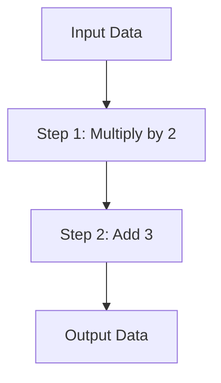

## 17.10.1 Keeping DSLs Simple and Focused

In the world of software development, Domain-Specific Languages (DSLs) offer a powerful way to express solutions in terms that are closer to the problem domain. As experienced Java developers transitioning to Clojure, you have the opportunity to leverage Clojure's metaprogramming capabilities to create DSLs that are both expressive and efficient. However, the key to successful DSL design lies in keeping them simple and focused. This section will guide you through the principles and practices of designing effective DSLs in Clojure, drawing parallels to Java where applicable.

### Understanding the Purpose of DSLs

Before diving into the specifics of DSL design, it's important to understand what a DSL is and why it might be beneficial. A DSL is a specialized language tailored to a specific application domain. Unlike general-purpose programming languages, DSLs are designed to solve problems within a particular domain more efficiently.

**Example:** Consider SQL, a DSL for database queries. It allows users to express complex data retrieval operations succinctly and clearly, without delving into the intricacies of database management.

### Why Keep DSLs Simple and Focused?

The primary advantage of a DSL is its ability to simplify complex tasks by providing a language that closely aligns with the domain's concepts. However, this advantage can quickly turn into a disadvantage if the DSL becomes too complex or tries to cover too broad a scope. Here are some reasons to keep DSLs simple and focused:

- **Maintainability:** A simple DSL is easier to maintain and extend. Complexity can lead to a tangled web of features that are difficult to manage.
- **Learnability:** Users can learn and adopt a simple DSL more quickly. A focused DSL reduces the cognitive load on users.
- **Performance:** A DSL with a narrow focus can be optimized for its specific tasks, leading to better performance.

### Principles of Simple and Focused DSL Design

#### 1. **Define Clear Boundaries**

A well-designed DSL should have clear boundaries that define what it can and cannot do. This involves identifying the core functionalities that the DSL should support and resisting the temptation to add features that fall outside its primary domain.

**Clojure Example:**

```clojure
(defmacro defsimple-dsl [name & body]
  `(defn ~name []
     (println "Executing DSL with:" ~@body)))

(defsimple-dsl my-dsl
  "This is a simple DSL example"
  "It prints messages to the console")

(my-dsl)
;; Output: Executing DSL with: This is a simple DSL example It prints messages to the console
```

**Java Parallel:**

In Java, you might achieve similar functionality using method overloading or builder patterns, but the flexibility and expressiveness of Clojure macros allow for more concise and domain-specific expressions.

#### 2. **Focus on the Core Domain**

Identify the core domain concepts and ensure that the DSL provides constructs that map directly to these concepts. Avoid adding features that are not essential to the domain.

**Clojure Example:**

```clojure
(defmacro defquery [name & clauses]
  `(defn ~name []
     (println "Querying with clauses:" ~@clauses)))

(defquery find-users
  "age > 30"
  "location = 'NY'")

(find-users)
;; Output: Querying with clauses: age > 30 location = 'NY'
```

**Java Parallel:**

In Java, you might use a fluent API to achieve similar results, but the DSL approach in Clojure allows for a more natural expression of the domain logic.

#### 3. **Use Clear and Consistent Syntax**

The syntax of a DSL should be intuitive and consistent, making it easy for users to understand and use. Consistency in syntax helps users predict how to use the DSL, reducing errors and increasing productivity.

**Clojure Example:**

```clojure
(defmacro defconfig [name & settings]
  `(defn ~name []
     (println "Configuring with settings:" ~@settings)))

(defconfig server-config
  "host = 'localhost'"
  "port = 8080")

(server-config)
;; Output: Configuring with settings: host = 'localhost' port = 8080
```

#### 4. **Leverage Clojure's Strengths**

Clojure's strengths, such as immutability, first-class functions, and macros, can be leveraged to create powerful DSLs. Use these features to simplify the DSL's implementation and enhance its expressiveness.

**Clojure Example:**

```clojure
(defmacro defpipeline [name & steps]
  `(defn ~name [data]
     (reduce (fn [acc step] (step acc)) data (list ~@steps))))

(defpipeline process-data
  (fn [x] (* x 2))
  (fn [x] (+ x 3)))

(process-data 5)
;; Output: 13
```

**Diagram: Data Flow in a DSL Pipeline**



*Caption: This diagram illustrates the flow of data through a simple DSL pipeline, where each step transforms the data.*

#### 5. **Avoid Over-Engineering**

It's easy to fall into the trap of over-engineering a DSL by adding features that are not strictly necessary. Focus on solving the core problems of the domain and avoid adding complexity for the sake of completeness.

**Clojure Example:**

```clojure
(defmacro defsimple-task [name & actions]
  `(defn ~name []
     (doseq [action (list ~@actions)]
       (println "Performing action:" action))))

(defsimple-task daily-tasks
  "Check emails"
  "Attend meetings"
  "Write code")

(daily-tasks)
;; Output: Performing action: Check emails
;;         Performing action: Attend meetings
;;         Performing action: Write code
```

### Comparing DSLs in Clojure and Java

While Java is a powerful language, creating DSLs in Java often involves using design patterns such as the Builder pattern or fluent interfaces. These approaches can lead to verbose code that lacks the expressiveness of a true DSL. Clojure, with its macro system, allows for more concise and expressive DSLs that can be tailored to the specific needs of a domain.

**Java Example:**

```java
public class QueryBuilder {
    private StringBuilder query = new StringBuilder();

    public QueryBuilder select(String fields) {
        query.append("SELECT ").append(fields).append(" ");
        return this;
    }

    public QueryBuilder from(String table) {
        query.append("FROM ").append(table).append(" ");
        return this;
    }

    public QueryBuilder where(String condition) {
        query.append("WHERE ").append(condition).append(" ");
        return this;
    }

    public String build() {
        return query.toString();
    }
}

// Usage
QueryBuilder query = new QueryBuilder();
String sql = query.select("*").from("users").where("age > 30").build();
System.out.println(sql);
```

**Clojure Equivalent:**

```clojure
(defmacro defsql [name & clauses]
  `(defn ~name []
     (println "SQL Query:" (str ~@clauses))))

(defsql user-query
  "SELECT * "
  "FROM users "
  "WHERE age > 30")

(user-query)
;; Output: SQL Query: SELECT * FROM users WHERE age > 30
```

### Try It Yourself

To deepen your understanding of DSLs in Clojure, try modifying the examples above:

- Add additional steps to the `defpipeline` macro and observe how the data flow changes.
- Create a new DSL for a different domain, such as task management or configuration settings.
- Experiment with different syntax styles to see how they affect readability and usability.

### Exercises

1. **Design a Simple DSL:** Create a DSL for managing a to-do list. The DSL should allow users to add, remove, and list tasks.

2. **Refactor a Java Fluent API:** Take a Java fluent API you are familiar with and refactor it into a Clojure DSL. Compare the expressiveness and simplicity of the two approaches.

3. **Optimize a DSL:** Identify a complex DSL you have worked with and suggest ways to simplify it by focusing on its core domain.

### Key Takeaways

- **Simplicity and Focus:** Keep DSLs simple and focused on their core domain to enhance maintainability, learnability, and performance.
- **Leverage Clojure's Features:** Use Clojure's macros, immutability, and first-class functions to create expressive and efficient DSLs.
- **Avoid Over-Engineering:** Resist the temptation to add unnecessary features that complicate the DSL.
- **Compare and Contrast:** Understand the differences between DSLs in Clojure and Java, and leverage Clojure's strengths to create more concise and expressive solutions.

By following these principles and practices, you can design DSLs in Clojure that are both powerful and manageable, allowing you to solve domain-specific problems with elegance and efficiency.

For further reading on DSL design and Clojure's capabilities, consider exploring the [Official Clojure Documentation](https://clojure.org/reference/documentation) and [ClojureDocs](https://clojuredocs.org/).

---

## Quiz: Mastering DSL Design in Clojure



### What is a primary advantage of keeping DSLs simple and focused?

- [x] Easier to maintain and extend
- [ ] More features for users
- [ ] Increased complexity
- [ ] Broader scope

> **Explanation:** Keeping DSLs simple and focused makes them easier to maintain and extend, reducing complexity and improving usability.

### How can Clojure's macro system benefit DSL design?

- [x] Allows for concise and expressive DSLs
- [ ] Increases code verbosity
- [ ] Limits DSL capabilities
- [ ] Requires more boilerplate code

> **Explanation:** Clojure's macro system enables the creation of concise and expressive DSLs by allowing developers to define custom syntax and behavior.

### What is a key difference between DSLs in Clojure and Java?

- [x] Clojure DSLs are more concise due to macros
- [ ] Java DSLs are more expressive
- [ ] Clojure DSLs require more boilerplate
- [ ] Java DSLs are easier to maintain

> **Explanation:** Clojure DSLs are often more concise and expressive due to the use of macros, which allow for custom syntax and behavior.

### Why should a DSL have clear boundaries?

- [x] To define what it can and cannot do
- [ ] To include as many features as possible
- [ ] To increase complexity
- [ ] To make it harder to use

> **Explanation:** Clear boundaries help define the scope of a DSL, ensuring it remains focused on its core domain and does not become overly complex.

### What is a benefit of using consistent syntax in a DSL?

- [x] Reduces errors and increases productivity
- [ ] Makes the DSL harder to use
- [ ] Increases cognitive load
- [ ] Limits DSL capabilities

> **Explanation:** Consistent syntax makes a DSL easier to use and understand, reducing errors and increasing productivity for users.

### How can Clojure's immutability feature enhance DSL design?

- [x] By simplifying implementation and enhancing expressiveness
- [ ] By making the DSL more complex
- [ ] By limiting the DSL's capabilities
- [ ] By requiring more boilerplate code

> **Explanation:** Clojure's immutability simplifies DSL implementation and enhances expressiveness by ensuring data consistency and reducing side effects.

### What is a common pitfall to avoid when designing a DSL?

- [x] Over-engineering with unnecessary features
- [ ] Keeping the DSL too simple
- [ ] Focusing on the core domain
- [ ] Using consistent syntax

> **Explanation:** Over-engineering with unnecessary features can complicate a DSL, making it harder to maintain and use.

### How can you leverage Clojure's first-class functions in DSL design?

- [x] By creating flexible and reusable DSL constructs
- [ ] By increasing code verbosity
- [ ] By limiting DSL capabilities
- [ ] By requiring more boilerplate code

> **Explanation:** Clojure's first-class functions allow for flexible and reusable DSL constructs, enhancing the DSL's expressiveness and usability.

### What is the role of macros in Clojure DSLs?

- [x] To define custom syntax and behavior
- [ ] To increase code verbosity
- [ ] To limit DSL capabilities
- [ ] To require more boilerplate code

> **Explanation:** Macros in Clojure DSLs allow developers to define custom syntax and behavior, making the DSL more expressive and tailored to the domain.

### True or False: A DSL should try to cover as many features as possible to be effective.

- [ ] True
- [x] False

> **Explanation:** A DSL should focus on its core domain and avoid unnecessary features to remain simple, focused, and effective.


