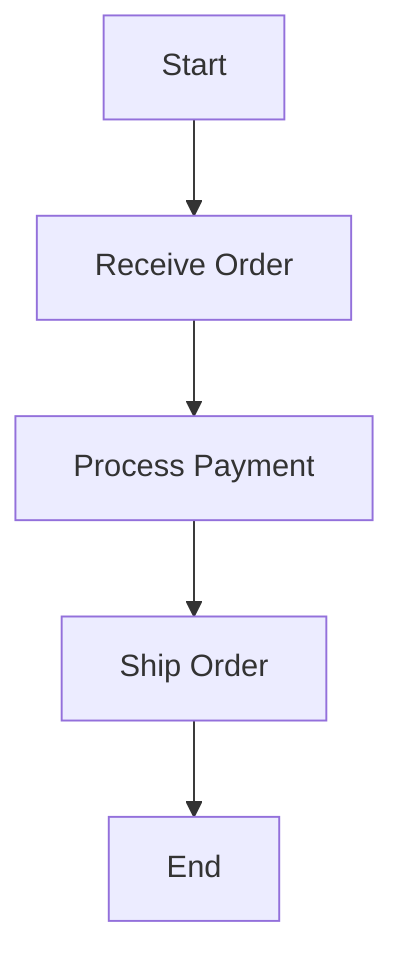

## 17.10.2 Documenting DSL Syntax and Usage

Creating a Domain-Specific Language (DSL) in Clojure can significantly enhance the expressiveness and efficiency of your code, especially when dealing with complex domains. However, the power of a DSL is only as good as its documentation. Proper documentation ensures that users can understand and effectively utilize the DSL, making it accessible and maintainable. In this section, we will explore best practices for documenting DSL syntax and usage, drawing parallels with Java where applicable, and providing clear, well-commented code examples.

### Understanding the Importance of DSL Documentation

Before diving into the specifics of documenting a DSL, let's understand why documentation is crucial:

1. **Usability**: Well-documented DSLs are easier to learn and use, reducing the learning curve for new users.
2. **Maintainability**: Clear documentation helps maintain the DSL over time, especially as team members change.
3. **Consistency**: Documentation ensures consistent usage across different projects and teams.
4. **Error Reduction**: By providing clear guidelines and examples, documentation helps prevent common errors and misuse.

### Key Components of DSL Documentation

When documenting a DSL, focus on the following key components:

- **Syntax Rules**: Define the grammar and structure of the DSL.
- **Usage Examples**: Provide practical examples to illustrate how the DSL should be used.
- **Limitations**: Clearly state any limitations or constraints of the DSL.
- **Best Practices**: Offer guidance on how to use the DSL effectively and efficiently.

### Syntax Rules

The syntax of a DSL defines its grammar and structure. In Clojure, DSLs often leverage the language's homoiconicity, where code is represented as data, allowing for powerful metaprogramming capabilities.

#### Defining Syntax Rules

To define syntax rules, consider the following:

- **Grammar**: Describe the structure of valid expressions in the DSL.
- **Keywords and Symbols**: List and explain the purpose of each keyword and symbol used in the DSL.
- **Data Types**: Specify the data types that the DSL supports and how they are used.

**Example:**

Let's consider a simple DSL for defining workflows in Clojure:

```clojure
(defmacro define-workflow [name & steps]
  `(def ~name (list ~@steps)))

(define-workflow my-workflow
  (step "Start" :action start-action)
  (step "Process" :action process-action)
  (step "End" :action end-action))
```

In this DSL, `define-workflow` is a macro that takes a name and a series of steps. Each step is defined using the `step` keyword, followed by a description and an action.

#### Documenting Syntax Rules

To document the syntax rules of this DSL, you might write:

- **`define-workflow`**: A macro to define a workflow. Takes a `name` and a series of `steps`.
- **`step`**: A keyword to define a step in the workflow. Each step requires a `description` (string) and an `action` (keyword).

### Usage Examples

Usage examples are essential for demonstrating how to use the DSL in practice. They provide context and help users understand the intended use cases.

#### Providing Usage Examples

When providing usage examples, consider the following:

- **Real-World Scenarios**: Use examples that reflect real-world use cases.
- **Step-by-Step Instructions**: Break down examples into clear, step-by-step instructions.
- **Annotated Code**: Include comments to explain each part of the example.

**Example:**

Continuing with our workflow DSL, here's an example of how to define and execute a workflow:

```clojure
;; Define a workflow
(define-workflow order-processing
  (step "Receive Order" :action receive-order)
  (step "Process Payment" :action process-payment)
  (step "Ship Order" :action ship-order))

;; Execute the workflow
(doseq [step order-processing]
  (println "Executing step:" (first step))
  ((second step)))
```

**Explanation:**

- **Defining the Workflow**: We define a workflow named `order-processing` with three steps.
- **Executing the Workflow**: We iterate over each step in the workflow, printing the step description and executing the associated action.

### Limitations

Every DSL has limitations, and it's important to document these to set clear expectations for users.

#### Identifying Limitations

Consider the following when identifying limitations:

- **Scope**: What is the intended scope of the DSL? What is it not designed to do?
- **Performance**: Are there any performance considerations or constraints?
- **Compatibility**: Are there any compatibility issues with other libraries or systems?

**Example:**

For our workflow DSL, potential limitations might include:

- **Limited Error Handling**: The DSL does not provide built-in error handling for actions.
- **Synchronous Execution**: Steps are executed synchronously, which may not be suitable for all use cases.

### Best Practices

Providing best practices helps users make the most of the DSL and avoid common pitfalls.

#### Offering Best Practices

When offering best practices, consider the following:

- **Idiomatic Usage**: Encourage idiomatic usage of the DSL.
- **Performance Tips**: Provide tips for optimizing performance.
- **Common Pitfalls**: Highlight common mistakes and how to avoid them.

**Example:**

For our workflow DSL, best practices might include:

- **Modular Actions**: Define actions as separate functions to promote reusability.
- **Error Handling**: Implement custom error handling for each action to manage failures gracefully.

### Comparing with Java

For Java developers transitioning to Clojure, understanding the differences and similarities between Java and Clojure DSLs can be helpful.

#### Java DSLs

In Java, DSLs are often implemented using method chaining or builder patterns. Here's a simple example of a Java DSL for building SQL queries:

```java
Query query = new QueryBuilder()
    .select("name", "age")
    .from("users")
    .where("age > 18")
    .build();
```

#### Clojure DSLs

Clojure DSLs, on the other hand, leverage the language's macro system to create concise and expressive syntax. The workflow DSL we explored earlier is an example of this.

**Comparison:**

- **Syntax**: Clojure DSLs often have a more concise syntax due to the use of macros.
- **Flexibility**: Clojure's homoiconicity allows for more flexible and powerful DSLs.
- **Complexity**: Java DSLs may require more boilerplate code compared to Clojure.

### Try It Yourself

To deepen your understanding, try modifying the workflow DSL to include error handling for each step. Consider how you might document these changes to ensure clarity for users.

### Diagrams and Visual Aids

Visual aids can enhance understanding by providing a clear representation of the DSL's structure and flow.

#### Mermaid.js Diagram

Below is a Mermaid.js diagram illustrating the flow of a workflow defined using our DSL:



**Diagram Explanation:**

This diagram represents the sequence of steps in the `order-processing` workflow, providing a visual overview of the process.

### External Resources

For further reading on Clojure DSLs and documentation best practices, consider the following resources:

- [Official Clojure Documentation](https://clojure.org/reference/documentation)
- [ClojureDocs](https://clojuredocs.org/)
- [GitHub - Clojure DSL Examples](https://github.com/search?q=clojure+dsl)

### Exercises

1. **Extend the Workflow DSL**: Add support for asynchronous step execution and document the changes.
2. **Create a New DSL**: Design a simple DSL for defining data validation rules and document its syntax and usage.
3. **Compare DSLs**: Compare the workflow DSL with a similar Java DSL, highlighting differences in syntax and usage.

### Key Takeaways

- **Comprehensive Documentation**: Ensure your DSL documentation covers syntax, usage, limitations, and best practices.
- **Clear Examples**: Provide clear, annotated examples to illustrate how the DSL should be used.
- **Visual Aids**: Use diagrams to enhance understanding of the DSL's structure and flow.
- **Continuous Improvement**: Regularly update documentation to reflect changes and improvements in the DSL.

By following these guidelines, you can create effective documentation that empowers users to leverage your DSL to its fullest potential.

## Quiz: Mastering DSL Documentation in Clojure



### What is the primary purpose of documenting a DSL?

- [x] To enhance usability and maintainability
- [ ] To increase the complexity of the language
- [ ] To replace the need for code comments
- [ ] To limit the DSL's usage to experts

> **Explanation:** Documentation enhances usability and maintainability by providing clear guidelines and examples for users.

### Which component is NOT typically included in DSL documentation?

- [ ] Syntax Rules
- [ ] Usage Examples
- [x] Marketing Strategies
- [ ] Limitations

> **Explanation:** Marketing strategies are not part of DSL documentation, which focuses on syntax, usage, and limitations.

### In Clojure, what feature allows for powerful DSL creation?

- [x] Homoiconicity
- [ ] Object-Oriented Programming
- [ ] Static Typing
- [ ] Method Overloading

> **Explanation:** Clojure's homoiconicity, where code is represented as data, allows for powerful DSL creation.

### What is a common limitation of DSLs that should be documented?

- [x] Performance constraints
- [ ] Unlimited scalability
- [ ] Automatic error handling
- [ ] Built-in security features

> **Explanation:** Performance constraints are a common limitation that should be documented to set user expectations.

### How can visual aids enhance DSL documentation?

- [x] By providing a clear representation of the DSL's structure and flow
- [ ] By replacing the need for written documentation
- [ ] By making the DSL more complex
- [ ] By hiding syntax errors

> **Explanation:** Visual aids provide a clear representation of the DSL's structure and flow, enhancing understanding.

### What is a best practice for providing usage examples?

- [x] Use real-world scenarios
- [ ] Avoid comments in examples
- [ ] Use only abstract examples
- [ ] Limit examples to one line

> **Explanation:** Using real-world scenarios helps users understand how to apply the DSL in practical situations.

### How does Clojure's macro system benefit DSL creation?

- [x] It allows for concise and expressive syntax
- [ ] It enforces strict type checking
- [ ] It limits the DSL's flexibility
- [ ] It requires more boilerplate code

> **Explanation:** Clojure's macro system allows for concise and expressive syntax, enhancing DSL creation.

### What should be included in the syntax rules section of DSL documentation?

- [x] Grammar and structure of valid expressions
- [ ] Marketing strategies
- [ ] User testimonials
- [ ] Financial projections

> **Explanation:** The syntax rules section should include the grammar and structure of valid expressions in the DSL.

### Why is it important to document the limitations of a DSL?

- [x] To set clear expectations for users
- [ ] To discourage usage
- [ ] To hide potential issues
- [ ] To increase user frustration

> **Explanation:** Documenting limitations sets clear expectations for users, helping them understand the DSL's scope.

### True or False: Java DSLs often require more boilerplate code compared to Clojure DSLs.

- [x] True
- [ ] False

> **Explanation:** Java DSLs often require more boilerplate code due to the lack of macros and homoiconicity found in Clojure.


